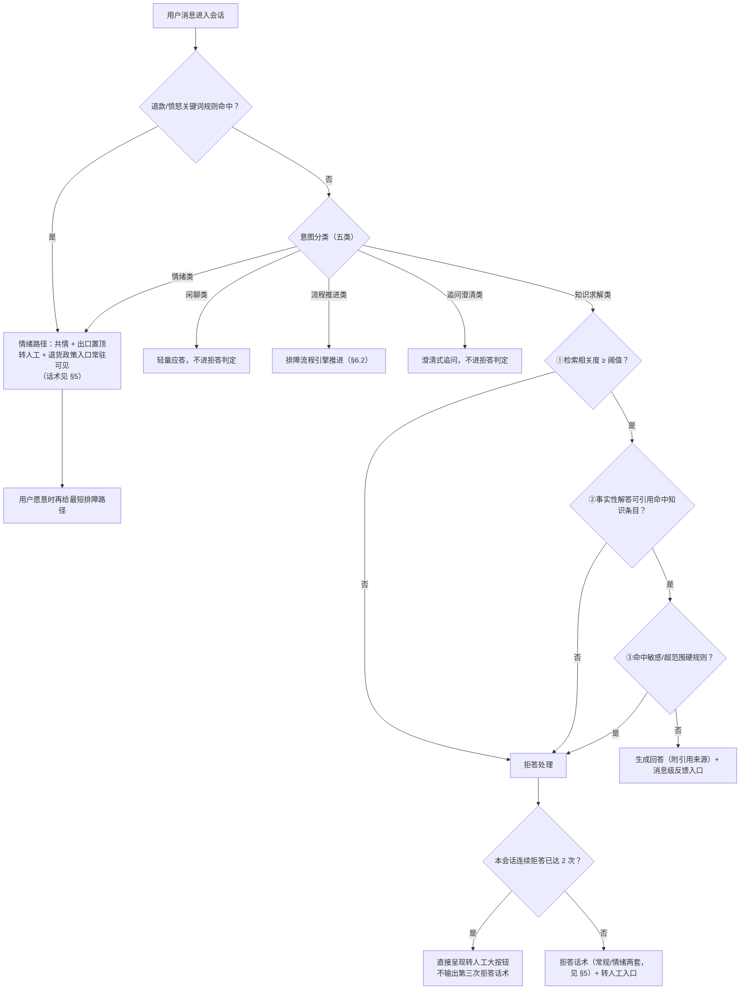
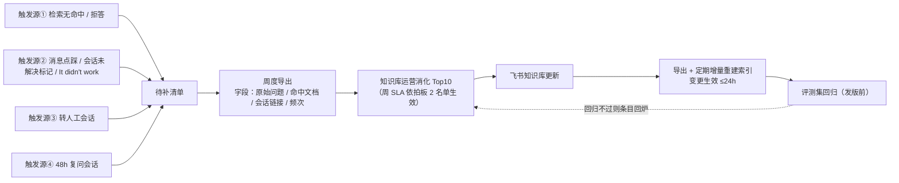
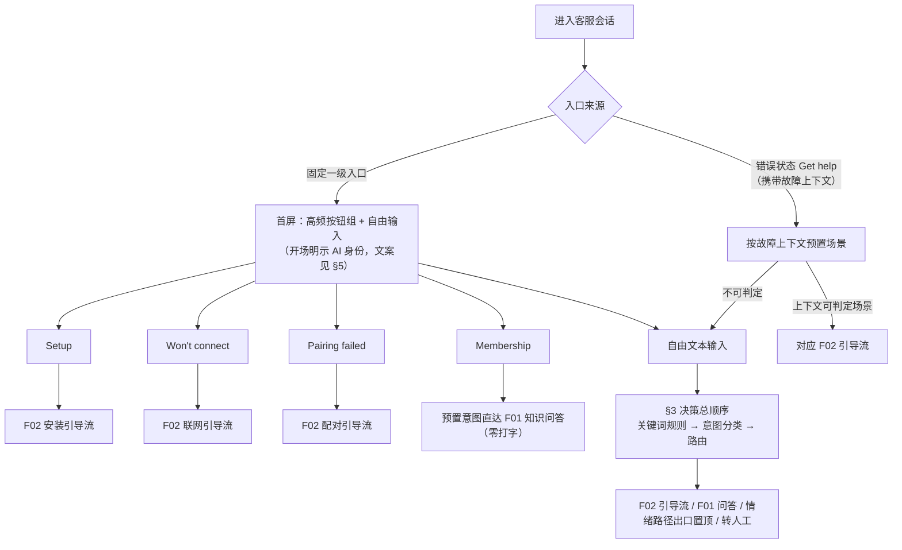
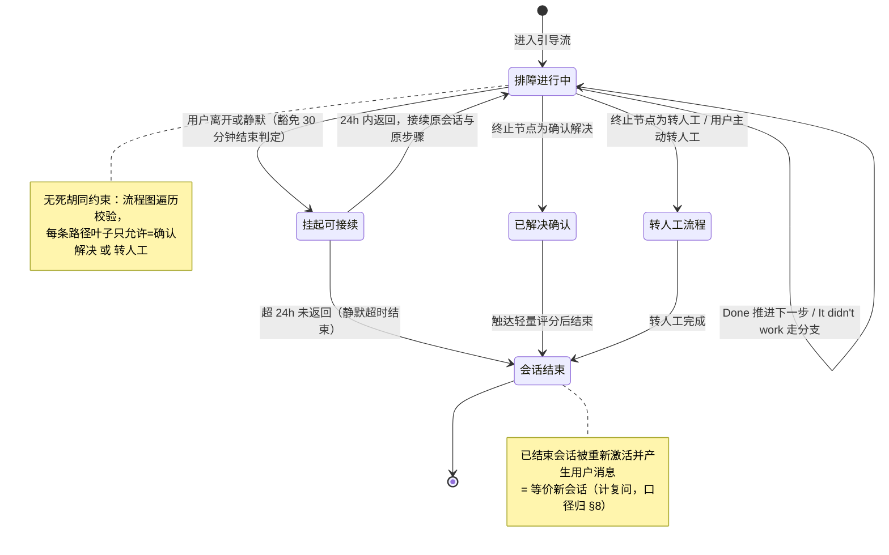
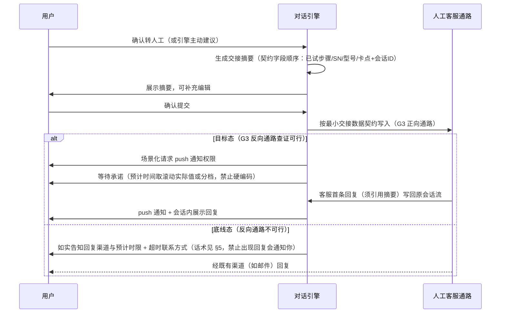
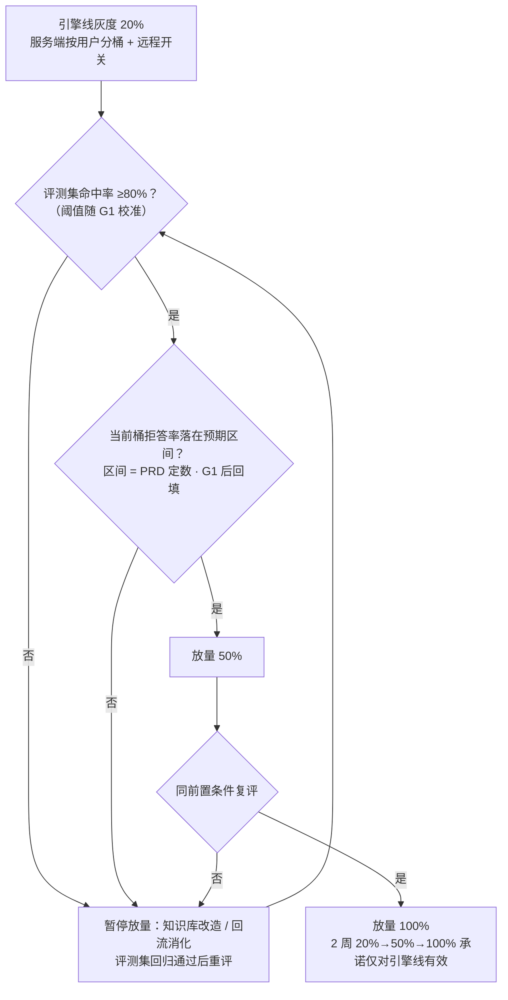

# r1-architect.md · 架构师主笔章节

> 主笔：架构师 ｜ 依据：r0-chapter-negotiation.md 分工表 ｜ 输入：proposal-v1.md（权威）、scene-anchor.md、assumptions.md、debate-log.md（Round 3 裁决）
> **形态无关声明**：拍板 1（重建服务端引擎 vs 升级现有系统）未决。本文 §3/§4 全部为**行为规格**——无论最终选 A 或 B，系统对外表现与数据产出均须满足本文描述；涉及实现形态的内容一律标注「架构建议（待技术负责人确认）」。
> 占位规范：依赖 G1–G4 数据的数值统一写 `[PRD 定数 · G1/G2 后回填]` + 当前建议值。

---

## §3 对话引擎决策逻辑（意图分类 → 三层拒答 → 路由）

本项目无算法章节；本章将 proposal-v1 §5 已裁决的**执行顺序（写死）**落成决策规格。所有用户可见话术的具体措辞归 §5（PM 副笔），本章只引用不复制。

### 3.1 决策总顺序（写死，不随拍板 1 变化）

```
用户消息 → 情绪/退款关键词规则（确定性，先行） → 意图分类（五类） → 仅"知识求解类"进三层拒答 → 生成回答或拒答 → 路由出口
```

两条独立机制，验收口径不同：

| 机制 | 性质 | 验收方式 |
|------|------|---------|
| 退款/愤怒类**关键词规则** | 确定性逻辑，命中即出口置顶 | 硬验收（100% 可复现） |
| 意图分类器判定"情绪类" | 概率性识别 | 只进评测集怒气样本 + 灰度抽检，**不进硬验收** |

### 3.2 意图分类（五类）与豁免规则

| 意图类别 | 处理 | 是否进三层拒答 |
|---------|------|--------------|
| 知识求解类 | 检索知识库生成事实性解答 | **是（唯一进入类别）** |
| 情绪类 | 共情话术 + 出口置顶（转人工 + 退货政策入口常驻可见） | 否（豁免） |
| 闲聊类 | 轻量应答并引导回支持场景 | 否（豁免） |
| 流程推进类 | 交排障流程引擎推进步骤（见 §6.2） | 否（豁免） |
| 追问澄清类 | 澄清式追问 | 否（豁免） |

**豁免防滥用**：豁免类别不得借"共情/追问"话术夹带事实性内容输出（否则等于绕过第②层引用约束）；评测集设"豁免滥用"陷阱题专门防守（见 §4.3）。

### 3.3 三层拒答（仅作用于知识求解类的事实性解答消息）

| 层 | 判定 | 结果 |
|----|------|------|
| ① 检索相关度 | 检索相关度低于阈值（阈值为商业参数，上线后调优为技术月人日第一用途，依拍板 2） | 承认不会 + 主动给转人工 |
| ② 引用忠实 | **事实性解答消息**必须引用命中知识条目；无引用即拒答。追问/共情/流程话术显式豁免 | 无引用 → 拒答；有引用但内容不忠实 → 由评测集陷阱题拦截（引用忠实率单列验收） |
| ③ 硬规则 | 敏感/超范围类目命中硬规则 | 直接拒答 |

**反向约束（防"全拒答刷满分"）**：
- 高频问题误拒率上限：`[PRD 定数 · G1 后回填]`（评测集高频误拒题验收）。
- 单会话连续拒答 ≤2 次：第 2 次拒答必须直接呈现转人工大按钮，不允许出现第三次"我没把握"类消息。
- 拒答话术分常规/情绪两套（措辞归 §5 PM 副笔，此处仅规定分套触发条件：情绪套 = 关键词规则命中或分类器判为情绪类后仍需拒答的场景）。

### 3.4 决策流程图



### 3.5 首屏路由（含 Membership 预置意图直达）

- 高频按钮（Setup / Won't connect / Pairing failed）→ 直接进入对应 F02 引导流，零打字。
- **Membership 按钮 = 预置意图直达 F01 知识问答（跳过打字）**，不走引导流；会员类知识条目列入改造清单候选，由 G1 数据裁决排序。
- 自由文本 → 3.1 决策总顺序。
- 错误状态"Get help"进入 → 携带故障上下文预置场景（entry_source=错误态入口），优先路由到对应引导流；上下文不可判时落到自由输入路径。
- 分流图见 §6.1。

### 3.6 排障决策形态（已裁决，proposal-v1 §5）

结构化流程（步骤 + 分支显式建模）承载排障逻辑；LLM 只负责意图识别、上下文衔接与话术生成，**不负责发明步骤**。"无死胡同"用图遍历自动验证：每条分支路径的叶子节点必须是「确认解决」或「转人工」之一。状态机见 §6.2，流程数据结构见 §4.1。

### 3.7 演进约束（架构约束五条，proposal-v1 §10，逐条落本章）

1. **引擎渠道无关化**：对话引擎核心接口不假设 App 来源；故障上下文等 App 专属信息作为**可选结构化输入**传入；未来邮箱/官网渠道接入只写渠道适配层、不重写引擎。
2. **埋点 channel 字段**：事件 schema 带 channel 字段（默认 app），见 §4.2。
3. **转人工最小交接数据契约**：固定字段顺序（已试步骤/SN/型号/卡点 + 会话 ID），兼作未来 Zendesk 字段映射底稿（字段清单归 §12 附录，本章只约束"契约字段顺序固定、不可随实现变动"）。
4. **F07 两条约束**：文案与 prompt 模板不硬编码语言；知识条目带语言字段（见 §4.1）。
5. **排障流程 schema 与知识条目均渠道中立**：不含任何 App 界面专属字段；界面呈现（卡片/按钮）由渠道适配层映射。

> 违反任一条即属架构回归，PRD 层面视为缺陷而非优化空间——这五条是"零成本现在写、两年后免还债"的裁决产物（debate-log Round 3 裁决 7）。

---

## §4 数据需求（知识库 schema ／ 埋点 schema ／ 评测集 ／ 回流数据流）

> 本章为**概念级 schema**：只定义"有什么信息、谁产生、流向哪"，不定义字段物理类型。指标口径与目标值归 §8，本章不重复。

### 4.1 知识条目与排障流程 schema（概念级）

**知识条目（问答型，供 F01 检索引用）**

| 信息项 | 说明 | 来源/约束 |
|--------|------|----------|
| 条目标识 | 唯一、稳定，供回答引用与回流清单关联 | 系统生成 |
| 标题 / 问题描述 | 用户语言的问题表述 | 内容运营 |
| 场景分类 | 安装 / 联网 / 配对 / 会员 / 其他（与 G1 咨询分布口径对齐） | 内容运营，G1 后可调 |
| 适用设备型号 | 可多值；空 = 全型号通用 | 内容运营 |
| **语言字段** | F07 约束，第一版恒为英文，字段必须存在 | 架构约束（§3.7） |
| 正文内容 | 事实性解答内容，作为第②层引用对象 | 飞书知识库 |
| 来源与版本 | 飞书源文档标识 + 更新时间，支撑"变更生效 ≤24h"追踪 | 同步机制生成 |
| 状态 | 草稿 / 已上线 / 待改造（改造清单排序在 G1 之后） | 内容运营 |

**排障流程条目（结构化，供 F02 引导流）**：在知识条目公共信息（标识/场景/型号/语言/版本/状态）之上，增加：

| 信息项 | 说明 |
|--------|------|
| 步骤节点 | 一步一屏的步骤文案 + 是否配图（Top3 场景关键分支配图🟩，其余🟨） |
| 分支 | 每步仅两出口：Done → 下一节点；It didn't work → 分支节点 |
| 终止节点 | 只允许两类：确认解决 / 转人工（**无死胡同图遍历校验的依据**） |

**渠道中立约束**：两类 schema 均不含 App 界面专属字段（§3.7 第 5 条）。

### 4.2 埋点事件清单（概念级 schema）

**公共属性（所有事件必带）**：会话 ID、用户标识、时间戳、**entry_source（固定入口/错误态入口/按钮组/自由输入）**、**app_version**、**channel（默认 app）**、灰度桶标识。

| 事件 | 触发时机 | 事件专属属性 | 服务对象（口径归 §8） |
|------|---------|-------------|---------------------|
| 会话开始 | 用户进入会话 | 进入场景（含错误态故障上下文类型）、语言检测结果 | 解决率分母、语言分布 |
| 意图分类结果 | 每条用户消息 | 意图类别、是否关键词规则命中 | 意图分布、旅程 C 硬验收 |
| 拒答事件 | 三层任一触发 | **触发层（①/②/③）**、本会话连续拒答计数 | 拒答率按层分列、连续拒答 ≤2 |
| 回答消息 | AI 输出事实性解答 | 引用条目标识列表 | 引用忠实抽检、回流关联 |
| 排障步骤推进 | 每步 Done / It didn't work | 流程标识、节点标识、方向 | 无死胡同实测、卡点分布 |
| 转人工 | 用户确认转人工 | 交接契约摘要标识、通路层级（目标态/底线态） | 转人工率与绝对量、容量预警 |
| 消息级反馈 | F01 消息 👍/👎 | 点踩原因（不相关/看不懂/试了没用） | 回流触发源② |
| 会话结束 | 三类结束判定 | 结束类型（确认解决/转人工完成/静默超时）、是否排障豁免接续 | 双口径解决率 |
| 会话重新激活 | 已结束会话产生新用户消息 | 原会话标识（**计为新会话**） | 复问口径 |
| 满意度评分 | 会话结束触达 | 分值 | 严口径输入、趋势参考 |

**交付约束**：埋点与功能同步交付、同步验收（缺埋点的功能不算完成）；事件语义一经发布只增补不改义，防口径断代。

### 4.3 离线评测集（golden set）构成

| 题型 | 内容 | 验收指标（目标值归 §8） |
|------|------|------------------------|
| 高频问答题 | Top 高频问题 + 期望答案 / 期望追问 | 命中率（灰度放量前置条件之一，≥80% 随 G1 校准） |
| 陷阱题① 应拒答 | 知识库外/无依据问题 | 拒答准确率 |
| 陷阱题② 有引用不忠实 | 有命中条目但答案偏离引用内容 | **引用忠实率**（与拒答准确率分列） |
| 陷阱题③ 豁免滥用 | 借共情/追问话术夹带事实性输出 | 豁免类别不得输出无引用事实内容 |
| 陷阱题④ 怒气样本 | 期望 = 共情 + 双出口；禁止技术追问、禁止"我没把握"模板 | 情绪路径行为验收 |
| 高频误拒题 | 知识库明确覆盖、必须正答的问题 | 高频误拒率 ≤ 上限 `[PRD 定数 · G1 后回填]` |

- 规模与配比：`[PRD 定数 · G1 分布后回填]`；题目来源 = G1 导出的真实咨询 + 差评原话。
- 运行时机：知识库改造验收、**发版前回归🟩**（每次 prompt/模型/知识库变更全量回归为🟨）；编写与维护工时计入拍板 2①。

### 4.4 回流数据流（F05，概念级）



回流机制与清单导出属 MVP 即上线；仅周消化 SLA 挂拍板 2 名单。

### 4.5 数据治理

- **时区**：所有事件与会话时间内部按统一标准时间（UTC）记录；报表与"48h 复问"等窗口计算按同一基准执行，展示层按业务时区换算——避免跨时区用户导致复问口径漂移。
- **PII**：SN、邮箱、家庭 Wi-Fi 名称等属敏感字段；会话日志**脱敏（打码）后才入分析库**；送 LLM 的输入以"供应商提供 DPA 且不用于训练"为选型硬条件（合规 NFR 归 §8/§9 前置项，本章约束数据流向）。
- **一致性**：会话状态（进行中/挂起/已结束）与排障进度须强一致（用户切回 App 必须恢复到正确步骤）；埋点与看板数据最终一致即可（按周呈报）。
- **保留**：会话日志留存期限 `[PRD 定数 · 合规 NFR 确认后回填]`；评测集与回流清单长期保留（改进依据）。

---

## §6 流程图

### 6.1 首屏路由分流图



### 6.2 排障状态机（含无死胡同约束与会话接续豁免）



（非引导态自由对话适用 30 分钟静默结束，属会话通用生命周期；异常/故障态矩阵归 §7 工程师主笔，本章不重复。）

### 6.3 转人工时序图（目标态 / 底线态随 G3 分层）



### 6.4 灰度放量流程（引擎线；发版线覆盖率呈报归 §9 工程师段）



---

## §9 风险与依赖（架构部分）

> 分工：本节只写技术/架构风险与外部依赖失败模式。实现/发版风险（覆盖率爬坡、错误码治理、状态矩阵落地）归工程师段 `[占位：§9 工程师段]`；G1–G4 门槛表、超期回退/回炉线写死规则、商业风险与并行行动项归 PM 段 `[占位：§9 PM 段]`。

### 9.A 架构风险

| # | 风险 | 失败模式 | 缓解（均为已裁决机制） |
|---|------|---------|----------------------|
| AR-1 | **A-001 知识库命门**：飞书知识库质量不足以支撑高频回答 | 三层拒答如实暴露知识缺口 → 拒答率高企、回答质量差，第一命门直接击穿目标 | 三大高频场景条目上线前结构化改造（排序在 G1 后）；改造完成 = schema 校验 + 评测集命中率 ≥80%；回流四触发源闭环（§4.4）；运营实名化依拍板 2 |
| AR-2 | **拒答洪水与灰度联动**：薄知识库 + 严拒答 = 爬坡期转人工不降反升，砸在 3 人团队最缺经验的时期 | 转人工绝对量突破容量预警线，客服被淹没、体验反噬 | 意图分类豁免非事实性对话（§3.2）；误拒率上限 + 连续拒答 ≤2（§3.3）；**放量前置条件 = 评测集 ≥80% 且拒答率在预期区间**（§6.4，洪水关在小流量里）；拒答率按层周监控；容量预警响应预案（业务侧，灰度前到位，归 PM 段） |
| AR-3 | **拍板 1 未决的形态风险**：选 B 后受旧架构约束，三层拒答/埋点钩子/排障引擎可能插不进 | 及格线能力在旧系统上落不了地，实现中静默缩水 | F01–F08 用户可见完成标准为**形态无关硬验收**；G2 三集成点可插拔判定 + 选项 B 能力对照表作为拍板输入；达不成的项逐条摆回企业家桌面重拍 |
| AR-4 | **演进约束失守**：实现期图省事把引擎与 App 耦合、埋点漏 channel | 两年后全渠道愿景 = 第二次重建；报表口径断代 | §3.7 五条约束入 PRD 验收面（schema 与接口审查项），违反视为缺陷 |

### 9.B 外部能力与配置责任

| 外部能力 | 用途 | 凭据归属 | 配置角色 | 作用域 | 所属阶段 | 失败模式 / 降级 |
|---------|------|---------|---------|--------|---------|----------------|
| LLM API（供应商待选型，硬条件 = 提供 DPA 且输入不用于训练） | 意图识别、话术生成、问答 | 内部技术团队（部署密钥，系统级，无用户可见配置） | 内部技术团队 | 服务端 | MVP | 超时/限流/不可用 → 降级直达转人工 + 排障文章（状态矩阵细节归 §7）；**单一供应商依赖**：更换供应商须整套评测集回归通过方可切换（评测集即供应商无关的行为契约） |
| 飞书知识库 API | 知识条目导出 + 定期增量重建索引（变更生效 ≤24h） | 用户团队（API 权限前置登记） | 用户团队申请 / 技术团队接入 | 服务端 | MVP | 同步失败 → 沿用上一版索引继续服务（内容陈旧但可用），同步中断超 24h 触发告警；权限未就绪 → 首次全量导出走人工导出兜底，增量机制延后 |
| push 通知基建（G3 反向通路组成部分） | 目标态"回复会通知你"的兑现前提 | 现有 App 基建 | 内部技术团队 | 客户端 + 服务端 | MVP（目标态） | G3 查证不可行或用户拒绝权限 → 落底线态三件套（§6.3），话术不承诺通知 |
| 方案商设备日志接口 | 第二阶段设备诊断王牌前提 | 方案商（不存在，争取中） | 用户团队争取（并行非工程行动项，归 PM 段） | — | **后置阶段，本期不接** | 本期排障上限 = 引导自查 + 带 SN 转人工（A-003 已确认现状）；6 个月无实质进展则重排第二阶段路线 |

### 9.C 方案前置能力（架构侧依赖点）

G1–G4 门槛表与治理规则归 PM 段 `[占位：§9 PM 段]`，此处仅列**架构产物对门槛结果的依赖关系**，防止两段重复：

| 门槛 | 本文哪些内容等它回填 |
|------|---------------------|
| G1 | §3.3 误拒率上限、拒答率预期区间（§6.4 放量条件）；§4.3 评测集规模与题源；§4.1 改造清单排序、会员类条目是否前置 |
| G2 | 拍板 1 输入（AR-3）；错误码结构化程度决定 F08 故障上下文可携带粒度（§6.1 CTX 分支的可判定率） |
| G3 | §6.3 目标态/底线态取值；三件套话术分层（§5） |
| G4 | 退货归因数据流是否可建（不可建则降级为渠道原因码粗分类 + 月度趋势，口径归 §8） |

### 9.D 可扩展性瓶颈（v1 → 下一阶段的升级路径）

| 维度 | v1 现状 | 瓶颈点 | 升级路径（已由演进约束预留） |
|------|--------|--------|---------------------------|
| 渠道 | 仅 App | 引擎若耦合 App 上下文则全渠道 = 重写 | §3.7-1：新增渠道只写适配层；channel 字段已在埋点 |
| 语言 | 英文单语 | 话术与条目若硬编码语言则多语言 = 全量返工 | §3.7-4 两条 F07 约束；语言分布传感器（§4.2）给出 15% 触发信号 |
| 容量 | 按当前咨询量设计 | 销量涨 2–3 倍 → 会话量与 LLM 成本同步放大 | 容量预警线（分母 = G1 实测 ×80%，口径归 §8）；LLM 成本随 G1 会话量入成本账；限流降级走状态矩阵（§7） |
| 排障深度 | 引导自查 + 带 SN 转人工 | 无设备侧数据，诊断上限锁死 | 方案商接口后置（9.B）；排障流程 schema 渠道中立，未来诊断结果可作为流程分支输入而不改引擎 |

---

## ⚠️ 待 R2 跟其他主笔对齐的章节边界

- §3 ↔ §5（工程师 + PM 副笔）：首屏按钮组、Done / It didn't work、拒答/情绪两套话术、AI 身份披露、非英语兜底——文案唯一落点在 §5，本文所有"见 §5"引用待 R2 核对无遗漏。
- §4 ↔ §8（PM）：本文只写事件与属性，指标口径/目标值/预警线全部归 §8——待核对无重复、无缺口（尤其双口径解决率所需事件是否齐备）。
- §6.2/§6.4 ↔ §7（工程师）：状态矩阵（超时 8–10 秒定数、LLM 降级、离线提示）归 §7；本文状态机只覆盖正常生命周期，待核对故障态转移无遗漏。
- §9.A/9.B ↔ §9 工程师段/PM 段：AR-3 与工程师"发版线覆盖率爬坡"、9.C 与 PM 的 G1–G4 门槛表须互引不重复。
