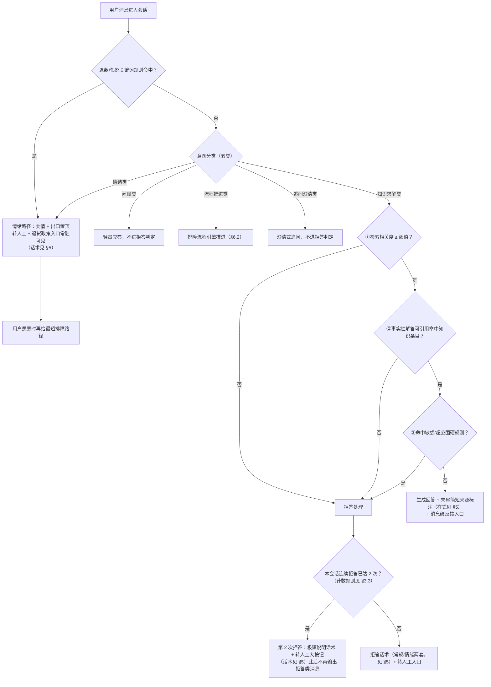
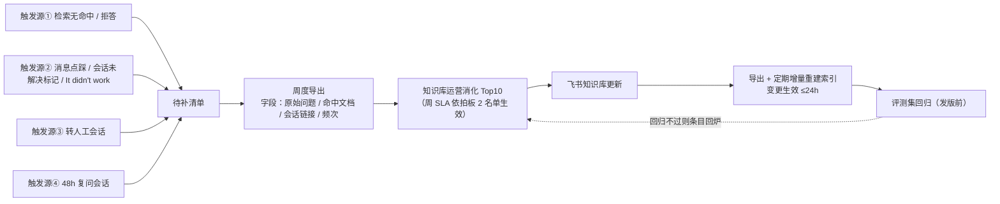
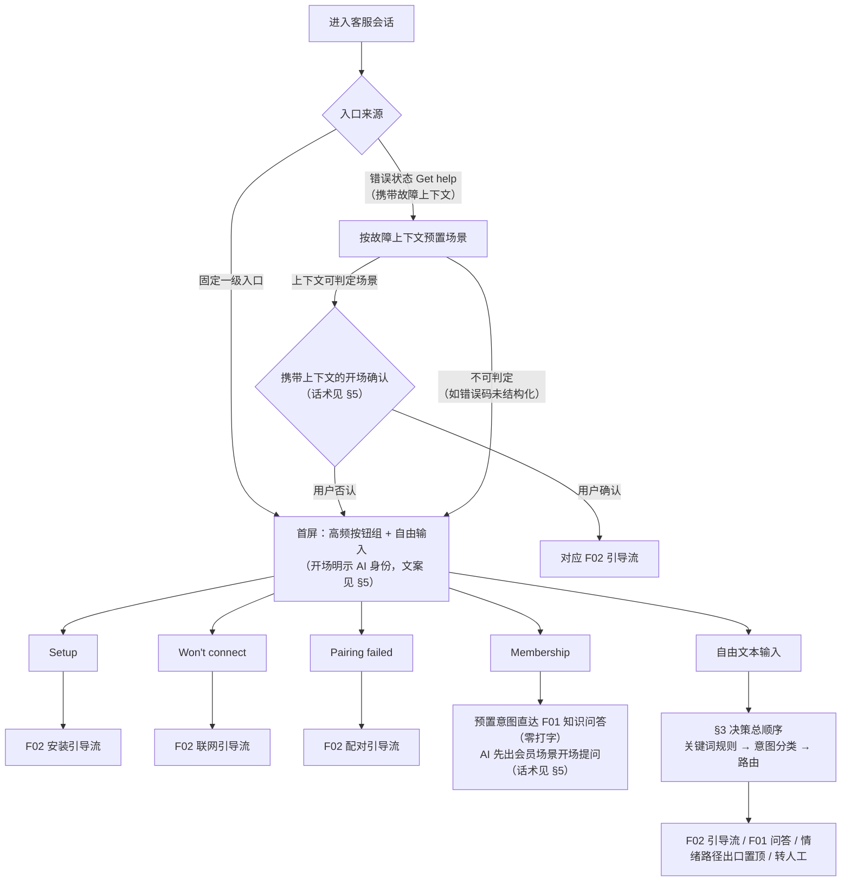
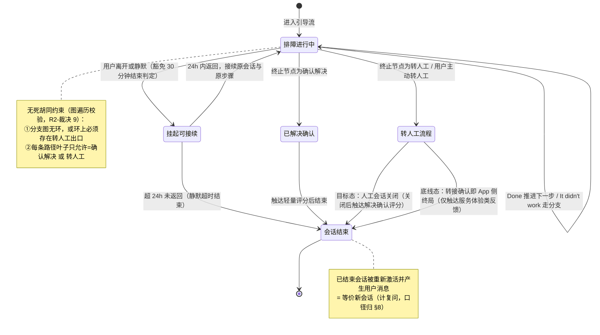
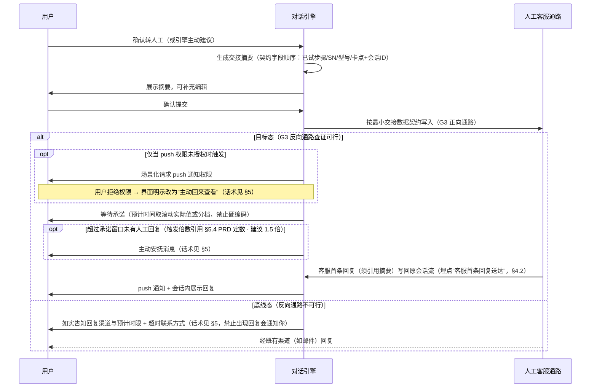
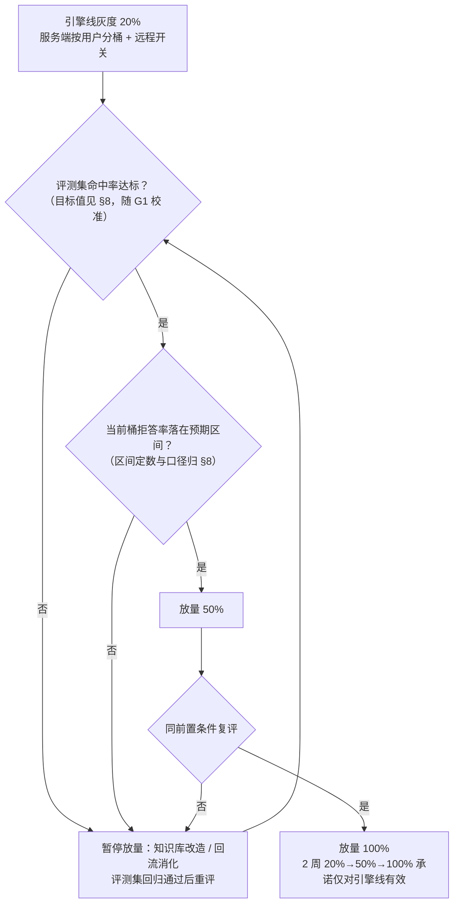

# r3-architect.md · 架构师主笔章节（R3 修订版）

> 主笔：架构师 ｜ 修订基底：r1-architect.md ｜ 依据：r2-pm-reviews-others.md「评架构师稿」、r2-engineer-reviews-others.md「评架构师稿」、debate-log.md「阶段 5 · R2 互审 Controller 裁决」（11 项）、r0-chapter-negotiation.md 分工表 ｜ 权威输入：proposal-v1.md、scene-anchor.md
> **形态无关声明**：拍板 1（重建服务端引擎 vs 升级现有系统）未决。本文 §3/§4 全部为**行为规格**——无论最终选 A 或 B，系统对外表现与数据产出均须满足本文描述；涉及实现形态的内容一律标注「架构建议（待技术负责人确认）」。
> 占位规范：依赖 G 数据的数值统一写 `[PRD 定数 · G1/G2 后回填]` + 当前建议值。

---

## §3 对话引擎决策逻辑（意图分类 → 三层拒答 → 路由）

本项目无算法章节；本章将 proposal-v1 §5 已裁决的**执行顺序（写死）**落成决策规格。所有用户可见话术的具体措辞归 §5（PM 副笔），本章只引用不复制。

### 3.1 决策总顺序（写死，不随拍板 1 变化）

```
用户消息 → 情绪/退款关键词规则（确定性，先行） → 意图分类（五类） → 仅"知识求解类"进三层拒答 → 生成回答或拒答 → 路由出口
```

> 关键词规则前置是对 proposal-v1 §5 执行顺序的**执行细化**（确定性逻辑先行、可硬验收），非顺序变更；§5 相关叙述以本节表述为准（R2 与工程师已对齐）。

两条独立机制，验收口径不同：

| 机制 | 性质 | 验收方式 |
|------|------|---------|
| 退款/愤怒类**关键词规则** | 确定性逻辑，命中即出口置顶 | 硬验收（100% 可复现） |
| 意图分类器判定"情绪类" | 概率性识别 | 只进评测集怒气样本 + 灰度抽检，**不进硬验收** |

### 3.2 意图分类（五类）与豁免规则

| 意图类别 | 处理 | 是否进三层拒答 |
|---------|------|--------------|
| 知识求解类 | 检索知识库生成事实性解答 | **是（唯一进入类别）** |
| 情绪类 | 共情话术 + 出口置顶（转人工 + 退货政策入口常驻可见） | 否（豁免） |
| 闲聊类 | 轻量应答并引导回支持场景 | 否（豁免） |
| 流程推进类 | 交排障流程引擎推进步骤（见 §6.2） | 否（豁免） |
| 追问澄清类 | 澄清式追问 | 否（豁免） |

**豁免防滥用**：豁免类别不得借"共情/追问"话术夹带事实性内容输出（否则等于绕过第②层引用约束）；评测集设"豁免滥用"陷阱题专门防守（见 §4.3）。

### 3.3 三层拒答（仅作用于知识求解类的事实性解答消息）

| 层 | 判定 | 结果 |
|----|------|------|
| ① 检索相关度 | 检索相关度低于阈值（阈值为商业参数，上线后调优为技术月人日第一用途，依拍板 2） | 承认不会 + 主动给转人工 |
| ② 引用忠实 | **事实性解答消息**必须引用命中知识条目；无引用即拒答。追问/共情/流程话术显式豁免 | 无引用 → 拒答；有引用但内容不忠实 → 由评测集陷阱题拦截（引用忠实率单列验收） |
| ③ 硬规则 | 敏感/超范围类目命中硬规则 | 直接拒答 |

**引用可见性（R2-裁决 4）**：通过第②层的知识求解类回答，末尾向用户显示**简短来源标注**（形如"来源：安装指南"，措辞样式归 §5）——轻量呈现：不展开引用全文、不做跳转承诺。来源标注必须与实际命中条目一致，构成评测集"引用忠实率"验收的**用户侧闭环**（用户看到的来源 = 系统实际引用的条目，见 §4.3 陷阱题②）。

**反向约束（防"全拒答刷满分"）**：
- 高频问题误拒率上限：`[PRD 定数 · G1 后回填]`（上限定数与口径归 §8；评测集高频误拒题验收）。
- 单会话连续拒答 ≤2 次：第 2 次拒答呈现**一句极短说明话术 + 转人工大按钮**（R2-裁决 1；措辞归 §5，本章只约束行为），此后本会话不再输出任何拒答类消息。
- **连续计数规则**（供 AC-E-02 与 §4.2 拒答事件计数属性统一口径）：任意一次成功事实性解答将计数清零；豁免类消息（闲聊/追问澄清/共情/流程推进）不清零也不累加。
- 拒答话术分常规/情绪两套（措辞归 §5 PM 副笔，此处仅规定分套触发条件：情绪套 = 关键词规则命中或分类器判为情绪类后仍需拒答的场景）。

### 3.4 决策流程图



### 3.5 首屏路由（含 Membership 预置意图直达）

- 高频按钮（Setup / Won't connect / Pairing failed）→ 直接进入对应 F02 引导流，零打字。
- **Membership 按钮 = 预置意图直达 F01 知识问答（跳过打字）**，AI 先出会员场景开场提问（话术归 §5，与 AC-M-04 统一），不走引导流；会员类知识条目列入改造清单候选，由 G1 数据裁决排序。
- 自由文本 → 3.1 决策总顺序。
- 错误状态"Get help"进入 → 携带故障上下文预置场景（entry_source=错误态入口）：**先出携带上下文的开场确认**（R2-裁决 3；话术归 §5）——用户确认 → 进入对应引导流；用户否认 → 回首屏（按钮组 + 自由输入），不锁死路由。上下文不可判定（如错误码未结构化）→ 降级为通用进入，落**首屏**（按钮组 + 自由输入），不落纯自由输入。
- 分流图见 §6.1。

### 3.6 排障决策形态（已裁决，proposal-v1 §5）

结构化流程（步骤 + 分支显式建模）承载排障逻辑；LLM 只负责意图识别、上下文衔接与话术生成，**不负责发明步骤**。"无死胡同"用图遍历自动验证，校验规则两条（R2-裁决 9）：

1. 分支有向图**无环**；确需回指先前节点的环，**环上必须存在转人工出口**；
2. 所有叶子节点 ∈ {确认解决, 转人工}。

运行时兜底（同一步骤第二次到达时附加转人工提示条）归 §5.3（工程师），校验层与其对齐表述。状态机见 §6.2，流程数据结构见 §4.1。

### 3.7 演进约束（架构约束五条，proposal-v1 §10，逐条落本章）

1. **引擎渠道无关化**：对话引擎核心接口不假设 App 来源；故障上下文等 App 专属信息作为**可选结构化输入**传入；未来邮箱/官网渠道接入只写渠道适配层、不重写引擎。
2. **埋点 channel 字段**：事件 schema 带 channel 字段（默认 app），见 §4.2。
3. **转人工最小交接数据契约**：固定字段顺序（已试步骤/SN/型号/卡点 + 会话 ID），兼作未来 Zendesk 字段映射底稿（字段清单归 §12 附录，本章只约束"契约字段顺序固定、不可随实现变动"）。
4. **F07 两条约束**：文案与 prompt 模板不硬编码语言；知识条目带语言字段（见 §4.1）。
5. **排障流程 schema 与知识条目均渠道中立**：不含任何 App 界面专属字段；界面呈现（卡片/按钮）由渠道适配层映射。

> 违反任一条即属架构回归，PRD 层面视为缺陷而非优化空间——这五条是"零成本现在写、两年后免还债"的裁决产物（debate-log Round 3 裁决 7）。

---

## §4 数据需求（知识库 schema ／ 埋点 schema ／ 评测集 ／ 回流数据流）

> 本章为**概念级 schema**：只定义"有什么信息、谁产生、流向哪"，不定义字段物理类型。指标口径与目标值归 §8，本章不重复。

### 4.1 知识条目与排障流程 schema（概念级）

**知识条目（问答型，供 F01 检索引用）**

| 信息项 | 说明 | 来源/约束 |
|--------|------|----------|
| 条目标识 | 唯一、稳定，供回答引用与回流清单关联 | 系统生成 |
| 标题 / 问题描述 | 用户语言的问题表述 | 内容运营 |
| 场景分类 | 安装 / 联网 / 配对 / 会员 / 其他（与 G1 咨询分布口径对齐） | 内容运营，G1 后可调 |
| 适用设备型号 | 可多值；空 = 全型号通用 | 内容运营 |
| **语言字段** | F07 约束，第一版恒为英文，字段必须存在 | 架构约束（§3.7） |
| 正文内容 | 事实性解答内容，作为第②层引用对象 | 飞书知识库 |
| 来源与版本 | 飞书源文档标识 + 更新时间，支撑"变更生效 ≤24h"追踪 | 同步机制生成 |
| 状态 | 草稿 / 已上线 / 待改造（改造清单排序在 G1 之后） | 内容运营 |

**排障流程条目（结构化，供 F02 引导流）**：在知识条目公共信息（标识/场景/型号/语言/版本/状态）之上，增加：

| 信息项 | 说明 |
|--------|------|
| 步骤节点 | 一步一屏的步骤文案 + 是否配图（Top3 场景关键分支配图🟩，其余🟨） |
| 分支 | 每步仅两出口：Done → 下一节点；It didn't work → 分支节点。**环路约束（R2-裁决 9）**：默认禁止环；确需回指先前节点的环，环上必须存在转人工出口 |
| 终止节点 | 只允许两类：确认解决 / 转人工（与环路约束共同构成 §3.6 **无死胡同图遍历校验的依据**） |

**渠道中立约束**：两类 schema 均不含 App 界面专属字段（§3.7 第 5 条）。

### 4.2 埋点事件清单（概念级 schema）

**公共属性（所有事件必带）**：会话 ID、用户标识、时间戳、**entry_source（入口来源，会话级，进入时刻写死：固定入口 / 错误态入口 / 未知**——旧版本客户端无字段的流量归"未知"单列呈报**）**、**interaction_mode（交互方式，消息级：按钮组 / 自由输入 / 预置意图）**、**app_version**、**channel（默认 app）**、灰度桶标识。

> entry_source 与 interaction_mode 为**两个独立维度**（R2-裁决 8）：前者回答"用户从哪进来"（会话级，一次写死），供 §8 分层解决率呈报与"引擎效果 vs 入口效果"分离；后者回答"这条消息怎么产生"（会话内可多次切换）。枚举唯一落点在本节，§5/§8 引用不复制。

| 事件 | 触发时机 | 事件专属属性 | 服务对象（口径归 §8） |
|------|---------|-------------|---------------------|
| 会话开始 | 用户进入会话 | 进入场景（含错误态故障上下文类型）、语言检测结果 | 解决率分母、语言分布 |
| 意图分类结果 | 每条用户消息 | 意图类别、是否关键词规则命中 | 意图分布、旅程 C 硬验收 |
| 拒答事件 | 三层任一触发 | **触发层（①/②/③）**、本会话连续拒答计数（计数口径见 §3.3：成功事实性解答清零，豁免类不清零不累加） | 拒答率按层分列、连续拒答 ≤2 |
| 回答消息 | AI 输出事实性解答 | 引用条目标识列表、用户可见来源标注内容（R2-裁决 4） | 引用忠实抽检（标注与引用一致性）、回流关联 |
| 排障步骤推进 | 每步 Done / It didn't work | 流程标识、节点标识、方向 | 无死胡同实测、卡点分布 |
| 转人工 | 用户确认转人工 | 交接契约摘要标识、通路层级（目标态/底线态） | 转人工率与绝对量、容量预警 |
| **客服首条回复送达** | 目标态：人工首条回复写回原会话流 | 关联转人工事件标识、回复时刻、是否首条 | 转人工首响时长（AC-I-03 不变行为）、超时安抚触发（§6.3） |
| 消息级反馈 | F01 消息 👍/👎 | 反馈方向（👍/👎）、点踩原因（不相关/看不懂/试了没用）、改选以最后一次为准 | 回流触发源②、回流清单去重 |
| 会话结束 | 三类结束判定 | 结束类型（确认解决/转人工完成/静默超时）、是否排障豁免接续 | 双口径解决率 |
| 会话重新激活 | 已结束会话产生新用户消息 | 原会话标识（**计为新会话**） | 复问口径 |
| 满意度评分 | 会话结束触达 | 反馈类型（解决确认/服务体验）、解决确认（Yes/No）、可选分值 | 严口径输入、趋势参考 |

**满意度评分分型（对齐 R2-裁决 2）**：目标态与常规会话结束触达"解决确认（Yes/No）+ 可选分值"；**底线态转接确认时只触达服务体验类反馈，不问"是否解决"**——解决维度按行为口径与保守折算处理（口径归 §8）。

**底线态首响度量口径（R2-裁决 8）**："客服首条回复送达"事件仅目标态可测（回复写回会话流）；底线态走邮件通路，App 侧不可观测，首响度量来源 = 人工渠道/邮箱系统记录，口径 `[PRD 定数 · G3 后回填]`；AC-I-03（转人工首响不劣于现状）验收随 G3 结果分层，不留不可测的纸面指标。

**交付约束**：埋点与功能同步交付、同步验收（缺埋点的功能不算完成）；事件语义一经发布只增补不改义，防口径断代。

### 4.3 离线评测集（golden set）构成

| 题型 | 内容 | 验收指标（目标值归 §8） |
|------|------|------------------------|
| 高频问答题 | Top 高频问题 + 期望答案 / 期望追问 | 命中率（灰度放量前置条件之一，**目标值见 §8**，随 G1 校准） |
| 陷阱题① 应拒答 | 知识库外/无依据问题 | 拒答准确率 |
| 陷阱题② 有引用不忠实 | 有命中条目但答案偏离引用内容 | **引用忠实率**（与拒答准确率分列）；判定含**用户可见来源标注与实际命中条目一致**（R2-裁决 4 用户侧闭环） |
| 陷阱题③ 豁免滥用 | 借共情/追问话术夹带事实性输出 | 豁免类别不得输出无引用事实内容 |
| 陷阱题④ 怒气样本 | 期望 = 共情 + 双出口；禁止技术追问、禁止"我没把握"模板 | 情绪路径行为验收 |
| 高频误拒题 | 知识库明确覆盖、必须正答的问题 | 高频误拒率不超上限（上限定数与口径归 §8，`[PRD 定数 · G1 后回填]`） |

- 规模与配比：`[PRD 定数 · G1 分布后回填]`；题目来源 = G1 导出的真实咨询 + 差评原话。
- 运行时机：知识库改造验收、**发版前回归🟩**（每次 prompt/模型/知识库变更全量回归为🟨）；编写与维护工时计入拍板 2①。

### 4.4 回流数据流（F05，概念级）



**聚合键（"同一问题"频次聚合口径，§5.6 引用本节不另行定义）**：有命中条目的按**命中条目标识**聚合；无命中的按**规范化问题文本**聚合（规范化清洗规则为实现细节，不入 PRD 定数）。改选反馈以最后一次为准（见 §4.2 消息级反馈），去重后计频次。

回流机制与清单导出属 MVP 即上线；仅周消化 SLA 挂拍板 2 名单。

### 4.5 数据治理

- **时区（三条口径，防误读）**：①用户界面时间按**设备本地时区**展示（与 §5.1 一致）；②内部报表/看板按**业务时区**换算呈报；③窗口计算（48h 复问、30min 静默、24h 接续）一律按 **UTC 时间差**执行——避免跨时区用户导致复问口径漂移。
- **PII**：SN、邮箱、家庭 Wi-Fi 名称等属敏感字段；会话日志**脱敏（打码）后才入分析库**；送 LLM 的输入以"供应商提供 DPA 且不用于训练"为选型硬条件（合规 NFR 归 §8/§9 前置项，本章约束数据流向）。
- **一致性**：会话状态（进行中/挂起/已结束）与排障进度须强一致（用户切回 App 必须恢复到正确步骤）；埋点与看板数据最终一致即可（按周呈报）。
- **保留**：会话日志留存期限 `[PRD 定数 · 合规 NFR 确认后回填]`（当前建议值：脱敏后 12 个月）；评测集与回流清单长期保留（改进依据）。

---

## §6 流程图

### 6.1 首屏路由分流图



> 错误态入口"先确认再路由"（CFM 节点）为 R2-裁决 3 结论：防客户端错误态误报把用户锁死在错误引导流；否认出口与"不可判定"均落首屏（按钮组 + 自由输入），不把最不会打字的用户群扔回空白输入框。

### 6.2 排障状态机（含无死胡同约束与会话接续豁免）



> "转人工完成"按通路分层定义（目标态 = 人工会话关闭；底线态 = 转接确认即 App 侧终局，后续回复走邮件等既有渠道），两条转移分别对应 F04 评分触达时机与双口径解决率分母；底线态触达内容遵循 R2-裁决 2（不问"是否解决"，见 §4.2 满意度评分分型）。
>
> （非引导态自由对话适用 30 分钟静默结束，属会话通用生命周期；异常/故障态矩阵归 §7 工程师主笔，本章不重复。）

### 6.3 转人工时序图（目标态 / 底线态随 G3 分层）



### 6.4 灰度放量流程（引擎线；发版线覆盖率呈报归 §9 工程师段）



---

## §9 风险与依赖（架构部分）

> 分工：本节只写技术/架构风险与外部依赖失败模式。实现/发版风险（覆盖率爬坡、错误码治理、状态矩阵落地）归工程师段 `[占位：§9 工程师段]`；G1–G4 门槛表、超期回退/回炉线写死规则、商业风险与并行行动项归 PM 段 `[占位：§9 PM 段]`。
> **编号说明**：架构段用 9.A–9.C + 9.I（可扩展性瓶颈挪尾），工程师段 9.D–9.H；终局编号待合稿重排（R2 与 PM 对齐结论）。

### 9.A 架构风险

| # | 风险 | 失败模式 | 缓解（均为已裁决机制） |
|---|------|---------|----------------------|
| AR-1 | **A-001 知识库命门**：飞书知识库质量不足以支撑高频回答 | 三层拒答如实暴露知识缺口 → 拒答率高企、回答质量差，第一命门直接击穿目标 | 三大高频场景条目上线前结构化改造（排序在 G1 后）；改造完成 = schema 校验 + 评测集命中率达标（目标值见 §8）；回流四触发源闭环（§4.4）；运营实名化依拍板 2 |
| AR-2 | **拒答洪水与灰度联动**：薄知识库 + 严拒答 = 爬坡期转人工不降反升，砸在 3 人团队最缺经验的时期 | 转人工绝对量突破容量预警线，客服被淹没、体验反噬 | 意图分类豁免非事实性对话（§3.2）；误拒率上限 + 连续拒答 ≤2（§3.3）；**放量前置条件 = 评测集命中率达标（目标值见 §8）且拒答率在预期区间**（§6.4，洪水关在小流量里）；拒答率按层周监控；容量预警响应预案（业务侧，灰度前到位，归 PM 段） |
| AR-3 | **拍板 1 未决的形态风险**：选 B 后受旧架构约束，三层拒答/埋点钩子/排障引擎可能插不进 | 及格线能力在旧系统上落不了地，实现中静默缩水 | F01–F08 用户可见完成标准为**形态无关硬验收**；G2 三集成点可插拔判定 + 选项 B 能力对照表作为拍板输入；达不成的项逐条摆回企业家桌面重拍 |
| AR-4 | **演进约束失守**：实现期图省事把引擎与 App 耦合、埋点漏 channel | 两年后全渠道愿景 = 第二次重建；报表口径断代 | §3.7 五条约束入 PRD 验收面（schema 与接口审查项），违反视为缺陷 |

### 9.B 外部能力与配置责任

| 外部能力 | 用途 | 凭据归属 | 配置角色 | 作用域 | 所属阶段 | 失败模式 / 降级 |
|---------|------|---------|---------|--------|---------|----------------|
| LLM API（供应商待选型，硬条件 = 提供 DPA 且输入不用于训练） | 意图识别、话术生成、问答 | 内部技术团队（部署密钥，系统级，无用户可见配置） | 内部技术团队 | 服务端 | MVP | 超时/限流/不可用 → 降级直达转人工 + 排障文章（状态矩阵细节归 §7）；**单一供应商依赖**：更换供应商须整套评测集回归通过方可切换（评测集即供应商无关的行为契约） |
| 飞书知识库 API | 知识条目导出 + 定期增量重建索引（变更生效 ≤24h） | 用户团队（API 权限前置登记） | 用户团队申请 / 技术团队接入 | 服务端 | MVP | 同步失败 → 沿用上一版索引继续服务（内容陈旧但可用）；**分层告警（与 §7.4 同一机制）**：中断超 24h（与"变更生效 ≤24h"承诺联动的定数）触发运营告警，超 `[PRD 定数 · 建议 48h]` 未恢复升级上报"知识时效风险"；权限未就绪 → 首次全量导出走人工导出兜底，增量机制延后 |
| push 通知基建（G3 反向通路组成部分） | 目标态"回复会通知你"的兑现前提 | 现有 App 基建 | 内部技术团队 | 客户端 + 服务端 | MVP（目标态） | G3 查证不可行或用户拒绝权限 → 落底线态三件套（§6.3），话术不承诺通知 |
| 方案商设备日志接口 | 第二阶段设备诊断王牌前提 | 方案商（不存在，争取中） | 用户团队争取 | — | **后置阶段，本期不接** | 本期排障上限 = 引导自查 + 带 SN 转人工（A-003 已确认现状）；争取进展的判定点与责任人归 PM 段 §9.PM.4（并行非工程行动项），本行不重复 |

### 9.C 方案前置能力（架构侧依赖点）

G1–G4 门槛表与治理规则归 PM 段 `[占位：§9 PM 段]`，此处仅列**架构产物对门槛结果的依赖关系**，防止两段重复：

| 门槛 | 本文哪些内容等它回填 |
|------|---------------------|
| G1 | §3.3 误拒率上限、拒答率预期区间（§6.4 放量条件，定数归 §8）；§4.3 评测集规模与题源；§4.1 改造清单排序、会员类条目是否前置 |
| G2 | 拍板 1 输入（AR-3）；错误码结构化程度决定 F08 故障上下文可携带粒度（§6.1 CTX 分支的可判定率与开场确认准确度） |
| G3 | §6.3 目标态/底线态取值；三件套话术分层（§5）；底线态首响度量口径（§4.2） |
| G4 | 退货归因数据流是否可建（不可建则降级为渠道原因码粗分类 + 月度趋势，口径归 §8） |

### 9.I 可扩展性瓶颈（v1 → 下一阶段的升级路径）

| 维度 | v1 现状 | 瓶颈点 | 升级路径（已由演进约束预留） |
|------|--------|--------|---------------------------|
| 渠道 | 仅 App | 引擎若耦合 App 上下文则全渠道 = 重写 | §3.7-1：新增渠道只写适配层；channel 字段已在埋点 |
| 语言 | 英文单语 | 话术与条目若硬编码语言则多语言 = 全量返工 | §3.7-4 两条 F07 约束；语言分布传感器（§4.2）给出 15% 触发信号 |
| 容量 | 按当前咨询量设计 | 销量涨 2–3 倍 → 会话量与 LLM 成本同步放大 | 容量预警线（分母 = G1 实测 ×80%，口径归 §8）；LLM 成本随 G1 会话量入成本账；限流降级走状态矩阵（§7） |
| 排障深度 | 引导自查 + 带 SN 转人工 | 无设备侧数据，诊断上限锁死 | 方案商接口后置（9.B）；排障流程 schema 渠道中立，未来诊断结果可作为流程分支输入而不改引擎 |

---

## R3 处理记录

| # | 来源 | 条目 | 处理 | 说明 |
|---|------|------|------|------|
| 1 | PM [需要改] | §3.4 BTN 节点三方不一致 | 裁决执行（R2-裁决 1） | 第 2 次拒答 = 极短说明话术 + 大按钮，节点只描述行为、话术引用 §5；§3.3 反向约束同步改写 |
| 2 | PM [冲突] + 工程 [冲突] | §3.5/§6.1 错误态直接路由 vs 先确认 | 裁决执行（R2-裁决 3，含自认领回改） | §6.1 补 CFM 开场确认节点（确认→F02X／否认→HOME）；§3.5 同步；"不可判定"落点按工程建议由 FT 改为 HOME |
| 3 | PM [需要改] + 裁决 8② | §4.2 entry_source 混维 | 裁决执行 | 拆为 entry_source（会话级：固定入口/错误态入口/未知）× interaction_mode（消息级：按钮组/自由输入/预置意图） |
| 4 | PM/工程 [需要改] + 裁决 8① | §4.2 缺"客服首条回复"事件 | 裁决执行 | 新增"客服首条回复送达"事件（目标态）；底线态度量来源标 `[PRD 定数 · G3 后回填]`，AC-I-03 随 G3 分层 |
| 5 | PM [需要改] + 裁决 10 | §4.3/§6.4 评测集 ≥80% 目标值越界 | 裁决执行 | 两处及 §9.A（AR-1/AR-2）共四处移除数值，改"目标值见 §8"；PM 已认领在 §8.2 补行 |
| 6 | PM [建议] | §4.5 留存期限占位附建议值 | 采纳 | 补"当前建议值：脱敏后 12 个月" |
| 7 | PM [冲突] | §9.D 与工程师编号撞车 | 采纳 | 可扩展性瓶颈由 9.D 改 9.I，§9 头部标注"编号待合稿重排" |
| 8 | PM [建议] | §9.B 方案商行与 PM §9.PM.4 重复 | 采纳 | 判定点与责任人改为引用 PM 段 §9.PM.4，本行只留能力属性与降级 |
| 9 | 工程 [建议] | §3.1 关键词前置与 proposal 顺序表述 | 采纳 | 补"执行细化、非顺序变更"说明句，工程师 §5.2 以本节为准 |
| 10 | 工程 [需要改] | §3.3 连续拒答计数重置条件未定义 | 采纳 | 定义"成功事实性解答清零；豁免类不清零不累加"，同步落 §4.2 拒答事件属性 |
| 11 | 工程 [OPEN_QUESTION] | §3.4 第 2 次拒答是否伴随话术 | 裁决执行（R2-裁决 1） | 同第 1 条，采"极短话术 + 大按钮" |
| 12 | 工程 [需要改] + 裁决 9 | §3.6 无死胡同校验防不住环路 | 裁决执行 | 校验规则补"无环，或环上必须有转人工出口"；§4.1 分支行、§6.2 注记同步；与工程 §5.3 运行时兜底对齐 |
| 13 | 工程 [建议] | §4.2 评分/反馈事件属性不足 | 采纳（受裁决 2 约束分型） | 评分事件补"解决确认 Yes/No + 可选分值 + 反馈类型"；底线态只触达服务体验类（R2-裁决 2）；消息级反馈补 👍 与"改选以最后一次为准" |
| 14 | 工程 [需要改] | §6.2 "转人工完成"未定义 | 采纳 | 转移拆两条：目标态=人工会话关闭；底线态=转接确认即 App 侧终局，触达内容对齐裁决 2 |
| 15 | 工程 [需要改] | §6.3 缺超时安抚时序 + push 权限注记 | 采纳 | 目标态 alt 内补超时安抚 opt（倍数引用 §5.4 定数）；push 请求加"仅未授权时触发"与"拒绝→主动回来查看"注记 |
| 16 | 工程 [冲突] | §9.B 飞书 24h vs §7.4 48h | 采纳 | 统一为分层：24h 运营告警（与 ≤24h 承诺联动）、`[PRD 定数 · 建议 48h]` 升级上报；工程师已认领 §7.4 对齐 |
| 17 | 工程 [建议] | §4.5 时区口径易误读 | 采纳 | 显式写成三条：界面=设备本地时区、报表=业务时区、窗口计算=UTC 时间差 |
| 18 | Controller 裁决 4 | 回答引用可见但轻量 | 裁决执行 | §3.3 补"引用可见性"段、§3.4 ANS 节点、§4.2 回答消息属性、§4.3 陷阱题②判定四处落地 |
| 19 | 自认领（R2） | §4.2 补"未知"枚举 | 落实 | entry_source 增"未知"值（旧版本客户端无字段流量单列呈报），§5.7/§8.2 引用本节 |
| 20 | 自认领（R2） | §4.4 补回流聚合键 | 落实 | 有命中按条目标识、无命中按规范化问题文本聚合；§5.6 引用本节 |

**驳回：0 条。** 全部 20 条为采纳 / 裁决执行 / 自认领落实。
