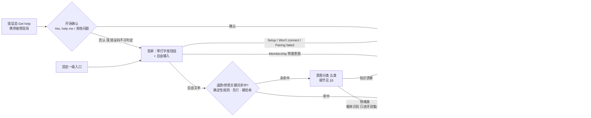

# r3-pm.md · PM 主笔章节（R3 修订版）

> 作者：prd-author-pm ｜ 日期：08-03-2026 ｜ 修订基底：drafts/r1-pm.md ｜ 修订输入：r2-architect-reviews-others.md（评 PM 稿节）、r2-engineer-reviews-others.md（评 PM 稿节）、debate-log.md「阶段 5 · R2 互审 Controller 裁决」11 项 ｜ 分工依据：drafts/r0-chapter-negotiation.md
> 主笔章节：§0 / §1 / §2 / §8 / §10 / §11；文末附 PM 副笔供稿（§5 用户可见文案包、§9 商业风险与外部依赖段）供各章主笔合并。文末「R3 处理记录」逐条登记 review 处理结果。

---

## §0 阶段路线图与 MVP 定义

> 放在 PRD 最前面。读到这里就应知道：MVP 做什么、做完用户拿到什么、什么叫做完。

### 0.1 阶段划分表

| 阶段 | 验证目标 | 功能模块 | 交付物（做完用户拿到什么） |
| :--- | :--- | :--- | :--- |
| **阶段一 · MVP** | 高频问题（安装/联网/配对/会员）的自助解决体验能否达到及格线：答得准、转得顺、找得到门、出得去门（高频类严口径解决率目标 60% / 底线 45%，3 个月，来源：proposal-v1 §7）；同时为第二阶段攒数据与回流体系 | F01 智能问答、F02 引导排障（三大场景）、F03 人机衔接、F04 双层反馈、F06 效果度量与容量预警、F08 入口与场景化触达；**F05 知识库回流闭环进 MVP**（回流机制与清单导出即上线，周消化 SLA 在拍板 2 名单落实后生效）；**F07 的两条零成本预留约束进 MVP**（文案/prompt 不硬编码语言、知识条目带语言字段） | App 用户在 COOLFLY App 内获得英文智能客服：错误提示旁一键 "Get help"、首屏零打字按钮组、一步一屏排障引导、答不准主动转人工且零复述、转人工后知道去哪等回复；业务侧获得双口径解决率看板与容量预警 |
| **阶段二及以后（后置，未排期、未细分，照抄已确认清单）** | 差异化与全渠道（本 PRD 不展开） | F07 完整多语言；设备状态诊断 + 自动解决方案（差异化王牌，依赖方案商接口争取）；邮箱/社媒/官网全渠道接入（长期愿景：一个 agent 服务全渠道）；Zendesk 客服工作台接入；方案商设备日志接口调用 | —（后置项不在本 PRD 承诺范围内，仅作演进方向登记） |

### 0.2 MVP 完成定义（照抄已确认结论，不得改动）

> **「F01/F02/F03/F04/F06/F08 六项全部达到及格线完成标准（含离线评测集验收通过 + 双口径看板可用）即 MVP 完成」**（来源：proposal-v1.md「MVP 划分（已与企业家确认 · 08-03-2026）」，企业家确认「就这些，没有补充」）。
> F05 / F07 **不卡** MVP 完成验收：F05 回流机制与清单导出随 MVP 上线，周消化 SLA 待拍板 2 名单落实后生效；F07 只验收两条约束（见 §10.4）。

### 0.3 功能清单（F01–F08 · 带所属阶段列）

| 编号 | 功能 | 优先级 | 档位 | 上线线 | 所属阶段 |
|------|------|--------|------|--------|---------|
| F01 | 智能问答会话（意图分类先行 + 三层拒答，细节见 §3） | 必做 | 🟩 | 引擎线（首屏按钮组属发版线） | 阶段一 MVP |
| F02 | 引导式排障（安装/联网/配对三场景，一步一屏） | 必做 | 🟩 | 内容引擎线 + 卡片 UI 发版线 | 阶段一 MVP |
| F03 | 人机衔接（摘要+SN+型号，三件套随 G3 分层） | 必做 | 🟩 | 引擎线 | 阶段一 MVP |
| F04 | 会话反馈（消息级 👍/👎 + 会话级评分） | 必做 | 🟩 | 引擎线 | 阶段一 MVP |
| F05 | 知识库升级与回流闭环 | 应做 | 🟩（周消化 SLA 依拍板 2） | — | 阶段一 MVP（回流机制进 MVP，不卡验收） |
| F06 | 效果度量与预警（双口径、分层、容量预警线） | 必做 | 🟩 | 引擎线（与功能同步验收） | 阶段一 MVP |
| F07 | 多语言能力预留（仅两条约束） | 可做 | 🟨（两条约束本身进 MVP） | — | 约束进阶段一；完整多语言后置 |
| F08 | 入口与场景化触达（固定入口 + 错误态 Get help） | 必做 | 🟩 | 发版线（移出 2 周灰度承诺） | 阶段一 MVP |

不做（边界重申，来源：proposal-v1 §4）：设备状态诊断与自动解决方案（第二阶段王牌）；客服工作台（未来 Zendesk）；邮箱/社媒/官网渠道改造；硬拦截降转人工率；客服容量/排班方案（产品只交付预警数据）。

### 0.4 MVP 方案前置能力（照抄 scene-anchor.md 已确认表）

| 能力 | 状态 | 负责人 | 证据/说明 | 替代方案 | 阶段 |
|------|------|--------|-----------|----------|------|
| LLM API（智能问答核心） | 待配置 | 内部技术团队 | 部署密钥方式配置，系统级，不做用户可见配置界面 | 无 LLM 则退化为检索式 FAQ，价值大减 | MVP |
| 现有 AI 客服历史数据导出 | 可导出（用户确认） | 用户团队 | 用于基线校准与知识库升级（即 G1） | 无导出则基线上线后重新采集 | MVP 前 |
| 飞书知识库（120+ 篇）访问/迁移 | 已存在 | 用户团队 | 智能问答的知识来源；飞书 API 权限前置登记 | — | MVP |
| 方案商设备日志接口 | 不存在，未来可能 | 用户团队争取 | 目前纯人工链路 | 引导自查 + 带 SN 转人工 | 后续阶段 |

### 0.5 未决拍板（不阻塞 PRD 定稿）

- `OPEN_QUESTION`（拍板 1）：**重建服务端对话引擎 vs 升级现有系统**——待 G1 基线 + G2 盘点（含选项 B 能力对照表、三集成点可插拔判定）后由企业家拍。**无论 A/B，F01–F08 用户可见完成标准为形态无关硬验收，不随之变化**；选 B 后达不成的项逐条摆回企业家桌面重拍，不许静默缩水（来源：proposal-v1 §14 拍板 1）。
- `OPEN_QUESTION`（拍板 3）：**上线时间表、灰度节奏与 Q4 旺季策略**——待 G1 与开发排期后在 A（旺季前完整爬坡）/ C（旺季前只上保守版，§4 已显式定义）中选，不推荐 B（避开旺季）；**G1 超 2 周未产出自动落保守版 C**（写死）。F01–F08 用户可见完成标准不随之变化（来源：proposal-v1 §14 拍板 3 + R0 特殊情况①）。
- 已决不重开（来源：项目纪要 08-03-2026 16:56:30）：拍板 2＝运营三岗现有人员兼任、名单 G1–G4 窗口内后补；拍板 4＝价值账保留原口径 ¥120–130 万/年并披露口径结构（见 §1.2/§11）；拍板 5＝知识库改造顺序与转人工通路授权按 G1/G3 门槛结果执行。

---

## §1 项目背景与业务收益

### 1.1 需求简介

在 COOLFLY App 内重建/升级智能客服入口，让用户（尤其刚装机的新用户）在几分钟内自助解决安装、联网、配对、会员等高频问题；解决不了时顺畅衔接人工、零复述、不干等（来源：scene-anchor.md 一句话定位）。

**第一阶段定位（诚实版）**：体验补课到及格线——答得准、转得顺、找得到门、出得去门——同时为第二阶段攒数据与回流体系；差异化王牌（AI + 设备诊断，调研证明全品类无人做到）留在第二阶段（来源：proposal-v1 §1；evidence/competitors.md 差异化机会 1）。

### 1.2 收益预估

#### 用户收益（量化）

| 收益 | 现状 | 目标 | 依据等级 |
|------|------|------|---------|
| 高频问题解决时长 | 人工回复平均 1–2 小时，配对类需人工链路定位、困难时隔天（用户确认事实） | 自助场景 ≤10 分钟（假设值，scene-anchor 已拍板） | A（现状）/ D（目标值） |
| 首次响应 | 人工渠道小时级；行业聊天首响均值约 2 分钟、邮件均值约 12 小时（来源：benchmark.md，Lorikeet 引 Zendesk/SuperOffice） | AI 入口秒级即时响应 | B（行业基准）/ C（推断） |
| 求助门槛 | App 被差评"labyrinthian maze"，错误发生时无指引（用户之声见下） | 错误提示旁一键 Get help；首屏零打字按钮组；新用户 3 步内找到入口 | A（差评为逐字原文） |
| 口径一致性 | 不同客服口径不一（用户确认事实） | 基于同一知识库回答，口径统一 | A / C |

**用户之声（COOLFLY 自身 App Store 差评逐字原文，直接做成验收用例，来源：evidence/complaints.md 痛点 6/9）**：
- "my device went off-line, and there are no instructions telling me how to get it back online"（设备掉线，没有任何指引告诉我怎么让它重新上线）——2025-08-31
- "To navigate this app is like an adventure in a labyrinthian maze"（在这 App 里导航像走迷宫）——2025-04-29；"It's an absolute nightmare to navigate"——2025-05-18

#### 业务收益（价值论证 · 拍板 4 已确认口径）

按用户拍板的原口径呈现（拍板 4，08-03-2026）：

| 价值块 | 计算口径 | 年价值 | 依据等级 |
|--------|----------|--------|---------|
| ② 减退货损失 | 退货率降 3pp（11%→5% 目标中归功智能客服的一半）× 10 万台/年 × $50 客单价 × 70% 退货损失率 ≈ $105,000 | 中性 ¥75 万（区间 ¥36–136 万） | 销量/退货率/客单价=A（用户确认）；3pp 归因=D（A-005）；70% 损失率=D（A-006） |
| ③ 撑增长不加人 | 销量涨 2–3 倍、咨询量同步涨时，自助解决 50%+ → 客服维持 3–4 人，避免新增 4–5 人 | ¥24–48 万 | 销量计划=A；解决率 50%+=D（A-004） |
| ① 省现有人力 | 客服工作量减半（按工作量折算，轮班最小配置不减人头）+ 技术定位省来回（30–50 起/月 × 1–2h，用户确认） | ¥12–17 万 | 客服成本/技术定位频次=A；减半幅度=D |

> **合计：中性约 ¥120–130 万/年，两年稳超 ¥200 万；乐观口径单年可到 ¥200 万**（来源：scene-anchor.md 价值论证已确认小节，用户 08-03-2026 拍板认可并在拍板 4 中确认保留原口径）。
>
> **口径结构披露（拍板 4 要求，随结论必须出现）**：
> 1. 价值块 ① 与 ③ 基于**同一份被释放的客服容量**——① 按"销量不涨、现有工作量减半"折算，③ 按"销量涨 2–3 倍、避免加人"折算，两者为不同情景下对同一容量的两种计法，同表相加存在重复计算风险；剔除重复后的可复算中性口径为 ②+③ = ¥99–123 万/年。企业家已知晓该风险，仍拍板保留 ¥120–130 万/年原口径对外呈现（来源：项目纪要 08-03-2026 16:56:30）。
> 2. **"两年稳超 ¥200 万"为中性情景结论，且以 G1 通过 A-005 检验（退货用户中曾咨询比例 ≥30%）为前提**；G1 触发回炉线则 ② 重算、此结论同步重述（来源：debate-log.md 裁决 4）。
>
> 未入账弹性：店铺评分 3.6–4.0 → 4.3+ 对转化率的拉动（3→4 星下载/转化 +89%，Apptentive 下载口径，店铺购买转化为类比推断，依据等级 C，来源：benchmark.md）；技术定位省来回若单列约 ¥3–5 万/年（工程师工时，独立资源；**已含于价值块①，此处仅为单列口径参考，不与上表叠加**）。

**最锋利的一句话**（来源：scene-anchor.md）：差评里一半是"装不上连不上"——这正好是智能客服最能吃掉的问题；退货率每降 1 个点，一年就是 1,000 台不用退。

#### 不做的风险（每条带依据等级）

| 风险 | 后果 | 依据等级 |
|------|------|---------|
| 挫败型退货持续流血 | 65% 受访者曾因开箱/装机挫败退掉**无缺陷**电子产品（TechSee）；68% 消费电子退货为无故障退货（Accenture）——现状 11% 退货率中可被自助排障拦截的部分持续损失 | B（外部权威调研，来源：complaints.md 痛点 10、benchmark.md） |
| 店铺评分被装机差评压制 | 差评中使用问题类占 50%+（用户确认），评分 3.6–4.0 压制转化；竞品 Bird Buddy 4.8 分/61K 评分（来源：competitors.md） | A（自有数据）+ B（竞品对照） |
| 销量翻倍时客服被淹没 | 2026 目标近 10 万台、未来一年销量涨 2–3 倍（用户确认）；3 人团队无自助分流则咨询量同步翻倍，服务质量与首响崩塌 | A（计划）+ C（外推） |
| 错失品类先发窗口 | 品类 7 家品牌无一做到"会读设备的 AI 客服"，有诊断的没 AI、有 AI 的读不到设备（来源：competitors.md）；第一阶段不落地，第二阶段王牌无数据、无回流体系可承接 | B（竞品调研） |

---

## §2 用户画像与核心旅程

### 2.1 用户角色矩阵

| 角色（稳定名称） | 身份/别名 | 直接/间接 | 目标 | 关键操作 | 数据/权限边界 | 所属阶段 |
| :--- | :--- | :--- | :--- | :--- | :--- | :--- |
| **App 用户** | COOLFLY 智能喂鸟器/鸟类相机买家；主力北美、英文；典型状态"刚拿到设备，卡在安装/联网/配对"；中老年占比高（打字意愿低） | 直接 | 几分钟内自助解决问题；解决不了时顺畅转人工、不复述、不干等 | 点错误态 Get help / 首屏按钮；分步排障（Done / It didn't work）；自由输入提问；确认并补充转人工摘要；👍/👎 与会话评分 | 仅本人会话、本人设备（SN/型号）与故障上下文；无任何后台数据 | 阶段一 MVP |
| **人工客服** | 菲律宾 3 人外包团队 | 间接（不为其做工具，本期无客服侧界面） | 接到转人工时即见摘要三件套（已试步骤/SN/型号/卡点），首条回复直奔问题 | 接收转人工会话与交接数据；按 SOP 首条回复引用摘要 | 仅接收交接契约字段与会话摘要；工作台能力不在本期范围（未来 Zendesk） | 阶段一 MVP（间接） |
| **业务负责人** | 企业家/COOLFLY 业务线负责人 | 间接 | 按周看双口径解决率看板、收到容量预警、月度退货归因，验证价值账 | 查看 F06 看板与周报；接收容量预警推送 | 聚合指标数据（脱敏后），无单用户会话明细浏览需求 | 阶段一 MVP（间接） |

单/多角色结论：**单直接角色产品**（App 用户）；人工客服与业务负责人均为数据/流程的间接接收方，目标、操作、数据边界互不相同故分列，但不产生独立界面需求。

### 2.2 明确不是谁

- **客服员工（作为工具使用者）**：客服工作台未来用 Zendesk，本期不做任何客服侧界面（已拍板边界）。
- **邮箱/社媒/官网渠道的咨询用户**：本期不动，后续阶段统一（长期愿景=一个 agent 服务全渠道）。
- **非英语主力市场用户**：第一版英文单语（A-002，依据等级 B）；非英语输入仅提供兜底说明与转人工，不承诺母语服务。
- **方案商/开发者**：设备日志接口不存在（A-003，依据等级 A），不是本期服务对象。

### 2.3 核心用户旅程（照 proposal-v1 §6 落成正式旅程；拒答/情绪机制细节参见 §3，流程图参见 §6）

> 图注（与 §3.1 执行顺序对齐，R2 修订）：自由文本**先过退款/愤怒关键词规则**（确定性、先行、硬验收 AC-E-03），命中直入旅程 C；未命中才进意图分类，分类器判为情绪类同入旅程 C（该识别为概率性，只进评测集与灰度抽检，不进硬验收）。错误态入口先出携带故障现场的开场确认（确认→对应排障流；否认或错误码不可判定→首屏按钮组，R2-裁决 3）。

**旅程 A · 自助解决（主路径，目标占高频类 60%，目标值为假设 A-004）**
北美用户 Sarah 配对到一半卡住，配对失败页直接显示 "Get help" → 点进去首条是开场确认"看起来配对没成功，要我带你排查吗？"点 "Yes, help me" → 首屏零打字进入分步引导，第一步问"你连的是 2.4GHz 还是 5GHz？"配路由器示意图 → Sarah 切出 App 去改路由器设置（超过 30 分钟也没关系）→ 回来自动恢复到当前步骤 → 点 "Done"，配对成功 → AI 确认解决，弹出轻量评分 → 全程 8 分钟，零打字也零等待。（2.4GHz/5GHz 为品类第一装机杀手，来源：complaints.md 痛点 1）

**旅程 B · 转人工兜底（不干等、不复述、知道去哪等）**
用户 Mike 扫码绑定失败，引导两轮自查仍失败 → AI 主动说"这个情况需要人工用你的设备序列号定位"，展示将发给客服的摘要，Mike 补充"绑定时 App 闪退过一次" → 确认转人工，界面按真实通路显示等待承诺（目标态/底线态两套话术见 §5 文案包；层级随 G3 查证分层）→ 人工客服首条回复即引用摘要直奔问题 → Mike 全程零复述、零虚假期待。

**旅程 C · 情绪崩溃路径（退货率的直接来源）**
用户折腾 2 小时后打出 "this thing is garbage, I want a refund" → 关键词规则命中，不进拒答判定、不追问技术细节 → 先共情，出口置顶：转人工 + 退货政策入口 → 若用户愿意，再给"最后试一步"最短排障路径。（机制细节与验收边界见 §3；关键词触发为确定性硬验收，怒气识别只进评测集与抽检；交接契约携带内部情绪会话标记，用户不可见，R2-裁决 7）

### 2.4 用户故事（US 注册表 · ID 与 F01–F08 对齐）

> FR 编号已按 R2-裁决 5 锁定为**组级 FR-F01…FR-F08**（工程师 §5 每个 F 小节落注，一经落定只增补不重排）；本节「由 FR-F0x 实现」即最终引用格式。

**F01 智能问答会话**
- **US-F01-01**：作为 App 用户，我想用英文直接提问安装/联网/配对/会员问题，AI 基于知识库多轮对话给出准确回答，让我几分钟内解决问题。（由 FR-F01 实现）
- **US-F01-02**：作为 App 用户，当 AI 对事实性问题没把握时，我希望它明说"不确定"并主动给我转人工入口，而不是编一个答案害我白折腾。（由 FR-F01 实现）
- **US-F01-03**：作为折腾了 2 小时、正在气头上的 App 用户，当我打出退款/愤怒字眼时，我希望先被安抚、并直接看到置顶的转人工与退货政策入口，而不是被追问技术细节或收到"我没把握"的模板话术。（由 FR-F01 实现）
- **US-F01-04**：作为 App 用户，同一会话里 AI 连续两次答不上来后，我希望直接看到转人工大按钮，不被消耗第三次耐心。（由 FR-F01 实现）
- **US-F01-05**：作为非英语输入的 App 用户，我希望收到英文+我所用语言的模板句说明（当前仅支持英文），并照常拿到转人工入口，而不是被无声忽略。（由 FR-F01 实现）
- **US-F01-06**：作为 App 用户，我希望会话开场就知道对面是 AI 助手，对回复能力有正确预期。（由 FR-F01 实现）
- **US-F01-07**：作为想咨询会员问题的 App 用户，我希望点首屏 Membership 按钮直接进入会员问答，跳过打字。（由 FR-F01 实现）

**F02 引导式排障**
- **US-F02-01**：作为面对空白输入框不知道打什么的 App 用户（中老年为典型），我希望首屏就有高频问题按钮（Setup / Won't connect / Pairing failed / Membership），点按直接进入一步一屏的分步引导。（由 FR-F02 实现）
- **US-F02-02**：作为排障中的 App 用户，每一步我只需在 "Done" 和 "It didn't work" 两个大按钮里选一个，就能走到下一步或换一条路径，永远不会走进死胡同。（由 FR-F02 实现）
- **US-F02-03**：作为需要切出 App 去改路由器设置的用户，我希望回来时（24 小时内）自动恢复到刚才的排障步骤，不用从头再来。（由 FR-F02 实现）

**F03 人机衔接**
- **US-F03-01**：作为自助未解决的 App 用户，我希望一键转人工时系统自动带上会话摘要+SN+设备型号，我能看到并补充这份摘要，到了人工那里不用从头复述。（由 FR-F03 实现）
- **US-F03-02**：作为已转人工的 App 用户，我希望界面如实告诉我回复将通过什么渠道、预计多久送达、超时了找谁，而不是对着聊天窗干等一个不会来的回复。（由 FR-F03 实现）

**F04 会话反馈**
- **US-F04-01**：作为 App 用户，我可以对 AI 的单条回答点 👍/👎，点踩时可选原因（不相关/看不懂/试了没用），让答错的地方被修正。（由 FR-F04 实现）
- **US-F04-02**：作为结束会话的 App 用户，我可以用一次轻量评分表达这次服务是否解决了问题。（由 FR-F04 实现）

**F05 知识库回流闭环（间接角色）**
- **US-F05-01**：作为知识库内容运营（owner 依拍板 2 名单，间接角色），我每周拿到一份按频次排序的待补条目清单（含原始问题/命中文档/会话链接），知道该优先补什么。（由 FR-F05 实现）

**F06 效果度量与预警（间接角色）**
- **US-F06-01**：作为业务负责人（间接角色），我上线第一周起就能按周查看双口径解决率（按入口分层）、拒答率（按层分列）、转人工量与语言分布，验证这笔投入是否值得。（由 FR-F06 实现）
- **US-F06-02**：作为业务负责人（间接角色），当月转人工绝对量达到预警线（G1 实测月处理量的 80%）时，我要收到预警推送，来得及启动容量应对预案。（由 FR-F06 实现）

**F08 入口与场景化触达**
- **US-F08-01**：作为设备掉线/配对失败/扫码失败的 App 用户，我希望错误提示旁边就有 "Get help"，点一下进入对话且故障现场已自动带上，不用自己描述发生了什么。（由 FR-F08 实现）
- **US-F08-02**：作为新用户，我希望在 App 内 3 步以内找到固定客服入口，而不是在"迷宫"里找门。（由 FR-F08 实现）

**F07 多语言能力预留**：无独立用户故事——本期只交付两条产品约束（用户可见文案与 prompt 模板不硬编码语言；知识条目带语言字段），验收见 §10.4；完整多语言体验后置（触发条件：F06 语言分布实测非英语占比 >15%，A-002）。

---

## §8 成功度量

### 8.1 北极星指标

**高频类自助解决率（严口径）**：AI 会话中未转人工、48h 内无新会话、且经 F04 显式确认解决（未答复按保守折算）的比例。**目标 60% / 底线 45%（上线 3 个月，G1 后校准回填）**。目标值性质：假设值（A-004，依据等级 C——行业第三方实测 FAQ 类 60–70% 区间支撑其可达性，来源：benchmark.md）。

**显式确认信号定义（R2 补充）**：显式确认 = 会话结束事件结束类型「确认解决」∪ F04 评分卡「Yes」，未答复按保守折算计入分母不计入分子；事件属性定义归 §4.2。

### 8.2 关键指标矩阵

| 指标 | 口径 | 基线 | 目标 | 时间窗 | 来源/呈报方式 |
|------|------|------|------|--------|--------------|
| 自助解决率（宽口径） | 未转人工 且 48h 内无任何新会话；接续排障会话不计新会话；已结束会话重新激活并产生用户消息=新会话 | 现有 AI 解决率 `[PRD 定数 · G1 后回填]` | 高频类 60% / 整体 50%（3 个月，假设值 A-004） | 周报 | F06 看板；**按入口来源（固定入口/错误态入口）分层呈报，交互方式（按钮组/自由输入/预置意图）为次维；旧版本无字段流量归「未知」单列**（两维枚举唯一定义见 §4，R2-裁决 8） |
| 自助解决率（严口径，验收用） | 宽口径 ∩ F04 显式确认（信号定义见 8.1，未答复保守折算） | 无（新口径） | 高频类目标 60% / 底线 45% | 3 个月 | F06 看板；连续 2 个月低于 45% 且回流机制正常运转 → 触发切采购扳机（见 8.3） |
| 沉默放弃率预警 | 宽口径 − 严口径 差值 | 无 | 差值持续扩大 → 触发口径复查 | 周报 | F06 周报 |
| 拒答率 | 按触发层①②③分列（层定义见 §3） | 无 | 上线首月预期区间 `[PRD 定数 · G1 后回填]`；超区间=知识库改造未到位信号，且为灰度放量前置条件之一 | 周监控 | F06 看板 |
| 离线评测集（golden set） | 评测集命中率 + 反向指标：拒答准确率、引用忠实率、幻觉率、高频误拒率、连续拒答（构成见 §4） | — | **命中率 ≥80%（随 G1 校准），为引擎线灰度放量前置条件之一（与拒答率落在预期区间并列）**；误拒率上限 `[PRD 定数 · G1/G2 后回填]`；单会话连续拒答 ≤2 次 | 每次发版前评测 | 评测集（R2-裁决 10：目标值唯一落点在本章，§4/§6 引用不复制） |
| 自助解决时长 | 自助场景从进入会话到确认解决 | 人工 1–2 小时（用户确认现状） | ≤10 分钟（假设值，scene-anchor 已拍板） | 3 个月 | F06 自动统计 |
| 转人工率与绝对量 | 自动统计；**容量预警线 = G1 实测的现有 3 人团队月处理量 × 80%** | 月处理量 `[PRD 定数 · G1 后回填]` | 达线即预警推送企业家 | 周监控 | F06 |
| 转人工首次响应 | 人工渠道首响；**测量口径分层：目标态=「客服首条回复送达」事件（§4.2）自动测量；底线态（邮件通路）依人工渠道统计，口径 `[PRD 定数 · G3 后回填]`**（R2-裁决 8） | `[PRD 定数 · G1 后回填]` | **不劣于现状**（不变行为，见 §10.5） | 持续 | F06（目标态）/ 人工渠道统计（底线态） |
| 会话满意度评分 | F04 会话级轻量评分；**触达时机分层（R2-裁决 2）：自助解决→评分卡（含"是否解决"Yes/No）；目标态转人工→人工会话关闭后触达；底线态转人工→转接确认时仅触达服务体验类反馈、不问"是否解决"——解决维度一律按行为口径+保守折算，不新增打分弹窗** | 无 | 趋势参考，不设达标线（已裁决，B11） | 周报 | F06 |
| 语言分布 | 来话语言占比 | `[PRD 定数 · G1 后回填]` | 非英语 >15% → 触发提前完整多语言评估（A-002 传感器） | **周看板呈现 + 月度触发评估** | F06 |
| 退货归因 | 月度（起步手工表🟩，看板化🟨），口径依 G4 查证结果；G4 映射链不存在则降级为"渠道原因码粗分类 + 月度趋势" | 退货率约 11%（用户确认） | 使用问题类退货占比下降趋势可见（A-005 验证） | 3 个月验收项 + 月报 | 月度归因报表（owner 待拍板 2 名单） |

### 8.3 指标防欺骗机制与检查点

- **交叉校验**：解决率 × 满意度 × 退货月度趋势三者背离 → 触发口径复查（来源：proposal-v1 §7）。
- **切采购扳机（写死）**：高频类严口径解决率连续 2 个月 <45% 且回流机制正常运转 → 触发采购路线复评（含 Zendesk 工作台迁移成本评估）；试点定位锁定为补位人工侧工作台，自研对话层保留评估，不是替换自研路线。
- **90 天价值兑现检查点**：上线 3 个月用真实数据回填 §1.2 价值账，15 分钟汇报——假设换事实的固定仪式。
- **灰度对比结论必须区分"引擎效果"与"入口效果"**：错误态入口流量问题更难、情绪更差，混算会让新系统被自己的增量流量拉低（来源：debate-log.md 裁决 2；entry_source 两维拆分即为此服务，见 §4）。

---

## §10 验收标准（业务场景 · 5 维）

> 只定义产品可观察结果；每条 AC 有唯一可观察结果。测试方法、自动化策略、测试数据与覆盖率归 TDD Master，本章不写。数值占位遵循 R0 规范：`[PRD 定数 · G 后回填]` + 当前建议值。

### 10.1 主流程

| ID | 场景（Given/When） | 可观察结果（Then） |
|----|--------------------|--------------------|
| AC-M-01 | 用户在配对失败错误页点 "Get help"（错误码已结构化，G2 前提满足） | 进入客服对话；**首条为携带该故障场景的开场确认消息（文案见 §5），含确认与否认两个出口**：确认后直接进入对应排障流第一步，否认则回到首屏按钮组——用户全程无需自己描述"我在配对时失败了"；会话开场可见 AI 身份披露语（文案见 §5）。（错误码未结构化时的降级行为见 AC-E-11） |
| AC-M-02 | 用户在对话首屏不打字，点 "Pairing failed" 按钮 | 直接进入配对排障分步引导第一步；一步一屏，**卡片主操作仅 "Done" / "It didn't work" 两个大按钮（无 👍/👎）；转人工为不与主按钮抢层级的次级入口，每张卡片可达**（AC-I-01 的落地件） |
| AC-M-03 | 用户在引导步骤点 "Done" 且为最后一步 | AI 给出解决确认，随后出现会话级轻量评分入口 |
| AC-M-04 | 用户点首屏 "Membership" 按钮 | **零打字进入会员问答上下文（预置意图）：AI 主动给出会员主题开场提问/高频问题引导（文案见 §5；该开场属追问澄清类豁免，不计事实性解答）**；用户后续提问按知识问答路径应答 |
| AC-M-05 | 用户自由输入英文提问〔安装 ｜ 联网 ｜ 配对 ｜ 会员〕类问题（四类各为一个独立验收场景） | AI 给出基于知识库的英文回答；**知识求解类回答末尾可见简短来源标注（如 "Source: Setup Guide"，R2-裁决 4：可见但轻量，不展开全文引用、不加跳转承诺；引用机制见 §3，展示样式归设计阶段）**；不输出编造步骤（由 AC-E-01 约束拒答侧） |
| AC-M-06 | 自助未解决，用户点转人工 | 界面展示将发送给客服的摘要（含已试步骤/SN/型号/卡点），用户可编辑补充；确认后显示回复渠道与预计时间（按 G3 层级取对应话术，见 §5） |
| AC-M-07 | 人工客服（间接角色）收到转人工会话 | 客服可见完整交接信息：会话摘要、已试步骤、SN、设备型号、卡点——无需向用户再要一遍（"零复述"，SOP 首条回复引用摘要属运营验收，见 §9） |
| AC-M-08 | 用户对 AI 单条回答点 👎 | 出现原因选择（不相关/看不懂/试了没用），提交后界面确认收到；**用户跳过原因选择时，点踩状态仍保持选中**；无论是否选原因，该消息均进入回流清单（清单可观察结果见 AC-M-09） |
| AC-M-09 | 运营（间接角色）在上线后任一周查看回流清单 | 可导出一份按频次排序的待补条目清单，字段含原始问题/命中文档/会话链接/频次 |
| AC-M-10 | 业务负责人（间接角色）在灰度第一周查看看板 | 双口径解决率、拒答率（分层）、转人工量、语言分布均有数据、按周可看；解决率**按入口来源（固定入口/错误态入口）分层，旧版本无字段流量归「未知」单列**（维度定义见 §4） |
| AC-M-11 | 新用户从 App 首页出发找客服 | 3 步以内到达固定客服入口；**"步" = 从 App 首页起的点击/页面跳转次数，不含滚动查找**（场景背景见 §11.3 差评行） |
| AC-M-12 | **底线态**下用户完成转人工转接确认 | 界面仅出现**服务体验类**反馈入口（文案见 §5），**不出现"是否解决"提问**；该会话的解决维度由行为口径统计（R2-裁决 2） |

### 10.2 异常分支

| ID | 场景 | 可观察结果 |
|----|------|-----------|
| AC-E-01 | 用户问知识库覆盖不到的事实性问题（检索无可靠依据） | AI 明确承认无法确定答案（常规拒答话术，见 §5），同屏给出转人工入口；不输出编造的操作步骤 |
| AC-E-02 | 同一会话内**连续**第 2 次拒答（连续计数的重置规则以 §3.3 定义为准） | 界面直接呈现**极短说明句 + 转人工大按钮**（R2-裁决 1，文案见 §5）；不出现第 3 次"我没把握"式回复 |
| AC-E-03 | 用户消息命中退款/愤怒类关键词（如 refund、garbage） | 本条消息不进入拒答判定、不被追问技术细节；回复为共情话术（情绪套话术，见 §5），且转人工与退货政策两个入口置顶常驻可见 |
| AC-E-04 | 用户输入非英语文本（如西班牙语） | 收到英文 + 该语言模板句的说明（仅支持英文），并照常提供转人工入口；会话不中断、不忽略该消息 |
| AC-E-05 | 用户在排障引导中点 "It didn't work" | 进入替代分支或转人工出口，绝不出现"无下一步可点"的死胡同（排障全分支适用） |
| AC-E-06 | 用户问敏感/超范围问题（硬规则命中，范围见 §3） | AI 拒答并说明能力边界，给出转人工入口 |
| AC-E-07 | 转人工后超过承诺时间**（含缓冲系数 `[PRD 定数 · 建议 1.5 倍]`，定数唯一落点见 §5.4）**未有人工回复（目标态） | 用户收到主动安抚消息（含超时联系方式）；不发生"承诺了通知却永远沉默" |
| AC-E-08 | 用户确认转人工时提交失败（网络/渠道故障） | 显式失败提示 + 可重试；连续失败后界面展示兜底联系方式（客服邮箱），不出死屏、不静默丢弃请求 |
| AC-E-09 | 转人工摘要自动生成失败 | 转人工**不被阻塞**：降级为"会话记录直达客服"+ 用户手填卡点描述；转人工可用性优先于摘要完整性 |
| AC-E-10 | 用户未绑定设备（SN/型号缺失）或绑定多台设备时转人工 | 摘要对应字段显示为空并可手动补充；多设备时可选择涉事设备；缺失/多选均不阻塞转接 |
| AC-E-11 | 用户在错误提示旁点 "Get help"，但该错误态无结构化错误信息（G2 前提不满足） | 降级为通用进入：落首屏按钮组 + 自由输入；"Get help" 入口不消失、点击不无响应 |
| AC-E-12 | 用户发送无意义输入（乱码/纯表情） | AI 按追问澄清路径回应（文案见 §5），不计拒答、不触发拒答话术 |

### 10.3 状态切换

| ID | 场景 | 可观察结果 |
|----|------|-----------|
| AC-S-01 | 用户在排障中途切出 App（如去改路由器设置），2 小时后返回 | 自动恢复到离开时的排障步骤，原会话接续（24h 内有效）；该会话不因 30 分钟静默被判结束 |
| AC-S-02 | 非排障态自由对话静默超过 30 分钟 | 会话按静默结束处理（结束态可见评分触达策略遵循 §5/§7 定义）；静默流失不追弹 |
| AC-S-03 | 已判结束的会话被用户重新打开并发送新消息 | 按新会话处理（口径上计复问）；用户侧对话体验连续、无报错 |
| AC-S-04 | AI 响应超时（超过 `[PRD 定数 · 建议 8–10 秒]`） | 界面出现重试提示，用户可重试或直接转人工；期间有流式/加载指示，无静默空屏 |
| AC-S-05 | LLM 服务不可用/限流 | 客服入口不出死屏：界面降级为直达转人工 + 相关排障文章入口 |
| AC-S-06 | 手机离线时打开客服入口 | 本地离线提示可见，恢复网络后可正常进入；无死屏无崩溃 |
| AC-S-07 | 用户转人工时被请求通知权限并拒绝（目标态） | 界面明示改为"主动回来查看回复"的指引，不再承诺通知送达 |
| AC-S-08 | AI 回复流式输出中网络中断（弱网） | 已输出内容保留、带中断标记，用户可重试；不出现整条消息消失或空屏 |
| AC-S-09 | 用户消息发送失败（弱网/瞬断） | 该条消息带失败标记、可单条重发；重发成功后不在会话流中重复出现 |
| AC-S-10 | 排障会话 24h 接续窗口过期后用户返回同场景 | 原会话按已结束处理并有过期提示可见（文案见 §5）；重新进入该场景为新会话、从第一步开始 |
| AC-S-11 | 排障流程内容更新（知识库改造/回流修订）或灰度开关切换时，存在进行中会话 | 进行中会话按其进入时的版本走完、不中途换步骤、不被打断；新会话使用新版本/新分桶 |

### 10.4 兼容性

| ID | 场景 | 可观察结果 |
|----|------|-----------|
| AC-C-01 | 用户开启系统最大字体缩放 | 对话与排障卡片不破版、按钮文字完整可读 |
| AC-C-02 | 用户在任一关键操作场景（排障推进、转人工确认等）点按关键按钮（Done / It didn't work / 转人工等），含最大字号档 | 按钮可点、响应正常；触达区域 ≥44pt |
| AC-C-03 | VoiceOver 开启走完主流程（进入入口→提问→转人工） | 关键控件可被读出、可操作（基础走查级，及格线不下放） |
| AC-C-04 | 未升级到含 F08 的 App 旧版本用户 | 仍可从原有固定入口使用引擎线全部能力（问答/排障内容/转人工）；仅缺错误态入口与新按钮组 UI；**卡片 UI 亦缺失时，排障以纯文本分步引导形式提供（每条消息一步 + 文字确认），路径完整不缺分支**（工程 §7.6 口径）；覆盖率随升级率如实呈报，不算入引擎灰度承诺 |
| AC-C-05 | 用户可见文案与 prompt 模板（F07 约束一） | 语言不硬编码——产品可观察结果：切换文案语言配置不需改动对话逻辑即可生效（验证细节归 §4/§5） |
| AC-C-06 | 知识条目（F07 约束二） | 每条知识条目带语言字段（schema 见 §4） |

### 10.5 不变行为（本产品上线不得改变的现状）

| ID | 不变行为 | 可观察结果 |
|----|---------|-----------|
| AC-I-01 | **不硬拦截转人工** | 用户在任何会话状态下主动要求转人工，均可达转人工流程；不存在"必须先走完 N 步排障才许转"的强制门槛 |
| AC-I-02 | **不做设备诊断** | 会话中不出现读取设备状态/远程诊断类功能承诺或界面（第二阶段边界）；配对类问题上限=引导自查 + 带 SN 转人工（A-003） |
| AC-I-03 | **转人工后人工首响不劣于现状** | 转人工请求到人工首次回复的时长，不劣于上线前人工渠道水平（基线 `[PRD 定数 · G1 后回填]`）；**测量口径随 G3 分层（R2-裁决 8）：目标态=「客服首条回复送达」事件自动测量（§4.2）；底线态=人工渠道统计，口径 `[PRD 定数 · G3 后回填]`** |
| AC-I-04 | **App 现有功能不受影响** | 客服模块任何故障（LLM 不可用、引擎超时）不影响 App 其余功能（设备直播、通知等）正常使用 |
| AC-I-05 | **不虚假承诺** | 底线态转人工话术中不出现"回复会通知你"字样；预计响应时间为滚动实际值或分档展示，界面上不出现硬编码的固定承诺时长；**不出现任何无实现载体的用户可见优先接入承诺（R2-裁决 7）** |

---

## §11 依据清单

### 11.1 用户确认的事实（依据等级 A）

| 依据 | 内容 | 出处 |
|------|------|------|
| 团队与成本 | 3 名全职客服 7×24（菲律宾团队，月成本合计约 ¥15–20k）；配对类技术定位 30–50 起/月 × 1–2h | 项目纪要 08-03-2026 15:41:12 / 15:44:30 |
| 销量与客单 | 2025 全年 7 万台；2026 全年目标近 10 万台；未来一年销量涨 2–3 倍；平均客单价按 $50 | 项目纪要 08-03-2026 15:44:30 / 15:46:56 |
| 退货与差评 | 退货率约 11%、目标 ≤5%；差评中使用问题类占 50%+；店铺评分 3.6–4.0 | 项目纪要 08-03-2026 15:41:12 |
| 现状渠道 | App 内自研 AI 客服（飞书 120+ 篇知识库）+ 客服邮箱；人工回复平均 1–2 小时、配对类困难时隔天；口径不一 | scene-anchor.md |
| 数据与接口 | 现有 AI 客服历史数据可导出；方案商设备日志接口不存在、纯人工链路（A-003 已确认） | 项目纪要 08-03-2026 15:30:24；assumptions.md A-003 |

### 11.2 用户拍板的口径与假设值（依据等级 D，登记于 assumptions.md，上线后校准）

| 编号 | 假设 | 与 G1 校准的关系 |
|------|------|------------------|
| A-004 | 高频类解决率 ≥60% / 整体 ≥50%（3 个月）为合理目标 | G1 导出基线后回填校准；最小字段（用户 ID/时间戳/问题分类/是否转人工）缺 ≥2 项 → 如实告知企业家"60%/45% 双档为纯假设"后再拍时间表与价值账 |
| A-005 | 智能客服可贡献退货率降约 3pp | G1 验证退货用户曾咨询比例，**<30% 触发回炉线**（回评审团复审，价值块②重算）；G4 查证归因数据链路 |
| A-006 | 每台退货平均损失约为客单价 70% | 财务实际退货损失数据校准，线性修正价值块② |
| A-001 | 飞书知识库质量足以支撑高频回答（第一命门，🟠） | G1 后排序改造清单；改造完成=schema 校验+评测集命中率达标（目标值见 §8.2）；灰度放量与知识库就绪联动 |
| A-002 | 第一版英文单语可接受（依据等级 B） | F06 语言分布实测，非英语 >15% 触发提前多语言 |
| A-007 | "高频三类（安装/联网/配对）占咨询量 60%+"（风险🟡） | G1 验证，**<40% 触发回炉线** |

> **假设 ID 勘误（R2-裁决 6）**：proposal-v1 §12 曾将"高频三类占 60%+"误标为 A-006（与"70% 退货损失率"撞号）。该假设现已在 assumptions.md 正式注册为 **A-007**，PRD 全文统一按 A-007 引用；proposal-v1 不回改，以 PRD 与 assumptions.md 为准，后续文档禁止再引用旧标号。

**拍板 4 口径披露（重申，详见 §1.2）**：价值账 ¥120–130 万/年为用户拍板保留的原口径；其中价值块①③基于同一份释放容量、同表相加存在重复计算，剔除后可复算口径为 ¥99–123 万/年；企业家知晓该风险仍拍板保留。"两年稳超 ¥200 万"以 G1 通过 A-005 检验（交叉比例 ≥30%）为前提。

### 11.3 调研证据（依据等级 B/C，全部带来源 URL，详见 evidence/ 三份文件）

| 依据 | 关键数字/结论 | 来源 |
|------|--------------|------|
| COOLFLY 自身差评（逐字原文） | 掉线无指引、"labyrinthian maze" 导航噩梦（后者为 AC-M-11 的场景背景来源） | App Store 评论页（complaints.md 痛点 6/9，2026-08-03 抓取） |
| 品类装机杀手 | 2.4GHz/双频路由器冲突为品类第一配对失败根因；配对卡死、扫码失败、固件升级失败为共性 | complaints.md 痛点 1/2/4/5（官方支持文档+排障指南） |
| 竞品客服失败模式 | Wyze "do-loop 绕不到真人"；Birdfy 电话仅 5% 接通真人；Bird Buddy 失败后甩静态文章、工单 7 天 | competitors.md / complaints.md 痛点 7/8 |
| AI 解决率行业基准 | 厂商自报 76%（Intercom Fin 官网）vs 第三方实测 38–53%、FAQ 类 60–70%、强部署 70–75% | benchmark.md（fin.ai；clonedesk/builts 第三方评测） |
| 首响基准 | 聊天行业均值约 2 分钟、AI 可 <5 秒；邮件均值约 12h、良好档 ≤4h | benchmark.md（Lorikeet 引 Zendesk/SuperOffice） |
| 退货可压缩性 | 68% 消费电子退货为无故障退货（Accenture）；65% 用户因挫败退掉无缺陷产品、74% 觉得复杂就会退（TechSee） | benchmark.md / complaints.md 痛点 10 |
| 评分-转化 | 3→4 星下载/转化 +89%（Apptentive，下载口径；店铺购买转化为类比推断） | benchmark.md |
| 自研 vs 采购 | 月 1500–2000 条体量下采购年费约 ¥8–19 万 vs 自研 LLM API 约 ¥1 万/年量级 → 第一版自研，Fin 留作扳机后手 | competitors.md 平台调研 |

### 11.4 内部裁决依据（流程产物）

- 三轮四方评审与 12 项收敛裁决：debate-log.md（Round 1–3，08-03-2026）。
- R2 互审 11 项 Controller 裁决：debate-log.md「阶段 5 · R2 互审 Controller 裁决」（08-03-2026 18:24）。
- MVP 划分与拍板 2/4/5：proposal-v1.md「MVP 划分」小节 + 项目纪要 08-03-2026 16:56:30 / 16:58:54。
- `OPEN_QUESTION`：拍板 1（重建 vs 升级）、拍板 3（时间表/灰度/旺季）待 G1/G2 证据后拍（见 §0.5、§9）。

---

## 【PM 副笔供稿 · 供 §5 主笔（工程师）合并】用户可见文案包

> R0 铁律：所有用户可见 UI 文案唯一落点在 §5，§2/§3/§7 只引用不复制。以下为 PM 副笔的完整文案稿（英文为交付语言），工程师合并进 §5 界面元素表；措辞以本文案内容为准、表结构以工程师的表为准。R3 已按工程 §5/§7 各"建议文案表"逐位收编（原覆盖缺口条目 #10–#13）。

**1. 首屏按钮组（F08/F02，发版线）**：`Setup` ｜ `Won't connect` ｜ `Pairing failed` ｜ `Membership`

**2. 排障卡片按钮（F02，卡片内不叠 👍/👎）**：`Done` ｜ `It didn't work`

**3. AI 身份披露语（F01 开场，加州 bot 披露 + 预期管理）**：
> "Hi! I'm COOLFLY's AI assistant. I'll do my best to help you fix things fast — and I'll bring in a human teammate whenever you need one."

**4. 拒答话术 · 常规套（F01）**：
> 第 1 次没把握："I don't want to guess on this one — I couldn't find a reliable answer in our guides. Let me connect you with our support team; they'll already have your conversation and device info."
> **第 2 次（连续）拒答（R2-裁决 1：极短说明句 + 大按钮，不再输出完整模板句）**："I'm still not able to answer this confidently — let's get a human on it." + 大按钮 `Talk to a human`
> （不存在第 3 次"我没把握"式回复；连续计数重置规则见 §3.3）

**5. 拒答话术 · 情绪套（旅程 C，关键词命中后共情 + 出口置顶）**：
> "I'm really sorry — you've spent way too long on this, and that's frustrating. Let's get this sorted."
> 置顶按钮：`Talk to a human` ｜ `Refund & return policy`（**R2-裁决 7：删除 "(priority)" 字样——现有人工渠道无优先队列，不做任何用户可见优先承诺；交接契约含内部「情绪会话标记」字段，用户不可见，客服 SOP 实际支持优先处理前不外显**）
> 可选跟随句："If you're open to one last quick check, there's one step that fixes this most often — your call."
> （禁止：技术追问、"我没把握"模板、任何拒答式措辞）

**6. 转人工三件套 · 目标态（G3 反向通路可行时）**：
> ① "You're connected to our support team. Expected reply: {rolling_estimate}."（{rolling_estimate}=近期实际首响滚动值或分档展示，如 "usually within 2 hours — replies may take longer right now"；**禁止硬编码固定时长**）
> ② "You can close this page — we'll notify you here when they reply."（发送前完成场景化通知权限请求；被拒则改为："Notifications are off, so please check back here for your reply."）
> ③ 超时安抚（超过承诺时间 × 缓冲系数 `[PRD 定数 · 建议 1.5 倍]` 自动下发，见 §5.4/AC-E-07）："Sorry for the wait — our team is still on your case. If it's urgent, reach us at {support_email}."

**7. 转人工三件套 · 底线态（G3 反向通路不可行时；禁"回复会通知你"）**：
> ① "Your request and the summary below have been sent to our support team."
> ② "They'll reply by email ({user_email}) — {rolling_estimate}. Please keep an eye on your inbox (and spam folder)."
> ②-fallback（账号无可见邮箱：Apple 隐私转发/未绑定邮箱时）："They'll reply by email — please make sure the email address on your COOLFLY account is up to date."
> ③ "If you don't hear back within {promised_window}, contact us directly at {support_email}."

**8. 非英语兜底模板句（F01，英文 + 用户所用语言双语，例：西班牙语）**：
> "Right now I can only help in English. / Por ahora solo puedo ayudarte en inglés."
> "You can keep typing in English, or reach our human team here: [Talk to a human] / Puedes escribir en inglés o contactar a nuestro equipo aquí: [Talk to a human]"
> （其他语言按同一双语模板结构复制，模板不硬编码语言——F07 约束一）

**9. 转人工摘要确认界面（F03）**：标题 "Here's what we'll send to our team"；字段按交接契约顺序（已试步骤/SN/型号/卡点，见 §12 附录）；编辑入口 `Add details`（占位 "Anything else we should know?"）；确认按钮 `Send & connect`；**取消按钮 `Not now`（返回原会话，不转接）**。（工程 §5.4 表中 "Confirm & transfer"/"Here's what I'll send…" 按 R0 规则统一为本版措辞）

**10. F04 反馈与评分（R3 新增收编）**：
> 会话评分卡（自助解决 / 目标态人工会话关闭后触达）："Did this solve your problem?" [Yes] [Not yet] + 可选星级；致谢句："Thanks — this helps us improve."
> 点踩原因三选（可跳过）：`Not relevant` ｜ `Hard to understand` ｜ `I tried it — didn't work`
> 底线态转接确认时的**服务体验类**反馈（R2-裁决 2，不含"是否解决"提问）："How was your experience with our assistant so far?" + 轻量星级/表情。

**11. F02 排障补充文案位（R3 新增收编）**：
> 恢复提示条："Welcome back! You were on Step {n} of {m} — ready to pick up where you left off?"
> 末步解决确认："Great — looks like you're all set!"（评分卡紧随其后触达，"是否解决"问句唯一落点在评分卡 #10，不在此句重复）
> 分支穷尽转人工引导："We've tried the usual fixes. This one needs a human with your device's serial number — let me hand you over with everything you've already tried."
> 24h 接续窗口过期提示："Your previous session has expired, so we'll start fresh from Step 1."

**12. F08 错误态开场确认（R3 新增收编，R2-裁决 3）**：
> 掉线场景："I can see your camera just went offline. Want me to walk you through getting it back online?" [Yes, help me] [I have a different question]
> 配对失败场景："Looks like pairing didn't go through. Want me to walk you through fixing it?" [Yes, help me] [I have a different question]
> （否认或错误码不可判定 → 落首屏按钮组，入口不消失）

**13. 状态提示语（§7 状态矩阵引用，R3 新增收编）**：
> 响应超时："This is taking longer than usual. [Retry]"
> LLM 降级："Our assistant is temporarily unavailable. You can reach our support team directly, or browse these guides."
> 本地离线："You're offline. Please check your connection."
> 输入框占位："Type your question…"
> 无意义输入追问澄清："Could you tell me a bit more about what's happening?"

---

## 【PM 副笔供稿 · 供 §9 主笔合并】商业风险与外部依赖段

> §9 三方各写各段：架构师=技术/架构风险，工程师=实现/发版风险，本段=PM 的商业风险与外部依赖。（小节编号待 Controller 发布 §9 编号分配表后统一，本段暂沿用 9.PM.x。）

### 9.PM.1 G1–G4 前置门槛表（硬窗口 ≤2 周 · 与 PRD 编写并行 · 回退规则写死）

| # | 动作 | 关键产出 | 负责人 | 硬截止 | 超期/回退规则（写死） |
|---|------|---------|--------|--------|----------------------|
| G1 | 现有 AI 客服历史数据导出 + 基线分析 | 咨询分布、现有解决率估算、转人工原因 Top10、退货-咨询交叉比例、语言分布、3 人团队月实际处理量 | 用户团队导出，AI 分析 | ≤5 个工作日 | 超 2 周未产出 → 视同拍板 3 自动落保守版 C；**回炉线**：高频三类占比 <40%（A-007）或退货-咨询交叉 <30%（A-005），任一触发回评审团复审；最小字段缺 ≥2 项 → 如实告知企业家双档目标为纯假设后再拍 |
| G2 | 现有系统能力盘点（反走过场版） | 三集成点可插拔判定、选项 B 能力对照表、客户端错误态清单与结构化程度 | 内部技术团队 | ≤5 个工作日 | 无错误码 → F08 携带上下文需先做错误码治理（工作量另计）；结论决定拍板 1 是否为真选择题 |
| G3 | 人工渠道通路查证（正/反双栏） | 正向=摘要写入接口；反向=回复写回+push 基建+会话 ID 关联；显式回答"底线态离及格线多远" | 用户团队 | ≤3 个工作日 | 反向查不到接口 → F03 目标态本期直接降级底线态，不留模糊区 |
| G4 | 退货归因数据链路查证 | 渠道退货原因码枚举、SN↔订单↔用户映射链、拉取方式与负责人 | 用户团队 | ≤5 个工作日 | 映射链不存在 → 退货归因降级为"原因码粗分类+月度趋势"，验收承诺同步降级 |

### 9.PM.2 未决拍板依赖（`OPEN_QUESTION` × 2，均不阻塞 PRD 定稿）

- 拍板 1（重建 vs 升级）：依赖 G1+G2；风险=G2 走过场则企业家拍假选择题；缓解=选项 B 能力对照表为 G2 硬产出。
- 拍板 3（时间表/灰度/旺季）：依赖 G1+开发排期；红线=爬坡期不撞旺季峰值（灰度爬坡须 11 月中旬前完成）；缓解=保守版 C 逃生舱已显式定义 + G1 超期自动落 C；随拍板同步确认倒排表 + 时间线 owner + 灰度值守分工——时间没有 owner，每个环节合理慢一周=集体无责任地错过旺季。

### 9.PM.3 运营依赖（拍板 2 已决：兼任 + 名单 G1–G4 窗口内后补）

三运营岗（知识库内容运营/退货归因月报/客服 SOP 培训与抽检）+ 技术团队上线后 6 个月月人日（拒答阈值调优为第一用途）。**名单在 G1–G4 窗口内给不出 → 按已确认规则砍 F05 周消化 SLA 承诺并下调目标**——宁缩范围，不留纸面机制。

### 9.PM.4 并行非工程行动项（不入产品范围，登记依赖）

- 方案商设备日志接口争取：责任人=用户团队；启动=本期开发期内；判定点=6 个月无实质进展则重排第二阶段路线。
- 容量预警响应预案：预警触发后谁决策、决策什么（加班/临时外包/场景收紧）；责任人=企业家/业务侧；**时限=灰度开始前到位**——预警器不能没有消防队。产品侧只登记依赖，不替业务写方案。

### 9.PM.5 合规 NFR 前置项（上线前置，🟩，详见本段清单 + 架构师 §4.5 数据治理）

LLM 供应商 DPA 且输入不用于训练（选型硬条件）；会话日志脱敏与留存期限；隐私政策更新（负责人=用户团队）；开场 AI 身份披露（加州 bot 披露）；push 权限场景化请求。任一未就绪=不满足上线条件。

---

## R3 处理记录

> 标记来源：A=r2-architect-reviews-others.md「评 PM 稿」，E=r2-engineer-reviews-others.md「评 PM 稿」，C=Controller 裁决（debate-log.md 阶段 5）。

| # | 来源 | 条目 | 处理 | 说明 |
|---|------|------|------|------|
| 1 | A[需要改] | §2.3 mermaid 关键词规则被并入意图分类 | 采纳 | 图中新增「关键词规则命中?」先行判定节点，未命中才进意图分类；情绪类概率路径单独标注；加图注说明两机制验收口径差异 |
| 2 | A[需要改] | US-F05-01 "人工客服侧兼任"预设拍板 2 名单结果 | 采纳 | 改为「owner 依拍板 2 名单」 |
| 3 | A[冲突]+C裁决8 | §8.2 entry_source 三种枚举口径 | 裁决执行 | §8.2/AC-M-10 改为"入口来源×交互方式"两维口径+「未知」单列，枚举唯一落点指向 §4 |
| 4 | A[建议] | §8 严口径显式确认信号源未定义 | 采纳 | §8.1 补定义：结束类型「确认解决」∪ 评分卡 Yes，未答复保守折算，属性归 §4.2 |
| 5 | A[冲突] | AC-M-02 与工程 §5.3 转人工常驻入口冲突 | 采纳 | 改为"主操作仅两大按钮；转人工为次级入口不抢层级"，并标注其为 AC-I-01 落地件 |
| 6 | A[冲突]+E[需要改] | AC-M-04 "直接给出解答"不可实现 | 采纳 | 以工程稿行为为准：零打字进入会员问答上下文+AI 开场提问；标注开场属追问澄清豁免 |
| 7 | A[需要改]+E[需要改]+C裁决4 | AC-M-05 "均有知识依据"不可观察/打包声明 | 裁决执行+采纳 | 裁决 4 使引用用户可见：改为"回答末尾可见简短来源标注"；四类拆为各自独立验收场景 |
| 8 | A[冲突]+E[冲突] | AC-E-07 超时触发缺 1.5 倍缓冲系数 | 采纳 | 补「含缓冲系数 `[PRD 定数 · 建议 1.5 倍]`」，定数唯一落点指向工程 §5.4 |
| 9 | A[需要改] | §9.PM.5 "详见 §8 合规节"引用悬空 | 采纳 | 改为「详见本段清单 + 架构师 §4.5 数据治理」 |
| 10 | A[冲突]+E[需要改]+C裁决6 | A-006' 私造 ID | 裁决执行 | 全文改 A-007；assumptions.md 已注册 A-007（含证伪条件 G1<40% 回炉线）；§11.2 加勘误注（proposal-v1 §12 不回改）；§9.PM.1 回炉线同步标注 A-007/A-005 |
| 11 | A[需要改]+E[需要改]+C裁决7 | 文案包#5 "(priority)" 虚假承诺 | 裁决执行 | 删除 "(priority)"；注明契约内部情绪会话标记字段（用户不可见）；AC-I-05 补"无实现载体的优先承诺不外显" |
| 12 | A[建议] | 文案包覆盖缺口（F04/F02/F08/§7 文案位） | 采纳 | 新增文案包 #10–#13，按工程 §5/§7 建议文案表逐位收编定稿 |
| 13 | A[建议] | §1.2 技术定位省来回两处并存易误读 | 采纳 | 未入账弹性处补「已含于①，不与上表叠加」 |
| 14 | E[冲突] | §2.3 图中 Membership 误入引导排障 | 采纳 | mermaid 单独拉边「Membership 预置意图 → QA」 |
| 15 | E[建议]+C裁决5 | US 的 FR 引用粒度定案 | 裁决执行 | §2.4 序言锁定组级 FR-F01…FR-F08 为最终格式，删除 R1 边界备忘对应条目 |
| 16 | E[冲突] | §8.2 语言分布月报 vs AC-M-10 周看板 | 采纳 | 统一为「周看板呈现 + 月度触发评估」 |
| 17 | E[需要改]+C裁决8 | §8.2 转人工首响基线未占位、测量口径缺 | 裁决执行 | 基线改 `[PRD 定数 · G1 后回填]`；补目标态=事件测量/底线态=`[PRD 定数 · G3 后回填]` 分层口径；AC-I-03 同步 |
| 18 | E[需要改]+C裁决3 | AC-M-01 未对齐开场确认+缺降级分支 | 裁决执行 | 改写为开场确认消息+确认/否认两出口；降级场景独立为 AC-E-11 |
| 19 | E[需要改] | AC-M-08 缺跳过原因分支 | 采纳 | 补"跳过时点踩状态保持选中且仍进回流清单" |
| 20 | E[需要改] | AC-M-11 "步"未定义+括注属测试数据 | 采纳 | 定义"步=点击/页面跳转次数，不含滚动"；括注移至 §11.3 作场景背景 |
| 21 | E[需要改] | AC-E-02 "第 2 次"可读成累计计数 | 采纳 | 改为"连续第 2 次拒答"，重置规则引用 §3.3（架构师 R3 定义） |
| 22 | E[需要改] | §10.2 缺 5 条异常 AC | 采纳 | 新增 AC-E-08（转接提交失败）/E-09（摘要生成失败降级）/E-10（SN 缺失/多设备）/E-11（错误码未结构化降级）/E-12（无意义输入） |
| 23 | E[需要改] | §10.3 缺状态切换覆盖 | 采纳 | 新增 AC-S-08（流式中断）/S-09（发送失败）/S-10（24h 过期返回）；③④（内容版本/灰度开关不打断）合并为 AC-S-11 一条 |
| 24 | E[冲突] | AC-C-04 未覆盖纯文本降级形态 | 采纳 | 补"卡片 UI 亦缺失时排障以纯文本分步提供、路径完整" |
| 25 | E[建议] | AC-C-02 静态断言不合场景式格式 | 采纳 | 改写为触发式场景（含最大字号档），保留原 ID 不重排 |
| 26 | E[需要改] | 文案包#5 (priority)（与 #11 同源） | 裁决执行 | 同 #11 |
| 27 | E[冲突] | 文案包#9 与工程 §5.4 按钮/标题措辞不一 | 采纳 | 按 R0 规则统一为 PM 版（`Send & connect` 等），并补 Cancel 按钮文案 `Not now` |
| 28 | E[建议] | 文案包#7② 无可见邮箱场景缺 fallback | 采纳 | 补 ②-fallback 句（Apple 隐私转发/未绑定邮箱） |
| 29 | E[OQ引用]+C裁决1 | 第 2 次拒答形态 | 裁决执行 | 文案包#4 补极短说明句 + 大按钮；AC-E-02 同步引用 |
| 30 | C裁决2 | 底线态转接只触达服务体验反馈 | 裁决执行 | §8.2 满意度行落触达分层口径；新增 AC-M-12；文案包#10 补服务体验反馈文案 |
| 31 | C裁决10 | §8 补评测集目标值行 | 裁决执行 | §8.2 新增「离线评测集（golden set）」行：命中率 ≥80% 为灰度放量前置条件（与拒答率区间并列）；§11.2 A-001 行同步改为引用 §8.2 目标值 |

**驳回条目：0 条。** 全部 31 项处理均为采纳或裁决执行（其中 #23 为收敛式采纳：评审列出的 5 个候选场景以 4 条 AC 全覆盖，未丢场景）。

**已拍板项核查**：拍板 2/4/5 未重开；MVP 边界（§0.2/§0.3）零改动；依赖 G 数据的数值全部保持 `[PRD 定数 · Gx 后回填]` 占位，无编造定数。
