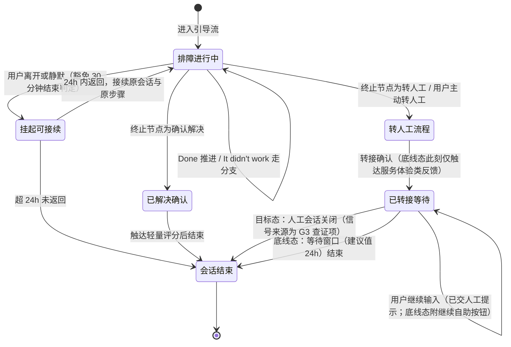

# COOLFLY 智能客服 · 开发版（PRD-dev，给程序员 + AI 编码助手）

**版本**: v1
**完整 PRD**: output/PRD详细版.md（1520 行）
**阅读时长**: 30 分钟
**目的**: 让程序员或 Claude Code/Codex 能直接据此写代码

---

## 1. 项目一句话

COOLFLY 智能客服 = 解决"App 用户装不上、连不上、配不了对且求助无门"的 App 内英文智能客服（知识问答 + 引导排障 + 零复述转人工），MVP 完成定义 = F01/F02/F03/F04/F06/F08 六项全部达到及格线（含离线评测集验收通过 + 双口径看板可用）。

**形态无关声明（必读）**: 拍板 1（重建服务端引擎 vs 升级现有系统）未决。本文全部为**行为规格**——无论选 A/B，系统对外表现与数据产出均须满足；F01–F08 用户可见完成标准为形态无关硬验收，不随拍板 1 变化（详见 PRD详细版 §3 开头、§0.5）。

## 2. 用户故事（精简版）

> 完整版见 PRD详细版 §2.4（22 条 US 注册表），下面列必做功能的 P0 用户故事。

**F01 智能问答（必做）**
- US-F01-01: 英文提问安装/联网/配对/会员问题，AI 基于知识库多轮对话给准确回答，几分钟内解决
- US-F01-02: AI 没把握时明说"不确定"并主动给转人工入口，不编答案
- US-F01-03: 打出退款/愤怒字眼时先被安抚，直接看到置顶转人工与退货政策入口，不被追问技术细节
- US-F01-04: 同一会话连续 2 次答不上来后，直接看到转人工大按钮
- US-F01-05: 非英语输入收到英文+所用语言的模板句说明，照常拿到转人工入口
- US-F01-06: 会话开场就知道对面是 AI 助手
- US-F01-07: 点首屏 Membership 按钮直接进入会员问答，跳过打字

**F02 引导式排障（必做）**
- US-F02-01: 首屏高频问题按钮（Setup / Won't connect / Pairing failed / Membership），点按进入一步一屏分步引导
- US-F02-02: 每一步只需在 "Done" 和 "It didn't work" 两个大按钮里选一个，永远不会走进死胡同
- US-F02-03: 切出 App 后 24 小时内返回，自动恢复到刚才的排障步骤

**F03 人机衔接（必做）**
- US-F03-01: 一键转人工自动带会话摘要+SN+型号，可见可补充，到人工不复述
- US-F03-02: 转人工后界面如实告知回复渠道、预计时长、超时找谁

**F04 会话反馈（必做）**
- US-F04-01: 单条回答可点 👍/👎，点踩可选原因（不相关/看不懂/试了没用）
- US-F04-02: 会话结束可轻量评分表达是否解决

**F06 效果度量（必做，间接角色）**
- US-F06-01: 业务负责人上线第一周起按周查看双口径解决率（按入口分层）、拒答率（按层分列）、转人工量与语言分布
- US-F06-02: 月转人工绝对量达预警线（G1 实测月处理量的 80%）时收到预警推送

**F08 入口触达（必做）**
- US-F08-01: 错误提示旁就有 "Get help"，点一下进入对话且故障现场已自动带上
- US-F08-02: 新用户 3 步以内找到固定客服入口

（F05 应做: US-F05-01 知识库运营每周拿到按频次排序的待补条目清单；F09 应做: US-F09-01–03 知识库内容运营在管理台录入/导入、审核 AI 起草草稿、确认问题标签，见 PRD详细版 §2.4；F07 无独立 US，仅两条约束）

## 3. 功能需求（精简版）

> 完整 FR 见 PRD详细版 §5。FR 编号为组级 FR-F01…FR-F09，与 F01–F09 一一对应，只增补不重排（R2-裁决 5；FR-F09 为 08-04-2026 增补）。上线线：🟢引擎线=服务端灰度（2 周承诺有效）；🔵发版线=客户端发版（覆盖率随升级率爬坡）。

| FR ID | 功能 | 优先级/上线线 | 一句话 | 关键边界 / 边界数值 |
|-------|------|--------------|--------|--------------------|
| FR-F01 | 智能问答会话 | 必做🟩 🟢（首屏按钮组🔵） | 意图分类先行+三层拒答的英文知识问答，事实性回答末尾附来源标注 | 连续拒答 ≤2（硬上限）；误拒率上限 `[PRD 定数 · G1 后回填]`；响应超时 8–10 秒（建议值）；输入上限 1,000 字符（建议值）；首条流式内容 ≤3 秒（建议值） |
| FR-F02 | 引导式排障 | 必做🟩 内容🟢+卡片 UI🔵 | 安装/联网/配对三场景一步一屏，会话流承载，Done / It didn't work 双按钮 | 无死胡同图遍历校验通过率 100%；排障中豁免 30 分钟静默；接续窗口 24h（写死）；同一步骤第 2 次到达附转人工提示条（建议值 2 次）；Top3 场景关键分支配图🟩 |
| FR-F03 | 人机衔接 | 必做🟩 🟢 | 转人工摘要（已试步骤/SN/型号/卡点）可见可补充，等待承诺按 G3 分目标态/底线态 | 交接契约 6 字段顺序固定（§12.3）；补充上限 500 字符（建议值）；超时安抚 = 承诺时间 ×1.5 倍（建议值）；连续提交失败 2 次出兜底邮箱（建议值）；底线态话术禁"回复会通知你" |
| FR-F04 | 会话反馈 | 必做🟩 🟢 | 消息级 👍/👎（挂全部 F01 事实性回答）+ 会话级轻量评分 | 评分卡每会话 ≤1 次；底线态转接只触达服务体验类、不问"是否解决"（R2-裁决 2）；改选以最后一次为准；排障卡片不叠 👍/👎 |
| FR-F05 | 知识库升级与回流闭环 | 应做🟩（SLA 依拍板 2）无 UI | 四触发源→按频次聚合的周度待补清单，运营消化 Top 10 | 周度导出；知识变更生效 ≤24h；聚合键=命中条目标识/规范化问题文本（§4.4） |
| FR-F06 | 效果度量与预警 | 必做🟩 🟢与功能同步验收 | 双口径解决率看板（按 entry_source 分层）+ 拒答率分层 + 容量预警推送 | 预警线 = G1 实测月处理量 ×80%；拒答率预期区间 `[PRD 定数 · G1 后回填]`；看板延迟 ≤24h（建议值）；旧版本无字段流量归"未知"桶单列 |
| FR-F07 | 多语言能力预留 | 可做🟨（两条约束进 MVP） | 仅两条零成本约束，完整多语言后置 | ①文案/prompt 模板不硬编码语言；②知识条目带语言字段；非英语占比 >15% 触发提前评估 |
| FR-F08 | 入口与场景化触达 | 必做🟩 🔵 | 固定一级入口 "Support" + 错误态 "Get help"（携带故障上下文，先开场确认再路由） | 新用户 ≤3 步找到入口；关键按钮 ≥44pt；错误态最低覆盖集合=掉线/配对失败/扫码失败；错误码未结构化时降级为通用进入（入口不消失） |
| FR-F09 | 知识库管理台 | 应做🟩（不卡六项及格线验收）🟢（内部 Web，不依赖 App 发版） | 知识库唯一权威源：条目管理 + 录入/导入 + AI 自动整理（建议态）+ 会话提炼审核队列 + 发布门禁（详见 PRD详细版 §5.10） | 无人审不生效（铁律）；发布须过评测集回归，不过即回炉；界面简体中文（条目内容仍英文带语言字段）；桌面 1280+；访问控制=Basic Auth+链接不公开（建议值）；批量导入单文件 ≤500 条（建议值）；问题标签每条目 ≤20 个（建议值） |

不做（边界）: 设备状态诊断、客服工作台、邮箱/社媒/官网渠道改造、硬拦截降转人工率、客服排班方案（详见 PRD详细版 §0.3）。

阶段二储备（本期只留接口、零额外开发，详见 PRD详细版 §0.1 后置清单）: ①语音/无屏渠道——接口预留 = §3.7 引擎渠道无关 + channel 字段 + 知识条目渠道中立；②知识库多渠道采集扩展——从应用商店评分/客服邮件采集进 F09 审核队列（依 channel 字段接入）；会话提炼与知识库管理台已随 F09 提前进 MVP（08-04-2026 拍板），无人审不生效与评测集回归门禁两条铁律不变。实现时不得违反上述预留约束。

### 3.1 F09 要点（08-04-2026 增补）

1. **四功能区**: 条目管理（列表/筛选/双编辑器/状态流转/修订历史）、录入与导入（手工表单 + Markdown/CSV 批量导入）、AI 自动整理（切条/问题标签/归类建议，全部建议态）、会话提炼审核队列（F05 消化工作面）。
2. **无人审不生效（铁律）**: AI 起草草稿与待整理条目未经运营审核不进检索库、不被 F01 命中（AC-M-15）。
3. **发布门禁**: 任何条目转入「已上线」触发评测集回归，结果留痕；回归不过→条目回炉、失败用例可见（AC-E-14）；通过→索引更新，变更生效 ≤24h。
4. **问题标签=检索信号**: 人工确认后的问题标签扩充 F01 召回+过滤；命中率仍以评测集验收，§8 目标值不变、不新增指标（AC-M-13）。
5. **飞书一次性迁移**: 120+ 篇存量导入「待整理」队列为初始数据，此后管理台为唯一权威源，不做双向同步；迁移失败走人工导出文件批量导入兜底。
6. 详见 PRD详细版 §5.10（界面元素/交互逻辑/文案定稿/异常场景唯一落点）。

## 4. 核心决策逻辑（对话引擎）

> 完整规格见 PRD详细版 §3。本项目无算法章节，核心是写死的决策总顺序。

### 4.1 决策总顺序（写死，不随拍板 1 变化）

```
用户消息
  → 步骤 0：语言检测（非英语 → 非英语兜底模板 + 转人工按钮，不进入后续任何步骤）
  → 情绪/退款关键词规则（确定性，先行，清单 v1 见 PRD详细版 §12.7，命中直入情绪路径）
  → 意图分类（五类）
  → 仅"知识求解类"进三层拒答
  → 生成回答或拒答
  → 路由出口
```

- 步骤 0: 关键词清单 v1 仅覆盖英语；混合语言按主要语言判定、不确定按英语处理（判定规则唯一落点 §7.7）。
- 情绪双机制，验收口径不同: 关键词规则=确定性、硬验收（AC-E-03，100% 可复现）；分类器判"情绪类"=概率性、只进评测集怒气样本+灰度抽检，不进硬验收。两者触发同一情绪路径行为。

### 4.2 意图分类（五类）

| 意图 | 处理 | 进三层拒答？ |
|------|------|-------------|
| 知识求解类 | 检索知识库生成事实性解答 | **是（唯一进入类别）** |
| 情绪类 | 共情 + 出口置顶（转人工+退货政策常驻） | 否 |
| 闲聊类 | 轻量应答引导回支持场景 | 否 |
| 流程推进类 | 交排障流程引擎推进（§6） | 否 |
| 追问澄清类 | 澄清式追问 | 否 |

豁免防滥用: 豁免类别不得夹带事实性内容输出；评测集设"豁免滥用"陷阱题防守。

### 4.3 三层拒答（仅知识求解类）

| 层 | 判定 | 结果 |
|----|------|------|
| ① 检索相关度 | 低于阈值（阈值为商业参数，上线后调优） | 承认不会 + 主动给转人工 |
| ② 引用忠实 | 事实性解答必须引用命中知识条目，无引用即拒答（追问/共情/流程话术豁免） | 拒答；有引用不忠实由评测集陷阱题拦截 |
| ③ 硬规则 | 敏感/超范围命中 | 直接拒答（专属文案，R5-S3） |

- 引用可见性: 通过第②层的回答末尾显示简短来源标注（"Source: Setup Guide"），标注必须与实际命中条目一致（R2-裁决 4）。
- 反向约束（防"全拒答刷满分"）:
  - 高频误拒率上限 `[PRD 定数 · G1 后回填]`；
  - 单会话连续拒答 ≤2：第 2 次拒答=极短说明句+转人工大按钮，此后不再输出拒答类消息；
  - 连续计数规则: 成功事实性解答清零；豁免类消息不清零也不累加；
  - 情绪会话内拒答: 任一次均呈现"共情式短语+转人工大按钮"，照常计数（R4-P0）。

### 4.4 首屏路由

- Setup / Won't connect / Pairing failed → 对应 F02 引导流（零打字）；
- Membership → 预置意图直达 F01 知识问答（AI 先出会员开场提问，属追问澄清类豁免）；
- 自由文本 → 决策总顺序；
- 错误态 "Get help" → 先出携带上下文的开场确认（确认→对应引导流；否认→首屏；上下文不可判定→降级落首屏，不落纯自由输入）。

### 4.5 排障决策形态

结构化流程（步骤+分支显式建模）承载排障；LLM 只负责意图识别、上下文衔接与话术生成，**不发明步骤**。图校验规则（R2-裁决 9）: ①分支有向图无环，或环上必须存在转人工出口；②所有叶子节点 ∈ {确认解决, 转人工}。图遍历自动验证为交付验收项。

### 4.6 演进约束（五条，违反=缺陷）

1. 引擎渠道无关化（App 专属信息为可选结构化输入）；
2. 埋点 schema 带 channel 字段（默认 app）；
3. 转人工最小交接数据契约 6 字段顺序固定（兼 Zendesk 映射底稿）；
4. F07 两条约束（文案/prompt 不硬编码语言；知识条目带语言字段）；
5. 排障流程 schema 与知识条目渠道中立（不含 App 界面专属字段）。

## 5. 数据模型（开发版）

> 完整概念级 schema 见 PRD详细版 §4；只定义"有什么信息、谁产生、流向哪"，不定物理类型。

### 5.1 知识条目（问答型）

字段: 条目标识（唯一稳定）/ 标题-问题描述 / 场景分类（安装/联网/配对/会员/其他）/ 适用设备型号（可多值，空=通用）/ **语言字段（F07 约束，第一版恒英文，必须存在）** / 正文（第②层引用对象，权威源=F09 管理台）/ 来源与版本（初始导入来源标识（飞书一次性迁移）+更新时间，支撑变更生效 ≤24h）/ **问题标签（多值，AI 建议+人工确认后生效，F01 检索信号）** / **审核信息（草稿来源+审核人/审核时间，未审核不进检索库）** / 状态（草稿/已上线/待改造/已下线，流转在 F09 管理台完成）。

### 5.2 排障流程条目（结构化）

公共信息之上增加: 步骤节点（一步一屏文案+是否配图）/ 分支（每步仅两出口 Done→下一节点、It didn't work→分支节点；环路约束见 §4.5）/ 终止节点（只允许确认解决/转人工）。两类 schema 均渠道中立。

### 5.3 埋点事件（12 事件）

公共属性（所有事件必带）: 会话 ID、用户标识、时间戳、**entry_source**（会话级，进入时写死: 固定入口/错误态入口/未知）、**interaction_mode**（消息级: 按钮组/自由输入/预置意图）、app_version、**channel**（默认 app）、灰度桶标识。entry_source 与 interaction_mode 为两个独立维度（R2-裁决 8），枚举唯一落点 §4.2。

| 事件 | 关键专属属性 |
|------|-------------|
| 会话开始 | 进入场景（含错误态故障上下文类型）、语言检测结果 |
| 意图分类结果 | 意图类别、是否关键词规则命中 |
| 拒答事件 | 触发层（①/②/③）、本会话连续拒答计数 |
| 回答消息 | 引用条目标识列表、用户可见来源标注内容 |
| 排障步骤推进 | 流程标识、节点标识、方向（Done / It didn't work） |
| 转人工 | 交接契约摘要标识、通路层级（目标态/底线态） |
| 客服首条回复送达 | 关联转人工事件标识、回复时刻、是否首条（仅目标态可测；底线态口径 `[PRD 定数 · G3 后回填]`） |
| 消息级反馈 | 反馈方向、点踩原因、改选以最后一次为准 |
| 会话结束 | 结束类型（确认解决/转人工完成/静默超时）、是否排障豁免接续 |
| 会话重新激活 | 原会话标识（计为新会话） |
| 满意度评分 | 反馈类型、解决确认（枚举 Yes/No；用户标签 Yes / Not yet）、可选分值 |

交付约束: 埋点与功能同步交付同步验收（缺埋点的功能不算完成）；事件语义只增补不改义。

### 5.4 离线评测集（golden set）

题型: 高频问答题（命中率 ≥80% 为灰度放量前置，随 G1 校准）/ 陷阱题①应拒答 / 陷阱题②有引用不忠实（引用忠实率，含来源标注一致性）/ 陷阱题③豁免滥用 / 陷阱题④怒气样本 / 高频误拒题（上限 `[PRD 定数 · G1 后回填]`）。规模与配比 `[PRD 定数 · G1 分布后回填]`；题源 = G1 真实咨询 + 差评原话；发版前回归🟩、每次变更全量回归🟨。

### 5.5 回流数据流（F05）

四触发源: ①检索无命中/拒答 ②消息点踩/会话未解决标记/It didn't work ③转人工会话 ④48h 复问会话 → 按频次聚合进 F09 管理台审核队列（AI 聚类起草草稿，含来源会话/频次/问题标签建议；周度待补清单保留为导出能力，字段: 原始问题/命中文档/会话链接/频次）→ 运营消化 Top 10（通过发布/驳回/改后发布）→ 管理台发布 → 索引更新（变更生效 ≤24h）→ 评测集回归（发布门禁，不过则条目回炉）。聚合键: 有命中按条目标识、无命中按规范化问题文本。

### 5.6 关键约束（数据治理）

- 时区三口径: 用户界面按设备本地时区；报表按业务时区；窗口计算（48h 复问、30min 静默、24h 接续）一律按 UTC 时间差。
- PII: SN/邮箱/Wi-Fi 名称等敏感字段脱敏后才入分析库；周度导出清单与评测集题目同规则；送 LLM 输入以"供应商提供 DPA 且不用于训练"为选型硬条件。
- 一致性: 会话状态与排障进度强一致（切回必须恢复正确步骤）；埋点看板最终一致即可。
- 保留: 会话日志脱敏后 12 个月（建议值·随合规 NFR 确认）；评测集与回流清单长期保留。

## 6. 关键流程

> 完整流程图见 PRD详细版 §6（首屏路由分流图 §6.1、转人工时序图 §6.3、灰度放量 §6.4）。

### 6.1 会话状态机（6 态，适用于全部转人工路径）



会话生命周期规则（写死）: ①非引导态自由对话静默 30 分钟=结束；②排障进行中豁免静默判定，24h 内返回接续（不计复问）；③已结束会话被重新激活并产生用户消息=新会话（计复问）；④「已转接等待」态豁免静默判定，「再输入=新会话」仅适用于「已结束」态（唯一落点 PRD详细版 §5.1）。

### 6.2 转人工分层（随 G3 查证结果定级）

- **目标态**（反向通路可行）: 确认已转接 + 预计响应时间（滚动实际值/分档，禁止硬编码）+ 可关闭页面回复会通知；场景化请求 push 权限；客服回复写回同一会话流；超承诺时间 ×1.5（建议值）自动下发安抚消息。
- **底线态**（反向通路不可行）: 确认已转接 + 如实告知回复渠道（如邮件）与预计时限 + 超时联系方式；**话术禁止"回复会通知你"**。
- 客服侧看到: 契约 6 字段 + 用户补充 + 会话记录摘要文本（默认回溯载体；可点开链接为 G3 查证项，通过才启用）。
- 交接契约字段顺序（固定不重排，§12.3）: 1 已试步骤 / 2 SN / 3 型号 / 4 卡点 / 5 会话 ID（随附会话记录摘要文本）/ 6 情绪会话标记（内部字段，不向用户展示、无用户可见优先承诺）。用户可见部分 = 1–4。

### 6.3 灰度放量门禁（引擎线）

启动 20% 前置条件（并列缺一不可）: 技术侧两条（评测集命中率达标 ≥80%、拒答率落在预期区间）+ 运营就绪三项（容量预警响应预案到位、客服 SOP 培训完成、运营名单落实或超窗回退路径已生效）。20%→50%→100% 各档复评同条件；2 周承诺仅对引擎线有效；发版线覆盖率随升级率如实呈报。

### 6.4 边界与异常表

**原则（写死）**: 任何故障态不出死屏——用户至少能看到状态说明 + 一个可用出路。转人工提交、排障卡片推进、固定入口为确定性路径，**不得依赖 LLM 可用性**（LLM 全挂时仍可用）。

状态矩阵（完整见 PRD详细版 §7.1，文案见 §5.1 文案位 C1–C3）:

| 状态 | 触发 | 用户可见表现 / 出路 |
|------|------|---------------------|
| 响应中 | 消息发出、回答未开始 | 流式指示（消息发出即出现，无静默空屏）；可继续输入排队 |
| 响应超时 | 超 8–10 秒（建议值）无内容 | 超时提示 + Retry；转人工入口保持可见 |
| 流式中断（弱网） | 输出中连接断 | 已输出内容保留 + 中断标记 + Retry |
| LLM 超时/限流/不可用 | 服务端降级信号 | 降级卡: 直达转人工 + 排障文章链接 |
| 手机离线 | 本地网络不可用 | 离线提示；输入可编辑、发送置灰；已加载内容可读；排障进度不丢 |
| 发送失败 | 消息未送达 | 失败标记 + 单条重发；重发不重复入流、AI 不重复应答 |
| 已转接等待 | 转接确认后（≠已结束） | 继续输入出"已交人工"提示；底线态附继续自助按钮；豁免静默判定 |

其他关键异常（完整见 PRD详细版 §5 各功能异常场景 + §7）:

| 场景 | 行为 |
|------|------|
| 空输入/纯空白 | 发送按钮置灰，不产生消息 |
| 超长输入（>1,000 字符建议值） | 计数提示、禁止发送（不截断静默发送） |
| 无意义输入（乱码/纯表情） | 按追问澄清路径回应，不计拒答 |
| SN/型号缺失或多设备 | 摘要字段留空可手补；多设备可选择；不阻塞转接 |
| 摘要生成失败 | 不阻塞转人工: 降级"会话记录直达客服"+手填卡点 |
| 错误码未结构化 | 错误态入口降级通用进入，入口不消失 |
| 排障中内容更新/灰度切换 | 进行中会话按原版本走完，新会话用新版本 |
| 同分支打转 | 同一步骤第 2 次到达附加转人工提示条 |
| 配图加载失败 | 隐藏图片位，文字说明独立完整可操作 |
| 旧版本客户端 | 引擎线能力全可用；卡片 UI 缺失时纯文本分步引导（路径完整）；埋点归"未知"桶 |
| 索引重建失败 | 上一版索引继续服务；中断超 24h 运营告警、超 48h（建议值）升级呈报 |
| 高敏输入（Wi-Fi 密码等） | AI 不主动索取密码类信息；指引用户在自己设备上操作 |
| 会话历史超上限（200 条建议值） | 提示开新会话，旧会话可查 |

## 7. 验收标准（AC 清单索引）

> 完整 5 维 AC 见 PRD详细版 §10；只定义产品可观察结果，测试方法归 TDD Master。共 51 条: AC-M×15、AC-E×14、AC-S×11、AC-C×6、AC-I×5（AC-M-13–15 / AC-E-13–14 为 F09 验收，按功能自身验收、不并入六项及格线 MVP 完成判定）。

### 7.1 主流程 AC-M-01–15（必过；13–15 为 F09，不卡 MVP 完成判定）

| ID | 一句话 |
|----|--------|
| AC-M-01 | 错误页 Get help → 携带故障场景的开场确认（确认/否认两出口）+ AI 身份披露 |
| AC-M-02 | 首屏 Pairing failed 按钮 → 一步一屏引导，卡片仅 Done / It didn't work 两大按钮，转人工次级入口每卡可达 |
| AC-M-03 | 末步 Done → 解决确认 + 会话级评分入口 |
| AC-M-04 | Membership 按钮 → 零打字进入会员问答（预置意图，开场属追问澄清豁免） |
| AC-M-05 | 自由输入安装/联网/配对/会员四类问题（各为独立场景）→ 基于知识库回答 + 末尾来源标注 |
| AC-M-06 | 转人工 → 摘要可见可编辑，确认后显示回复渠道与预计时间（按 G3 层级话术） |
| AC-M-07 | 客服收到完整交接信息（摘要/已试步骤/SN/型号/卡点），零复述 |
| AC-M-08 | 点 👎 → 原因三选可跳过，跳过仍保持选中，均入回流清单 |
| AC-M-09 | 运营任一周可导出按频次排序待补清单（原始问题/命中文档/会话链接/频次） |
| AC-M-10 | 灰度第一周看板有数据: 双口径解决率（按入口分层，未知单列）、拒答率分层、转人工量、语言分布 |
| AC-M-11 | 新用户从首页 ≤3 步到固定入口（"步"=点击/页面跳转，不含滚动） |
| AC-M-12 | 底线态转接确认 → 仅服务体验类反馈，不出现"是否解决"提问 |
| AC-M-13 | F09 管理台新建/改后发布条目，审核+发布门禁回归通过 → 状态「已上线」、回归留痕；≤24h 内 F01 可检索命中并作引用来源（录入→审核→发布→命中闭环） |
| AC-M-14 | F05 回流会话累积 → 管理台审核队列出现 AI 聚类起草草稿（来源会话链接/脱敏摘要、频次、标签建议），按频次降序 |
| AC-M-15 | 未经审核的草稿/待整理条目 → 不被检索命中、不出现在任何回答引用中（无人审不生效铁律） |

### 7.2 异常分支 AC-E-01–14（必过；13–14 为 F09，不卡 MVP 完成判定）

| ID | 一句话 |
|----|--------|
| AC-E-01 | 知识库外事实性问题 → 承认无法确定 + 转人工入口，不编造步骤 |
| AC-E-02 | 连续第 2 次拒答 → 极短说明句 + 转人工大按钮，无第 3 次"我没把握" |
| AC-E-03 | 命中退款/愤怒关键词（清单 v1 §12.7）→ 不进拒答、不追问技术细节，共情 + 双出口置顶（硬验收，100% 可复现） |
| AC-E-04 | 非英语输入 → 英文+该语言模板句 + 转人工入口，不忽略 |
| AC-E-05 | It didn't work → 替代分支或转人工，绝无死胡同 |
| AC-E-06 | 敏感/超范围（第③层）→ 专属文案说明能力边界 + 转人工，不用"找不到答案"语义 |
| AC-E-07 | 目标态超承诺时间 ×1.5（建议值）未回复 → 主动安抚消息（含超时联系方式） |
| AC-E-08 | 转接提交失败 → 显式提示 + 重试；连续失败出兜底邮箱，不出死屏 |
| AC-E-09 | 摘要生成失败 → 不阻塞转人工（会话记录直达 + 手填卡点） |
| AC-E-10 | SN/型号缺失或多设备 → 留空可补/可选择，不阻塞转接 |
| AC-E-11 | 错误态无结构化错误信息 → 降级通用进入，入口不消失、点击有响应 |
| AC-E-12 | 无意义输入 → 追问澄清路径，不计拒答 |
| AC-E-13 | 运营对 AI 切条/标签/归类建议逐项修改或拒绝 → 按修改内容生效/拒绝不生效，且不阻塞人工直接编辑发布（建议态非门槛） |
| AC-E-14 | 发布时评测集回归失败 → 条目不生效、状态回炉，失败原因与用例可见，修订后可重新发布 |

### 7.3 状态切换 AC-S-01–11

| ID | 一句话 |
|----|--------|
| AC-S-01 | 排障中切出 2 小时返回 → 恢复原步骤（24h 内），不被 30 分钟静默判结束 |
| AC-S-02 | 非排障态静默 30 分钟 → 会话结束，静默流失不追弹 |
| AC-S-03 | 已结束会话再输入 → 新会话（计复问），体验连续无报错 |
| AC-S-04 | 响应超时（8–10 秒建议值）→ 重试提示 + 可转人工，期间有流式/加载指示 |
| AC-S-05 | LLM 不可用/限流 → 降级直达转人工 + 排障文章，不出死屏 |
| AC-S-06 | 离线打开客服入口 → 离线提示，恢复后正常，无死屏无崩溃 |
| AC-S-07 | push 权限被拒（目标态）→ 明示"主动回来查看"，不再承诺通知 |
| AC-S-08 | 流式输出中断网 → 已输出内容保留 + 中断标记可重试 |
| AC-S-09 | 消息发送失败 → 失败标记单条重发，重发不重复 |
| AC-S-10 | 24h 接续窗口过期返回 → 原会话已结束 + 过期提示，新会话从第一步开始 |
| AC-S-11 | 内容更新/灰度切换遇进行中会话 → 按原版本走完不打断，新会话用新版本 |

### 7.4 兼容性 AC-C-01–06

| ID | 一句话 |
|----|--------|
| AC-C-01 | 最大字体缩放不破版、按钮文字完整 |
| AC-C-02 | 关键按钮可点、触达区域 ≥44pt（含最大字号档） |
| AC-C-03 | VoiceOver 走完主流程，关键控件可读出可操作（基础走查级） |
| AC-C-04 | 旧版本客户端引擎线能力全可用；卡片缺失时纯文本分步引导，路径完整 |
| AC-C-05 | 文案与 prompt 模板语言不硬编码: 切换语言配置无需改对话逻辑（F07 约束一） |
| AC-C-06 | 每条知识条目带语言字段（F07 约束二） |

### 7.5 不变行为 AC-I-01–05（上线不得改变的现状）

| ID | 一句话 |
|----|--------|
| AC-I-01 | 不硬拦截转人工: 任何状态可达转人工，无强制排障门槛 |
| AC-I-02 | 不做设备诊断: 上限=引导自查 + 带 SN 转人工（A-003） |
| AC-I-03 | 转人工首响不劣于现状（基线 `[PRD 定数 · G1 后回填]`；口径随 G3 分层） |
| AC-I-04 | 客服模块任何故障不影响 App 其余功能 |
| AC-I-05 | 不虚假承诺: 底线态禁"回复会通知你"；禁硬编码承诺时长；禁无载体的优先接入承诺 |

## 8. 技术栈建议

> **本节全部为架构建议，技术负责人确认前非最终决定**；拍板 1（重建 vs 升级）未决，不得据此锁定实现形态。提炼自 PRD详细版 §3.7 / §9.2 / §9.8 / §9.14。

- **对话引擎**: 服务端引擎，渠道无关接口（App 上下文为可选结构化输入）；RAG 形态知识问答（PRD 只约束用户可观察行为）。
- **LLM**: 供应商待选型，硬条件 = 提供 DPA 且输入不用于训练（合规前置 §9.14）；单一供应商依赖，更换须整套评测集回归通过；部署密钥系统级配置，无用户可见配置界面。
- **知识检索**: F09 管理台为知识库唯一权威源（飞书 120+ 篇一次性迁移导入初始数据，不做双向同步）；管理台发布触发索引更新，变更生效 ≤24h；迁移失败/权限未就绪走人工导出文件经 F09 批量导入兜底。
- **排障引擎**: 结构化流程数据（步骤+分支显式建模）+ 图遍历校验工具（无死胡同验证，须先于内容改造完成，§9.8 技术债第 1 优先级）。
- **灰度**: 服务端按用户分桶 + 远程开关；进行中会话按原版本走完。
- **埋点与看板**: 事件 schema 见 §5.3，channel 字段必带；周粒度看板 + 容量预警推送（载体建议值: 飞书群机器人）。
- **push**: 复用现有 App push 基建（G3 反向通路组成部分，目标态前提）。
- **确定性路径隔离**: 转人工提交、排障卡片推进、固定入口不依赖 LLM 可用性（LLM 断供演练为验收硬项）。

## 9. 实施顺序与阻塞项

| 顺序 | 模块/动作 | 前置依赖 | 阻塞条件 / 回退（写死） |
|------|-----------|----------|------------------------|
| 0 | G1 历史数据导出与基线分析（≤5 工作日） | 用户团队导出 | 超 2 周 → 拍板 3 自动落保守版 C；回炉线: 高频三类占比 <40% 或退货-咨询交叉 <30% 触发复审 |
| 0 | G2 现有系统能力盘点（≤5 工作日） | 内部技术团队 | 结论决定拍板 1 是否为真选择题；无错误码 → F08 携带上下文需先做错误码治理 |
| 0 | G3 人工渠道通路查证（≤3 工作日） | 用户团队 | 反向查不到接口 → F03 目标态直接降级底线态 |
| 0 | G4 退货归因数据链路查证（≤5 工作日） | 用户团队 | 映射链不存在 → 降级"原因码粗分类+月度趋势" |
| 1 | 拍板 1（重建 vs 升级） | G1+G2+成本账（§9.15） | 拍板 1 先决于拍板 3（开发排期仅在拍板 1 落定后存在） |
| 2 | 拍板 3（时间表/灰度/旺季） | G1+开发排期 | 红线: 灰度爬坡须 11 月中旬前完成，否则只剩保守版 C（定义见 PRD详细版 §12.2） |
| 3 | 排障分支图遍历校验工具 | — | 先于知识库三场景内容改造完成（§9.8 必须解决项） |
| 4 | 知识库三场景结构化改造 + 评测集建设 | G1 排序；拍板 2 名单（超窗回退: AI 生成初版评测集+企业家抽检；改造收敛为 Top1 场景） | 改造完成 = schema 校验 + 评测集命中率达标 |
| 5 | F01–F08 开发 + 埋点同步交付 | 上述 | 缺埋点的功能不算完成 |
| 6 | 合规前置项 | DPA/脱敏/隐私政策/AI 身份披露/push 场景化请求 | 任一未就绪 = 不满足上线条件（§9.14） |
| 7 | 引擎线灰度 20%→50%→100% | §6.3 门禁五条件 | 不达标即暂停放量（洪水关在小流量里） |

### 9.1 占位符清单（18 项 `[PRD 定数 · Gx 后回填]`，同步自 PRD详细版 §13.2）

| # | 位置 | 占位内容 | 回填依赖 | 当前建议值 |
|---|------|---------|---------|-----------|
| 1 | §3.3 反向约束 | 高频问题误拒率上限 | G1 | —（口径归 §8） |
| 2 | §4.2 底线态首响度量口径 | 底线态首响口径 | G3 | — |
| 3 | §4.3 高频误拒题 | 误拒率上限 | G1 | — |
| 4 | §4.3 规模与配比 | 评测集规模与配比 | G1 分布 | — |
| 5 | §5.2 边界数值 | 高频问题误拒率上限 | G1 | — |
| 6 | §5.7 边界数值 | 拒答率预期区间 | G1 | — |
| 7 | §8.2 宽口径基线 | 现有 AI 解决率基线 | G1 | — |
| 8 | §8.2 拒答率 | 上线首月预期区间 | G1 | — |
| 9 | §8.2 评测集 | 误拒率上限 | G1/G2 | — |
| 10 | §8.2 转人工量 | 3 人团队月处理量（预警线分母） | G1 | — |
| 11 | §8.2 转人工首响 | 首响基线 + 底线态口径 | G1 / G3 | — |
| 12 | §8.2 语言分布 | 语言分布基线 | G1 | — |
| 13 | §10.5 AC-I-03 | 首响基线 + 底线态口径（与 §8.2 同源） | G1 / G3 | — |
| 14 | §9.10 G3 行 | 人工会话关闭信号降级口径 | G3 | 客服末条回复后 24h 无往来自动判关闭 |
| 15 | §9.15 成本账 | LLM 推理成本（年化） | G1 | 现体量约 ¥1 万/年量级 |
| 16 | §9.15 成本账 | 基础设施与集成成本 | G2 | — |
| 17 | §9.15 成本账 | 运营三岗工时 | 拍板 2 名单 | 合计 ≤1 人日/周起步 |
| 18 | §9.15 成本账 | 开发投入（A/B 人日粗估） | G2 | — |

不依赖 G 数据的「建议值 · 终稿前确认」产品参数（19 项: 超时 8–10 秒、首条流式 ≤3 秒、安抚系数 1.5、滚动窗口近 7 天中位数、看板延迟 ≤24h、日志留存 12 个月、索引上报阈值 48h、输入上限 1,000 字符、摘要补充 500 字符、会话历史 200 条、步骤循环 2 次、转接失败兜底 2 次、超时优化线 5%、双语模板集合 西/法/德、底线态等待窗口 24h、预警载体飞书群机器人、管理台访问控制 Basic Auth+链接不公开（F09）、批量导入单文件上限 500 条（F09）、问题标签每条目 ≤20 个（F09））见 PRD详细版 §13.2 单列表；情绪/退款关键词清单 v1 为「建议值 · SOP 岗确认」（§12.7）。

## 10. 给 AI 编码助手的 5 个"开工提示"

1. **第一步先做这个**: 排障分支图遍历校验工具（无环/环上必有转人工出口 + 叶子仅两类），它是内容改造与"无死胡同"验收的前提；同时搭评测集回归的执行留痕（放量前置条件的凭据）。
2. **数据 schema 按这个设计**: 见本文 §5——知识条目必须带语言字段，埋点必须带 entry_source / interaction_mode / channel / app_version，两维独立不合并；缺埋点的功能不算完成。
3. **决策顺序照抄不改**: 本文 §4.1 决策总顺序写死（步骤 0 语言检测 → 关键词规则 → 意图分类 → 仅知识求解进三层拒答）；关键词规则是确定性硬验收，别用 LLM 实现它。
4. **遇到边界问题怎么办**: 查本文 §6.4 边界异常表与 PRD详细版 §7——铁律是任何故障态不出死屏，且转人工/排障推进/固定入口不得依赖 LLM 可用性。
5. **产品行为以这些契约为准**: 本文 §7 的 46 条 AC + PRD详细版 §10；用户可见文案唯一落点为 PRD详细版 §5（文案定稿表，照抄勿改写）；测试方法由 TDD Master 生成。

## 11. 关键决策

> 从 PRD详细版 §0.6 原样同步，不重新推导；完整讨论见 debate-log.md。

| ID | 决策 | 拍板人 | 阶段 |
|----|------|--------|------|
| D-1 | 核心目标=提升用户解决速度与解决体验；降人工量是副产品 | 企业家 | 阶段 1 |
| D-3 | 第一版范围只做 App 用户侧客服入口；客服员工工作台未来用 Zendesk 接入，现阶段不做任何客服侧工具 | 企业家 | 阶段 1 |
| D-4 | 成功指标：核心=自助解决率（未转人工且 48h 未复问），3 个月高频类 ≥60% / 整体 ≥50%（假设值待基线校准）；次要=自助解决时长 ≤10 分钟、转人工首响不劣化、会话满意度 | 企业家 | 阶段 1 |
| D-5 | 第一阶段核心=高质量 AI 式对话（知识库问答+转人工衔接）；设备状态诊断与自动解决方案不是本阶段重要目标，降为后续阶段差异化储备 | 企业家 | 阶段 3 |
| D-6 | 拍板 2：运营三岗（知识库运营/退货归因/客服 SOP 抽检）现有人员兼任，名单 G 窗口内后补；给不出名单则砍 F05 承诺并下调目标 | 企业家 | 阶段 4.5 |
| D-7 | 拍板 4：价值账保留原口径 ¥120–130 万/年（不采纳修正为 99–123 万） | 企业家 | 阶段 4.5 |
| D-8 | 拍板 5：知识库三场景前置改造+回流补齐（排序依 G1）、转人工沿现有渠道层级依 G3，授权按门槛结果执行（回炉线除外不上会）；拍板 1/3 待 G1/G2 证据后拍 | 企业家 | 阶段 4.5 |

未决 `OPEN_QUESTION`（不阻塞 PRD 定稿，不入上表）: 拍板 1（重建 vs 升级，待 G1+G2）、拍板 3（时间表/灰度/旺季，待 G1+开发排期；G1 超 2 周自动落保守版 C）——详见 PRD详细版 §0.5 / §9.11 / §13.3。

## 12. 详细补充

每个章节标"详见 PRD详细版 §X.Y"，不重复写完整内容：阶段路线图与 MVP 定义 §0；价值账与披露 §1.2；用户旅程 A/B/C §2.3；决策逻辑全文 §3；数据需求全文 §4；用户可见文案定稿（唯一落点）§5 各功能文案表；流程图 §6；边界异常全文 §7；指标口径与目标值（唯一落点）§8；风险与依赖、G1–G4 门槛表 §9；验收标准全文 §10；依据清单 §11；交接契约/保守版 C/关键词清单 v1 §12；一致性自检与占位清单 §13。

output/PRD详细版.md 是完整版（1520 行），本文是浓缩版；产品可观察行为与稳定 ID 以 PRD详细版为准，测试方法由后续 TDD Master 定义。若冲突，停止实现并回到 PRD 修订。
