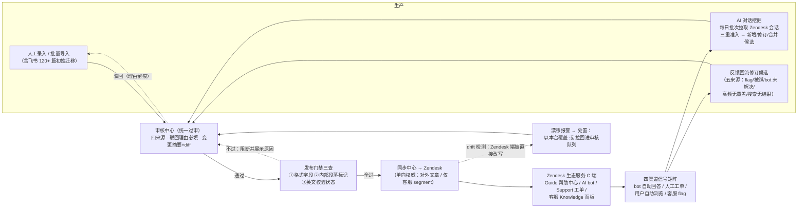
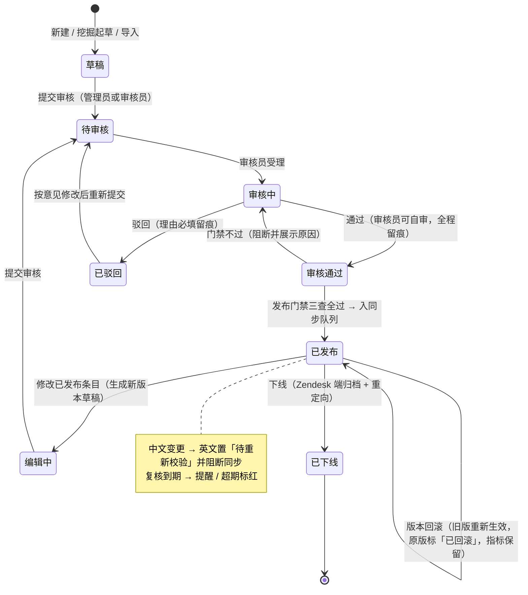
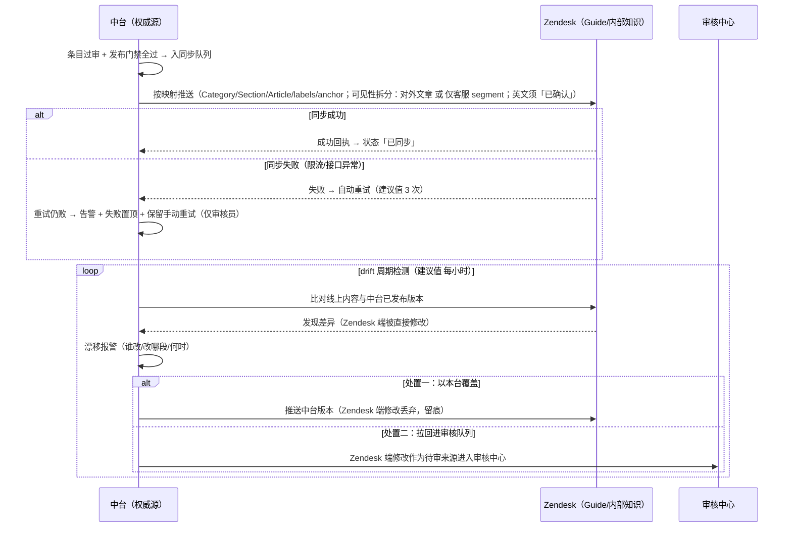

# COOLFLY 智能客服 PRD

> **重大转向声明（08-04-2026 · D-10，来源：项目纪要 08-04-2026 18:30:58 用户拍板）**：本版起产品架构全面转向 Zendesk——C 端服务由 Zendesk 生态承担（Guide 帮助中心对外文章·中英双语 + AI bot 在线聊天自动回答 + Support 人工工单·邮件与转人工 + 客服 Knowledge 面板·内部知识 segment），客服工作数据报表由 Zendesk Explore 承担；自研范围收缩为**知识运营中台**（内部 Web，界面简体中文），功能标准 = 用户自制原型 v3（output/pages/知识运营中台v3.dc.html）。原 F01–F08 自研对话线整体废止；App 侧本期完全不动（存量自研 AI 客服入口维持现状，App 接入 Zendesk 为后置阶段议题）。
>
> **ID 纪律（不可违背）**：已发布 ID 永不重编号；废止对象保留原 ID 并标 retired（登记见 §0.4/§2.4/§5.2/§10.5/§12.4）；新增对象只增补新 ID。被废止章节的详细正文自本版删除以保可读性，完整历史见 git（commit 671e97a 及之前）。

## 0. 阶段路线图与 MVP 定义

### 0.1 阶段划分表

| 阶段 | 验证目标 | 功能模块 | 交付物（做完用户拿到什么） |
| :--- | :--- | :--- | :--- |
| **阶段一 · MVP** | 知识运营闭环能否跑通：知识**生产得出**（人工录入 + AI 对话挖掘）、**审得住**（统一过审 + 驳回留痕）、**同步得准**（中台→Zendesk 单向权威同步 + drift 检测）、**回流得动**（四渠道信号矩阵 + 五来源修订候选）；同时完成知识初始迁移——飞书 120+ 篇导入中台→审核→同步 Zendesk（来源：项目纪要 08-04-2026 18:30:58） | **F09 知识运营中台（十视图五组，功能标准=v3 原型）**：工作台／知识库总览／条目工作台／AI 对话挖掘／审核中心／同步中心·Zendesk／数据看板／反馈回流／操作日志／用户与权限；配套 **Zendesk 配置迁移**：Guide 目录结构映射（Category/Section）、对外公开与仅客服 segment 划分、AI bot 知识源接通、Explore 报表口径确认 | 运营侧获得知识运营中台（内部 Web，简体中文，RBAC 四角色真实账号）；C 端用户经 Zendesk 获得：帮助中心中英双语文章、在线聊天 AI bot 自动回答、邮件与转人工工单；业务侧获得中台数据看板（知识侧）+ Zendesk Explore（客服侧） |
| **阶段二及以后（后置，未排期）** | 渠道扩展与差异化（本 PRD 不展开） | **App 接入 Zendesk SDK**（存量自研 AI 客服入口改造为 Zendesk Messaging，本期完全不动，D-10 拍板）；语音/无屏交互渠道（08-03-2026 拍板登记保留）；知识库多渠道采集扩展（应用商店评分/更多客服邮箱源进 AI 对话挖掘）；设备状态诊断 + 自动解决方案（差异化王牌，依赖方案商接口争取）；中台 UI 多语言切换（第一版仅简体中文资源） | —（后置项仅作演进方向登记） |

### 0.2 MVP 完成定义（08-04-2026 D-10 换锚）

> 原「F01/F02/F03/F04/F06/F08 六项及格线」完成定义随 F01–F08 废止而失效（历史定义见 git）。新完成定义：
>
> 1. **十视图全部可用**：§10.1 AC-P 全部 P0 项验收通过（含权限矩阵生效、统一过审铁律、驳回理由必填、同步阻断、版本回滚、drift 报警、翻译人工校验后才同步）。
> 2. **知识初始迁移完成**：飞书 120+ 篇经批量导入进审核队列、人工审核通过、同步至 Zendesk 对应 Section（对外文章）或仅客服 segment（内部知识）。
> 3. **RBAC 与账号体系生效**：四角色真实账号可登录，权限矩阵约束全部界面动作，全量操作写审计日志。
> 4. **回流闭环有数据**：四渠道信号（bot 自动回答/人工工单/用户自助浏览/客服 flag）在反馈回流视图可见，AI 对话挖掘每日批次正常产出（含空批次如实标注）。

### 0.3 功能清单（F01–F09 · 带状态列，ID 永不重编号）

| 编号 | 功能 | 状态 | 承接方 / 说明 | 所属阶段 |
|------|------|------|--------------|---------|
| F01 | 智能问答会话 | **retired（08-04-2026 D-10）** | Zendesk AI bot（在线聊天自动回答） | — |
| F02 | 引导式排障 | **retired（08-04-2026 D-10）** | Zendesk bot 对话流 + 帮助中心排障文章 | — |
| F03 | 人机衔接 | **retired（08-04-2026 D-10）** | Zendesk Support 工单（邮件 + 转人工） | — |
| F04 | 会话反馈 | **retired（08-04-2026 D-10）** | Zendesk CSAT + 文章投票 + 客服 flag | — |
| F05 | 知识库升级与回流闭环 | **retired（升级并入 F09）** | F09 反馈回流 + AI 对话挖掘视图 | — |
| F06 | 效果度量与预警 | **retired（08-04-2026 D-10）** | 中台数据看板（知识侧）+ Zendesk Explore（客服侧） | — |
| F07 | 多语言能力预留 | **retired（被翻译工作流取代）** | F09 条目工作台中→英翻译工作流 | — |
| F08 | 入口与场景化触达 | **retired（App 本期不动）** | 后置阶段（App 接入 Zendesk SDK 时重启） | — |
| F09 | **知识运营中台**（十视图五组，知识唯一权威源 + Zendesk 单向同步，细节见 §5.10） | **必做 🟩（现役，范围升级）** | 自研范围的全部 | 阶段一 MVP |

不做（边界重申，08-04-2026 D-10）：自研任何 C 端对话界面；重建 Zendesk Explore 已有的客服工作报表（工单量/首响/CSAT/人效）；App 侧任何改造（含存量自研客服入口，维持现状）；客服排班/容量方案。

### 0.4 已废止范围清单（F01–F08 · retired 登记，逐条废止理由 + 承接方）

| 编号 | 原功能 | 废止理由（一句） | 承接方 |
|------|--------|----------------|--------|
| F01 | 智能问答会话（意图分类 + 三层拒答） | 自研对话引擎不再服务用户问答，运行时全部交给 Zendesk | Zendesk AI bot：在线聊天自动回答，知识源 = 中台同步的帮助中心文章与内部知识 |
| F02 | 引导式排障（一步一屏卡片流） | 自研排障卡片 UI 随 C 端对话页废弃，步骤内容以文章形态继续存在 | Zendesk bot 对话流 + 帮助中心排障文章（中台「操作流程型」条目承载步骤与配图） |
| F03 | 人机衔接（摘要三件套 + 等待承诺） | 转人工、工单流转、客服协作为 Zendesk Support 原生能力，无需自研 | Zendesk Support 人工工单（邮件 + 在线聊天转人工），客服侧配 Knowledge 面板 |
| F04 | 会话反馈（消息级 👍/👎 + 会话评分） | 自研埋点反馈体系废止，解决与满意信号由 Zendesk 原生信号取代 | Zendesk CSAT + 帮助中心文章投票（赞/踩）+ 客服主动 flag（信号矩阵见 §8.2） |
| F05 | 知识库升级与回流闭环 | 非删除而是**升级并入**：回流从自研埋点四触发源升级为 Zendesk 四渠道信号矩阵 | F09 反馈回流视图（信号矩阵 + 五来源修订候选）+ AI 对话挖掘视图（每日批次拉取 Zendesk 会话） |
| F06 | 效果度量与预警（双口径看板） | 客服工作数据（工单量/首响/CSAT/人效）Zendesk Explore 原生具备，本台不重建 | 中台数据看板专注知识侧（覆盖/条目效果/缺口）；客服侧指向 Zendesk Explore |
| F07 | 多语言能力预留（两条零成本约束） | 「英文单语 + 预留约束」被正式的中→英翻译工作流实质取代 | F09 条目工作台双语版本管理：中文权威源 → AI 翻译 → 人工校验 → 同步（§5.10） |
| F08 | 入口与场景化触达（错误态 Get help） | App 侧本期完全不动，存量自研客服入口维持现状不改造（D-10 拍板） | 后置阶段：App 接入 Zendesk SDK/Messaging 时重启入口设计 |

> 配套废止：FR-F01–FR-F08（§5.2 登记）、原 US 23 条（§2.4 登记）、原 AC 55 条（§10.5 登记）、§3 自研引擎决策逻辑、§6 原 App 流程图、§7 原 App 状态矩阵（各章头登记）。原「六项及格线」「引擎线/发版线」「灰度放量流程」「保守版 C」「切采购扳机」等机制随之废止，术语表同步清理（§12.1）。

### 0.5 MVP 前置能力（08-04-2026 重订）

| 能力 | 状态 | owner | 证据/说明 | 替代方案 | 阶段 |
|------|------|-------|-----------|----------|------|
| Zendesk 账号与订阅（Guide/bot/Support/Explore） | **ready（已有账号在用/试用中，用户确认 08-04-2026）** | 用户团队 | 订阅档位与 AI agent 计费（automated resolution）在核实清单内（§0.6） | 无——Zendesk 为本架构基座 | MVP |
| Zendesk API 凭据（Guide 文章读写、工单/会话读取、Knowledge 面板） | **committed** | **内部技术团队** | 同步中心、AI 对话挖掘、drift 检测均依赖；限流边界见 §7.2 | 无 API 则同步退化为人工粘贴，中台价值大减 | MVP |
| **中台内部账号体系（新前置）** | 待建 | 内部技术团队 | RBAC 四角色需**真实账号**（v3 拍板）；方案「建议值 邮箱+密码邀请制、首次登录强制改密 · 终稿前确认」 | 无账号体系则权限矩阵与审计日志失去主体，不可上线 | MVP |
| LLM API（挖掘聚类起草、AI 翻译、整理建议） | 待配置 | 内部技术团队 | DPA 且输入不用于训练为选型硬条件（§9.7） | 无 LLM 则挖掘/翻译退化为纯人工，闭环价值大减 | MVP |
| 飞书知识库（120+ 篇）导出 | ready（已存在） | 用户团队 | 一次性导出文件→批量导入进审核队列（§5.10 视图③/⑤） | 导出失败→人工整理逐条录入 | MVP 前 |
| 现有 AI 客服历史数据导出（原 G1） | 可导出（用户确认） | 用户团队 | **保留·用途改为挖掘冷启动语料**（高频问题聚类的初始输入，§9.3） | 无导出则挖掘仅靠 Zendesk 增量会话冷启动，起量慢 | MVP 前 |

### 0.6 未决拍板与待核实（不阻塞 PRD 定稿）

- **拍板 1（重建 vs 升级）**：已被 D-10 **实质取代并关闭**——自研对话引擎废止后不存在重建/升级选择题（来源：项目纪要 08-04-2026 18:30:58）。
- `OPEN_QUESTION`（拍板 3）：上线时间表与迁移节奏——随 D-10 转向重估，待 Zendesk 事实核实清单回填后排期；原「灰度/旺季/保守版 C」机制随 F01–F08 废止。
- **Zendesk 事实核实清单（5 项，owner=用户团队）**：①订阅档位与各能力开通状态；②帮助中心存量文章盘点（与初始迁移的认领关系，§9.5）；③AI agent 配置现状与 automated resolution 计费口径；④App 聊天入口现状确认（本期不动的基线）；⑤API 凭证权限与 Guide 编辑权限收权（drift 治理前提，§7.3）。
- **中台账号体系方案**：邮箱+密码邀请制为建议值，终稿前确认（§0.5）。

### 0.7 关键决策表

| ID | 决策 | 拍板人 | 阶段 | 状态 |
|----|------|--------|------|------|
| D-1 | 核心目标=提升用户解决速度与解决体验；降人工量是副产品 | 企业家 | 阶段 1 | 有效（实现路径换 Zendesk） |
| D-3 | 第一版范围只做 App 用户侧客服入口；客服工作台未来用 Zendesk 接入 | 企业家 | 阶段 1 | **被 D-10 取代**（Zendesk 从「未来」变为当期基座；App 侧本期不动） |
| D-4 | 成功指标：自助解决率 3 个月高频类 ≥60% / 整体 ≥50%（假设值） | 企业家 | 阶段 1 | **随口径换锚需重校准**（历史目标基于自研埋点，已废止，见 §8.1） |
| D-5 | 第一阶段核心=高质量 AI 式对话；设备诊断降为后续储备 | 企业家 | 阶段 3 | 部分有效（AI 对话由 Zendesk bot 承担；设备诊断仍后置） |
| D-6 | 拍板 2：运营三岗现有人员兼任、名单后补 | 企业家 | 阶段 4.5 | 换形态有效（岗位映射到 RBAC 角色，见 §2.1） |
| D-7 | 拍板 4：价值账保留原口径 ¥120–130 万/年 | 企业家 | 阶段 4.5 | 有效（口径结构披露不变；测量换锚后需重校准，§1.2） |
| D-8 | 拍板 5：知识库改造顺序与转人工通路授权按门槛结果执行 | 企业家 | 阶段 4.5 | **随 F01–F08 废止失效**（转人工通路=Zendesk 原生） |
| **D-10** | **重大转向：全面转向 Zendesk——C 端服务由 Zendesk 生态承担（Guide/bot/Support/Explore），自研 C 端对话页废弃，自研范围=知识运营中台（v3 十视图为功能标准）；App 侧本期完全不动；拍板 1 被实质取代** | **企业家** | **08-04-2026** | **现行架构基准** |

> 编号说明：D-2/D-9 未启用（历史编号空洞如实保留，不回填不复用）；拍板 1/3 处置见 §0.6。

---

## 1. 项目背景与业务收益

### 1.1 需求简介

让 COOLFLY 用户（尤其刚装机的新用户）在几分钟内自助解决安装、联网、配对、会员、售后等高频问题；解决不了时顺畅衔接人工（来源：scene-anchor.md 一句话定位，业务目标不变）。**实现路径（08-04-2026 D-10 换轨）**：C 端体验由 Zendesk 生态承担——帮助中心文章自助浏览、AI bot 在线聊天自动回答、邮件与转人工工单；自研投入全部集中在**知识运营中台**——让喂给 Zendesk 的知识"生产得出、审得住、同步得准、回流得动"。知识质量是 Zendesk bot 回答质量的唯一自变量，中台即质量杠杆。

### 1.2 收益预估

#### 用户收益（业务逻辑保留，达成路径换 Zendesk）

| 收益 | 现状 | 目标 | 依据等级 |
|------|------|------|---------|
| 高频问题解决时长 | 人工回复平均 1–2 小时，配对类困难时隔天（用户确认事实） | 帮助中心/bot 即时自助（假设值，scene-anchor 已拍板 ≤10 分钟，随 Zendesk 口径重校准） | A（现状）/ D（目标值） |
| 首次响应 | 人工渠道小时级；行业聊天首响均值约 2 分钟（来源：benchmark.md） | Zendesk bot 秒级即时响应 | B（行业基准）/ C（推断） |
| 口径一致性 | 不同客服口径不一（用户确认事实） | bot、客服 Knowledge 面板、帮助中心同源于中台唯一权威知识，口径统一 | A / C |
| 双语覆盖 | 现状英文单语、无系统化维护 | 帮助中心中英双语文章（中文权威源→AI 翻译→人工校验，§5.10） | A（现状）/ 承诺 |

**用户之声（COOLFLY 自身 App Store 差评逐字原文，来源：evidence/complaints.md 痛点 6/9）**：
- "my device went off-line, and there are no instructions telling me how to get it back online"——2025-08-31
- "To navigate this app is like an adventure in a labyrinthian maze"——2025-04-29

#### 业务收益（价值论证 · 拍板 4 口径保留，测量换锚标注）

| 价值块 | 计算口径 | 年价值 | 依据等级 |
|--------|----------|--------|---------|
| ② 减退货损失 | 退货率降 3pp（11%→5% 目标中归功智能客服的一半）× 10 万台/年 × $50 客单价 × 70% 退货损失率 ≈ $105,000 | 中性 ¥75 万（区间 ¥36–136 万） | 销量/退货率/客单价=A（用户确认）；3pp 归因=D（A-005）；70% 损失率=D（A-006） |
| ③ 撑增长不加人 | 销量涨 2–3 倍、咨询量同步涨时，自助解决 50%+ → 客服维持 3–4 人，避免新增 4–5 人 | ¥24–48 万 | 销量计划=A；解决率 50%+=C（A-004，随 Zendesk 口径重校准） |
| ① 省现有人力 | 客服工作量减半（按工作量折算）+ 技术定位省来回（30–50 起/月 × 1–2h，用户确认） | ¥12–17 万 | 客服成本/技术定位频次=A；减半幅度=D |

> **合计：中性约 ¥120–130 万/年**（拍板 4 保留原口径，用户 08-03-2026 拍板认可）。
>
> **口径结构披露（拍板 4 要求，随结论必须出现）**：价值块 ① 与 ③ 基于同一份被释放的客服容量，同表相加存在重复计算风险；剔除后可复算中性口径为 ②+③ = ¥99–123 万/年。企业家知晓该风险仍拍板保留原口径对外呈现（来源：项目纪要 08-03-2026 16:56:30）。
>
> **测量换锚标注（08-04-2026 D-10 新增）**：上表"自助解决 50%+"等分子分母原基于自研埋点（已废止）；转向后测量口径 = Zendesk 信号矩阵（bot automated resolution / 工单 solved+reopen+CSAT / 文章投票 / 客服 flag，见 §8.2）。**价值账需在 Zendesk 数据跑通后重校准**——业务逻辑（减退货/撑增长/省人力）不变，数值待实测回填。

#### 不做的风险（业务逻辑保留）

| 风险 | 后果 | 依据等级 |
|------|------|---------|
| 挫败型退货持续流血 | 65% 受访者曾因开箱/装机挫败退掉无缺陷电子产品（TechSee）；68% 消费电子退货为无故障退货（Accenture）——知识供给不上，bot 与帮助中心答不准，退货持续 | B（来源：complaints.md 痛点 10、benchmark.md） |
| Zendesk 空转 | 已付费的 Zendesk 生态若无高质量知识供给，bot 自动解决率上不去、帮助中心搜索无结果高企（v3 示例：freeze/frozen 周搜索 42 次无结果）——买了运行时没买到解决率 | C（推断，锚 v3 原型示例数据） |
| 口径漂移失控 | 无中台权威源时，客服在 Zendesk 端各自改文章（drift），口径分叉回到"每个客服一个说法"的现状 | A（现状口径不一为用户确认事实）+ C |
| 销量翻倍时客服被淹没 | 2026 目标近 10 万台、未来一年销量涨 2–3 倍（用户确认）；无自助分流则咨询量同步翻倍 | A（计划）+ C（外推） |

> **最锋利的一句话**（来源：scene-anchor.md，逻辑不变）：差评里一半是"装不上连不上"——这正好是知识运营最能吃掉的问题；退货率每降 1 个点，一年就是 1,000 台不用退。

---

## 2. 用户画像与核心旅程

### 2.1 用户角色矩阵（08-04-2026 D-10 重写：RBAC 四角色为直接角色）

| 角色（稳定名称） | 身份/别名 | 直接/间接 | 目标 | 关键操作 | 数据/权限边界 | 所属阶段 |
| :--- | :--- | :--- | :--- | :--- | :--- | :--- |
| **知识管理员** | 知识生产主力（如运营王雯；原「知识库内容运营」岗映射于此，拍板 2 兼任安排延续） | **直接（中台）** | 让知识生产得出：录入/编辑条目、维护章节结构、处置挖掘候选、提交审核 | 新建/编辑条目；管理目录与章节；提交审核；处置 AI 挖掘候选；触发 AI 翻译并人工校验英文；查看数据 | 可创建/编辑/提交/管结构/看数据；**不能审核通过、不能发布、不能回滚——无绕过审核的路径**；范围可限定到指定知识库 | 阶段一 MVP |
| **知识审核员** | 质量与发布把关人（如李骁） | **直接（中台）** | 守住质量线：审核、发布、同步、回滚的唯一执行者 | 审核通过/驳回（理由必填）；发布并同步 Zendesk；版本回滚；drift 处置（覆盖/拉回）；同步失败重试；也可编辑与提交 | 全部知识库；**可审核自己提交的条目**（原四眼原则 08-05-2026 取消，制衡改为事后审计）；查看全量审计日志 | 阶段一 MVP |
| **AI 运营** | 数据洞察与建议角色（如陈迪；含客服兼任的只读账号） | **直接（中台）** | 把效果数据与缺口变成修订建议 | 只读效果/缺口/无结果关键词数据；提交优化建议进审核队列；人工校验英文译文 | **只读 + 建议**：编辑器只读，禁止审核/发布/回滚/同步；范围可限定 | 阶段一 MVP |
| **系统管理员** | 运维/IT（如运维 Ken） | **直接（中台）** | 管人不管内容（职责分离） | 用户创建/禁用/启用；角色与权限矩阵管理；查看全量审计日志 | 仅用户与权限 + 审计日志；**不参与知识内容的审核与发布** | 阶段一 MVP |
| **App 用户 / 帮助中心访客** | COOLFLY 买家，主力北美、英文 | **间接（经 Zendesk 触达）** | 几分钟内自助解决问题；解决不了顺畅转人工 | 浏览帮助中心文章、与 AI bot 聊天、发邮件/转人工工单、文章投票 | 全部在 Zendesk 生态内发生；中台对其不可见 | 阶段一 MVP（间接） |
| **人工客服** | 菲律宾 3 人外包团队 | 间接（Zendesk Support 使用者） | 用统一口径的内部知识快速回复工单 | 在 Zendesk 客服工作台使用 Knowledge 面板（含仅内部条目）；标记文章过时/有问题（flag） | 工作界面=Zendesk（本台不为其做界面）；flag 信号回流进中台（§8.2） | 阶段一 MVP（间接） |
| **业务负责人** | 企业家/业务线负责人 | 间接 | 验证价值账：知识侧看中台数据看板，客服侧看 Zendesk Explore | 查看中台数据看板（只读账号，角色=AI 运营）；查看 Zendesk Explore 报表 | 聚合数据；无审核/发布权限 | 阶段一 MVP（间接） |

> 单/多角色结论：中台侧**四个直接角色**（RBAC，权限矩阵唯一落点 §5.10）；App 用户、人工客服、业务负责人为间接角色——C 端与客服侧界面全部由 Zendesk 承担，本台零 C 端界面。原「知识库内容运营」直接角色（08-04 上午增补）由知识管理员/知识审核员两角色细分取代（retired 登记见 §2.4）。

### 2.2 明确不是谁

- **App 用户（作为中台使用者）**：中台是纯内部工具，任何 C 端用户不可访问；C 端体验全部在 Zendesk 生态。
- **人工客服（作为中台操作者）**：客服在 Zendesk 工作台工作，不进中台改知识；客服的知识诉求走 flag 信号回流（§8.2）。客服可持只读账号（AI 运营角色）查看口径。
- **App 工程团队**：本期 App 侧零改造（D-10 拍板），不是本 PRD 的交付对象。
- **方案商/开发者**：设备日志接口不存在（A-003），不是本期服务对象。

### 2.3 核心旅程（中台侧三条 + C 端归属声明）

> C 端用户旅程（浏览帮助中心/与 bot 对话/提工单）由 Zendesk 产品形态承载，本 PRD 不再定义 C 端交互；本节只定义中台内部角色旅程。流程图见 §6。

**旅程 K1 · 知识生产与发布（知识管理员 → 知识审核员）**
运营王雯在工作台看到「被驳回待改」1 条——「会员退订与计费周期」被李骁驳回（理由：计费周期与财务口径不符，请附财务确认截图）。她按意见补充财务确认与跨月退订示例后重新提交；审核员李骁在审核中心看到重提条目与完整审核历史，通过后触发发布门禁（格式字段完整性/内部段落标记/英文版本状态）三查通过，条目入同步队列，几分钟后帮助中心「会员计费」Section 下文章更新，客服 Knowledge 面板同步可见。全程每一步写入操作日志。

**旅程 K2 · AI 对话挖掘沉淀（系统 → 知识管理员 → 审核）**
每日批次自动拉取昨日 Zendesk 邮件工单与在线聊天（08-04 批次：37 个会话 → 6 条候选）。「喂鸟器在极寒天气下自动关机」一周出现 17 次、语义查重 0.42、缺口判定=未覆盖——三重准入通过，建议立新条；王雯点「起草并提交审核」，AI 起草稿（含三步骤与型号说明）进审核中心；另一条「太阳能板阴天充不满电」查重 0.88 ≥ 0.85，不新建、挂为 KB-0155 修订建议。审核通过并同步后，下周该主题工单量回落——挖掘消化率看板可见。

**旅程 K3 · 反馈回流修订与回滚（AI 运营 → 知识审核员）**
「退款政策」从 v1（退款 7 天）改为 v2（退款 5 天）后，反馈回流视图显示：文章被踩 11 次（评论集中在"5 天太短，与页面标注不一致"）、bot 引用后 18 次转人工；条目工作台版本对比可见 v2 解决率 70% 较 v1 的 90% 大幅下降。AI 运营陈迪只读发现后提交优化建议（建议回滚 v1）；审核员李骁比对 v1↔v2 diff，确认回滚——v1 重新生效、v2 标「已回滚」、历史指标保留、动作写日志并入同步队列，Zendesk 端文章同步回旧口径。

### 2.4 用户故事（US 注册表 · 只增补不重排）

**已废止 US 登记（retired · 08-04-2026 D-10，ID 永不复用；原文见 git）**：

| retired US | 原属 | 承接说明 |
|------------|------|---------|
| US-F01-01 … US-F01-07（7 条） | F01 智能问答 | C 端问答体验由 Zendesk bot 承担，不再以本 PRD US 表达 |
| US-F02-01 … US-F02-03（3 条） | F02 引导式排障 | 排障内容以「操作流程型」条目继续生产（US-F09-07），C 端呈现归 Zendesk |
| US-F03-01 … US-F03-02（2 条） | F03 人机衔接 | 转人工与工单体验由 Zendesk Support 承担 |
| US-F04-01 … US-F04-02（2 条） | F04 会话反馈 | 反馈信号换锚 Zendesk（文章投票/CSAT/flag），回流侧见 US-F09-13 |
| US-F05-01（1 条） | F05 回流闭环 | 升级并入 US-F09-13/14（信号矩阵与挖掘候选） |
| US-F06-01 … US-F06-02（2 条） | F06 效果度量 | 客服侧看板归 Zendesk Explore；知识侧看板见 US-F09-13 |
| US-F08-01 … US-F08-02（2 条） | F08 入口触达 | App 侧本期不动，后置阶段重启 |
| US-F09-01 … US-F09-04（4 条） | F09 管理台（五区版） | 被十视图版 US-F09-05 起新序列取代（角色细分为 RBAC 四角色，统一过审/标签/看板语义分别并入 US-F09-05/07/09/13） |

**现役 US（F09 知识运营中台 · 08-04-2026 增补，由 FR-F09 实现）**：

- **US-F09-05**：作为知识管理员，我登录后要在我的工作台一眼看到我的草稿、我提交待审、被驳回待改三组条目和各自的下一步动作（有审核权限的角色另见「待我审核」），不用在各视图里翻找。（由 FR-F09 实现）
- **US-F09-06**：作为知识管理员，我要在多知识库（政策与售后/产品与使用/客服话术库·仅内部）与「目录→章节→条目」结构树中组织知识，结构映射 Zendesk（目录→Category、章节→Section），让中台结构与帮助中心结构一一对应。（由 FR-F09 实现）
- **US-F09-07**：作为知识管理员，我要在条目工作台编辑条目正文与字段（两级场景/标签/适用型号/复核周期/负责人），并为条目标记可见性——对外公开、仅客服内部、或对外+内部段落混合；内部段落绝不进对外文章、不翻译。（由 FR-F09 实现）
- **US-F09-08**：作为知识管理员，我提交的所有条目（含批量导入与 AI 挖掘起草）都必须经审核员过审才生效——我自己没有任何直接发布路径，这样口径事故不会因我一个人的失误流到线上。（由 FR-F09 实现）
- **US-F09-09**：作为知识审核员，我要在审核中心统一处理四来源（AI 挖掘/人工录入/版本修订/反馈修订）的待审条目，先看变更摘要、可点开 git diff 视图看逐行具体变更，并看到审核历史；驳回必须填写理由，理由回传提交人并留痕。（由 FR-F09 实现）
- **US-F09-10**：作为知识审核员，我通过审核后系统自动跑发布门禁（格式字段完整性/内部段落标记/英文版本状态），全过才入同步队列；同步失败自动重试后告警、可手动重试，英文未校验等原因的阻断可见原因。（由 FR-F09 实现）
- **US-F09-11**：作为知识审核员，我要看到每个版本的效果对比（调用/命中/解决/采纳）与任意两版 diff；当新版本效果骤降时收到回滚建议，一键回滚旧版并自动同步 Zendesk，历史版本与指标不丢。（由 FR-F09 实现）
- **US-F09-12**：作为知识审核员，当 Zendesk 端文章被绕过中台直接改写（drift）时，我要在同步中心看到漂移报警（谁改的/改了哪段/何时），并二选一处置：以中台内容覆盖，或把 Zendesk 端修改拉回进审核队列。（由 FR-F09 实现）
- **US-F09-13**：作为 AI 运营，我要只读查看数据看板（场景覆盖/条目效果/知识缺口/搜索无结果关键词）与反馈回流信号矩阵（四渠道命中与解决信号、确定性档位），并把洞察以优化建议形式提交进审核队列——我不能直接改库。（由 FR-F09 实现）
- **US-F09-14**：作为知识管理员，我要在 AI 对话挖掘视图查看每日批次（来源会话数分邮件工单/在线聊天、候选数、批次状态），对通过三重准入（频次阈值/语义查重/缺口判定）的候选按新增/修订/合并三类处置——起草提交审核或丢弃留痕。（由 FR-F09 实现）
- **US-F09-15**：作为系统管理员，我要创建/禁用用户、分配角色与知识库范围、维护 10 项权限矩阵；我不参与知识内容的审核与发布（职责分离），我的每次权限变更都写审计日志。（由 FR-F09 实现）
- **US-F09-16**：作为知识管理员（或受托的 AI 运营校验人），我要对中文条目触发 AI 翻译生成英文稿并逐段人工校验（可修正表述但不得改变政策口径），确认后英文才可同步 Zendesk；中文一旦变更，英文自动置为待重新校验并阻断同步。（由 FR-F09 实现）

---
## 3. 已废止 · 自研对话引擎决策逻辑（retired 登记，08-04-2026 D-10）

> **本章整体已废止**：自研对话引擎（意图分类→三层拒答→路由）不再存在，问答运行时承接方 = Zendesk AI bot（自动回答与转人工判定按 Zendesk 产品配置），人工衔接承接方 = Zendesk Support 工单。原 §3.1–§3.7 详细正文（决策总顺序/意图分类五类/三层拒答/决策流程图/首屏路由/排障决策形态/演进约束五条）自本版删除，完整历史见 git commit 671e97a。保留登记如下，编号不复用：

| 原节 | 原内容 | 承接说明 |
|------|--------|---------|
| §3.1–§3.4 | 语言检测→关键词规则→意图分类→三层拒答的决策规格与流程图 | Zendesk bot 的回答/转人工行为按其产品能力配置；本台不再定义对话决策 |
| §3.5 | 首屏路由（按钮组/预置意图/错误态确认） | C 端界面废弃；App 侧本期不动（D-10） |
| §3.6 | 排障结构化流程 + 无死胡同图遍历校验 | 排障步骤内容以「操作流程型」条目继续生产（§4.1/§5.10）；无死胡同校验降级为条目编辑器的步骤完整性检查（§5.10 视图③） |
| §3.7 | 演进约束五条（渠道无关/channel 字段/交接契约/F07 两条/schema 渠道中立） | 引擎侧约束随引擎废止；**知识条目渠道中立与语言字段约束由中台 schema 继承**（§4.1）；交接契约由 Zendesk 工单字段原生承担（§12.3 登记） |

---

## 4. 数据需求（中台权威版 schema · 概念级）

> 本章为概念级：只定义"有什么信息、谁产生、流向哪"，不定义字段物理类型。指标口径与目标值归 §8。原 §4.2 App 埋点 schema、§4.3 离线评测集（golden set）、§4.4 App 触发源回流数据流随 F01–F08 **废止**。评测集机制曾降级为发布门禁第④查「代理评测（本台向量检索召回验证）」，该降级方案于 **08-05-2026 随向量能力整体删除一并废止**——真实检索由 Zendesk AI 承担，本台不再自建任何检索代理指标，发布门禁收敛为**三查**（见 §5.10 视图⑤）。

### 4.1 知识条目 schema（升级版 · 08-04-2026 D-10，对齐 v3 原型）

| 信息项 | 说明 | 来源/约束 |
|--------|------|----------|
| 条目标识 | 唯一、稳定（如 KB-0201），供版本、同步、效果归因、审计关联 | 系统生成 |
| 标题 | 用户语言的问题表述（如「退款政策」「订单发出后能否改地址」） | 知识管理员 |
| 所属知识库 | 多知识库：政策与售后知识库 / 产品与使用知识库 / 客服话术库（仅内部，不对外公开） | 知识管理员 |
| 目录 / 章节 | 两级结构：目录 → 章节（如 售后政策 → 退款与退货）；映射 Zendesk：目录→Category、章节→Section | 知识管理员（管理结构权限） |
| 条目类型 | FAQ 政策型 / FAQ 型 / 操作流程型（承接原排障步骤内容）/ 内部口径 | 知识管理员 |
| **可见性** | 三档：**对外公开**（同步为帮助中心文章）/ **仅客服内部**（仅挂客服 Knowledge segment，不对外）/ **对外公开 + 内部段落**（混合：正文含标记为内部的段落，**内部段落不进对外文章、不翻译、不同步对外**） | 知识管理员标记；发布门禁核查（§5.10） |
| 问题场景（两级） | 一级场景（售后与退款/安装与配网/设备使用/会员与账户/订单与物流）+ 二级场景（如 退款时限/退货运费/保修换新）；一级场景是缺口看板与工单分类的对照维度 | 知识管理员；场景集随工单分布可调 |
| 标签 | 用户问法变体，多值；**同步为 Zendesk labels**，影响帮助中心搜索与 bot 匹配 | 知识管理员（AI 建议 + 人工确认） |
| 适用型号 | 可多值；空 = 全型号通用 | 知识管理员 |
| **语言版本（中英双语状态）** | 中文 = **唯一权威源**（结构、字段、口径以中文为准）；英文 = 同步 Zendesk 的对外版本，状态机：未生成 → AI 翻译中 → 待人工校验 → 已确认 → 已同步（异常态：翻译失败 / 待重新校验）；中文变更即英文置「待重新校验」并阻断同步 | 中文人工维护；英文 AI 翻译 + 人工校验（§5.10 翻译工作流） |
| **版本** | v1…vN；每版含：变更说明、生效区间、操作人、**各版效果指标**（调用次数/命中率/解决率/采纳率）；任意两版可 diff；回滚不删历史 | 系统生成 + 审核流转 |
| 状态 | 条目级：草稿 / 编辑中 / 待审核 / 审核中 / 审核通过 / 已发布 / 已驳回 / 已下线；版本级另有「已回滚」「历史版本」 | 审核流转（§6.2 状态机） |
| **复核到期** | 复核周期（建议值 180 天，可选 90/365 天 · 终稿前确认）；发布后起算，到期提醒、超期标红——防政策口径悄然过时 | 知识管理员设定；系统计算 |
| 负责人 | 条目 owner（如 王雯·知识管理员） | 知识管理员 |
| **AI 摘要** | 2–3 句中文摘要，发布时由 LLM 依标题与正文生成；可人工改写，改写后标「人工校正」且不再被 AI 覆盖；**只服务本台内部**——AI 对话挖掘做语义查重时的比对基准，Zendesk AI 有自己的索引，两者独立 | 系统生成（LLM）+ 知识管理员可校正 |
| 同步状态 | 未同步 / 待同步 / 同步中 / 已同步 / 失败 / 已阻断 / 已归档（下线条目在 Zendesk 端归档 + 重定向） | 同步中心（§5.10 视图⑥） |
| 审核信息 | 来源（AI 挖掘 / 人工录入 / 版本修订 / 反馈修订 / 批量导入）+ 提交人/时间 + 审核人/时间 + 驳回理由（必填留痕） | 系统生成 |

**Zendesk 结构映射（唯一落点，§5.10/§12.2 引用不复制）**：知识库 → Help Center brand；目录 → Category；章节 → Section；条目 → Article；条目内锚点 → 文章内 anchor；英文 → 该文章的英文语言版本（en-us）；标签 → labels；仅内部条目 → 内部知识（仅客服 segment 可见）。

### 4.2 版本效果与条目效果数据（口径唯一落点 §8.2，本节只列信息面）

- **版本行**：版本号、变更说明、状态、生效区间、操作人、调用次数（bot + 人工引用合计）、命中率（检索到本条目/相关提问）、解决率（引用后会话判解决，**近似归因**——一次会话可引用多条目，看板如实标注该性质）、采纳率（bot 引用后真正写进回答）。
- **条目效果行**：bot 引用次数、客服（agent）引用次数、文章被踩数、客服 flag 数、解决率；引用数低于样本量下限（建议值 10 次 · 终稿前确认）显示「样本积累中」，不显示误导性数值。
- 关联关系：效果数据按「条目 × 版本」关联聚合，回滚后历史版本指标保留可查（v3 示例：退款政策 v1 解决率 90% → v2 解决率 70%，构成回滚建议依据）。

### 4.3 反馈回流信号数据（四渠道信号矩阵 · 确定性档位标注）

| 场景 | 渠道 | 命中信号（知识被用到） | 解决信号 | 确定性档位 |
|------|------|----------------------|---------|-----------|
| AI bot 自动回答 | Zendesk 在线聊天 | bot 引用了哪篇文章 + 哪个锚点 | automated resolution（确认解决或未追问）；转人工 = 未解决 | **档位相关**（依订阅档位，待核实，§0.6） |
| 人工工单 | 邮件 + 转人工 | 客服 Knowledge 面板引用记录 | 工单 solved + reopen + CSAT | **工单信号必得 / 面板引用事件待核实** |
| 用户自助浏览 | 帮助中心 | 文章浏览与搜索点击 | 文章赞/踩；看完未提单（弱信号） | **投票必得 / 浏览待核实** |
| 客服主动反馈 | Zendesk 客服侧 | — | 客服标记文章过时/有问题（flag） | **原生 · 必得** |

- **修订候选五来源**（回流→动作的数据面）：①客服 flag（如「太阳能板阴天充不满电」被 3 位客服标记步骤过时）；②文章被踩（如「退款政策 v2」被踩 11 次）；③bot 未解决转人工（如「会员退订」bot 引用后 18 次转人工）；④高频无覆盖（如「第三方支架兼容」周 11 次工单无条目→立新条）；⑤搜索无结果关键词（如 refund how long 周 24 次——已有条目但命名不匹配→改标题与 labels）。
- **搜索无结果关键词**：关键词、周次数、判定（无对应条目 / 有条目但命名不匹配 / 内部有口径未对外）。

### 4.4 AI 对话挖掘数据流（每日批次 + 三重准入 + 三类候选）

- **批次**：抓取时间、来源会话数（分渠道：邮件工单 n / 在线聊天 m）、生成候选数、批次状态（完成 / 无新草稿 / 失败——失败示例：Zendesk API 429 限流，次日照常拉取，如实标注不静默缺批次）。抓取节奏 =「建议值 每日 · 终稿前确认」。
- **候选**：类型（**新增 / 修订 / 合并** 三类）、标题、来源会话数与渠道分布、频次（次/周）、语义查重值与**查重判定理由**、缺口判定（未覆盖 / 已覆盖但答不好 / 重复建条）、AI 摘要、建议动作。
- **三重准入（沉淀判断，全过才成为候选）**：①频次达阈值（建议值 ≥10 次/周 · 终稿前确认）；②**LLM 语义查重**——两段式：先按 问题场景 + 标签交集 + 标题字面相似度 粗筛出至多 5 条最可能重复的既有条目（控制 LLM 调用量），再把候选主题与来源摘要连同这些条目的 **AI 摘要**（§4.1）交 LLM 判定，输出 `{条目标识, 相似度 0–1, 判定理由}`，取最高分；相似度 **≥0.85 不新建、挂为该条目修订建议**（防重复建条分流 bot 引用），**判定理由随候选落库并在候选卡展示**供审核员复核改判。LLM 不可用（未配置供应商凭据）时如实降级为字面相似度并在候选卡标注「语义查重未生效」，不冒充语义判定。③缺口判定（对照场景覆盖与既有条目）。合并类候选来自本台查重发现（两条目相似度 ≥0.85 且互相分流），合并后另一条在 Zendesk 端归档并重定向。
- 候选处置：起草并提交审核（进审核中心，来源标注「AI 挖掘」）/ 丢弃（留痕；同主题再达阈值会重新出现）。**挖掘产出无直接入库路径**——全部经审核中心（统一过审铁律）。
- 冷启动语料：原 G1 历史数据导出保留，作为高频问题聚类的初始输入（§9.3）。

### 4.5 审计日志 schema（全量）

| 信息项 | 说明 |
|--------|------|
| 时间 | 操作发生时间 |
| 操作人 + 角色 | 谁（真实账号）+ 当时角色（如 李骁·知识审核员） |
| 对象 | 条目/版本/用户/角色/权限项/同步任务（如 KB-0201 退款政策 v2） |
| 动作 | 全量覆盖：创建/保存草稿/提交审核/审核通过/审核驳回/发布并同步/版本回滚/触发翻译/英文校验确认/同步重试/drift 覆盖/拉回进审核/丢弃候选/用户启停/角色权限修改 等 |
| 字段级前后值 | 关键变更记录 字段 + 变更前 + 变更后（如 退款时限：7 天 → 5 天；发布权限：允许 → 禁止） |
| 备注 | 补充说明（如驳回理由、来源标注） |

约束：审计日志**只增不改不删**、长期保留；驳回理由、权限变更、drift 处置为必留痕动作（AC-P-21）。

### 4.6 数据治理

- **时区**：中台界面时间按业务时区展示（建议值 · 终稿前确认）；Zendesk 侧数据按其接口返回时间统一换算，跨源对齐口径在数据看板标注。
- **PII**：挖掘候选引用的来源会话**脱敏后**才进中台（邮箱/SN/家庭 Wi-Fi 名称打码）；送 LLM 的输入（挖掘/翻译）以「供应商提供 DPA 且不用于训练」为选型硬条件（§9.7）。
- **一致性**：中台为知识唯一权威源，中台→Zendesk 单向同步、最终一致；**drift 检测周期性比对**中台版本与 Zendesk 线上内容，检出差异即报警（§5.10 视图⑥）。同一条目并发编辑冲突：后提交者收到冲突提示、不静默覆盖。
- **保留**：审计日志长期保留；挖掘批次与候选留存「建议值 12 个月 · 终稿前确认」；版本历史与各版效果指标永久保留（回滚与追责依据）。

---

## 5. 详细功能说明

### 5.1 通用约定（08-04-2026 D-10 重写）

- **FR 编号纪律（不变）**：组级编号 FR-F01…FR-F09 一经落定只增补不重排；FR-F01–FR-F08 已废止（保留编号，登记见 §5.2），FR-F09 为现役唯一功能组。
- **产品形态**：知识运营中台 = 独立内部 Web（桌面 1280+ 宽度）；十视图五组一级导航（§5.10）；不依赖 App 发版。
- **界面语言**：全部界面元素与示例内容 100% 简体中文（品牌词 COOLFLY 保留）；条目内容语言 = 中文权威源 + 英文同步版本（§4.1）。中台 UI 多语言切换为后置增强（文案从语言资源加载，不硬编码语言）。
- **权限**：任何界面动作受 RBAC 权限矩阵约束（唯一落点 §5.10 视图⑩）——越权动作按钮禁用并说明原因，或明确拒绝提示；**不存在任何绕过审核的发布路径**。
- **留痕**：审核、发布、回滚、同步、翻译确认、drift 处置、权限变更、用户启停全部写审计日志（schema 见 §4.5）。
- **文案唯一落点**：全部界面文案定稿在 §5.10 文案定稿表；其余章节引用不复制。
- **异常原则（写死）**：任何失败态（同步失败/翻译失败/摘要生成失败/批次失败）都**如实标注 + 保留上次可用内容 + 提供重试路径**，不静默吞错、不带病上线。

### 5.2 已废止功能规格登记（FR-F01–FR-F08 · retired，编号永不复用）

| retired FR | 原功能 | 废止与承接说明（详细正文见 git commit 671e97a） |
|------------|--------|--------------------------------------------------|
| FR-F01 | 智能问答会话 | 自研意图分类、三层拒答、情绪双机制、拒答文案体系整体废止；用户问答运行时 = Zendesk AI bot（在线聊天自动回答），bot 行为按 Zendesk 产品配置管理，回答质量经由中台知识供给间接治理（§8.2 条目效果） |
| FR-F02 | 引导式排障 | 一步一屏卡片流、无死胡同图遍历校验、24h 接续等 C 端机制废止；排障步骤内容以「操作流程型」条目在中台继续生产维护（§4.1），C 端呈现为帮助中心文章与 bot 对话流 |
| FR-F03 | 人机衔接 | 转人工摘要三件套、目标态/底线态分层、push 通知机制废止；转人工与工单流转 = Zendesk Support 原生（邮件 + 在线聊天转人工），客服侧配 Knowledge 面板引用内部知识 |
| FR-F04 | 会话反馈两层 | 消息级 👍/👎 与会话评分卡废止；解决与满意信号换锚 Zendesk：CSAT、文章投票（赞/踩）、客服 flag，进入 §8.2 信号矩阵与 §5.10 反馈回流视图 |
| FR-F05 | 知识库升级与回流闭环 | **升级并入 FR-F09**：回流从自研埋点四触发源升级为 Zendesk 四渠道信号矩阵（§4.3），消化工作面从审核队列升级为反馈回流 + AI 对话挖掘 + 审核中心三视图协同；周消化 SLA 由挖掘消化率指标承接（§8.2） |
| FR-F06 | 效果度量与预警 | 双口径解决率看板、容量预警线廃止；客服工作数据（工单量/首响/CSAT/人效）= Zendesk Explore 原生，本台不重建；知识侧效果 = 中台数据看板（§5.10 视图⑦），原「客服工作数据子看板」降级为 Explore 指向说明 |
| FR-F07 | 多语言能力预留 | 「文案不硬编码语言 + 条目语言字段」两条预留约束完成历史使命，被正式的中→英翻译工作流取代（§5.10）：中文权威源 → AI 翻译 → 人工校验 → 同步 en-us；内部段落不翻译不同步 |
| FR-F08 | 入口与场景化触达 | App 固定入口与错误态 Get help 廃止于本 PRD 范围；App 侧本期完全不动（存量自研 AI 客服入口维持现状），App 接入 Zendesk SDK 为后置阶段议题（§0.1 阶段二） |

> 原 §5.2–§5.9 小节编号（F01–F08 规格正文）随之停用，编号不复用；§5.10 沿用原编号承载 F09 规格（下节）。

### 5.10 F09 知识运营中台（FR-F09 · 必做 🟩 · 内部 Web · 十视图五组，功能标准 = v3 原型）

**位置与总体**：独立内部 Web 系统（桌面 1280+）；使用者 = RBAC 四角色真实账号（§2.1；账号体系前置见 §0.5）；顶栏含当前视图标题、面包屑、当前用户与角色标识；全局角色权限即时生效。

**一级导航（十视图五组，v3 原型 NAV 定稿）**：

| 分组 | 视图 | 核心职责 |
|------|------|---------|
| 工作台 | ① 我的工作台 | 按角色聚合"我的草稿/我提交待审/被驳回待改/待我审核"与下一步动作 |
| 知识生产 | ② 知识库总览 | 多知识库 + 目录章节结构树 + 条目列表（含 Zendesk 映射） |
| 知识生产 | ③ 条目工作台 | 条目编辑、双语版本、版本与回滚、效果指标、条目级日志 |
| 知识生产 | ④ AI 对话挖掘 | 每日批次拉取 Zendesk 会话 → 三重准入 → 三类候选处置 |
| 质量与发布 | ⑤ 审核中心 | 四来源统一过审、驳回理由必填、发布门禁 |
| 质量与发布 | ⑥ 同步中心 · Zendesk | 单向权威同步、失败/阻断处置、drift 检测与治理、映射管理 |
| 数据 | ⑦ 数据看板 | 知识库效果 / 知识缺口 / 客服工作数据（Explore 指向） |
| 数据 | ⑧ 反馈回流 | 四渠道信号矩阵 + 五来源修订候选 + 搜索无结果关键词 |
| 治理 | ⑨ 操作日志 | 全量审计：谁/角色/对象/动作/字段前后值 |
| 治理 | ⑩ 用户与权限 | 用户管理 / 角色管理 / 权限矩阵（RBAC） |

**三条权威原则（铁律）**：

1. **中台 = 知识唯一权威源**：条目的录入、修订、审核、发布全部在中台完成，中台→Zendesk **单向同步**；Zendesk 端被直接改写 = drift，检测报警并处置（视图⑥）。飞书 120+ 篇一次性导入为初始数据，不做双向同步。
2. **统一过审**：全部新条目/修订/挖掘候选/优化建议一律经审核中心，人工审核通过并过发布门禁后才生效同步——**无人审不生效，任何角色无绕过审核的发布路径**（含知识管理员无发布权限）。
3. **中文 = 内容权威源**：结构、字段、口径以中文版本为准；英文经 AI 翻译 + 人工校验后才可同步；内部段落不翻译、不对外。

**RBAC 权限矩阵（唯一落点 · 10 项 × 4 角色，v3 原型 MATRIX 定稿）**：

| 权限项 | 知识管理员 | 知识审核员 | AI 运营 | 系统管理员 |
|--------|-----------|-----------|---------|-----------|
| 新建 / 编辑知识条目 | ✓ | ✓ | — | — |
| 提交审核 | ✓ | ✓ | — | — |
| 审核通过 / 驳回 | — | ✓ | — | — |
| 发布到 Zendesk | — | ✓ | — | — |
| 版本回滚 | — | ✓ | — | — |
| 管理目录与章节 | ✓ | ✓ | — | — |
| 查看效果与缺口数据 | ✓ | ✓ | ✓ | ✓ |
| 提交优化建议 | ✓ | ✓ | ✓ | — |
| 用户与角色管理 | — | — | — | ✓ |
| 查看全量审计日志 | — | ✓ | — | ✓ |

> **审核员自审（08-05-2026 变更）**：知识审核员也可编辑与提交，且**可以审核自己提交的条目**——原「四眼原则」硬约束（自己提交须另一名审核员通过）经用户拍板取消，界面与接口均不再拦截自审。**已接受的代价**：单个审核员可独立完成 提交 → 通过 → 发布 全链路，制衡从流程前置约束改为**事后可审计**（每一步写审计日志，含提交人与审核人同一人的情形，见 §4.5 / 视图⑨）。矩阵仅系统管理员可修改，每次修改写审计日志。

#### 视图① 我的工作台

| 元素 | 类型 | 默认态 | 操作后 | 禁用条件 |
|------|------|--------|--------|---------|
| 四统计卡（我的草稿 / 我提交待审 / 被驳回待改 / 待我审核） | 统计卡 | 按当前账号与角色实时计数；「待我审核」含 AI 挖掘与人工提交合计 | 点卡片切换到对应分组列表 | 无审核权限角色的「待我审核」显示「（无审核权限）」说明 |
| 分组列表（四 tab） | 表格（条目/状态/中英文状态/最近操作/下一步动作） | 默认「我的草稿箱」 | 点行进入条目工作台对应条目 | 无 |
| 下一步动作列 | 按状态与角色计算：草稿→继续编辑；待审核→（有审核权）去审核／（无审核权）查看进度；已驳回→按意见修改 | 随状态变化 | 点击直达动作 | 受权限矩阵约束 |
| 新建条目按钮 | 主按钮 | 常驻 | 进入条目工作台新建草稿 | 无新建权限角色禁用并说明 |

交互要点：草稿仅本人可见，提交后进审核中心；被驳回条目带审核意见回退，修改后可重新提交；空分组给出引导文案（如「当前角色没有待审任务（审核权限仅知识审核员）」）。

#### 视图② 知识库总览

| 元素 | 类型 | 默认态 | 操作后 | 禁用条件 |
|------|------|--------|--------|---------|
| 知识库切换卡 | 卡片组（政策与售后 38 条 / 产品与使用 46 条 / 客服话术库·仅内部 12 条——示例计数） | 高亮当前库；仅内部库带「不对外公开，仅挂客服 segment」说明 | 切换当前库 | 无 |
| 结构树 | **三级折叠树**（目录 → 章节 → 条目，逐级缩进）：目录行带文件夹图标与条目计数、章节行带 Zendesk Section 映射标识（如 Sec 5101）、条目行带文档图标与标题（过长省略号截断）；树内**仅呈现已发布条目**（卡头「仅已发布」徽章标注）；顶部结构操作工具条（新建目录 / 新建章节 / 调整层级），行内操作（重命名 / 删除）随鼠标悬停或选中显示，不常驻挤压行宽；「调整层级」= 把章节移到另一个目录下（结构深度恒为 2，不支持目录与章节互转） | 逐级可折叠展开（caret 指示） | 点条目进入条目工作台；点章节筛选条目列表 | 无「管理目录与章节」权限时工具条与行内操作隐藏 |
| 结构映射说明 | 说明条 | 常驻：「映射 Zendesk：知识库 → Help Center brand、目录 → Category、章节 → Section、条目 → Article、条目内锚点 → 文章内 anchor」 | 只读 | 无 |
| 条目列表 | 表格：标识/标题/路径/类型/可见性/版本/状态/英文状态/同步状态/解决率/复核到期/更新时间 | 按更新时间降序；低解决率标红；复核超期标红（如「复核已到期 12 天」）、临期标黄 | 点行进入条目工作台 | 无 |
| 搜索与筛选 | 搜索框 + 筛选器（场景/状态/可见性/复核到期：全部/已到期/30 天内到期） | 常驻 | 即时过滤 | 无 |
| 一键批量导入 | 按钮（有「新建/编辑知识条目」权限可见）→ 导入面板：粘贴或上传 `.md`/`.txt` 文档 → 按 `#`/`##`/`###` 标题自动切成多条条目（空行分段；`内部：`/`内部:`/`【内部】` 开头的段落自动识别为内部段落、该条目可见性自动建议「对外公开 + 内部段落」）→ 逐条预览可改标题/落点章节/可见性 → 一键导入 | 结果分「成功清单」与「失败行号 + 原因」两段如实展示 | 导入产物**全部进审核队列**（来源「批量导入」），无绕过审核的入库路径；单次上限见 §13.2 | 无该权限时按钮不可见 |
| 章节管理 | 结构操作（新建目录/章节、重命名、调整层级） | 有「管理目录与章节」权限可见 | 变更即时反映并留痕；同步中心据映射更新 Zendesk 结构 | 无权限禁用；含条目的章节不可直接删除（先移空） |

#### 视图③ 条目工作台

**状态流转条**：草稿 → 编辑中 → 待审核 → 审核中 → 审核通过 → 已发布（异常支线：已驳回 / 已下线），当前态高亮、已过态打勾；旁附最近操作人与时间。**操作按钮**：保存中文草稿 / 提交审核 / 发布并同步 / **下线**（08-05-2026 补齐入口）——按权限矩阵与当前状态禁用；「下线」仅知识审核员且仅「已发布」态可用，经二次确认弹窗（列明：不是删除、Zendesk 端归档 + 重定向不裸删、版本历史与效果指标保留、重新编辑过审即可再次上架）后置「已下线」并写归档同步任务（如知识管理员的「发布并同步」恒禁用并提示「统一过审铁律：知识管理员不能直接发布，必须由知识审核员在审核中心通过后发布」）。**门禁提示条**：实时显示阻断原因（如 英文未确认）或「门禁通过：正文已保存、英文已确认，可发布并同步」。

**四个页签**：

1. **知识正文**：**双语富文本编辑器（08-05-2026 改版）**——左中文（权威源）/ 右英文（同步 Zendesk）**同屏逐行对齐**，一行 = 一个段落，取代原「中文/英文」页签来回切换；左格为富文本编辑器（加粗/斜体/删除线、H2/H3 标题、有序与无序列表、引用块、图片），右格为该段英文（可人工修订，修订后带「人工修订」标注，如「人工把 buyer's remorse 改为 change of mind」），**内部段落行整行标色且右格显示「内部段落不翻译、不同步到对外帮助中心」**。共享工具条含**「标为内部段落」块级标记按钮**——原「内部段落」「小标题」两个勾选框取消：小标题由 H2/H3 承担，内部段落由该按钮承担（标记本身不可取消，它是可见性三档、发布门禁第②查、翻译剥离与内部口径零外泄的唯一承载）。标题不是段落，单独成卡做中英对照（英文标题缺失即阻断同步）。另有字段侧栏（所属知识库/目录章节/两级问题场景/标签·同步 Zendesk labels/可见性三档/适用型号/复核周期/负责人，字段对齐 §4.1）；英文操作：生成/重新翻译、标记已确认（按钮随英文状态机与权限启停）。只读角色（AI 运营）编辑器锁定并明示「只读模式」。**AI 摘要面板**：展示当前摘要正文、生成时间与来源（AI 生成 / 人工校正）、用途说明「只服务本台内部：AI 对话挖掘做语义查重的比对基准，与 Zendesk AI 索引无关」；摘要在**发布时**由 LLM 依标题与正文生成，可人工改写——改写后标「人工校正」且后续发布不再被 AI 覆盖；未生成时提示「本条目尚未发布，摘要将在首次发布时生成」。
2. **版本与回滚**：版本列表（版本号/变更说明/状态/生效区间/操作人/调用/命中率/解决率/采纳率）；勾选任意两版**对比 diff**（左右并排，删除行红底、新增行绿底，示例：「非质量问题：签收后 7 天内可退」→「签收后 5 天内可退」）；**回滚建议条**：当前发布版解决率较历史版大幅下降时给出建议（示例：「v2 解决率 70%，较 v1 下降 20pp，建议回滚 v1 后再单独修订口径」，判定线「建议值 下降 ≥15pp · 终稿前确认」）；**回滚**（仅审核员）：确认弹窗列明后果（目标版重新生效、当前版标「已回滚」、写入操作日志与同步队列、历史版本与指标不删除），确认后自动同步 Zendesk。
3. **效果指标**：当前版本四卡（调用次数/命中率/解决率·近似归因标注/采纳率）+ 各版本解决率对比条形 + 条目级反馈信号列表（文章被踩/bot 未解决转人工/客服 flag/文章投票，含原文摘录与次数）。
4. **操作日志**：本条目全量留痕时间线（含字段级前后值），数据面同 §4.5。

#### 视图④ AI 对话挖掘

| 元素 | 类型 | 默认态 | 操作后 | 禁用条件 |
|------|------|--------|--------|---------|
| 抓取批次列表 | 批次卡（抓取日期、来源会话数分渠道「邮件工单 n · 在线聊天 m」、候选数、状态：完成/无新草稿/失败） | 按日期降序；空批次「均未达频次阈值，如实标注」；失败批次注明原因（示例：Zendesk API 429 限流 · 次日照常拉取） | 点批次查看该批候选 | 无 |
| 三重准入说明条 | 说明 | 常驻：「沉淀判断三重准入：①频次达阈值 ②LLM 语义查重 ③缺口判定」；LLM 不可用时追加「语义查重未生效——当前按字面相似度粗判，结果仅供参考」 | 只读 | 无 |
| 候选卡 | 卡片（类型徽章：新增/修订/合并；标题；来源会话与渠道分布；频次；查重值 + **查重判定理由**；缺口判定；AI 摘要；准入结论） | 查重 ≥0.85 高亮并注明「不新建，挂修订」，同时展示 LLM 给出的判定理由与比中的条目标识供审核员复核改判；合并类注明「合并后另一条 Zendesk 归档并重定向」 | 主操作按类型：起草并提交审核 / 挂为既有条目修订建议 / 发起合并（进审核）；次操作：丢弃（留痕，同主题再达阈值会重新出现） | 无提交权限角色降级为「提交优化建议」；AI 服务不可用时批次标失败、人工流程照常 |

#### 视图⑤ 审核中心

| 元素 | 类型 | 默认态 | 操作后 | 禁用条件 |
|------|------|--------|--------|---------|
| 待审队列 | 列表（来源徽章：AI 挖掘·新增 / 人工录入 / 版本修订 / 反馈修订；标题/频次/归属章节与建议可见性/版本说明/提交人/提交时间） | 待审计数在导航常驻可见；按提交时间排序、AI 挖掘候选附频次 | 点条打开审详情 | 无 |
| 审核详情 · 变更摘要 | **两层设计（08-05-2026 变更）**：第一层只给**大概摘要**——一行总览（如「正文 3 处改动 · 字段 2 处改动」，新建条目为「新建条目 · 5 个段落」）+ 逐项一句话概述（如「退款时限：签收日起算 → 清关日起算」「新增段落：跨境订单说明」），不展开全文 | 展示来源与频次证据 | 点「查看具体变更」进入第二层 | — |
| 审核详情 · 具体变更（git diff 视图） | 第二层：**统一 git diff 视图**——按段落切分对齐，删除行 `-` 红底、新增行 `+` 绿底、未变更上下文行灰字并折叠（默认前后各留 1 行，可「展开全部」）；行首带变更前/变更后行号槽；字段变更以同样 diff 形态呈现（键值行）；内部段落带「内部段落」标记，剥离后不进对外文章的事实在 diff 内直接可见 | 默认折叠，点「查看具体变更」展开 | 可再收起回摘要层 | 新建条目无「变更前」侧，diff 全为新增行 |
| 审核操作 | 通过 / 驳回 双按钮 + 门禁说明（「通过后自动跑发布门禁：静态检查 + 英文校验状态，全过才入同步队列」） | 仅审核员可操作；其余角色「只能查看，不能通过或驳回」 | 通过→发布门禁→同步队列；**驳回→理由必填弹窗**（空理由不可提交，提示「驳回理由必填——审核意见会回传给提交人并留痕」），确认后条目回提交人草稿箱、状态「已驳回」 | 非审核员禁用（审核员**可**审核自己提交的条目，原四眼原则已取消，见 §5.10 权限矩阵注） |
| 审核历史 | 时间线（驳回/重新提交/发布记录及理由，示例：李骁驳回「计费周期与财务口径不符，请附财务确认截图」→ 王雯重提「已补充财务确认截图与跨月退订示例」） | 每条目可查 | — | — |
| 发布门禁结果 | **三查清单**（08-05-2026 由四查收敛）：①格式与字段完整性（标题/章节/可见性/锚点/标签已填）②敏感信息与内部口径（内部段落已标记，不会进对外文章）③英文版本状态（未确认则同步将被阻断）。原第④查「代理评测（本台向量检索召回验证）」随向量能力删除一并退役——真实检索由 Zendesk AI 承担，本台不再自建检索代理指标 | 通过项打勾、警示项标黄 | 任一硬项不过→不入同步队列并展示原因 | 无 |
#### 视图⑥ 同步中心 · Zendesk

| 元素 | 类型 | 默认态 | 操作后 | 禁用条件 |
|------|------|--------|--------|---------|
| 四统计卡 | 待同步（过审后入队，分钟级推送）/ 同步中 / 已同步（含本周成功与失败次数）/ 失败·阻断（重试后告警；阻断=英文未校验等门禁原因） | 实时计数；失败·阻断标红 | 点卡片过滤列表 | 无 |
| 同步任务列表 | 表格：条目标识/标题与版本/动作（更新正文 + labels / 待过审后创建 / 归档 + 重定向）/ 目标（帮助中心·具体 Section 或 内部知识·仅客服 segment）/ 状态（未同步/待同步/同步中/已同步/失败/已阻断/已归档）/ 语言（中/英；英文未生成或待校验如实标注） | 失败与阻断置顶 | 失败行可**手动重试**（仅审核员）；阻断行展示阻断原因（如「英文待校验」） | 非审核员重试禁用并说明 |
| **drift 报警区** | 警示卡：「检测到 n 篇文章在 Zendesk 端被直接修改（内容漂移）」+ 漂移行（文章标题与 Article 标识/修改方/差异摘要与时间，示例：退款政策 第 2 段被改写 · 08-03 21:40） | 有漂移即显著展示 | 两处置（仅审核员）：**以本台内容覆盖**（Zendesk 端修改被丢弃，留痕）/ **拉回进审核队列**（Zendesk 端修改作为待审来源进审核中心） | 非审核员禁用 |
| drift 治理说明 | 说明条：「治理 = Guide 编辑权限收权（流程）+ 漂移检测（技术兜底）+ 覆盖策略。覆盖动作仅审核员可执行。」 | 常驻 | 只读 | 无 |
| 结构映射表 | 表格：本台结构 ↔ Zendesk 结构（映射规则唯一落点 §4.1，本表为实例视图，如「售后政策 → 退款与退货 ↔ Category 5100 → Section 5101」「客服话术库 ↔ 内部知识·仅客服 segment」） | 常驻可查 | 结构变更后映射随章节管理更新 | 无 |

**同步规则（写死）**：①中台→Zendesk 单向，Zendesk 端不是编辑入口；②可见性决定目标——对外公开→帮助中心文章（中文+已确认英文），仅客服内部→内部知识 segment（不对外），混合条目内部段落剥离后才生成对外文章；③英文未「已确认」则该条目英文同步**阻断**（中文可先行同步策略「建议值 中英同发，英文未确认整条阻断 · 终稿前确认」）；④失败自动重试（建议值 3 次 · 终稿前确认）后告警并保留手动重试；⑤下线条目在 Zendesk 端归档并配置重定向，不裸删。

#### 中→英翻译工作流（条目工作台/同步中心横切，唯一落点）

- **语向**：中文 → 英文（中文为唯一内容权威源；英文服务北美用户的帮助中心与 bot）。
- **状态机**：未生成 → AI 翻译中 → 待人工校验 → 已确认 → 已同步（异常：翻译失败 / 待重新校验）。
- **规则（铁律）**：①**人工校验后才同步**——「已确认」前同步按钮禁用；②中文变更即英文置「待重新校验」并阻断同步（界面提示「中文已变更 → 英文置为待重新校验，同步阻断」）；③英文允许人工独立修改表述（如 buyer's remorse → change of mind），但不得改变政策口径，修订留痕；④**内部段落不翻译、不同步**；⑤翻译失败保留上一次英文内容、同步阻断、可重试，连续失败（建议值 3 次 · 终稿前确认）告警。

#### 视图⑦ 数据看板（三页签）

1. **知识库效果**：场景覆盖条（一级场景 × 条目数 × 覆盖率，对照工单场景分布；低覆盖标红，示例：配件兼容 19%）+ **条目效果列表**（逐条目：bot 引用 / agent 引用 / 被踩 / 客服 flag / 解决率 / 版本 / 归属章节；低解决率标红加粗浮顶；样本不足显示「样本积累中」）；点条目行直达条目工作台效果页签。口径唯一落点 §8.2。
2. **知识缺口**：缺口 → 动作列表（主题/周频次/来源渠道分布/覆盖判定「未覆盖 → 立新条」「已覆盖但答不好 → 修订」/动作按钮：起草新条目或挂为修订建议，进审核队列）+ **搜索无结果关键词**列表（关键词/周次数/判定：无对应条目·有条目但命名不匹配·内部有口径未对外）。
3. **客服工作数据**：**不重建 Zendesk Explore**——本页签展示口径说明与 Explore 指向：「工单量、首响时长、CSAT、客服人效等分析 Explore 原生具备，本台不重建。省下的工时投入知识缺口与版本效果——回答『下一条写什么、哪条该修、哪个版本该回滚』」，并提供「去知识缺口」直达。

#### 视图⑧ 反馈回流

- **信号矩阵表**（四渠道，数据面唯一落点 §4.3、指标口径 §8.2）：每行 = 场景/渠道/命中信号/解决信号/确定性档位（档位相关、必得、待核实如实标注）。
- **修订候选队列（五来源）**：来源徽章（客服 flag / 文章被踩 / bot 未解决 / 高频无覆盖 / 搜索无结果）+ 条目或主题 + 信号摘要与次数 + 动作按钮（转为修订建议 / 起草新条目 / 改标题与 labels——全部进审核队列，来源标注「反馈修订」）。
- 权限：AI 运营可提交建议（进审核队列），不可直接改库；处置动作全部留痕。

#### 视图⑨ 操作日志

- 全量审计流（schema §4.5）：时间线行 = 时间 / 操作人（角色）/ 对象 / 动作徽章 / 字段级前后值（如「退款时限：7 天 → 5 天」「发布权限：允许 → 禁止」）/ 备注（含驳回理由）。
- 四页签过滤：全部 / 内容变更（保存/创建版本/修订/翻译/丢弃/拉回）/ 审核与发布（提交/通过/驳回/发布/回滚/同步）/ 权限与系统（角色/用户/启停）。
- 只增不改不删；知识审核员与系统管理员可查全量，其余角色可查与己相关记录（细则「建议值 · 终稿前确认」）。

#### 视图⑩ 用户与权限（三页签）

1. **用户管理**：用户列表（姓名/邮箱/角色/知识库范围（全部或指定库，可授单库；只读范围如「只读 · 政策与售后」）/最后活跃/启用状态）；创建用户（仅系统管理员）：必须选择角色与权限范围，保存写审计日志，**首次登录强制改密**（账号体系=真实账号，建议值 邮箱+密码邀请制 · 终稿前确认，§0.5）；禁用用户：会话即时失效、历史留痕保留，可再启用。
2. **角色管理**：四角色卡（人数/允许清单/禁止清单/角色定位说明——知识管理员「知识生产主力，所有产出必须过审，无直接发布路径」；知识审核员「质量与发布唯一执行者，可审核自己提交的条目，全流程留痕可审计」；AI 运营「只读 + 建议角色，把数据洞察变成审核队列里的建议」；系统管理员「职责分离：管人不管内容」）。
3. **权限矩阵**：10 项 × 4 角色矩阵（定稿见本节权威原则后的矩阵表）；仅系统管理员可点格修改，修改即写审计日志（「已更新权限矩阵（改动已写审计日志）」）；其余角色只读并提示「权限矩阵仅系统管理员可修改」。

#### 文案定稿（简体中文界面 · 唯一落点，v3 原型收编）

| 文案位 | 定稿文案 |
|--------|---------|
| 一级导航（五组十视图） | 「工作台：我的工作台」「知识生产：知识库总览 / 条目工作台 / AI 对话挖掘」「质量与发布：审核中心 / 同步中心 · Zendesk」「数据：数据看板 / 反馈回流」「治理：操作日志 / 用户与权限」 |
| 条目状态枚举 | 「草稿」「编辑中」「待审核」「审核中」「审核通过」「已发布」「已驳回」「已下线」；版本级：「历史版本」「已回滚」 |
| 可见性枚举 | 「对外公开」「仅客服内部」「对外公开 + 内部段落」 |
| 英文状态枚举 | 「未生成」「AI 翻译中」「待人工校验」「已确认」「已同步 Zendesk」「翻译失败」「待重新校验」 |
| 同步状态枚举 | 「未同步」「待同步」「同步中」「已同步」「失败」「已阻断」「已归档」 |
| AI 摘要面板 | 「AI 摘要（只服务本台内部：AI 对话挖掘的语义查重比对基准，与 Zendesk AI 索引无关）」；来源徽章「AI 生成」「人工校正」；未生成「本条目尚未发布，摘要将在首次发布时生成」 |
| 审核来源徽章 | 「AI 挖掘 · 新增」「人工录入」「版本修订」「反馈修订」「批量导入」 |
| 审核操作 | 「通过」「驳回」；驳回弹窗输入占位「例如：计费周期与财务口径不符，请附财务确认截图」；必填校验「驳回理由必填——审核意见会回传给提交人并留痕。」 |
| 统一过审提示 | 「统一过审铁律：{角色名}不能直接发布，必须由知识审核员在审核中心通过后发布。」 |
| 门禁通过提示 | 「门禁通过：正文已保存、英文已确认，可发布并同步。」 |
| 变更对照两层 | 摘要层「{n} 处改动 · 点『查看具体变更』看逐行 diff」；新建条目「新建条目 · {n} 个段落」；详情层按钮「查看具体变更」「收起」「展开全部上下文」 |
| 发布确认弹窗 | 「发布后本版本立即生效，并推送到 Zendesk 帮助中心（对外文章 + 内部段落按可见性拆分）。发布动作全程留痕。」 |
| 回滚确认弹窗 | 「回滚会把 {版本} 重新置为发布版本，当前发布版本标记为『已回滚』，并立即同步 Zendesk。历史版本与指标不会被删除。」 |
| 中文变更联动提示 | 「中文已变更 → 英文置为待重新校验，同步阻断」 |
| 内部段落标注 | 「内部段落不翻译、不同步到对外帮助中心」 |
| 挖掘批次摘要 | 「{日期} 批次：{n} 个会话 → {m} 条候选」「邮件工单 {a} · 在线聊天 {b}」；空批次「无新候选：均未达频次阈值，如实标注」；失败批次「拉取失败：{原因} · 次日照常拉取」 |
| 三重准入说明 | 「沉淀判断三重准入：①频次达阈值 ②LLM 语义查重 ③缺口判定」；查重超线「查重 ≥ 0.85 → 不新建，挂修订」；查重理由行「判定理由：{LLM 理由}（比中 {条目标识}）」；LLM 不可用「语义查重未生效——当前按字面相似度粗判，结果仅供参考」 |
| 候选处置按钮 | 「起草并提交审核」「挂为修订建议」「发起合并（进审核）」「丢弃」；丢弃提示「已丢弃候选（留痕）：同主题再达阈值会重新出现」 |
| drift 报警 | 「检测到 {n} 篇文章在 Zendesk 端被直接修改（内容漂移）」；处置按钮「以本台内容覆盖」「拉回进审核队列」；治理说明「治理 = Guide 编辑权限收权（流程）+ 漂移检测（技术兜底）+ 覆盖策略。覆盖动作仅审核员可执行。」 |
| 样本不足 | 「样本积累中」 |
| 越权提示（示例） | 「当前角色（{角色名}）对编辑器只读，无法修改内容。」「发布权限仅知识审核员。」「权限矩阵仅系统管理员可修改。」 |
| 用户启停提示 | 「已禁用 {姓名}（会话即时失效，历史留痕保留）」 |

#### 异常场景（中台侧，全视图）

- **挖掘批次失败/空批次**：如实标注（失败原因如 Zendesk API 429 限流），次日照常拉取；不阻塞人工录入与审核（AI 能力为增强不是依赖）。
- **AI 服务不可用（起草/翻译/整理建议）**：对应功能标注不可用并保留人工路径；翻译失败保留上次英文、阻断同步、可重试、连续失败告警。
- **同步失败**：自动重试（建议值 3 次）后告警；失败不影响 Zendesk 端上一版继续服务；手动重试仅审核员。
- **同步阻断**：英文未校验、门禁未过等原因阻断，原因可见；不存在"阻断但已同步"的中间态。
- **drift 与本台待发版本冲突**（Zendesk 端被改的同时中台有新版本待发）：先处置 drift（覆盖或拉回）再放行同步，防止相互覆盖丢内容。
- **AI 摘要缺失或 LLM 不可用**：未发布过的条目无摘要、LLM 不可用时摘要不生成——挖掘查重降级为字面相似度粗判并在候选卡如实标注「语义查重未生效」（会漏判重复建条），不阻塞发布与人工流程。
- **并发编辑同一条目**：后提交者收到冲突提示，须基于最新版本重做；不静默覆盖，修订历史可回溯。
- **批量导入部分失败**：成功条目进审核队列，失败条目逐条报告行号与原因；不整批静默失败。
- **条目下线**：只有「已发布」条目可下线；下线 = 状态置「已下线」+ Zendesk 端归档 + 重定向（**不物理删除**，帮助中心不留死链），版本历史、各版效果指标、审计日志全部保留；下线条目仍可编辑（自动回「编辑中」），重新过审发布即再次上架——不存在只能下线不能上架的单向陷阱。**本系统不提供条目物理删除**。
- **权限变更即时性**：角色/权限修改即时生效；被禁用账号会话即时失效。
- **审核队列积压**：候选按频次降序保持可操作；积压不影响已发布条目正常服务。
- **含条目章节删除**：不允许直接删除，须先移空（防孤儿条目）。

#### 边界数值（建议值汇总，唯一落点 §13.2 引用本节）

- 挖掘抓取节奏 = 每日（建议值 · 终稿前确认）；频次准入阈值 = ≥10 次/周（建议值）；语义查重挂修订线 = ≥0.85（v3 定稿）；查重粗筛候选上限 = 5 条既有条目（08-05-2026 定，控 LLM 调用量）。
- 同步失败自动重试 = 3 次后告警（建议值）；翻译连续失败告警 = 3 次（建议值）。
- 复核周期 = 180 天默认，可选 90/365 天（建议值）；复核临期提醒 = 30 天内（建议值）。
- 回滚建议判定线 = 解决率较历史版下降 ≥15pp（建议值）；条目效果样本量下限 = 引用 10 次（建议值）；低解决率标红线 = 60%（建议值，口径 §8.2）。
- drift 检测扫描周期 =「建议值 每小时 · 终稿前确认」；drift 处置时效目标 = ≤3 个工作日（建议值，§8.2）。
- 桌面最小适配宽度 = 1280；初始迁移规模 = 飞书 120+ 篇（一次性）；批量导入单文件上限 = 500 条（建议值）；标签上限 = 每条目 ≤20 个（建议值）。

F09 无 C 端旅程；服务 §2.3 旅程 K1/K2/K3，使用故事见 US-F09-05…16（§2.4）。

---

## 6. 流程图（中台侧 · 08-04-2026 D-10 重写）

> 原 §6.1–§6.4（App 首屏路由/排障状态机/转人工时序/灰度放量）随 F01–F08 废止，正文删除（历史见 git），编号不复用。以下为中台侧关键流程。

### 6.1 知识生产 → 审核 → 同步 → 回流闭环

### 6.2 条目版本生命周期状态机

### 6.3 同步与 drift 处置时序

---

## 7. 边界与异常（中台侧 · 08-04-2026 D-10 重写）

> 原 §7.1–§7.8（App 会话状态矩阵/网络边界/生命周期/新旧版本共存等）随 F01–F08 废止，正文删除（历史见 git）；C 端故障体验（bot 不可用、页面加载失败等）由 Zendesk 平台承担，不在本 PRD 边界内。原则（写死）：中台任何失败态**如实标注 + 保留上次可用内容 + 提供重试路径**，不静默吞错。

### 7.1 中台状态矩阵（运营可见表现）

| 状态 | 触发 | 运营可见表现 | 出路 |
|------|------|-------------|------|
| 同步失败 | Zendesk 接口异常/限流 | 同步中心失败置顶 + 原因；Zendesk 端上一版继续服务 | 自动重试（建议值 3 次）→ 告警 → 手动重试（审核员） |
| 同步阻断 | 英文未校验 / 门禁未过 | 状态「已阻断」+ 阻断原因可见 | 完成校验/整改后自动恢复入队 |
| 翻译失败 | LLM 上游异常 | 英文状态「翻译失败」，保留上次英文内容，同步阻断 | 重试；连续失败（建议值 3 次）告警 |
| AI 摘要未生成 / 生成失败 | 条目未发布过 / LLM 不可用 | 面板标注来源与状态；挖掘候选卡标「语义查重未生效」 | 下次发布时重新生成；不阻塞发布与人工流程 |
| 挖掘批次失败 | Zendesk API 拉取失败（如 429 限流） | 批次标「失败」+ 原因；不产生候选 | 次日照常拉取；人工录入不受影响 |
| AI 建议不可用 | LLM 故障 | 建议卡隐藏并明示；人工路径全部照常 | 恢复后自动可用 |
| 并发编辑冲突 | 两人同时编辑同一条目 | 后提交者收到冲突提示，改动不覆盖线上 | 基于最新版本重做；修订历史可回溯 |
| 越权操作 | 角色无对应权限 | 按钮禁用 + 原因说明，或明确拒绝提示 | 走有权限角色的流程（如提交建议代替直接修改） |
| 账号禁用 | 系统管理员禁用 | 会话即时失效；历史留痕保留 | 重新启用后恢复 |

### 7.2 Zendesk 接口边界

- **限流（429）**：挖掘批次拉取与同步推送均可能被限流——批次失败如实标注次日重拉；同步按重试策略退避；批量操作（初始迁移 120+ 篇）分批推送，避开峰值（节奏「建议值 · 终稿前确认」）。
- **鉴权失效/权限不足**：同步与拉取失败原因显式区分「凭据失效」，告警指向 owner（内部技术团队，§0.5）。
- **结构映射失败**（目标 Section 不存在/被删）：同步失败并提示先在章节管理修复映射；不自动创建未经确认的 Zendesk 结构。
- **能力口径待核实项**：bot 引用锚点事件、Knowledge 面板引用记录、automated resolution 口径依订阅档位——按 §0.6 核实清单回填；核实前信号矩阵相应行标「待核实」，不编造数据。

### 7.3 drift 治理（唯一落点）

三道防线：①**流程收权**——Guide 编辑权限收归最小集合（核实清单⑤），日常编辑只走中台；②**技术兜底**——drift 周期检测 + 报警（§6.3）；③**处置策略**——覆盖（默认，中台为权威）或拉回过审（Zendesk 端修改确有价值时），两者均留痕。drift 处置时效目标 ≤3 个工作日（建议值，§8.2）。

### 7.4 数据与内容安全边界

- **内部段落泄漏防线**：发布门禁第②查强制核验内部段落标记；同步器按可见性拆分——任何「仅内部」内容不出现在对外文章与英文翻译中（AC-P-14）。
- **PII**：挖掘候选引用来源会话须脱敏（§4.6）；中台不存储 C 端用户明细。
- **误操作防护**：发布/回滚/覆盖 drift 均二次确认并列明后果；审计日志全量可追责。

---

## 8. 成功度量（08-04-2026 D-10 换锚 Zendesk 口径）

### 8.1 北极星指标

**知识驱动的自动解决率（Zendesk 口径）**：AI bot 自动解决率（automated resolution rate——bot 回答后用户确认解决或未追问的比例）为北极星；其分子分母由 Zendesk 产出、由中台知识质量驱动。**目标值：待 Zendesk 基线跑通后设定（占位 `[PRD 定数 · Zendesk 基线后回填]`）**。

> **原目标废止标注**：原「高频类自助解决率严口径 60% / 底线 45%（3 个月）」及宽口径 60%/50% 目标**随口径换锚需重校准**——历史目标基于自研埋点双口径（已废止），与 Zendesk automated resolution 口径不可直接比较；A-004 假设保留业务含义（自助解决可达 50%+），数值待 Zendesk 基线重估（§11.2）。

### 8.2 关键指标矩阵

**Zendesk 锚定信号（C 端效果 · 确定性档位随 §4.3 信号矩阵标注）**：

| 指标 | 口径 | 确定性档位 | 目标 | 呈报 |
|------|------|-----------|------|------|
| bot 自动解决率 | automated resolution（确认解决或未追问）；转人工=未解决 | 档位相关（依订阅，待核实 §0.6） | `[PRD 定数 · Zendesk 基线后回填]` | Zendesk 报表 + 中台数据看板引用 |
| 工单解决与复开 | 工单 solved + reopen 率 + CSAT | 工单信号必得 | 趋势改善（基线回填） | Zendesk Explore |
| 文章投票 | 帮助中心文章赞/踩比 | 投票必得 | 高踩文章进修订候选（§4.3） | 中台反馈回流视图 |
| 客服 flag | 客服标记文章过时/有问题 | 原生·必得 | flag 3 日内进候选处置（建议值） | 中台反馈回流视图 |
| bot 引用命中 | bot 引用了哪篇文章 + 哪个锚点 | 待核实（依 API 能力） | — | 中台条目效果 |

**中台自有指标（知识运营健康度）**：

| 指标 | 口径 | 目标（建议值 · 终稿前确认） | 呈报 |
|------|------|---------------------------|------|
| 知识覆盖率 | 一级场景条目覆盖率（对照工单场景分布，§4.3） | 高频场景 ≥90% | 数据看板·知识库效果 |
| 条目解决率 | 引用该条目的会话判解决比例（近似归因，如实标注） | 标红线 60%；低于线浮顶待修订 | 数据看板 + 条目工作台 |
| 审核时效 | 提交 → 审结（通过/驳回）中位时长 | ≤2 个工作日 | 审核中心统计 |
| 同步成功率 | 同步任务成功 /（成功+最终失败） | ≥99%；失败重试 3 次后告警 | 同步中心统计 |
| 挖掘消化率 | 候选 7 日内被处置（提交审核或丢弃）比例 | ≥80% | AI 对话挖掘视图 |
| drift 处置时效 | 漂移检出 → 处置完成 | ≤3 个工作日 | 同步中心 |
| 翻译人工校验率 | 同步到 Zendesk 的英文中经人工校验确认的比例 | **100%（铁律，非建议值）** | 同步中心门禁 |
| 复核按期率 | 复核到期条目按期完成复核比例 | ≥90% | 知识库总览筛选 |

### 8.3 指标防欺骗机制与检查点

- **近似归因如实标注**：条目解决率为消息级近似归因（一次会话可引用多条目），看板固定标注该性质，不冒充精确归因。
- **本台不产出检索代理指标**：08-05-2026 起本台不再自建任何检索召回代理评测（原发布门禁第④查随向量能力一并退役）；解决率等对外口径只能来自 Zendesk 侧真实信号（§4.3 信号矩阵），不得用本台内部指标对外宣称。
- **口径换锚重校准检查点**：Zendesk 数据跑通后（建议值 上线后 60–90 天 · 终稿前确认）用真实基线回填北极星目标与 §1.2 价值账，替换全部「随口径换锚需重校准」标注项。
- **信号确定性分级呈报**：待核实信号（bot 锚点引用、面板引用、浏览行为）核实前不进任何达标判定，只做趋势参考——防用不可得信号编指标。
- **切采购扳机废止登记**：原「连续 2 个月低于 45% 触发采购路线复评」机制随自研运行时废止——运行时已全面采用 Zendesk；对应风险转为供应商锁定管理（§9.1）。

---

## 9. 风险与依赖（08-04-2026 D-10 重写）

### 9.1 架构与供应商风险

| # | 风险 | 失败模式 | 缓解 |
|---|------|---------|------|
| ZR-1 | **Zendesk 供应商锁定** | 运行时、工单、报表全押 Zendesk；涨价/能力变更/档位限制被动接受 | 中台=知识唯一权威源（知识资产在自己手里，条目结构化可整体迁出）；映射层隔离（§4.1 映射为唯一耦合面）；订阅档位与计费口径进核实清单（§0.6） |
| ZR-2 | **drift 失控** | Zendesk 端被直接改写，口径分叉回到"每个客服一个说法" | 三道防线：Guide 编辑权限收权 + 周期检测报警 + 覆盖/拉回处置（§7.3）；处置时效指标（§8.2） |
| ZR-3 | **翻译质量事故** | AI 翻译错译政策口径（如退款时限）直接对外，引发客诉/法务风险 | **人工校验后才同步（铁律，100%）**；中文变更即英文阻断；英文修订留痕；内部段落不翻译（§5.10 翻译工作流） |
| ZR-4 | **RBAC 权限失配** | 权限配置过松（绕过审核发布）或过紧（无人能发布），口径事故或流程死锁 | 权限矩阵产品化定稿（§5.10，10 项×4 角色）；矩阵修改仅系统管理员且留痕；全量审计日志 append-only 可追溯（四眼原则已取消，制衡改为事后审计）；AC-P-22 验收 |
| ZR-5 | **迁移期口径混乱** | 飞书、Zendesk 存量文章、中台三源并存期互相打架 | 迁移次序写死：飞书导出→中台过审→同步 Zendesk（存量文章认领对齐，§9.5）；迁移完成前 Zendesk 端冻结手工编辑（收权前置）；不做飞书双向同步 |
| ZR-6 | **信号可得性落空** | bot 锚点引用、面板引用等信号实测拿不到，条目效果归因失真 | 信号分档如实标注（§4.3/§8.2）；必得信号（工单/投票/flag）先行支撑闭环；待核实信号回填前不进达标判定 |

### 9.2 外部能力与配置责任（Zendesk 全套）

| 外部能力 | 用途 | 状态 | 凭据/owner | 失败模式 / 降级 |
|---------|------|------|-----------|----------------|
| Zendesk Guide（帮助中心） | 对外文章（中英双语）+ 目录结构（Category/Section）+ labels | **ready（账号在用/试用中）** | 内部技术团队 | 结构映射失败→同步阻断并提示修复映射（§7.2）；编辑权限未收权→drift 风险升高（§7.3） |
| Zendesk AI bot | 在线聊天自动回答（知识源=帮助中心+内部知识） | **ready/待配置核实** | 内部技术团队 | automated resolution 口径与计费依档位（核实清单③）；bot 行为配置属 Zendesk 侧运营，不在中台界面内 |
| Zendesk Support | 人工工单（邮件+转人工）+ 客服 Knowledge 面板（内部 segment） | **ready** | 内部技术团队 | 面板引用事件待核实；工单信号必得，兜底闭环成立 |
| Zendesk Explore | 客服工作数据报表（工单量/首响/CSAT/人效） | **ready** | 内部技术团队 | 本台不重建；Explore 不可用时客服侧报表暂缺，不影响中台知识闭环 |
| Zendesk API | 同步推送、会话/工单拉取（挖掘）、drift 比对 | **committed** | **内部技术团队** | 429 限流→批次失败如实标注次日重拉、同步退避重试（§7.2，v3 批次示例）；凭据失效→告警指向 owner |
| LLM API（挖掘/翻译/建议） | 聚类起草、中→英翻译、整理建议 | 待配置 | 内部技术团队 | DPA 硬条件（§9.7）；不可用时人工路径照常（§7.1） |
| 飞书导出 | 初始迁移 120+ 篇 | ready | 用户团队 | 导出失败→人工整理逐条录入 |

### 9.3 前置门槛处置（原 G1–G4 · 08-04-2026 重估）

| 门槛 | 原用途 | 现处置 |
|------|--------|--------|
| G1 历史数据导出 | 基线校准、评测集题源、改造排序 | **保留**——用途改为 **AI 对话挖掘冷启动语料**（高频问题聚类初始输入）+ 初始场景集参照；原基线回填职能由 Zendesk 基线取代（§8.3 检查点） |
| G2 现有系统能力盘点 | 拍板 1（重建 vs 升级）决策输入 | **已由 Zendesk 能力取代**——拍板 1 随 D-10 关闭，盘点对象消失；剩余价值（客户端错误态清单）归后置阶段 App 接入时重启 |
| G3 人工渠道通路查证 | 转人工目标态/底线态分层 | **已由 Zendesk 能力取代**——转人工与回复通路为 Zendesk Support 原生，无需查证自研通路 |
| G4 退货归因数据链路查证 | 价值账 A-005 验证 | **保留**——退货归因与价值账重校准仍需该链路（§8.3 检查点、§11.2 A-005/A-006） |

### 9.4 运营与账号依赖

- **RBAC 角色到人**：知识管理员/知识审核员/AI 运营按拍板 2 兼任安排映射到人（名单后补机制延续）；审核员至少 1 人（四眼原则取消后不再有 2 人下限，但单审核员场景下发布制衡完全依赖事后审计，建议仍配 2 人）；系统管理员 1 人。
- **账号体系前置**：真实账号（建议值 邮箱+密码邀请制、首次登录强制改密）上线前就绪，否则 RBAC 与审计失去主体（§0.5，不满足=不上线）。
- **Zendesk 侧运营职责**：bot 配置、工单分派、Explore 报表属 Zendesk 侧运营工作，本 PRD 只登记依赖不做界面。

### 9.5 初始迁移计划（飞书 120+ 篇 + Zendesk 存量认领）

1. 飞书一次性导出 → 批量导入进审核队列（来源「批量导入」）；AI 整理建议（切条/场景/标签/章节归类）辅助，人工逐条审。
2. Zendesk 帮助中心**存量文章盘点**（核实清单②）：与导入条目做认领对齐——已有对应文章的条目走「更新」而非重复建条；无主文章拉回进审核队列认领（同 drift 拉回机制）。
3. 过审条目按可见性同步：对外文章（中英，英文过人工校验）/ 仅客服 segment。
4. 迁移完成判定：120+ 篇全部处置（发布/合并/淘汰留痕）+ Guide 编辑权限完成收权。分批推送避开限流（§7.2）。

### 9.6 技术架构建议（待技术负责人确认，不构成 PRD 承诺）

- 中台前端 = Web 单页应用（React 方向沿用既有技术栈决策）；后端 = Node 服务沿用既有选型；数据库 = Postgres（**08-05-2026 起不含 pgvector**——向量能力整体删除，挖掘查重改由 LLM 依条目 AI 摘要语义判定）；LLM = Claude 方向（挖掘聚类与查重判定/翻译/条目摘要/整理建议）。
- 原自研对话引擎（RN 对话页/SSE 流式/意图分类管线）冻结不再演进；可复用资产=知识条目存储模块（原向量检索模块随 08-05-2026 删除向量一并废止）。

### 9.7 合规 NFR（上线前置 🟩）

LLM 供应商 DPA 且输入不用于训练（选型硬条件）；挖掘来源会话脱敏（§4.6）；中台账号最小权限与首次登录改密；审计日志长期保留；对外内容（帮助中心/bot 话术）合规责任随 Zendesk 侧内容审校流程——中台过审即口径把关点。任一未就绪=不满足上线条件。

### 9.8 已废止风险条目登记

原 AR-1（飞书知识库命门）转化为迁移质量风险（§9.5 过审消化）；AR-2（拒答洪水）/AR-3（拍板 1 形态）/AR-4（演进约束失守）、发版线爬坡（原 §9.5）、错误码治理（原 §9.6）、状态矩阵落地（原 §9.7）、成本账 A/B 对比（原 §9.15）均随 F01–F08 与拍板 1 废止；LLM 成本与 Zendesk 订阅成本合并为运营成本核实项（核实清单①③）。

---

## 10. 验收标准（中台十视图 · 08-04-2026 D-10 重写）

> 只定义产品可观察结果；测试方法、自动化策略、测试数据与覆盖率归 TDD Master。新 AC 系列 **AC-P**（中台，只增补不重排）；原 AC 55 条 retired 登记见 §10.5。数值占位遵循「建议值 · 终稿前确认」规范。

### 10.1 中台十视图验收（AC-P-01 … AC-P-25）

| ID | 视图/主题 | 优先级 | 场景（Given/When） | 可观察结果（Then） |
|----|----------|--------|--------------------|--------------------|
| AC-P-01 | ①工作台 | P0 | 任一角色登录进入我的工作台 | 四统计卡（我的草稿/我提交待审/被驳回待改/待我审核）按当前账号实时计数；分组列表每行给出与角色权限一致的下一步动作；无审核权限角色的「待我审核」显示无权限说明而非空报错 |
| AC-P-02 | ②知识库总览 | P0 | 打开知识库总览并切换三个知识库 | 多库可切换（含「客服话术库·仅内部」带不对外说明）；结构树按 目录→章节→条目 **三级**可折叠导航（目录/章节/条目逐级缩进、仅呈现已发布条目），章节行带 Zendesk Section 映射标识；条目行可见 状态/可见性/版本/英文状态/同步状态/解决率/复核到期 |
| AC-P-03 | ②知识库总览 | P1 | 使用搜索与组合筛选（场景/状态/可见性/复核到期） | 结果即时过滤且标注归属路径；「已到期/30 天内到期」筛选可用，超期条目标红 |
| AC-P-04 | ③条目工作台 | P0 | 知识管理员编辑「退款政策」正文并保存中文草稿 | 富文本与字段侧栏（库/章节/两级场景/标签/可见性/型号/复核周期/负责人）可编辑保存；保存后英文状态自动置「待重新校验」、该条目同步被阻断且原因可见 |
| AC-P-05 | 统一过审铁律 | P0 | 知识管理员尝试直接发布任一条目 | 「发布并同步」恒禁用并提示统一过审铁律；其提交的条目仅出现在审核中心；未过审条目不同步 Zendesk、不出现在帮助中心与客服 segment（承接原 AC-M-15/18 语义） |
| AC-P-06 | ③版本与回滚 | P0 | 审核员查看「退款政策」版本页并执行回滚到 v1 | 版本列表含各版效果（调用/命中/解决/采纳）；任选两版可见左右 diff（删除红/新增绿）；确认回滚后 v1 重新生效、v2 标「已回滚」、历史指标保留、动作写审计日志并自动入同步队列 |
| AC-P-07 | 复核到期 | P1 | 条目发布后达到复核周期 | 条目在总览显示到期倒计时；超期标红并可被「已到期」筛选命中 |
| AC-P-08 | ④AI 对话挖掘 | P0 | 查看近四日抓取批次（含一个空批次与一个失败批次） | 每批次显示 来源会话数（分邮件工单/在线聊天）、候选数、状态；空批次标「无新候选（未达频次阈值）」、失败批次标原因（如 API 限流）且次日照常拉取——无静默缺批次 |
| AC-P-09 | ④三重准入 | P0 | 查看候选卡并处置（含一条查重 0.88 的候选） | 每条候选展示 频次/查重值/缺口判定 三项与类型（新增/修订/合并）；查重 ≥0.85 的候选不提供「立新条」而是「挂为修订建议」；处置=起草并提交审核 或 丢弃（留痕，同主题再达阈值重现）；无任何候选直接入库路径 |
| AC-P-10 | ⑤审核中心 | P0 | 审核员打开待审队列 | 四来源徽章（AI 挖掘/人工录入/版本修订/反馈修订）可辨；单条先见**变更摘要**（一行总览 + 逐项一句话），点「查看具体变更」展开 **git diff 视图**（删除行红底 `-`、新增行绿底 `+`、上下文灰字可展开）；通过后自动进入发布门禁；待审计数在导航实时可见 |
| AC-P-11 | ⑤驳回理由必填 | P0 | 审核员驳回一条待审条目且理由留空 | 空理由无法提交（必填校验提示可见）；填写后条目回提交人草稿箱、状态「已驳回」、理由写入审核历史并在提交人工作台可见；重新提交后审核历史含完整往返记录 |
| AC-P-12 | 发布门禁 | P0 | 一条英文状态为「待人工校验」的条目通过审核 | 门禁**三查**展示（格式字段/内部段落标记/英文状态）；英文未确认→不入同步队列、阻断原因可见；界面不出现任何检索代理指标 |
| AC-P-13 | ⑥同步中心 | P0 | 查看同步任务列表（含失败与阻断行） | 状态五档（待同步/同步中/已同步/失败/已阻断）计数与列表一致；失败行自动重试（建议值 3 次）后告警并保留手动重试（仅审核员可点）；阻断行展示阻断原因 |
| AC-P-14 | 可见性同步 | P0 | 三种可见性条目各同步一次 | 对外公开→帮助中心文章；仅客服内部→仅客服 segment、对外帮助中心不可见；混合条目的内部段落不出现在对外文章与英文翻译中 |
| AC-P-15 | ⑥drift | P0 | Zendesk 端一篇文章被绕过中台直接修改 | 同步中心出现漂移报警（文章/修改方/差异摘要/时间）；审核员可二选一处置：以本台覆盖（留痕）或拉回进审核队列（成为待审来源）；两动作均写审计日志 |
| AC-P-16 | 翻译工作流 | P0 | 中文条目走完英文流程 | 英文状态机 未生成→AI 翻译中→待人工校验→已确认→已同步 逐态可见；「已确认」前「同步到 Zendesk」禁用（人工校验后才同步）；翻译失败保留上次英文、同步阻断、可重试；人工修订段落带修订标注 |
| AC-P-17 | ⑦数据看板·效果 | P0 | 打开知识库效果页签 | 场景覆盖条（对照工单场景分布，低覆盖标红）与条目效果列表（bot 引用/agent 引用/被踩/flag/解决率/版本）可见；低解决率条目标红浮顶；引用数低于样本下限显示「样本积累中」（承接原 AC-E-15 语义）；点行直达条目效果页签 |
| AC-P-18 | ⑦知识缺口 | P1 | 打开知识缺口页签 | 缺口→动作列表（未覆盖→立新条/已覆盖但答不好→修订）与搜索无结果关键词列表（含判定）可见；动作按钮一键起草/挂修订进审核队列 |
| AC-P-19 | ⑦客服工作数据 | P1 | 打开客服工作数据页签 | 不出现重建的工单量/首响/CSAT 图表；展示 Explore 口径说明与指向 + 「去知识缺口」直达——本台不重建 Explore 已有报表 |
| AC-P-20 | ⑧反馈回流 | P0 | 打开反馈回流视图 | 信号矩阵四渠道行（bot 自动回答/人工工单/用户自助浏览/客服 flag）各含命中信号、解决信号与确定性档位标注（必得/档位相关/待核实如实区分）；修订候选五来源（flag/被踩/bot 未解决/高频无覆盖/搜索无结果）逐条可转为建议进审核队列 |
| AC-P-21 | ⑨操作日志 | P0 | 完成一轮 提交→驳回→重提→通过→发布→回滚→权限修改 后查看日志 | 每一步均有记录：时间/操作人（角色）/对象/动作/字段级前后值（如 退款时限：7 天→5 天；发布权限：允许→禁止）/备注（含驳回理由）；四页签过滤（内容变更/审核与发布/权限与系统）生效 |
| AC-P-22 | ⑩权限矩阵生效 | P0 | 分别以四角色执行越权操作（AI 运营改正文、知识管理员点审核/发布/回滚、审核员改权限矩阵） | 全部被界面禁用或明确拒绝并说明原因，与 §5.10 权限矩阵（10 项×4 角色）逐项一致；矩阵修改仅系统管理员可执行且每次写审计日志 |
| AC-P-23 | 审核员自审（08-05-2026 修订） | P0 | 知识审核员审核自己提交的条目 | 通过操作**可执行**（界面不禁用、接口不拒绝）；该次审核在操作日志中留痕且提交人与审核人同为一人可查——原「四眼原则不可自审」判据已废止 |
| AC-P-24 | ⑩用户与权限 | P0 | 系统管理员创建并随后禁用一个用户 | 创建时必须选择角色与知识库范围（可授单库）、首次登录强制改密；禁用后该用户会话即时失效、历史操作留痕保留；两动作均写审计日志 |
| AC-P-25 | 初始迁移 | P0 | 飞书 120+ 篇批量导入 | 导入内容全部进审核队列（来源「批量导入」，失败条目逐条报告原因）；未过审条目不同步；过审条目按可见性同步至 Zendesk 对应 Section 或客服 segment——迁移全程不存在绕过审核的入库路径 |
| AC-P-26 | AI 摘要与语义查重（08-05-2026 新增） | P0 | 发布一条条目后在工作台查看 AI 摘要面板，随后跑一次挖掘批次 | 摘要在发布时生成、面板展示来源徽章（AI 生成/人工校正）与用途说明；人工改写后标「人工校正」且再次发布不被 AI 覆盖；挖掘候选卡展示查重值 + LLM **判定理由**与比中条目标识；LLM 不可用时候选卡如实标注「语义查重未生效」而非静默给分 |

### 10.5 已废止 AC 登记（retired · 08-04-2026 D-10，ID 永不复用；原文见 git）

| retired AC 系列 | 条数 | 原属 | 承接说明 |
|----------------|------|------|---------|
| AC-M-01 … AC-M-12 | 12 | App 主流程（问答/排障/转人工/反馈/看板/入口） | C 端行为归 Zendesk 产品能力，不再以本 PRD AC 表达 |
| AC-M-13 … AC-M-18 | 6 | F09 管理台（五区版） | 语义并入新 AC：录入→审核→发布→检索闭环→AC-P-25/13；审核队列→AC-P-10；无人审不生效→AC-P-05；数据看板→AC-P-17；章节树→AC-P-02；统一过审→AC-P-05 |
| AC-E-01 … AC-E-12 | 12 | App 异常分支（拒答/情绪/非英语/转接失败等） | 自研对话引擎废止，无承接对象 |
| AC-E-13 … AC-E-15 | 3 | F09 管理台异常 | AI 建议态→AC-P-09（候选处置）；发布门禁回归失败→AC-P-12；样本积累中→AC-P-17 |
| AC-S-01 … AC-S-11 | 11 | App 状态切换（接续/静默/弱网/灰度） | C 端会话状态归 Zendesk，无承接对象 |
| AC-C-01 … AC-C-06 | 6 | App 兼容性与 F07 约束 | 无障碍/旧版本共存归后置 App 接入阶段；F07 两条约束→AC-P-16（翻译工作流取代） |
| AC-I-01 … AC-I-05 | 5 | 不变行为（不硬拦截/不虚假承诺等） | C 端承诺归 Zendesk 配置治理；「App 现有功能不受影响」由「App 侧本期零改造」自然满足 |

> 合计 retired AC = 55 条；现役 AC = AC-P-01 … AC-P-25（25 条）。

---

## 11. 依据清单

### 11.1 用户确认的事实（依据等级 A）

| 依据 | 内容 | 出处 |
|------|------|------|
| 转向拍板 | 全面转向 Zendesk：C 端由 Zendesk 生态承担；自研=知识运营中台（v3 十视图为功能标准）；App 自研对话页废弃；App 侧本期完全不动；Zendesk 已有账号在用/试用中；API 凭据 owner=内部技术团队 | 项目纪要 08-04-2026 18:30:58（D-10） |
| 范围收敛四问 | AI 问答运行时=Zendesk 自带 AI；同步目标=对外文章+对内客服知识两者都要；F01–F08 自研线收敛；Zendesk 对话形态=邮件工单+在线聊天都有 | 项目纪要 08-04-2026 15:55:35 |
| 团队与成本 | 3 名全职客服 7×24（菲律宾团队，月成本合计约 ¥15–20k）；配对类技术定位 30–50 起/月 × 1–2h | 项目纪要 08-03-2026 15:41:12 / 15:44:30 |
| 销量与客单 | 2025 全年 7 万台；2026 全年目标近 10 万台；未来一年销量涨 2–3 倍；平均客单价按 $50 | 项目纪要 08-03-2026 15:44:30 / 15:46:56 |
| 退货与差评 | 退货率约 11%、目标 ≤5%；差评中使用问题类占 50%+；店铺评分 3.6–4.0 | 项目纪要 08-03-2026 15:41:12 |
| 现状渠道与知识 | 飞书 120+ 篇知识库；现有 AI 客服历史数据可导出；客服口径不一 | scene-anchor.md；项目纪要 08-03-2026 15:30:24 |

### 11.2 假设与待校准（注册于 assumptions.md，状态随 D-10 更新）

| 编号 | 假设 | D-10 后状态 |
|------|------|------------|
| A-004 | 自助解决率高频类 ≥60% / 整体 ≥50% 为合理目标 | **随口径换锚需重校准**——历史目标基于自研埋点（已废止）；业务含义保留，数值待 Zendesk 基线重估（§8.1/§8.3 检查点） |
| A-005 | 智能客服可贡献退货率降约 3pp | 保留；验证链路=G4（保留，§9.3）+ Zendesk 工单交叉分析 |
| A-006 | 每台退货平均损失约为客单价 70%（假设值，待财务校准） | 保留；财务校准挂价值账重校准检查点（§8.3） |
| A-001 | 飞书知识库质量足以支撑高频回答 | 转化为迁移质量风险：120+ 篇逐条过审消化（§9.5），质量在审核中兜底 |
| A-002 | 第一版英文单语可接受 | **废止**——翻译工作流交付中英双语（§5.10），假设失效 |
| A-003 | 方案商设备日志接口不存在 | 保留（后置阶段前提不变） |
| A-007 | 高频三类占咨询量 60%+ | 保留；验证源改为 Zendesk 工单场景分布 + G1 历史语料（§9.3） |

> 拍板 4 口径披露（重申）：价值账 ¥120–130 万/年为用户拍板保留的原口径，①③重复计算风险已披露（§1.2）；测量换锚后需重校准。

### 11.3 调研证据（依据等级 B/C，详见 evidence/ 三份文件）

| 依据 | 关键数字/结论 | 来源 |
|------|--------------|------|
| COOLFLY 自身差评（逐字原文） | 掉线无指引、"labyrinthian maze" 导航噩梦 | App Store 评论页（complaints.md，2026-08-03 抓取） |
| 品类装机杀手 | 2.4GHz/双频路由器冲突为品类第一配对失败根因 | complaints.md 痛点 1/2/4/5 |
| AI 解决率行业基准 | 厂商自报 76% vs 第三方实测 38–53%、FAQ 类 60–70% | benchmark.md |
| 退货可压缩性 | 68% 消费电子退货为无故障退货（Accenture）；65% 用户因挫败退掉无缺陷产品（TechSee） | benchmark.md / complaints.md 痛点 10 |
| 评分-转化 | 3→4 星下载/转化 +89%（Apptentive，下载口径，类比推断 C） | benchmark.md |
| v3 原型示例数据 | 十视图信息架构、信号矩阵、三重准入参数（查重 0.85）、批次形态（含 429 失败示例）等功能语义 | output/pages/知识运营中台v3.dc.html（用户自制原型，08-04-2026 收编为功能标准） |

### 11.4 内部裁决依据（流程产物）

- D-10 转向拍板与执行波次：项目纪要 08-04-2026 18:30:58。
- 范围收敛四问：项目纪要 08-04-2026 15:55:35 / 15:45:38。
- 历史评审与裁决（自研线，已废止但留档）：debate-log.md、proposal-v1.md、drafts/。

---

## 12. 附录

### 12.1 术语表（08-04-2026 D-10 清理版）

| 术语 | 含义 |
|------|------|
| 知识运营中台 | 本 PRD 自研范围：内部 Web，十视图五组（§5.10）；知识唯一权威源，单向同步 Zendesk |
| 统一过审 | 全部新条目/修订/候选/建议经审核中心人工过审 + 发布门禁后才生效同步；任何角色无绕过路径 |
| 四眼原则（已废止） | 原指审核员自己提交的条目须另一名审核员通过；08-05-2026 经用户拍板取消，术语保留仅为追溯历史文档，当前系统**不实施**该约束 |
| 可见性 | 条目三档：对外公开 / 仅客服内部 / 对外公开+内部段落（混合）；内部内容不对外、不翻译 |
| segment | Zendesk 内容可见范围机制；「仅客服 segment」= 仅客服可见的内部知识 |
| drift（内容漂移） | Zendesk 端绕过中台直接修改已同步内容产生的差异；检测报警后覆盖或拉回处置（§7.3） |
| 三重准入 | 挖掘沉淀判断：①频次达阈值 ②语义查重（≥0.85 挂修订不新建）③缺口判定 |
| 三类候选 | AI 挖掘产出：新增 / 修订 / 合并（合并后另一条 Zendesk 归档并重定向） |
| automated resolution | Zendesk AI bot 自动解决口径（确认解决或未追问）；计费与口径依订阅档位（核实清单③） |
| 客服 flag | 客服在 Zendesk 侧标记文章过时/有问题的原生信号；确定性=必得 |
| AI 摘要 | 条目的 2–3 句中文摘要，发布时由 LLM 生成、可人工校正；只服务本台内部（AI 对话挖掘的语义查重比对基准），与 Zendesk AI 索引无关 |
| 复核到期 | 条目按复核周期到期须人工复核的机制，防口径悄然过时 |
| 翻译工作流 | 中文权威源 → AI 翻译 → 人工校验 → 已确认 → 同步 en-us；内部段落不翻译（§5.10） |
| 信号矩阵 | 四渠道命中/解决信号及确定性档位表（§4.3/§8.2） |
| RBAC 四角色 | 知识管理员 / 知识审核员 / AI 运营（只读+建议）/ 系统管理员；权限矩阵唯一落点 §5.10 |
| retired | 已废止对象标记：ID 保留永不复用，正文删除、登记承接（§0.4/§2.4/§5.2/§10.5/§12.4） |

> 已废止术语（正文不再使用，历史含义见 git）：三层拒答、意图分类五类、情绪双机制、引擎线/发版线、目标态/底线态、转人工三件套、双口径解决率、待补清单、无死胡同、保守版 C、回炉线、切采购扳机、PRD 定数（G 回填类）。

### 12.2 Zendesk 结构映射（实例参照，规则唯一落点 §4.1）

| 中台结构 | Zendesk 结构 | 可见性 |
|---------|-------------|--------|
| 政策与售后知识库 | Help Center brand（如 support.ourcoolfly.com） | 混合 |
| 目录「售后政策」→ 章节「退款与退货」 | Category → Section | 对外公开 |
| 客服话术库 | 内部知识（Category 级） | 仅客服 segment |
| 条目「退款政策」（中/英） | Article + 英文语言版本（en-us）+ labels | 对外公开 + 内部段落（内部段剥离） |

### 12.3 已废止附录登记

- **转人工交接最小数据契约（原 §12.3）**：retired——转人工与工单字段由 Zendesk Support 原生承担；原六字段契约作为历史底稿留存于 git（若后置阶段做 App→Zendesk 接入映射可参考）。
- **保守版 C 定义（原 §12.2）**、**G1–G4 产出物清单（原 §12.4）**、**情绪/退款关键词清单 v1（原 §12.7）**：retired——随拍板 3 重估、G2/G3 取代（§9.3）与自研拒答线废止；G1/G4 现行处置见 §9.3。

### 12.4 retired ID 总登记表（08-04-2026 D-10）

| ID 系列 | retired 数量 | 明细 | 现役 |
|---------|-------------|------|------|
| 功能 F | 8 | F01–F08（§0.4，承接方逐条登记） | F09（范围升级为知识运营中台） |
| FR | 8 | FR-F01–FR-F08（§5.2） | FR-F09 |
| US | 23 | F01×7、F02×3、F03×2、F04×2、F05×1、F06×2、F08×2、F09 旧×4（§2.4） | US-F09-05 … US-F09-16（12 条新增） |
| AC | 55 | AC-M×18、AC-E×15、AC-S×11、AC-C×6、AC-I×5（§10.5） | AC-P-01 … AC-P-25（25 条新增） |
| 拍板 | 1 | 拍板 1（被 D-10 实质取代关闭） | 拍板 3 重估中（§0.6） |
| 假设 | 1 | A-002（英文单语，被翻译工作流取代） | A-001/003/004/005/006/007（状态见 §11.2） |

### 12.5 缩写

| 缩写 | 全称 | 含义 |
|------|------|------|
| RBAC | Role-Based Access Control | 基于角色的访问控制（四角色权限矩阵，§5.10） |
| CSAT | Customer Satisfaction | Zendesk 工单满意度信号（§8.2） |
| SLA | Service Level Agreement | 服务水平承诺（如审核时效目标） |
| NFR | Non-Functional Requirement | 非功能需求（合规/安全，§9.7） |
| DPA | Data Processing Agreement | 数据处理协议（LLM 供应商硬条件） |
| FR / US / AC | Functional Requirement / User Story / Acceptance Criteria | 需求追溯三层：US（§2.4）→ FR（§5）→ AC（§10） |
| KB | Knowledge Base | 知识条目标识前缀（如 KB-0201） |

### 12.6 关联文档

- output/pages/知识运营中台v3.dc.html（⭐ 功能标准原型，用户自制，08-04-2026 收编）
- doc/项目纪要-COOLFLY.md（D-10 拍板记录）
- scene-anchor.md / assumptions.md / evidence/（业务事实与调研证据）
- debate-log.md / proposal-v1.md（自研线历史裁决，已废止留档）
- output/requirements.md（机器契约，待 rev5 同步本版）

---

## 13. 一致性自检

### 13.1 ID 体系核对表

| ID 系列 | 数量 | 定义落点 | 引用闭环情况 |
|---------|------|---------|-------------|
| F01–F09 | 9（8 retired + 1 现役） | §0.3 功能清单 | retired 登记 §0.4 与 §5.2/§2.4/§10.5 承接闭合；F09 规格 §5.10 |
| FR-F01–FR-F09 | 9（组级；8 retired + 1 现役） | §5.2（retired）/§5.10（FR-F09） | §2.4 全部 12 条现役 US 的「由 FR-F09 实现」指向已定义组级 FR；只增补不重排 |
| US | 35 注册（23 retired + 12 现役 US-F09-05…16） | §2.4 | 现役 12 条全部落 FR-F09；与 AC-P 对应：US-F09-05↔AC-P-01、06↔02/03、07↔04/14、08↔05、09↔10/11、10↔12/13、11↔06、12↔15、13↔17–20、14↔08/09、15↔22/24、16↔16 |
| AC | 80 注册（55 retired + 25 现役 AC-P-01…25） | §10.1 / §10.5 | 现役 AC 全部指向 §5.10 视图规格与 §4 schema；铁律覆盖核对：权限矩阵生效=AC-P-22、统一过审=AC-P-05、驳回理由必填=AC-P-11、同步阻断=AC-P-12/13、版本回滚=AC-P-06、drift 报警=AC-P-15、翻译人工校验后才同步=AC-P-16；AC-P-23 由「四眼原则」修订为「审核员自审可执行且留痕」（08-05-2026） |
| 十视图 | 10 | §5.10 导航表 | AC 覆盖：①=AC-P-01、②=02/03、③=04/06/07、④=08/09、⑤=10/11/12、⑥=13/14/15、⑦=17/18/19、⑧=20、⑨=21、⑩=22/24；横切=05/16/23/25 |
| A-001–A-007 | 7（1 废止 + 6 保留/重校准） | §11.2 | A-002 废止登记；A-004 重校准标注与 §8.1 呼应 |
| D 决策 | 8 行（含 D-10） | §0.7 | D-2/D-9 空洞如实保留；D-10 为现行架构基准，§0 各节引用一致 |
| 拍板 | 拍板 1 关闭；拍板 3 OPEN_QUESTION | §0.6 | 与 §9.3（G2 取代）闭合 |
| Zendesk 核实清单 | 5 项 | §0.6 | §7.2/§8.2/§9.1/§9.2/§9.5 引用一致 |

### 13.2 「建议值 · 终稿前确认」参数单列表（唯一落点 §5.10 边界数值，本表汇总核对）

| 参数 | 建议值 | 位置 |
|------|--------|------|
| 挖掘抓取节奏 | 每日 | §4.4 / §5.10 |
| 挖掘频次准入阈值 | ≥10 次/周 | §4.4 / §5.10 |
| 语义查重挂修订线 | ≥0.85（v3 定稿） | §4.4 / §5.10 / AC-P-09 |
| 同步失败自动重试 | 3 次后告警 | §5.10 / §7.1 / AC-P-13 |
| 翻译连续失败告警 | 3 次 | §5.10 / §7.1 |
| 复核周期 / 临期提醒 | 180 天（可选 90/365）/ 30 天内 | §4.1 / §5.10 |
| 回滚建议判定线 | 解决率下降 ≥15pp | §5.10 |
| 条目效果样本量下限 | 引用 10 次 | §4.2 / §5.10 / AC-P-17 |
| 低解决率标红线 | 60% | §5.10 / §8.2 |
| drift 扫描周期 / 处置时效 | 每小时 / ≤3 个工作日 | §5.10 / §7.3 / §8.2 |
| 中英同步策略 | 中英同发，英文未确认整条阻断 | §5.10 同步规则 |
| 批量导入单文件上限 / 标签上限 | 500 条 / 每条目 ≤20 个 | §5.10 |
| 中台账号体系 | 邮箱+密码邀请制、首次登录强制改密 | §0.5 / §5.10 视图⑩ |
| 审核时效 / 同步成功率 / 挖掘消化率 / 复核按期率 目标 | ≤2 个工作日 / ≥99% / ≥80% / ≥90% | §8.2 |
| 客服 flag 处置时限 | 3 日内进候选 | §8.2 |
| 知识覆盖率目标 | 高频场景 ≥90% | §8.2 |
| 口径重校准检查点 | 上线后 60–90 天 | §8.3 |
| 批量迁移推送节奏 | 分批避开限流 | §7.2 / §9.5 |
| 中台界面时区 | 业务时区 | §4.6 |
| 挖掘批次/候选留存 | 12 个月 | §4.6 |
| 操作日志可见范围细则 | 审核员/系统管理员全量，其余与己相关 | §5.10 视图⑨ |

> 占位 `[PRD 定数 · Zendesk 基线后回填]`：北极星目标值与 bot 自动解决率目标（§8.1/§8.2，共 2 处）——依赖 Zendesk 基线数据，重校准检查点回填（§8.3）。

### 13.3 OPEN_QUESTION 汇总（不阻塞 PRD 定稿）

| # | 未决项 | 落点 | 依赖 | 兜底 |
|---|--------|------|------|------|
| 1 | 拍板 3：上线时间表与迁移节奏（D-10 后重估） | §0.6 | Zendesk 事实核实清单 5 项回填 + 排期 | 迁移次序与判定已写死（§9.5），节奏后定不影响范围 |
| 2 | 中台账号体系方案终确认 | §0.5 / §5.10 视图⑩ | 技术负责人确认 | 建议值=邮箱+密码邀请制、首次登录强制改密 |
| 3 | Zendesk 信号可得性（bot 锚点引用/面板引用/浏览信号/automated resolution 口径） | §0.6 / §4.3 / §8.2 | 核实清单①③⑤ | 必得信号（工单/投票/flag）先行支撑闭环；待核实信号回填前不进达标判定 |
