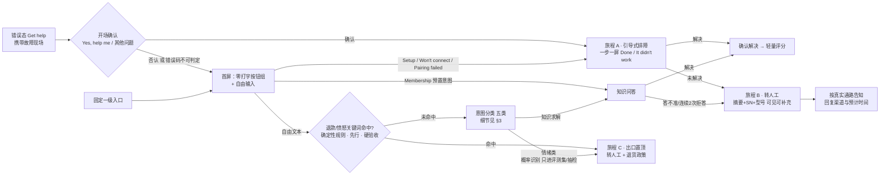
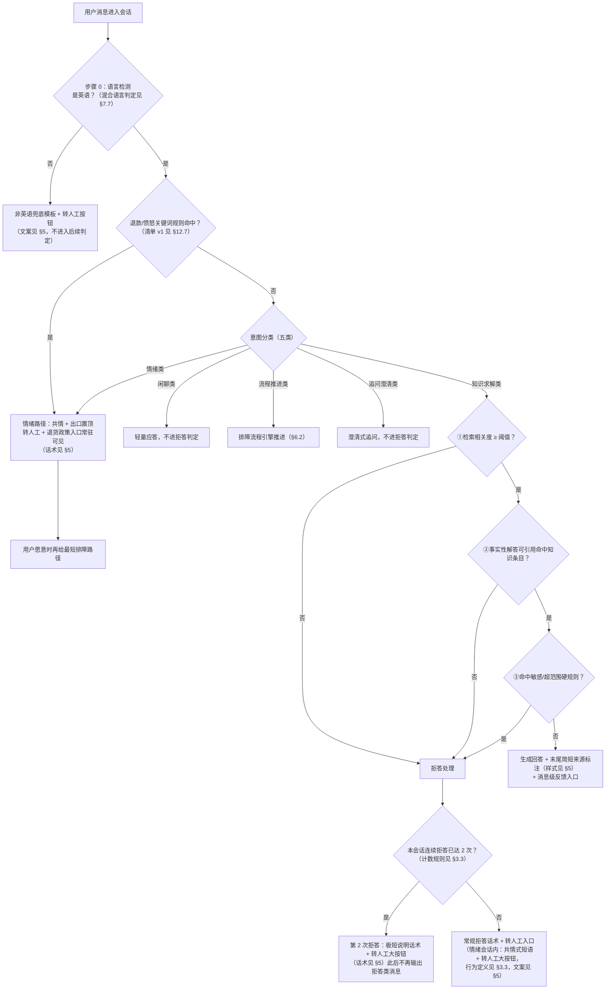
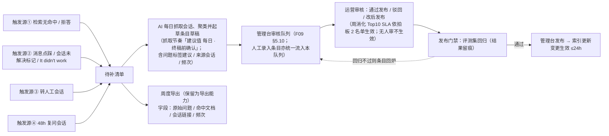
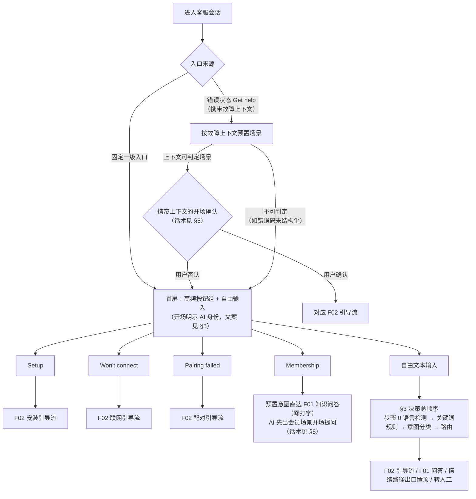
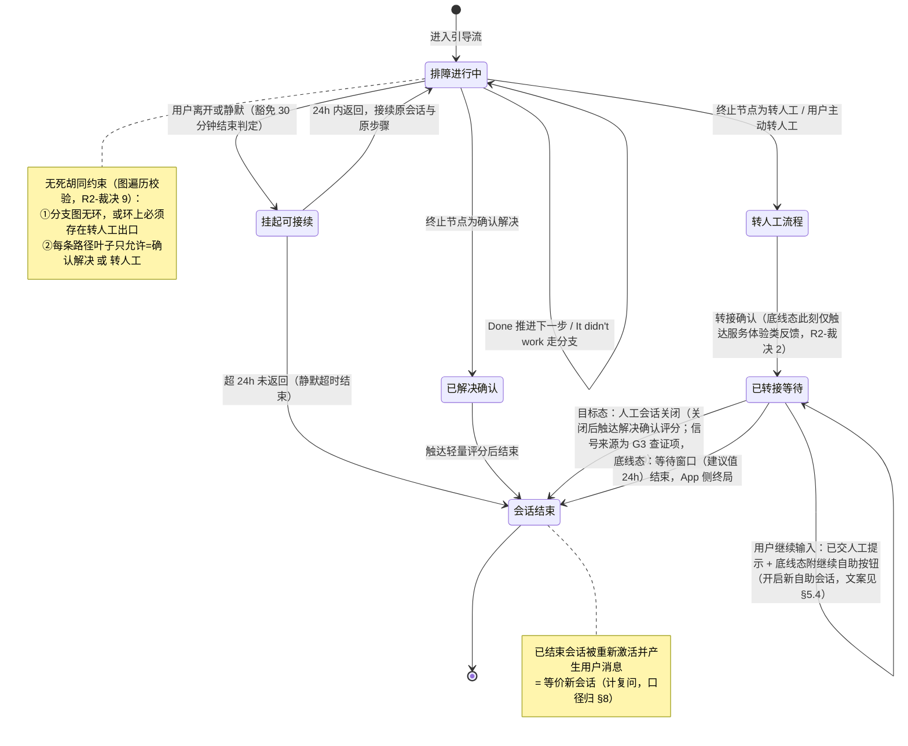
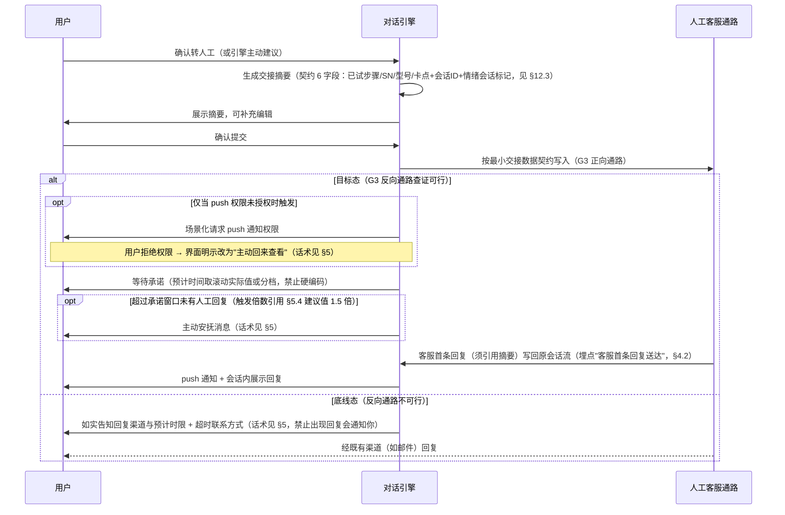
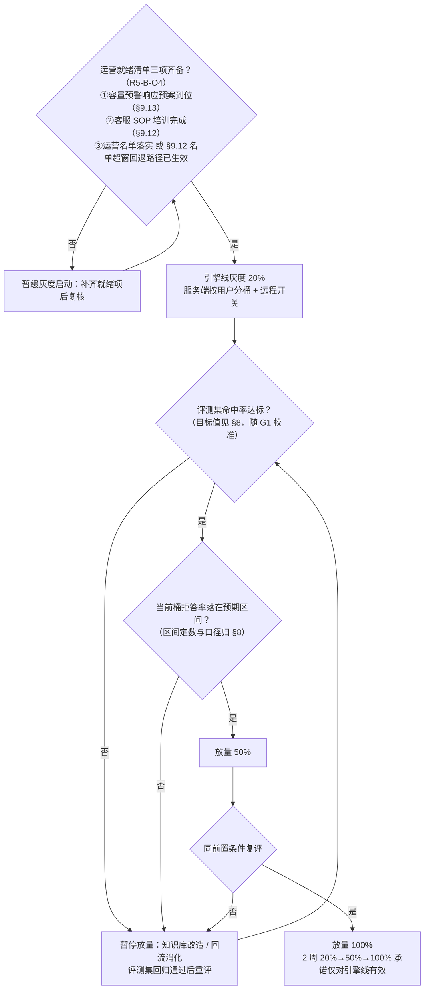

# COOLFLY 智能客服 PRD

## 0. 阶段路线图与 MVP 定义

### 0.1 阶段划分表

| 阶段 | 验证目标 | 功能模块 | 交付物（做完用户拿到什么） |
| :--- | :--- | :--- | :--- |
| **阶段一 · MVP** | 高频问题（安装/联网/配对/会员）的自助解决体验能否达到及格线：答得准、转得顺、找得到门、出得去门（高频类严口径解决率目标 60% / 底线 45%，3 个月，来源：proposal-v1 §7；「高频类」指标口径 = 安装/联网/配对三类，唯一定义见 §8.1）；同时为第二阶段攒数据与回流体系 | F01 智能问答、F02 引导式排障（三大场景）、F03 人机衔接、F04 双层反馈、F06 效果度量与预警、F08 入口与场景化触达；**F05 知识库升级与回流闭环进 MVP**（回流机制与清单导出即上线，周消化 SLA 在拍板 2 名单落实后生效）；**F07 的两条零成本预留约束进 MVP**（文案/prompt 不硬编码语言、知识条目带语言字段）；**F09 知识库管理台进 MVP（08-04-2026 拍板增补）**：管理台=知识库唯一权威源（飞书 120+ 篇一次性导入为初始数据，此后不做双向同步），含条目管理、录入/导入、AI 自动整理、会话提炼审核队列与发布门禁，同 F05 待遇**不卡**六项及格线验收（细节见 §5.10） | App 用户在 COOLFLY App 内获得英文智能客服：错误提示旁一键 "Get help"、首屏零打字按钮组、一步一屏排障引导、答不准主动转人工且零复述、转人工后知道去哪等回复；业务侧获得双口径解决率看板与容量预警；运营侧获得知识库管理台（内部 Web：条目录入/审核/发布，界面简体中文） |
| **阶段二及以后（后置，未排期、未细分，照抄已确认清单）** | 差异化与全渠道（本 PRD 不展开） | F07 完整多语言；设备状态诊断 + 自动解决方案（差异化王牌，依赖方案商接口争取）；邮箱/社媒/官网全渠道接入（长期愿景：一个 agent 服务全渠道）；Zendesk 客服工作台接入；方案商设备日志接口调用；**语音/无屏交互渠道**（App 内语音输入与答案朗读、智能音箱形态；企业家 08-03-2026 拍板登记，接口预留 = §3.7 引擎渠道无关 + 埋点 channel 字段 + §4.1 知识条目渠道中立，本期零额外开发）；**知识库多渠道采集扩展**（原「AI 生成型知识库」中的会话提炼与知识库管理台已随 F09 提前进入 MVP，08-04-2026 拍板；阶段二仅保留多渠道客诉采集扩展——从应用商店评分/客服邮件采集进 F09 审核队列，依 channel 字段接入；「无人审不生效」铁律与评测集回归门禁不变） | —（后置项不在本 PRD 承诺范围内，仅作演进方向登记） |

### 0.2 MVP 完成定义（照抄已确认结论，不得改动）

> **「F01/F02/F03/F04/F06/F08 六项全部达到及格线完成标准（含离线评测集验收通过 + 双口径看板可用）即 MVP 完成」**（来源：proposal-v1.md「MVP 划分（已与企业家确认 · 08-03-2026）」，企业家确认「就这些，没有补充」）。
> F05 / F07 **不卡** MVP 完成验收：F05 回流机制与清单导出随 MVP 上线，周消化 SLA 待拍板 2 名单落实后生效；F07 只验收两条约束（见 §10.4）。
>
> **F09 增补（08-04-2026 拍板，上文完成定义原文不动）**：F09 知识库管理台随 MVP 交付，同 F05 待遇——**不卡**六项及格线完成验收；其功能验收见 §10（AC-M-13–15 / AC-E-13–14），按功能自身验收，不并入 MVP 完成判定。

### 0.3 功能清单（F01–F09 · 带所属阶段列）

| 编号 | 功能 | 优先级 | 档位 | 上线线 | 所属阶段 |
|------|------|--------|------|--------|---------|
| F01 | 智能问答会话（意图分类先行 + 三层拒答，细节见 §3） | 必做 | 🟩 | 引擎线（首屏按钮组属发版线） | 阶段一 MVP |
| F02 | 引导式排障（安装/联网/配对三场景，一步一屏） | 必做 | 🟩 | 内容引擎线 + 卡片 UI 发版线 | 阶段一 MVP |
| F03 | 人机衔接（摘要+SN+型号，三件套随 G3 分层） | 必做 | 🟩 | 引擎线 | 阶段一 MVP |
| F04 | 会话反馈（消息级 👍/👎 + 会话级评分） | 必做 | 🟩 | 引擎线 | 阶段一 MVP |
| F05 | 知识库升级与回流闭环 | 应做 | 🟩（周消化 SLA 依拍板 2） | — | 阶段一 MVP（回流机制进 MVP，不卡验收） |
| F06 | 效果度量与预警（双口径、分层、容量预警线） | 必做 | 🟩 | 引擎线（与功能同步验收） | 阶段一 MVP |
| F07 | 多语言能力预留（仅两条约束） | 可做 | 🟨（两条约束本身进 MVP） | — | 约束进阶段一；完整多语言后置 |
| F08 | 入口与场景化触达（固定入口 + 错误态 Get help） | 必做 | 🟩 | 发版线（移出 2 周灰度承诺） | 阶段一 MVP |
| F09 | 知识库管理台（知识库唯一权威源；一级导航五区：数据看板/知识库总页面（章节树）/人工录入/AI 录入/审核队列，人工+AI 统一过审+发布门禁，细节见 §5.10） | 应做 | 🟩（不卡六项及格线验收，同 F05 待遇） | 引擎线（内部 Web，不依赖 App 发版） | 阶段一 MVP（08-04-2026 拍板增补，第三轮拍板五区重构） |

不做（边界重申，来源：proposal-v1 §4）：设备状态诊断与自动解决方案（第二阶段王牌）；客服工作台（未来 Zendesk）；邮箱/社媒/官网渠道改造；硬拦截降转人工率；客服容量/排班方案（产品只交付预警数据）。

### 0.4 MVP 方案前置能力（照抄 scene-anchor.md 已确认表）

| 能力 | 状态 | 负责人 | 证据/说明 | 替代方案 | 阶段 |
|------|------|--------|-----------|----------|------|
| LLM API（智能问答核心） | 待配置 | 内部技术团队 | 部署密钥方式配置，系统级，不做用户可见配置界面 | 无 LLM 则退化为检索式 FAQ，价值大减 | MVP |
| 现有 AI 客服历史数据导出 | 可导出（用户确认） | 用户团队 | 用于基线校准与知识库升级（即 G1） | 无导出则基线上线后重新采集 | MVP 前 |
| 飞书知识库（120+ 篇）访问/迁移 | 已存在 | 用户团队 | 初始知识来源：一次性迁移导入 F09 管理台，此后管理台为唯一权威源（08-04-2026 拍板）；飞书 API 权限前置登记 | 迁移失败→人工导出文件经 F09 批量导入（§9.2） | MVP |
| 方案商设备日志接口 | 不存在，未来可能 | 用户团队争取 | 目前纯人工链路 | 引导自查 + 带 SN 转人工 | 后续阶段 |

### 0.5 未决拍板（不阻塞 PRD 定稿）

- `OPEN_QUESTION`（拍板 1）：**重建服务端对话引擎 vs 升级现有系统**——待 G1 基线 + G2 盘点（含选项 B 能力对照表、三集成点可插拔判定）后由企业家拍。**无论 A/B，F01–F08 用户可见完成标准为形态无关硬验收，不随之变化**；选 B 后达不成的项逐条摆回企业家桌面重拍，不许静默缩水（来源：proposal-v1 §14 拍板 1）。
- `OPEN_QUESTION`（拍板 3）：**上线时间表、灰度节奏与 Q4 旺季策略**——待 G1 与开发排期后在 A（旺季前完整爬坡）/ C（旺季前只上保守版，定义见 §12.2）中选，不推荐 B（避开旺季）；**G1 超 2 周未产出自动落保守版 C**（写死）。F01–F08 用户可见完成标准不随之变化（来源：proposal-v1 §14 拍板 3）。
- 已决不重开（来源：项目纪要 08-03-2026 16:56:30）：拍板 2＝运营三岗现有人员兼任、名单 G1–G4 窗口内后补；拍板 4＝价值账保留原口径 ¥120–130 万/年并披露口径结构（见 §1.2/§11）；拍板 5＝知识库改造顺序与转人工通路授权按 G1/G3 门槛结果执行。

### 0.6 关键决策表

| ID | 决策 | 拍板人 | 阶段 |
|----|------|--------|------|
| D-1 | 核心目标=提升用户解决速度与解决体验；降人工量是副产品 | 企业家 | 阶段 1 |
| D-3 | 第一版范围只做 App 用户侧客服入口；客服员工工作台未来用 Zendesk 接入，现阶段不做任何客服侧工具 | 企业家 | 阶段 1 |
| D-4 | 成功指标：核心=自助解决率（未转人工且 48h 未复问），3 个月高频类 ≥60% / 整体 ≥50%（假设值待基线校准）；次要=自助解决时长 ≤10 分钟、转人工首响不劣化、会话满意度 | 企业家 | 阶段 1 |
| D-5 | 第一阶段核心=高质量 AI 式对话（知识库问答+转人工衔接）；设备状态诊断与自动解决方案不是本阶段重要目标，降为后续阶段差异化储备 | 企业家 | 阶段 3 |
| D-6 | 拍板 2：运营三岗（知识库运营/退货归因/客服 SOP 抽检）现有人员兼任，名单 G 窗口内后补；给不出名单则砍 F05 承诺并下调目标 | 企业家 | 阶段 4.5 |
| D-7 | 拍板 4：价值账保留原口径 ¥120–130 万/年（不采纳修正为 99–123 万） | 企业家 | 阶段 4.5 |
| D-8 | 拍板 5：知识库三场景前置改造+回流补齐（排序依 G1）、转人工沿现有渠道层级依 G3，授权按门槛结果执行（回炉线除外不上会）；拍板 1/3 待 G1/G2 证据后拍 | 企业家 | 阶段 4.5 |

> 拍板 1（重建 vs 升级）、拍板 3（时间表）为 `OPEN_QUESTION`，待 G1/G2 证据后拍，不入本表（见 §0.5、§9.11）；完整讨论过程见 debate-log.md。

---

## 1. 项目背景与业务收益

### 1.1 需求简介

在 COOLFLY App 内重建/升级智能客服入口，让用户（尤其刚装机的新用户）在几分钟内自助解决安装、联网、配对、会员等高频问题；解决不了时顺畅衔接人工、零复述、不干等（来源：scene-anchor.md 一句话定位）。

> **第一阶段定位（诚实版）**：体验补课到及格线——答得准、转得顺、找得到门、出得去门——同时为第二阶段攒数据与回流体系；差异化王牌（AI + 设备诊断，调研证明全品类无人做到）留在第二阶段（来源：proposal-v1 §1；evidence/competitors.md 差异化机会 1）。

### 1.2 收益预估

#### 用户收益（量化）

| 收益 | 现状 | 目标 | 依据等级 |
|------|------|------|---------|
| 高频问题解决时长 | 人工回复平均 1–2 小时，配对类需人工链路定位、困难时隔天（用户确认事实） | 自助场景 ≤10 分钟（假设值，scene-anchor 已拍板） | A（现状）/ D（目标值） |
| 首次响应 | 人工渠道小时级；行业聊天首响均值约 2 分钟、邮件均值约 12 小时（来源：benchmark.md，Lorikeet 引 Zendesk/SuperOffice） | AI 入口秒级即时响应 | B（行业基准）/ C（推断） |
| 求助门槛 | App 被差评"labyrinthian maze"，错误发生时无指引（用户之声见下） | 错误提示旁一键 Get help；首屏零打字按钮组；新用户 3 步内找到入口 | A（差评为逐字原文） |
| 口径一致性 | 不同客服口径不一（用户确认事实） | 基于同一知识库回答，口径统一 | A / C |

**用户之声（COOLFLY 自身 App Store 差评逐字原文，直接做成验收用例，来源：evidence/complaints.md 痛点 6/9）**：
- "my device went off-line, and there are no instructions telling me how to get it back online"（设备掉线，没有任何指引告诉我怎么让它重新上线）——2025-08-31
- "To navigate this app is like an adventure in a labyrinthian maze"（在这 App 里导航像走迷宫）——2025-04-29；"It's an absolute nightmare to navigate"——2025-05-18

#### 业务收益（价值论证 · 拍板 4 已确认口径）

按用户拍板的原口径呈现（拍板 4，08-03-2026）：

| 价值块 | 计算口径 | 年价值 | 依据等级 |
|--------|----------|--------|---------|
| ② 减退货损失 | 退货率降 3pp（11%→5% 目标中归功智能客服的一半）× 10 万台/年 × $50 客单价 × 70% 退货损失率 ≈ $105,000 | 中性 ¥75 万（区间 ¥36–136 万） | 销量/退货率/客单价=A（用户确认）；3pp 归因=D（A-005）；70% 损失率=D（A-006） |
| ③ 撑增长不加人 | 销量涨 2–3 倍、咨询量同步涨时，自助解决 50%+ → 客服维持 3–4 人，避免新增 4–5 人 | ¥24–48 万 | 销量计划=A；解决率 50%+=C（A-004） |
| ① 省现有人力 | 客服工作量减半（按工作量折算，轮班最小配置不减人头）+ 技术定位省来回（30–50 起/月 × 1–2h，用户确认） | ¥12–17 万 | 客服成本/技术定位频次=A；减半幅度=D |

> **合计：中性约 ¥120–130 万/年，两年稳超 ¥200 万；乐观口径单年可到 ¥200 万**（来源：scene-anchor.md 价值论证已确认小节，用户 08-03-2026 拍板认可并在拍板 4 中确认保留原口径）。
>
> **口径结构披露（拍板 4 要求，随结论必须出现）**：
> 1. 价值块 ① 与 ③ 基于**同一份被释放的客服容量**——① 按"销量不涨、现有工作量减半"折算，③ 按"销量涨 2–3 倍、避免加人"折算，两者为不同情景下对同一容量的两种计法，同表相加存在重复计算风险；剔除重复后的可复算中性口径为 ②+③ = ¥99–123 万/年。企业家已知晓该风险，仍拍板保留 ¥120–130 万/年原口径对外呈现（来源：项目纪要 08-03-2026 16:56:30）。
> 2. **"两年稳超 ¥200 万"为中性情景结论，且以 G1 通过 A-005 检验（退货用户中曾咨询比例 ≥30%）为前提**；G1 触发回炉线则 ② 重算、此结论同步重述（来源：debate-log.md 裁决 4）。

未入账弹性：店铺评分 3.6–4.0 → 4.3+ 对转化率的拉动（3→4 星下载/转化 +89%，Apptentive 下载口径，店铺购买转化为类比推断，依据等级 C，来源：benchmark.md）；技术定位省来回若单列约 ¥3–5 万/年（工程师工时，独立资源；**已含于价值块①，此处仅为单列口径参考，不与上表叠加**）。

> **最锋利的一句话**（来源：scene-anchor.md）：差评里一半是"装不上连不上"——这正好是智能客服最能吃掉的问题；退货率每降 1 个点，一年就是 1,000 台不用退。

#### 不做的风险（每条带依据等级）

| 风险 | 后果 | 依据等级 |
|------|------|---------|
| 挫败型退货持续流血 | 65% 受访者曾因开箱/装机挫败退掉**无缺陷**电子产品（TechSee）；68% 消费电子退货为无故障退货（Accenture）——现状 11% 退货率中可被自助排障拦截的部分持续损失 | B（外部权威调研，来源：complaints.md 痛点 10、benchmark.md） |
| 店铺评分被装机差评压制 | 差评中使用问题类占 50%+（用户确认），评分 3.6–4.0 压制转化；竞品 Bird Buddy 4.8 分/61K 评分（来源：competitors.md） | A（自有数据）+ B（竞品对照） |
| 销量翻倍时客服被淹没 | 2026 目标近 10 万台、未来一年销量涨 2–3 倍（用户确认）；3 人团队无自助分流则咨询量同步翻倍，服务质量与首响崩塌 | A（计划）+ C（外推） |
| 错失品类先发窗口 | 品类 7 家品牌无一做到"会读设备的 AI 客服"，有诊断的没 AI、有 AI 的读不到设备（来源：competitors.md）；第一阶段不落地，第二阶段王牌无数据、无回流体系可承接 | B（竞品调研） |

---

## 2. 用户画像与核心旅程

### 2.1 用户角色矩阵

| 角色（稳定名称） | 身份/别名 | 直接/间接 | 目标 | 关键操作 | 数据/权限边界 | 所属阶段 |
| :--- | :--- | :--- | :--- | :--- | :--- | :--- |
| **App 用户** | COOLFLY 智能喂鸟器/鸟类相机买家；主力北美、英文；典型状态"刚拿到设备，卡在安装/联网/配对"；中老年占比高（打字意愿低） | 直接 | 几分钟内自助解决问题；解决不了时顺畅转人工、不复述、不干等 | 点错误态 Get help / 首屏按钮；分步排障（Done / It didn't work）；自由输入提问；确认并补充转人工摘要；👍/👎 与会话评分 | 仅本人会话、本人设备（SN/型号）与故障上下文；无任何后台数据 | 阶段一 MVP |
| **人工客服** | 菲律宾 3 人外包团队 | 间接（不为其做工具，本期无客服侧界面） | 接到转人工时即见摘要三件套（已试步骤/SN/型号/卡点），首条回复直奔问题 | 接收转人工会话与交接数据；按 SOP 首条回复引用摘要 | 仅接收交接契约字段与会话摘要；工作台能力不在本期范围（未来 Zendesk） | 阶段一 MVP（间接） |
| **业务负责人** | 企业家/COOLFLY 业务线负责人 | 间接 | 按周看双口径解决率看板、收到容量预警、月度退货归因，验证价值账 | 查看 F06 看板与周报；接收容量预警推送；访问 F09 知识库管理台查看条目与审核动态（管理台使用者之一，08-04-2026 拍板） | 聚合指标数据（脱敏后），无单用户会话明细浏览需求 | 阶段一 MVP（间接） |
| **知识库内容运营** | 拍板 2 名单岗位（现有人员兼任，2 名，08-04-2026 拍板）；内部角色 | **直接（内部工具）**——F09 知识库管理台使用者，无 App 侧界面 | 让知识库持续答得准：录入/整理知识条目，审核 AI 起草的条目草稿，发布须过评测集回归的条目，周消化回流 Top 10（F05 SLA） | 管理台内搜索/筛选条目；新建/编辑（问答型/排障流程型）；批量导入（飞书一次性迁移/Markdown/CSV）；确认、修改或拒绝 AI 切条与问题标签建议；审核队列通过发布/驳回/改后发布；导出周清单 | 管理台全量知识条目与审核队列；来源会话仅脱敏后摘要/链接（§4.5 PII 规则）；无 App 用户明细数据 | 阶段一 MVP（08-04-2026 增补） |

> 单/多角色结论：**App 侧单直接角色**（App 用户）；**知识库内容运营为内部工具侧直接角色**（F09 管理台，08-04-2026 增补，同时补齐 requirements-analysis RA-005 指出的角色缺口）；人工客服与业务负责人均为数据/流程的间接接收方，目标、操作、数据边界互不相同故分列——间接角色不产生独立 App 界面需求，内部工具界面归 F09（§5.10）。

### 2.2 明确不是谁

- **客服员工（作为工具使用者）**：客服工作台未来用 Zendesk，本期不做任何客服侧界面（已拍板边界）。
- **邮箱/社媒/官网渠道的咨询用户**：本期不动，后续阶段统一（长期愿景=一个 agent 服务全渠道）。
- **非英语主力市场用户**：第一版英文单语（A-002，依据等级 B）；非英语输入仅提供兜底说明与转人工，不承诺母语服务。
- **方案商/开发者**：设备日志接口不存在（A-003，依据等级 A），不是本期服务对象。

### 2.3 核心用户旅程（拒答/情绪机制细节见 §3，流程图见 §6）



> 图注（与 §3.1 执行顺序对齐）：非英语输入在进入下列判定前由**步骤 0 语言检测**截住，直接走非英语兜底模板（含转人工按钮，见 §3.1/§5.2，R5-T2）；英语自由文本**先过退款/愤怒关键词规则**（确定性、先行、硬验收 AC-E-03，清单 v1 见 §12.7），命中直入旅程 C；未命中才进意图分类，分类器判为情绪类同入旅程 C（该识别为概率性，只进评测集与灰度抽检，不进硬验收）。错误态入口先出携带故障现场的开场确认（确认→对应排障流；否认或错误码不可判定→首屏按钮组，R2-裁决 3）。

**旅程 A · 自助解决（主路径，目标占高频类 60%，目标值为假设 A-004；「高频类」口径见 §8.1）**
北美用户 Sarah 配对到一半卡住，配对失败页直接显示 "Get help" → 点进去首条是开场确认"看起来配对没成功，要我带你排查吗？"点 "Yes, help me" → 首屏零打字进入分步引导，第一步问"你连的是 2.4GHz 还是 5GHz？"配路由器示意图 → Sarah 切出 App 去改路由器设置（超过 30 分钟也没关系）→ 回来自动恢复到当前步骤 → 点 "Done"，配对成功 → AI 确认解决，弹出轻量评分 → 全程 8 分钟，零打字也零等待。（2.4GHz/5GHz 为品类第一装机杀手，来源：complaints.md 痛点 1）

**旅程 B · 转人工兜底（不干等、不复述、知道去哪等）**
用户 Mike 扫码绑定失败，引导两轮自查仍失败 → AI 主动说"这个情况需要人工用你的设备序列号定位"，展示将发给客服的摘要，Mike 补充"绑定时 App 闪退过一次" → 确认转人工，界面按真实通路显示等待承诺（目标态/底线态两套话术见 §5；层级随 G3 查证分层）→ 人工客服首条回复即引用摘要直奔问题 → Mike 全程零复述、零虚假期待。

**旅程 C · 情绪崩溃路径（退货率的直接来源）**
用户折腾 2 小时后打出 "this thing is garbage, I want a refund" → 关键词规则命中，不进拒答判定、不追问技术细节 → 先共情，出口置顶：转人工 + 退货政策入口 → 若用户愿意，再给"最后试一步"最短排障路径。（机制细节与验收边界见 §3；关键词触发为确定性硬验收，怒气识别只进评测集与抽检；交接契约携带内部情绪会话标记，用户不可见，R2-裁决 7）

### 2.4 用户故事（US 注册表 · ID 与 F01–F09 对齐）

> FR 编号采用组级 **FR-F01…FR-F09**（§5 各功能小节定义，一经落定只增补不重排，R2-裁决 5；FR-F09 为 08-04-2026 增补）；本节「由 FR-F0x 实现」即最终引用格式。

**F01 智能问答会话**
- **US-F01-01**：作为 App 用户，我想用英文直接提问安装/联网/配对/会员问题，AI 基于知识库多轮对话给出准确回答，让我几分钟内解决问题。（由 FR-F01 实现）
- **US-F01-02**：作为 App 用户，当 AI 对事实性问题没把握时，我希望它明说"不确定"并主动给我转人工入口，而不是编一个答案害我白折腾。（由 FR-F01 实现）
- **US-F01-03**：作为折腾了 2 小时、正在气头上的 App 用户，当我打出退款/愤怒字眼时，我希望先被安抚、并直接看到置顶的转人工与退货政策入口，而不是被追问技术细节或收到"我没把握"的模板话术。（由 FR-F01 实现）
- **US-F01-04**：作为 App 用户，同一会话里 AI 连续两次答不上来后，我希望直接看到转人工大按钮，不被消耗第三次耐心。（由 FR-F01 实现）
- **US-F01-05**：作为非英语输入的 App 用户，我希望收到英文+我所用语言的模板句说明（当前仅支持英文），并照常拿到转人工入口，而不是被无声忽略。（由 FR-F01 实现）
- **US-F01-06**：作为 App 用户，我希望会话开场就知道对面是 AI 助手，对回复能力有正确预期。（由 FR-F01 实现）
- **US-F01-07**：作为想咨询会员问题的 App 用户，我希望点首屏 Membership 按钮直接进入会员问答，跳过打字。（由 FR-F01 实现）

**F02 引导式排障**
- **US-F02-01**：作为面对空白输入框不知道打什么的 App 用户（中老年为典型），我希望首屏就有高频问题按钮（Setup / Won't connect / Pairing failed / Membership），点按直接进入一步一屏的分步引导。（由 FR-F02 实现）
- **US-F02-02**：作为排障中的 App 用户，每一步我只需在 "Done" 和 "It didn't work" 两个大按钮里选一个，就能走到下一步或换一条路径，永远不会走进死胡同。（由 FR-F02 实现）
- **US-F02-03**：作为需要切出 App 去改路由器设置的用户，我希望回来时（24 小时内）自动恢复到刚才的排障步骤，不用从头再来。（由 FR-F02 实现）

**F03 人机衔接**
- **US-F03-01**：作为自助未解决的 App 用户，我希望一键转人工时系统自动带上会话摘要+SN+设备型号，我能看到并补充这份摘要，到了人工那里不用从头复述。（由 FR-F03 实现）
- **US-F03-02**：作为已转人工的 App 用户，我希望界面如实告诉我回复将通过什么渠道、预计多久送达、超时了找谁，而不是对着聊天窗干等一个不会来的回复。（由 FR-F03 实现）

**F04 会话反馈**
- **US-F04-01**：作为 App 用户，我可以对 AI 的单条回答点 👍/👎，点踩时可选原因（不相关/看不懂/试了没用），让答错的地方被修正。（由 FR-F04 实现）
- **US-F04-02**：作为结束会话的 App 用户，我可以用一次轻量评分表达这次服务是否解决了问题。（由 FR-F04 实现）

**F05 知识库升级与回流闭环（间接角色）**
- **US-F05-01**：作为知识库内容运营（owner 依拍板 2 名单，间接角色），我每周拿到一份按频次排序的待补条目清单（含原始问题/命中文档/会话链接），知道该优先补什么。（由 FR-F05 实现）

**F06 效果度量与预警（间接角色）**
- **US-F06-01**：作为业务负责人（间接角色），我上线第一周起就能按周查看双口径解决率（按入口分层）、拒答率（按层分列）、转人工量与语言分布，验证这笔投入是否值得。（由 FR-F06 实现）
- **US-F06-02**：作为业务负责人（间接角色），当月转人工绝对量达到预警线（G1 实测月处理量的 80%）时，我要收到预警推送，来得及启动容量应对预案。（由 FR-F06 实现）

**F08 入口与场景化触达**
- **US-F08-01**：作为设备掉线/配对失败/扫码失败的 App 用户，我希望错误提示旁边就有 "Get help"，点一下进入对话且故障现场已自动带上，不用自己描述发生了什么。（由 FR-F08 实现）
- **US-F08-02**：作为新用户，我希望在 App 内 3 步以内找到固定客服入口，而不是在"迷宫"里找门。（由 FR-F08 实现）

**F09 知识库管理台（内部工具 · 直接角色=知识库内容运营，08-04-2026 增补）**
- **US-F09-01**：作为知识库内容运营，我要在管理台录入或导入知识条目（手工表单、飞书一次性迁移、Markdown/CSV 批量导入），并让 AI 给出切条、问题标签与场景/型号/章节归类建议供我确认，让 120+ 篇存量与新增内容快速变成可检索的结构化条目；我录入的条目进入审核队列，**人工审核通过后才正式转入知识库总页面**（08-04-2026 第三轮拍板修订：不再直接发布）。（由 FR-F09 实现）
- **US-F09-02**：作为知识库内容运营，我要在审核队列里看到人工录入与 AI 每日从真实会话抓取聚类起草的条目草稿（含来源会话与频次、标签建议）统一流入，一键通过发布/驳回/改后发布——未经我审核的条目绝不生效（08-04-2026 第三轮拍板修订：统一过审）。（由 FR-F09 实现）
- **US-F09-03**：作为知识库内容运营，我确认后的问题标签要成为检索信号，让用户的各种问法更准命中条目；发布须过评测集回归，回归不过的条目不生效，命中率仍以 §8 目标值验收。（由 FR-F09 实现）
- **US-F09-04**（08-04-2026 第二轮拍板增补）：作为知识库内容运营，我要在管理台数据看板（知识库数据子看板）看到每条知识的使用与解决效果（命中/引用/点踩/条目准确率），知道该优先修哪条。（由 FR-F09 实现）

**F07 多语言能力预留**：无独立用户故事——本期只交付两条产品约束（用户可见文案与 prompt 模板不硬编码语言；知识条目带语言字段），验收见 §10.4；完整多语言体验后置（触发条件：F06 语言分布实测非英语占比 >15%，A-002）。

---

## 3. 对话引擎决策逻辑（意图分类 → 三层拒答 → 路由）

> **形态无关声明**：拍板 1（重建服务端引擎 vs 升级现有系统）未决。本章与 §4 全部为**行为规格**——无论最终选 A 或 B，系统对外表现与数据产出均须满足本文描述；涉及实现形态的内容一律标注「架构建议（待技术负责人确认）」。

本项目无算法章节；本章将 proposal-v1 §5 已裁决的**执行顺序（写死）**落成决策规格。所有用户可见话术的具体措辞归 §5，本章只引用不复制。

### 3.1 决策总顺序（写死，不随拍板 1 变化）

```
用户消息 → 步骤 0：语言检测（非英语 → 非英语兜底模板 + 转人工按钮，不进入后续任何步骤） → 情绪/退款关键词规则（确定性，先行，清单 v1 见 §12.7） → 意图分类（五类） → 仅"知识求解类"进三层拒答 → 生成回答或拒答 → 路由出口
```

> 关键词规则前置是对 proposal-v1 §5 执行顺序的**执行细化**（确定性逻辑先行、可硬验收），非顺序变更；本 PRD §5.2 的相关叙述与本节逐节点一致，以本节表述为准。
>
> **步骤 0 · 语言检测（R5-T2）**：确定性前置节点——非英语消息直接出非英语兜底模板（含转人工按钮，文案见 §5.2），**不进入关键词规则与意图分类**（关键词清单 v1 仅覆盖英语，§12.7；西语 "reembolso" 类退款词由兜底模板的转人工按钮承接，不做跨语言关键词匹配）；混合语言按主要语言判定、判定不确定时按英语处理（判定规则唯一落点 §7.7）。

两条独立机制，验收口径不同：

| 机制 | 性质 | 验收方式 |
|------|------|---------|
| 退款/愤怒类**关键词规则** | 确定性逻辑，命中即出口置顶 | 硬验收（100% 可复现） |
| 意图分类器判定"情绪类" | 概率性识别 | 只进评测集怒气样本 + 灰度抽检，**不进硬验收** |

### 3.2 意图分类（五类）与豁免规则

| 意图类别 | 处理 | 是否进三层拒答 |
|---------|------|--------------|
| 知识求解类 | 检索知识库生成事实性解答 | **是（唯一进入类别）** |
| 情绪类 | 共情话术 + 出口置顶（转人工 + 退货政策入口常驻可见） | 否（豁免） |
| 闲聊类 | 轻量应答并引导回支持场景 | 否（豁免） |
| 流程推进类 | 交排障流程引擎推进步骤（见 §6.2） | 否（豁免） |
| 追问澄清类 | 澄清式追问 | 否（豁免） |

**豁免防滥用**：豁免类别不得借"共情/追问"话术夹带事实性内容输出（否则等于绕过第②层引用约束）；评测集设"豁免滥用"陷阱题专门防守（见 §4.3）。

### 3.3 三层拒答（仅作用于知识求解类的事实性解答消息）

| 层 | 判定 | 结果 |
|----|------|------|
| ① 检索相关度 | 检索相关度低于阈值（阈值为商业参数，上线后调优为技术月人日第一用途，依拍板 2） | 承认不会 + 主动给转人工 |
| ② 引用忠实 | **事实性解答消息**必须引用命中知识条目；无引用即拒答。追问/共情/流程话术显式豁免 | 无引用 → 拒答；有引用但内容不忠实 → 由评测集陷阱题拦截（引用忠实率单列验收） |
| ③ 硬规则 | 敏感/超范围类目命中硬规则 | 直接拒答 |

**引用可见性（R2-裁决 4）**：通过第②层的知识求解类回答，末尾向用户显示**简短来源标注**（形如"来源：安装指南"，措辞样式归 §5）——轻量呈现：不展开引用全文、不做跳转承诺。来源标注必须与实际命中条目一致，构成评测集"引用忠实率"验收的**用户侧闭环**（用户看到的来源 = 系统实际引用的条目，见 §4.3 陷阱题②）。

**反向约束（防"全拒答刷满分"）**：
- 高频问题误拒率上限：`[PRD 定数 · G1 后回填]`（上限定数与口径归 §8；评测集高频误拒题验收）。
- 单会话连续拒答 ≤2 次：第 2 次拒答呈现**一句极短说明话术 + 转人工大按钮**（R2-裁决 1；措辞归 §5，本章只约束行为），此后本会话不再输出任何拒答类消息。
- **连续计数规则**（供 AC-E-02 与 §4.2 拒答事件计数属性统一口径）：任意一次成功事实性解答将计数清零；豁免类消息（闲聊/追问澄清/共情/流程推进）不清零也不累加。
- **情绪会话内的拒答形态（R4-P0 裁决）**：情绪会话（关键词规则命中或分类器判为情绪类）中的知识求解消息触发三层拒答任一层时，**不输出常规拒答措辞**，直接呈现"一句共情式短语 + 转人工大按钮"（即第 2 次拒答形态的情绪适配版；文案归 §5.2「拒答 · 情绪场景」）；该次**照常计入连续拒答计数**（清零/不累加规则同上，连续拒答 ≤2 链路保持完整）。

### 3.4 决策流程图



### 3.5 首屏路由（含 Membership 预置意图直达）

- 高频按钮（Setup / Won't connect / Pairing failed）→ 直接进入对应 F02 引导流，零打字。
- **Membership 按钮 = 预置意图直达 F01 知识问答（跳过打字）**，AI 先出会员场景开场提问（话术归 §5，与 AC-M-04 统一），不走引导流；会员类知识条目列入改造清单候选，由 G1 数据裁决排序。
- 自由文本 → 3.1 决策总顺序。
- 错误状态"Get help"进入 → 携带故障上下文预置场景（entry_source=错误态入口）：**先出携带上下文的开场确认**（R2-裁决 3；话术归 §5）——用户确认 → 进入对应引导流；用户否认 → 回首屏（按钮组 + 自由输入），不锁死路由。上下文不可判定（如错误码未结构化）→ 降级为通用进入，落**首屏**（按钮组 + 自由输入），不落纯自由输入。
- 分流图见 §6.1。

### 3.6 排障决策形态（已裁决，proposal-v1 §5）

结构化流程（步骤 + 分支显式建模）承载排障逻辑；LLM 只负责意图识别、上下文衔接与话术生成，**不负责发明步骤**。"无死胡同"用图遍历自动验证，校验规则两条（R2-裁决 9）：

1. 分支有向图**无环**；确需回指先前节点的环，**环上必须存在转人工出口**；
2. 所有叶子节点 ∈ {确认解决, 转人工}。

运行时兜底（同一步骤第二次到达时附加转人工提示条）归 §5.3，校验层与其对齐表述。状态机见 §6.2，流程数据结构见 §4.1。

### 3.7 演进约束（架构约束五条，proposal-v1 §10，逐条落本章）

1. **引擎渠道无关化**：对话引擎核心接口不假设 App 来源；故障上下文等 App 专属信息作为**可选结构化输入**传入；未来邮箱/官网渠道接入只写渠道适配层、不重写引擎。阶段二第一个预期新渠道 = **语音/无屏交互**（App 内语音、智能音箱；企业家 08-03-2026 拍板登记，见 §0 后置清单）——届时仅新增语音适配层（语音转文字进引擎、答案文字转语音出），引擎与知识库零改造；引导式排障的语音可读版为该阶段设计工作量，本期不做。
2. **埋点 channel 字段**：事件 schema 带 channel 字段（默认 app），见 §4.2。
3. **转人工最小交接数据契约**：固定字段顺序（6 字段：已试步骤/SN/型号/卡点/会话 ID/情绪会话标记（内部）），兼作未来 Zendesk 字段映射底稿（字段清单归 §12.3 附录，本章只约束"契约字段顺序固定、不可随实现变动"）。
4. **F07 两条约束**：文案与 prompt 模板不硬编码语言；知识条目带语言字段（见 §4.1）。
5. **排障流程 schema 与知识条目均渠道中立**：不含任何 App 界面专属字段；界面呈现（卡片/按钮）由渠道适配层映射。

> 违反任一条即属架构回归，PRD 层面视为缺陷而非优化空间——这五条是"零成本现在写、两年后免还债"的裁决产物（debate-log Round 3 裁决 7）。

---

## 4. 数据需求（知识库 schema ／ 埋点 schema ／ 评测集 ／ 回流数据流）

> 本章为**概念级 schema**：只定义"有什么信息、谁产生、流向哪"，不定义字段物理类型。指标口径与目标值归 §8，本章不重复。

### 4.1 知识条目与排障流程 schema（概念级）

**知识条目（问答型，供 F01 检索引用）**

| 信息项 | 说明 | 来源/约束 |
|--------|------|----------|
| 条目标识 | 唯一、稳定，供回答引用与回流清单关联 | 系统生成 |
| 标题 / 问题描述 | 用户语言的问题表述 | 内容运营 |
| 场景分类 | 安装 / 联网 / 配对 / 会员 / 其他（与 G1 咨询分布口径对齐） | 内容运营，G1 后可调 |
| **所属章节** | 大章节 / 小章节两级归属（书目录式层级，F09 知识库总页面章节树导航用，§5.10）；层级归属可调整（条目/小章节可移动）；章节由运营在总页面内维护 | 内容运营（08-04-2026 第三轮拍板增补） |
| 适用设备型号 | 可多值；空 = 全型号通用 | 内容运营 |
| **语言字段** | F07 约束，字段必须存在；条目语言在录入时选择（08-04-2026 第三轮拍板修订：不再限定恒为英文，服务 App 英文用户的生产条目为英文） | 架构约束（§3.7）+ 内容运营录入时选择 |
| 正文内容 | 事实性解答内容，作为第②层引用对象 | 知识库管理台（F09，唯一权威源；初始内容来自飞书一次性迁移） |
| 来源与版本 | 初始导入来源标识（飞书一次性迁移）+ 更新时间，支撑"变更生效 ≤24h"追踪 | 管理台生成（F09） |
| **问题标签** | 多值：用户问法变体集合；AI 生成建议 + 人工确认后生效（F09 §5.10）；作为检索信号（扩充召回+过滤），命中率仍以评测集验收（§8 目标值不变） | 内容运营确认（AI 建议态） |
| **审核信息** | 草稿来源（人工录入 / 批量导入 / 会话提炼）+ 审核人 / 审核时间；未审核条目不进检索库（无人审不生效，F09 §5.10） | 管理台生成（F09） |
| 状态 | 草稿 / 已上线 / 待改造 / 已下线（状态流转在 F09 管理台完成，§5.10；改造清单排序在 G1 之后） | 内容运营 |

**排障流程条目（结构化，供 F02 引导流）**：在知识条目公共信息（标识/场景/所属章节/型号/语言/版本/状态）之上，增加：

| 信息项 | 说明 |
|--------|------|
| 步骤节点 | 一步一屏的步骤文案 + 是否配图（Top3 场景关键分支配图🟩，其余🟨） |
| 分支 | 每步仅两出口：Done → 下一节点；It didn't work → 分支节点。**环路约束（R2-裁决 9）**：默认禁止环；确需回指先前节点的环，环上必须存在转人工出口 |
| 终止节点 | 只允许两类：确认解决 / 转人工（与环路约束共同构成 §3.6 **无死胡同图遍历校验的依据**） |

**渠道中立约束**：两类 schema 均不含 App 界面专属字段（§3.7 第 5 条）。

### 4.2 埋点事件清单（概念级 schema）

**公共属性（所有事件必带）**：会话 ID、用户标识、时间戳、**entry_source（入口来源，会话级，进入时刻写死：固定入口 / 错误态入口 / 未知**——旧版本客户端无字段的流量归"未知"单列呈报**）**、**interaction_mode（交互方式，消息级：按钮组 / 自由输入 / 预置意图）**、**app_version**、**channel（默认 app）**、灰度桶标识。

> entry_source 与 interaction_mode 为**两个独立维度**（R2-裁决 8）：前者回答"用户从哪进来"（会话级，一次写死），供 §8 分层解决率呈报与"引擎效果 vs 入口效果"分离；后者回答"这条消息怎么产生"（会话内可多次切换）。枚举唯一落点在本节，§5/§8 引用不复制。

| 事件 | 触发时机 | 事件专属属性 | 服务对象（口径归 §8） |
|------|---------|-------------|---------------------|
| 会话开始 | 用户进入会话 | 进入场景（含错误态故障上下文类型）、语言检测结果 | 解决率分母、语言分布 |
| 意图分类结果 | 每条用户消息 | 意图类别、是否关键词规则命中 | 意图分布、旅程 C 硬验收 |
| 拒答事件 | 三层任一触发 | **触发层（①/②/③）**、本会话连续拒答计数（计数口径见 §3.3：成功事实性解答清零，豁免类不清零不累加） | 拒答率按层分列、连续拒答 ≤2 |
| 回答消息 | AI 输出事实性解答 | 引用条目标识列表、用户可见来源标注内容（R2-裁决 4） | 引用忠实抽检（标注与引用一致性）、回流关联 |
| 排障步骤推进 | 每步 Done / It didn't work | 流程标识、节点标识、方向 | 无死胡同实测、卡点分布 |
| 转人工 | 用户确认转人工 | 交接契约摘要标识、通路层级（目标态/底线态） | 转人工率与绝对量、容量预警 |
| **客服首条回复送达** | 目标态：人工首条回复写回原会话流 | 关联转人工事件标识、回复时刻、是否首条 | 转人工首响时长（AC-I-03 不变行为）、超时安抚触发（§6.3） |
| 消息级反馈 | F01 消息 👍/👎 | 反馈方向（👍/👎）、点踩原因（不相关/看不懂/试了没用）、改选以最后一次为准 | 回流触发源②、回流清单去重 |
| 会话结束 | 三类结束判定 | 结束类型（确认解决/转人工完成/静默超时）、是否排障豁免接续 | 双口径解决率 |
| 会话重新激活 | 已结束会话产生新用户消息 | 原会话标识（**计为新会话**） | 复问口径 |
| 满意度评分 | 会话结束触达 | 反馈类型（解决确认/服务体验）、解决确认（数据属性枚举 Yes/No；用户可见标签为 Yes / Not yet，映射见 §5.5）、可选分值 | 严口径输入、趋势参考 |

**满意度评分分型（对齐 R2-裁决 2）**：目标态与常规会话结束触达"解决确认（Yes/No）+ 可选分值"；**底线态转接确认时只触达服务体验类反馈，不问"是否解决"**——解决维度按行为口径与保守折算处理（口径归 §8）。

**底线态首响度量口径（R2-裁决 8）**："客服首条回复送达"事件仅目标态可测（回复写回会话流）；底线态走邮件通路，App 侧不可观测，首响度量来源 = 人工渠道/邮箱系统记录，口径 `[PRD 定数 · G3 后回填]`；AC-I-03（转人工首响不劣于现状）验收随 G3 结果分层，不留不可测的纸面指标。

**交付约束**：埋点与功能同步交付、同步验收（缺埋点的功能不算完成）；事件语义一经发布只增补不改义，防口径断代。**F09 数据看板零新增埋点（08-04-2026 第二轮拍板，第三轮拍板改组为「数据看板 · 知识库数据子看板」，内容不变）**：F09 管理台知识库数据看板（§5.10）全部指标由上述既有事件聚合产出——「回答消息」事件的引用条目标识列表（引用采纳计数）+「消息级反馈」（点踩与「试了没用」原因）+「会话结束」（解决口径归因），不新增任何埋点事件；口径唯一落点 §8.2。

### 4.3 离线评测集（golden set）构成

| 题型 | 内容 | 验收指标（目标值归 §8） |
|------|------|------------------------|
| 高频问答题 | Top 高频问题 + 期望答案 / 期望追问 | 命中率（灰度放量前置条件之一，**目标值见 §8**，随 G1 校准） |
| 陷阱题① 应拒答 | 知识库外/无依据问题 | 拒答准确率 |
| 陷阱题② 有引用不忠实 | 有命中条目但答案偏离引用内容 | **引用忠实率**（与拒答准确率分列）；判定含**用户可见来源标注与实际命中条目一致**（R2-裁决 4 用户侧闭环） |
| 陷阱题③ 豁免滥用 | 借共情/追问话术夹带事实性输出 | 豁免类别不得输出无引用事实内容 |
| 陷阱题④ 怒气样本 | 期望 = 共情 + 双出口；禁止技术追问、禁止"我没把握"模板 | 情绪路径行为验收 |
| 高频误拒题 | 知识库明确覆盖、必须正答的问题 | 高频误拒率不超上限（上限定数与口径归 §8，`[PRD 定数 · G1 后回填]`） |

- 规模与配比：`[PRD 定数 · G1 分布后回填]`；题目来源 = G1 导出的真实咨询 + 差评原话。
- 运行时机：知识库改造验收、**发版前回归🟩**、**F09 条目发布门禁🟩**（发布动作触发、结果留痕、回归不过条目回炉，§5.10；每次 prompt/模型/知识库变更全量回归为🟨）；编写与维护工时计入拍板 2 的运营兼任工时（§9.12）。

### 4.4 回流数据流（F05，概念级）



**聚合键（"同一问题"频次聚合口径，§5.6 引用本节不另行定义）**：有命中条目的按**命中条目标识**聚合；无命中的按**规范化问题文本**聚合（规范化清洗规则为实现细节，不入 PRD 定数）。改选反馈以最后一次为准（见 §4.2 消息级反馈），去重后计频次。

回流机制、管理台审核队列（F09）与清单导出属 MVP 即上线；仅周消化 SLA 挂拍板 2 名单（08-04-2026 拍板：回流消化工作面从「导出文件」升级为管理台内审核队列，周度导出保留为导出能力）。**AI 提炼节奏（08-04-2026 第三轮拍板）**：AI 起草由「回流触发累积即入队」明确为**每日批次抓取**——系统按「建议值 每日 · 终稿前确认」节奏抓取客户会话（上述四触发源为输入）总结归纳生成草稿，批次可见（F09 AI 录入界面，§5.10）；周度导出节奏保留不变。

### 4.5 数据治理

- **时区（三条口径，防误读）**：①用户界面时间按**设备本地时区**展示（与 §5.1 一致）；②内部报表/看板按**业务时区**换算呈报；③窗口计算（48h 复问、30min 静默、24h 接续）一律按 **UTC 时间差**执行——避免跨时区用户导致复问口径漂移。
- **PII**：SN、邮箱、家庭 Wi-Fi 名称等属敏感字段；会话日志**脱敏（打码）后才入分析库**；F05 周度导出清单与评测集题目（含"原始问题"原文）适用同一脱敏规则，会话回溯载体（摘要文本/链接，见 §12.3）受权限控制（R5 带出）；送 LLM 的输入以"供应商提供 DPA 且不用于训练"为选型硬条件（合规 NFR 归 §9.14 前置项，本章约束数据流向）。
- **一致性**：会话状态（进行中/挂起/已结束）与排障进度须强一致（用户切回 App 必须恢复到正确步骤）；埋点与看板数据最终一致即可（按周呈报）。
- **保留**：会话日志留存期限「建议值 脱敏后 12 个月 · 终稿前随合规 NFR 确认」；评测集与回流清单长期保留（改进依据）。

---

## 5. 详细功能说明

### 5.1 通用约定

- **FR 编号（R2-裁决 5）**：本章功能需求采用组级编号 **FR-F01…FR-F09**（与 F01–F09 一一对应，§2.4 US 注册表的「由 FR-F0x 实现」引用以此闭合；FR-F09 为 08-04-2026 增补）；需要时可增补子级 FR-F0x-N。编号一经落定入注册表，**只增补不重排**。
- 语言：第一版用户可见文案全部英文；非英语输入按 5.2 兜底规则处理（F07 两条预留约束见 5.8）。
- 时间展示：按用户设备本地时区展示；相对时间（"usually within 2 hours"）取滚动实际值或分档，禁止硬编码（Round 3 裁决 11②）。
- 上线线标注：每个 F 标注 🟢引擎线（服务端灰度，2 周承诺有效）/ 🔵发版线（客户端发版，覆盖率随升级率爬坡）；一个功能可能横跨两条线，按元素拆分标注。
- 无障碍（NFR 🟩，全功能适用）：关键可点击元素 ≥44pt；系统字体缩放至最大档不破版、不截断按钮文案；对话流、排障卡片、转人工摘要通过基础 VoiceOver 走查。
- 状态矩阵为全功能公共约束：任何故障态不出死屏，详见 §7.1；本节各 F 的异常场景只写该功能特有部分，公共故障态引用 §7。
- 会话生命周期公共规则（Round 3 裁决 10；R5-S4/S5 补充）：非引导态自由对话静默 30 分钟判结束；引导式排障进行中的会话豁免静默判定，24h 内返回接续原会话；**转接确认后会话进入「已转接等待」态（≠已结束，定义见 §7.1）——目标态持续至人工会话关闭、底线态持续至等待窗口「建议值 24h · 终稿前确认」结束，该态豁免 30 分钟静默判定（同排障豁免逻辑），保证客服回复写回与评分触达不断链（§6.2 状态机适用于全部转人工路径，不限排障入口）**；已判结束的会话被重新激活并产生用户消息 = 等价新会话（计复问）——「再输入=新会话」**仅适用于「已结束」态**，不适用于「已转接等待」态（该态输入行为见 §5.4）。
- 每个 F 结尾标注实现的用户旅程（§2.3 旅程 A/B/C）。
- 全 PRD 用户可见文案唯一落点为本章（R0 铁律）：§2/§3/§7 只引用不复制。

**公共故障态文案（唯一落点；§7.1 引用不复制）**：

| 文案位 | 场景 | 定稿文案 |
|--------|------|-----------|
| C1 | 响应超时提示 | "This is taking longer than usual. [Retry]" |
| C2 | LLM 不可用降级卡 | "Our assistant is temporarily unavailable. You can reach our support team directly, or browse these guides." |
| C3 | 手机离线提示 | "You're offline. Please check your connection." |

---

### 5.2 F01 智能问答会话（FR-F01 · 必做 🟩 · 🟢引擎线；首屏按钮组属 🔵发版线）

**位置**：客服对话页（固定入口与错误态入口最终均到达此页，入口见 5.9 F08）。会话开场即为本功能首屏。

**界面元素与展示规则**：

| 元素 | 类型 | 默认态 | 操作后 | 禁用条件 |
|------|------|--------|--------|---------|
| 开场消息（AI 身份披露） | 系统消息气泡 | 每个新会话首条自动出现 | 不可交互 | 无 |
| 首屏按钮组（Setup / Won't connect / Pairing failed / Membership）🔵 | 大按钮 ×4 | 开场消息下方常驻展示 | 前三个→进入对应 F02 引导流；Membership→预置意图直达知识问答（跳过打字） | 会话产生首条用户消息后收起（可从菜单重新唤起） |
| 自由输入框 | 文本输入 | 占位文案 "Type your question…" | 发送后清空，消息入会话流；AI 回复流式输出中仍可输入、可发送，消息进入队列按序应答 | 输入为空 / 手机离线（见 §7.1） |
| 发送按钮 | 按钮 | 置灰（输入为空时） | 发送消息 | 输入为空 / 手机离线（见 §7.1） |
| AI 回答气泡 | 流式消息 | 消息发出即显示 responding 指示，随后流式逐字输出；知识求解类回答末尾附简短来源标注（R2-裁决 4） | 输出完成后消息级 👍/👎 出现（归 F04，挂全部 F01 事实性回答消息，含 Membership 预置意图路径产生的回答） | 无 |
| 拒答消息（常规套） | 消息气泡 + 内联转人工链接 | 触发三层拒答任一层时出现 | 点链接进 F03 转人工流程 | 无 |
| 转人工大按钮 | 全宽大按钮（≥44pt） | 隐藏 | 单会话第 2 次拒答后紧随极短说明句出现（R2-裁决 1）；情绪会话内任一次拒答随共情式短语出现（R4-P0，见交互逻辑 2）；点击进 F03 | 无 |
| 情绪出口置顶卡 | 置顶卡片（双按钮：Talk to a human / Refund & return policy，无任何"优先处理"类承诺，R2-裁决 7） | 隐藏 | 情绪路径触发后置顶常驻，不随消息滚动消失 | 无 |
| 非英语兜底消息 | 消息气泡（英文 + 该语言模板句） | 检测到非英语输入时出现（决策步骤 0，先于关键词规则与意图分类，§3.1） | 附带转人工入口，照常可转 | 无 |
| 会话菜单（转人工 / 重看首屏按钮 / 结束会话） | 顶部菜单 | 常驻可见 | 对应操作 | 无 |

**交互逻辑**（执行顺序写死，与 §3 决策逻辑逐节点一致，本节只写用户可见结果）：

1. 用户消息发出后的处理顺序（情绪双机制分离，R2-裁决 11；语言检测前置，R5-T2）：
   - **⓪ 语言检测先行**（决策步骤 0，§3.1）：非英语输入直接收到非英语兜底消息（含转人工按钮，文案见下表），该消息**不进入关键词规则与意图分类**；预置双语模板语言集合与集合外回落规则见下表该文案位。
   - **① 退款/愤怒关键词规则先行**（确定性规则，先于意图分类执行；清单 v1 唯一落点 §12.7，owner=客服 SOP 抽检岗）：命中 → 进入情绪路径。此机制为**硬验收**（AC-E-03，100% 可复现）。
   - **② 关键词未命中 → 意图分类五类**（知识求解 / 情绪 / 闲聊 / 流程推进 / 追问澄清）：分类为**情绪类**的，同样进入情绪路径——该识别是**概率性**的，**只进评测集怒气样本与灰度抽检，不进硬验收**。两种触发的用户可见行为完全一致，差别仅在验收口径。
   - ③ 知识求解 → 进三层拒答判定；通过则给出带知识依据的事实性回答。
   - ④ 闲聊 / 流程推进 / 追问澄清 → 正常对话推进，**不触发拒答话术**（豁免检索阈值判定）。
   - **情绪路径**（①② 共用同一行为）：不追问技术细节，先共情，出口置顶卡出现（转人工 + 退货政策常驻可见，不含任何优先处理承诺）；用户若愿意继续，再给"最后试一步"的最短排障路径。情绪路径触发的转人工，交接契约自动携带内部"情绪会话标记"（见 §12.3，R2-裁决 7）。
2. 拒答行为（用户可见，R2-裁决 1）：第 1 次拒答 = 常规套话术 + 内联转人工链接（第③层硬规则命中时改用「拒答 · 超范围/敏感」专属文案，R5-S3，计数规则不变）；同一会话第 2 次拒答 = **极短说明句（一句话，不重复第 1 次模板）+ 转人工大按钮直接呈现**；此后不再输出拒答类消息——**不存在第 3 次"我没把握"**（连续拒答 ≤2 为硬上限）。**情绪会话内触发拒答时（R4-P0 裁决）**：任一次均不用常规拒答措辞，呈现为"共情式短语 + 转人工大按钮"（文案见下表「拒答 · 情绪场景」），并照常计入连续拒答计数（行为定义见 §3.3）。
3. Membership 按钮 = 预置意图直达 F01 知识问答：点按后 AI 直接以会员主题开场提问，用户零打字进入问答（该开场属追问澄清类豁免，不计事实性解答，与 AC-M-04 统一）。
4. 非英语输入（决策步骤 0，§3.1）：AI 用英文回复 + 检测语言的模板句说明当前仅支持英文，并照常提供转人工入口；不静默忽略、不硬拦截。
5. 事实性解答消息附知识依据，**用户可见形式 = 回答末尾简短来源标注**（如 "Source: Setup Guide"；不展开全文引用、不加跳转承诺，R2-裁决 4）；无可靠依据即拒答，不编造。展示样式细节交设计阶段，评测验收走引用忠实率（§8.2）。

**文案定稿（PM 文案包收编，唯一落点）**：

| 文案位 | 定稿文案 |
|------|---------|
| 首屏按钮组（F08/F02，发版线） | `Setup` ｜ `Won't connect` ｜ `Pairing failed` ｜ `Membership` |
| 开场 AI 身份披露（加州 bot 披露 + 预期管理） | "Hi! I'm COOLFLY's AI assistant. I'll do my best to help you fix things fast — and I'll bring in a human teammate whenever you need one." |
| 拒答 · 常规套（第 1 次没把握） | "I don't want to guess on this one — I couldn't find a reliable answer in our guides. Let me connect you with our support team; they'll already have your conversation and device info." |
| 拒答 · 第 2 次（连续；极短说明句 + 大按钮，R2-裁决 1） | "I'm still not able to answer this confidently — let's get a human on it." + 大按钮 `Talk to a human`（不存在第 3 次"我没把握"式回复；连续计数重置规则见 §3.3） |
| 情绪路径开场（旅程 C，关键词命中后共情 + 出口置顶） | "I'm really sorry — you've spent way too long on this, and that's frustrating. Let's get this sorted." 置顶按钮：`Talk to a human` ｜ `Refund & return policy`；可选跟随句："If you're open to one last quick check, there's one step that fixes this most often — your call."（禁止：技术追问、"我没把握"模板、任何拒答式措辞；R2-裁决 7：无 "(priority)" 等用户可见优先承诺，交接契约含内部情绪会话标记字段，用户不可见） |
| 拒答 · 情绪场景（情绪会话内知识求解触发拒答时；R4-P0 裁决，行为定义见 §3.3） | "This one's taking more effort than it should — let me get a human teammate on it for you." + 大按钮 `Talk to a human`（一句共情式短语 + 大按钮，即第 2 次拒答形态的情绪适配版；照常计入连续拒答计数；禁止：技术追问、"我没把握"模板、任何拒答式措辞、任何优先处理承诺） |
| 拒答 · 超范围/敏感（第③层硬规则专属，R5-S3；与常规套分列，不用"找不到答案"语义） | "This is outside what I can help with in this chat — but a human teammate can take it from here." + 内联转人工入口（说明能力边界而非知识缺口；照常计入连续拒答计数，§3.3；情绪会话内仍按「拒答 · 情绪场景」形态呈现） |
| 来源标注格式 | "Source: {document title}"（样式交设计阶段） |
| 非英语兜底模板句（英文 + 用户所用语言双语，例：西班牙语） | "Right now I can only help in English. / Por ahora solo puedo ayudarte en inglés."＋"You can keep typing in English, or reach our human team here: [Talk to a human] / Puedes escribir en inglés o contactar a nuestro equipo aquí: [Talk to a human]"（其他语言按同一双语模板结构复制，模板不硬编码语言——F07 约束一）。**首发预置双语模板语言集合「建议值 西班牙语/法语/德语 · 终稿前确认」；集合外语言（如日语）回落纯英文兜底句，转人工入口照常（R5 带出）** |
| 输入框占位 | "Type your question…" |
| 无意义输入追问澄清 | "Could you tell me a bit more about what's happening?" |
| Membership 预置意图开场 | "What would you like to know about your membership?" 类会员主题开场提问/高频问题引导 |

**异常场景**：

- 网络/LLM 故障态：见 §7.1 状态矩阵（响应超时重试、LLM 不可用降级、离线提示），本功能不另行定义。
- 空输入 / 纯空白：发送按钮置灰，不产生消息。
- 超长输入：超出上限时输入框计数提示、禁止发送（不截断静默发送）。上限「建议值 1,000 字符 · 终稿前确认」。
- 无意义输入（乱码/纯表情）：按追问澄清路径回应（文案见上表），不计拒答、不进拒答话术。
- 流式输出中用户连续发送多条消息：可正常发送，按发送顺序排队逐条应答，会话流顺序与发送顺序一致，不丢消息（与元素表、§7.1 同口径）。
- 检索无命中 / 命中但无可靠依据：分别落入拒答第①/②层，用户可见表现同"拒答行为"，不暴露内部层级。
- 旧版本客户端（无首屏按钮组）：自由输入问答完整可用；开场消息文字中附高频问题引导语替代按钮（版本共存详见 §7.6）。
- 已结束会话中用户再输入：按通用规则开新会话，开场披露重新出现，不继承已失效的排障进度。

**边界数值**：

- 单会话连续拒答上限 = 2 次（硬性，评测集反向指标）。
- 高频问题误拒率上限 = `[PRD 定数 · G1 后回填，评测集反向指标]`。
- 响应超时阈值 = 8–10 秒（「建议值 · 终稿前确认」，见 §7.1）。
- 流式指示：消息发出即显示 responding 指示（无静默空屏，与 §7.1/AC-S-04 同口径）；首条流式内容出现时间为性能预期「建议值 ≤3 秒 · 终稿前确认」，不是指示的触发条件。

实现 §2.3 旅程 A/C。

---

### 5.3 F02 引导式排障（FR-F02 · 必做 🟩 · 内容 🟢引擎线 + 卡片 UI 🔵发版线）

**位置**：三个进入通道——①首屏按钮（Setup / Won't connect / Pairing failed）；②自由文本被意图分类路由至对应场景；③F08 错误态入口经开场确认后携带故障上下文直达对应场景（如配对失败页 → Pairing failed 流程，见 5.9）。

**排障承载形态（R5-S1，写死）**：排障由**会话流承载**——步骤卡片为会话流内全宽消息卡（一步一屏），追问澄清消息、情绪出口置顶卡（置顶行为见 §5.2）、转人工提示条均为会话流内消息元素，按时间序插入流中，当前步骤卡保持可回达；**不做独立全屏模式或浮层页面**；具体视觉与滚动行为归 design-master。

**界面元素与展示规则**：

| 元素 | 类型 | 默认态 | 操作后 | 禁用条件 |
|------|------|--------|--------|---------|
| 步骤卡片 🔵 | 会话流内全宽消息卡（一步一屏，大字） | 显示当前步骤标题 + 操作说明 | Done / It didn't work 推进 | 无 |
| 步骤配图 | 图片（Top 3 场景关键分支步骤配图 🟩，其余 🟨） | 随卡片展示 | 可点看大图 | 图片加载失败时隐藏，文字说明必须独立完整（见异常） |
| 进度指示 | 文本/步骤点（"Step 2"，**不带总步数分母**——分支换路径时总数会变，不作总数承诺） | 每步顶部展示 | 随步骤推进更新 | 无 |
| Done 按钮 | 大按钮（≥44pt） | 常驻卡片底部 | 进入下一步 / 末步则进入解决确认 | 无 |
| It didn't work 按钮 | 大按钮（≥44pt） | 常驻卡片底部，与 Done 并列 | 进入该步骤失败分支 | 无 |
| 转人工常驻入口 | 次级链接/菜单项 | 每张卡片可达（不与两大按钮抢层级） | 进 F03，摘要自动含已试步骤 | 无 |
| 自由输入框 | 文本输入 | 排障中仍可用 | LLM 做上下文衔接（见交互逻辑 4） | 无 |
| 恢复提示条 | 提示条 | 用户中途离开后返回时出现 | 点击回到离开时的步骤 | 会话已超 24h 接续窗口 |

**卡片内不叠 👍/👎**（Round 3 裁决 11①）："It didn't work" 本身即该步骤负反馈，直接入 F05 回流；消息级 👍/👎 只挂 F01 事实性回答消息。

**交互逻辑**：

1. 进入场景 → 第一步卡片（如配对场景第一步："Is your phone connected to a 2.4GHz Wi-Fi network?" + 路由器示意图）。
2. Done → 下一步；末步 Done → AI 确认解决 → 触发 F04 会话评分。
3. It didn't work → 进入显式建模的失败分支；**任何分支路径终点只有两种：解决确认 或 转人工（携带已试步骤）**——无死胡同；分支图校验规则 = **无环，或环上必须存在转人工出口**（R2-裁决 9，与 §3.6 校验规则一致），图遍历验证为交付验收项。
4. 排障中自由输入：LLM 做意图识别与上下文衔接——追问澄清就地解答后回到当前步骤；情绪触发（关键词或分类器，见 5.2）走 F01 情绪路径（出口置顶）；**与当前场景无关的新知识求解，照常走 §3 决策顺序（含三层拒答）——有依据则答、无依据则拒答，之后询问是否继续排障**（排障态不构成拒答豁免后门）。
5. 进度持久化：切出 App（去改路由器设置、拔电源）再回来，自动恢复到离开时的步骤；排障进行中会话豁免 30 分钟静默结束，24h 内返回一律接续原会话（不计复问，口径见 §8）。
6. 排障穷尽或用户点转人工 → F03，摘要自动带已试步骤与卡点。

**文案定稿（PM 文案包收编，唯一落点）**：

| 文案位 | 定稿文案 |
|------|---------|
| 推进按钮（卡片内不叠 👍/👎） | `Done` ｜ `It didn't work` |
| 恢复提示条 | "Welcome back! You were on Step {n} — ready to pick up where you left off?" |
| 末步解决确认 | "Great — looks like you're all set!"（评分卡紧随其后触达；"是否解决"问句唯一落点在评分卡文案，见 5.5，不在此句重复） |
| 分支穷尽转人工引导 | "We've tried the usual fixes. This one needs a human with your device's serial number — let me hand you over with everything you've already tried." |
| 24h 接续窗口过期提示 | "Your previous session has expired, so we'll start fresh from Step 1." |

**异常场景**（含差评真实故障，evidence/complaints.md）：

- **配对卡死（差评 #2：灯常亮但 App 不往下走）**：配对场景必须含"指示灯状态"分支步骤，各灯态给出对应下一步；无法判断灯态时提供"我看不出灯的状态"分支，不留死路。
- **2.4GHz/5GHz 与 Mesh 路由（差评 #1）**：联网/配对场景第一层分支即频段自查（含合并 SSID 的 Mesh 路由说明），Top 3 配图优先覆盖此分支。
- **扫码失败（差评 #4）**：扫码绑定失败为独立分支（贴膜/反光/二维码过期/距离），走完仍失败 → 带 SN 转人工（§2.3 旅程 B）。
- **排障中设备/手机再掉线（核心用户正处于连接故障中）**：手机离线时当前卡片内容保持可读、按钮点击给离线提示（§7.1），恢复后操作生效；不丢当前步骤。
- 配图加载失败：隐藏图片位，文字说明必须独立完整可操作（配图是增强不是依赖）。
- 排障流程内容更新（知识库改造/回流修订）与进行中会话冲突：进行中会话按其进入时的流程版本走完，不中途换图换步骤；新会话用新版本。
- 24h 接续窗口过期后返回：原会话按已结束处理；用户再进入同场景 = 新会话、从第一步开始（可见提示原会话已过期，文案见上表）。
- 用户反复 Done/It didn't work 在同一分支打转：同一步骤第二次到达时，卡片附加转人工提示条，不让用户无限循环（此为分支图"环上必有转人工出口"规则的用户侧表现）。

**边界数值**：

- 排障中静默豁免：30 分钟静默不结束，接续窗口 24h（写死，Round 3 裁决 10）。
- 覆盖场景 = 三大高频场景（安装 / 联网 / 配对）🟩；配图 = Top 3 场景关键分支步骤 🟩，全量配图 🟨。
- 分支图校验 = 无死胡同（任一路径终点为解决确认或转人工）且无环、或环上必有转人工出口；图遍历自动验证通过率 100%。
- 同一步骤循环上限 = 2 次到达后附加转人工提示（「建议值 2 次 · 终稿前确认」）。

实现 §2.3 旅程 A/B。

---

### 5.4 F03 人机衔接（FR-F03 · 必做 🟩 · 🟢引擎线；三件套随 G3 结果分目标态/底线态）

**位置**：转人工触点——拒答消息内联链接、第 2 次拒答大按钮、情绪出口置顶卡、排障分支终点、会话菜单常驻项。

**界面元素与展示规则**：

| 元素 | 类型 | 默认态 | 操作后 | 禁用条件 |
|------|------|--------|--------|---------|
| 转人工摘要预览卡 | 卡片（固定字段顺序：已试步骤 / SN / 型号 / 卡点） | 触发转人工时自动生成并**对用户完整可见** | 可补充后确认 | 无 |
| Add details 输入区 | 文本输入 | 空，占位 "Anything else we should know?" | 补充内容追加进摘要，用户可见 | 无 |
| Send & connect 按钮 | 大按钮 | 可用 | 提交转接 → 显示等待承诺（分层） | 提交中置灰防重复提交 |
| Not now 返回 | 次级按钮 | 可用 | 返回原会话，不转接 | 无 |
| 等待承诺消息（目标态/底线态两套） | 系统消息 | 转接成功后出现 | 不可交互 | 无 |
| push 权限请求（目标态） | 系统弹窗（场景化时机） | 转接确认时机触发，仅在未授权时 | 允许→回复推送；拒绝→界面明示改为主动回来查看 | 已授权 / 底线态不触发 |
| 客服回复消息（目标态） | 会话流消息 | 客服回复写回同一会话流 | 用户可继续回复 | 底线态无此元素 |
| 超时安抚消息（目标态）/ 超时联系方式（底线态） | 系统消息 / 渠道告知文字 | 超承诺时间未回复时出现 / 转接时即写明 | — | — |

**交互逻辑**：

1. 触发转人工 → 摘要自动生成并展示（**可见**）：已试步骤（来自 F02 进度或会话内容）、SN、设备型号、卡点描述；用户可在 Add details 补充（**可补充**）。
2. 确认转接 → 按 G3 查证结果的层级展示等待承诺：
   - **目标态**（反向通路可行）：确认已转接 + 预计响应时间（滚动实际值/分档）+ 明示可关闭页面、回复会通知；转接时机场景化请求 push 权限；客服回复写回同一会话流 + push。
   - **底线态**（反向通路不可行）：确认已转接 + 如实告知回复渠道（如邮件）与预计时限 + 写明超时联系方式；**话术禁止出现"回复会通知你"**（Round 3 裁决 9）。
3. 预计响应时间 = 近期实际首响滚动值或分档展示，禁止硬编码；客服人工侧看到的内容 = 摘要固定字段 + 用户补充 + **会话 ID + 会话记录摘要文本（默认回溯载体，R5-T3）** + **情绪会话标记（内部字段，R2-裁决 7）**；「可点开的会话链接（含承载系统与鉴权方式）」列入 G3 查证清单（§9.10），**查证通过才启用**，未通过则以会话记录摘要文本为载体——链接为只读回溯能力，不与 D-3「本期不做任何客服侧工具」冲突；客服首条回复须引用摘要，属 SOP 包验收（见 §9.12）。情绪会话标记不向用户展示、不构成任何用户可见的优先处理承诺——客服 SOP 实际支持优先处理前，界面与话术不得出现 "priority" 类表述。
4. 目标态超承诺时间未回复 → 主动安抚消息（不是新承诺，是状态说明 + 仍在处理）。
5. push 权限被拒 → 界面明示"回复送达后请回到本页查看"，不重复弹权限。

**文案定稿（PM 文案包收编，唯一落点）**：

| 文案位 | 定稿文案 |
|------|---------|
| 摘要卡标题 | "Here's what we'll send to our team" |
| 摘要字段 | 按交接契约顺序（已试步骤/SN/型号/卡点，见 §12.3） |
| 补充输入 | 编辑入口 `Add details`；占位 "Anything else we should know?" |
| 确认按钮 | `Send & connect` |
| 取消按钮 | `Not now`（返回原会话，不转接） |
| 等待承诺 · 目标态 ① | "You're connected to our support team. Expected reply: {rolling_estimate}."（{rolling_estimate}=近期实际首响滚动值或分档展示，如 "usually within 2 hours — replies may take longer right now"；**禁止硬编码固定时长**） |
| 等待承诺 · 目标态 ② | "You can close this page — we'll notify you here when they reply."（发送前完成场景化通知权限请求） |
| push 被拒后的明示 | "Notifications are off, so please check back here for your reply." |
| 超时安抚 · 目标态 ③ | "Sorry for the wait — our team is still on your case. If it's urgent, reach us at {support_email}."（超过承诺时间 × 缓冲系数「建议值 1.5 倍 · 终稿前确认」自动下发，触发定义与 AC-E-07 一致，该参数唯一落点在本节边界数值） |
| 等待承诺 · 底线态 ①（禁"回复会通知你"） | "Your request and the summary below have been sent to our support team." |
| 等待承诺 · 底线态 ② | "They'll reply by email ({user_email}) — {rolling_estimate}. Please keep an eye on your inbox (and spam folder)." |
| 底线态 ②-fallback（账号无可见邮箱：Apple 隐私转发/未绑定邮箱时） | "They'll reply by email — please make sure the email address on your COOLFLY account is up to date." |
| 等待承诺 · 底线态 ③ | "If you don't hear back within {promised_window}, contact us directly at {support_email}." |
| 转接提交失败提示（R5-S6） | "We couldn't send your request just now. Please try again." + 按钮 `Retry` |
| 转接连续失败兜底（R5-S6，连续失败次数见边界数值） | "Still not going through — sorry about that. You can reach our team directly at {support_email}; your summary above is saved here so you can copy it." |
| 转接后继续输入提示 · 目标态（R5-S6，「已转接等待」态，§7.1） | "You're connected with our support team — your message has been added to this conversation for them to see." |
| 转接后继续输入提示 · 底线态（R5-S6/S4，「已转接等待」态，§7.1） | "This conversation has been handed to our support team — they'll reply through the channel above. Need help with something else in the meantime?" + 按钮 `Continue with the AI assistant`（点击开启新自助会话，原转接与人工处理不受影响） |

**异常场景**：

- SN/型号缺失（用户未绑定设备或多设备）：摘要对应字段显示为空并提示可手动补充；多设备时让用户选择涉事设备；缺失不阻塞转接。
- 摘要自动生成失败：不阻塞转人工——降级为"会话记录直达客服"+ 用户手填卡点描述；转人工可用性优先于摘要完整性（验收见 AC-E-09）。
- 转接提交失败（网络/渠道故障）：显式失败提示 + 重试按钮（文案见文案包）；连续失败「建议值 2 次 · 终稿前确认」后展示兜底联系方式（邮箱，文案见文案包），不出死屏。
- 转接后用户继续在会话输入（会话处于「已转接等待」态，≠已结束，R5-S4，状态定义见 §7.1）：（目标态）消息进入同一会话流待客服查看，界面出现"转接后继续输入提示 · 目标态"（文案见文案包）；（底线态）界面出现"转接后继续输入提示 · 底线态"+「继续自助」按钮（文案见文案包），点按开启新自助会话、原转接与人工处理不受影响；两态输入均不静默丢弃。「再输入=新会话」仅适用于「已结束」态（§5.1），底线态等待窗口结束转入已结束后方适用。
- 重复点击确认按钮：提交中置灰，只产生一次转接（客服侧不收到重复单）。
- 滚动首响值不可得（冷启动/数据不足）：分档兜底展示（"usually within a few hours"），仍禁止硬编码具体小时数。

**边界数值**：

- 摘要补充输入上限「建议值 500 字符 · 终稿前确认」。
- 预计响应时间滚动窗口「建议值 近 7 天首响中位数 · 终稿前确认」；超时安抚触发 = 超过承诺时间 ×「建议值 1.5 倍 · 终稿前确认」（与 AC-E-07 同一触发定义）。
- 交接内容固定字段顺序：已试步骤 / SN / 型号 / 卡点 + 会话 ID + 情绪会话标记（契约全文见 §12.3）。

实现 §2.3 旅程 B/C。

---

### 5.5 F04 会话反馈·两层（FR-F04 · 必做 🟩 · 🟢引擎线）

**位置**：①消息级——全部 F01 事实性回答消息（含 Membership 预置意图路径产生的回答）的 AI 回答气泡下方；②会话级——会话结束判定触发时。

**界面元素与展示规则**：

| 元素 | 类型 | 默认态 | 操作后 | 禁用条件 |
|------|------|--------|--------|---------|
| 👍/👎 | 图标按钮对 | AI 回答输出完成后出现（灰） | 选中高亮；可改选，以最后一次为准 | 挂全部 F01 事实性回答消息（含预置意图路径）；排障卡片、拒答消息、系统消息不挂 |
| 点踩原因浮层 | 三选浮层（Not relevant / Hard to understand / I tried it — didn't work）+ 可跳过 | 点 👎 后弹出 | 选择或跳过后收起；点踩即入 F05 回流（不依赖是否选原因） | 无 |
| 会话评分卡（解决维度） | 轻量评分（"Did this solve your problem?"，用户可见标签 [Yes] [Not yet]——语义值 Yes/No，标签与数据属性映射见 §4.2；+ 可选星级） | 结束判定命中时出现一次 | 提交后显示致谢；语义值 Yes/No 进严口径 | 每会话最多出现一次；底线态转接场景不出现（见交互逻辑 1②） |
| 服务体验反馈（底线态转接） | 轻量单问（服务体验维度，不问"是否解决"） | 底线态转接确认后出现一次 | 提交后致谢 | 仅底线态转接场景 |

**交互逻辑**：

1. 会话结束判定三类，评分触达各异：
   - ① 用户确认解决（排障末步 Done / 明示解决）→ 立即弹会话评分卡；
   - ② 转人工完成 → **目标态**在人工会话关闭后触达会话评分卡（问"是否解决"）——"人工会话关闭"信号来源列入 G3 查证清单（R5-T4）；查无信号则评分触达与严口径分母按底线态口径处理（降级口径与占位见 §9.10）；**底线态**转接确认时只触达**服务体验类**轻量反馈（不问"是否解决"，R2-裁决 2）——此刻问题尚未被人工解决，问解决与否必得系统性负样本，会污染严口径分子；"是否解决"维度按已确认的行为口径（未转人工且 48h 无新会话）与未答复保守折算处理（与 §8 严口径定义一致）；
   - ③ 静默 30 分钟超时（非排障态）→ **静默流失不追弹**（不推送、不下次打开弹窗），未答复按严口径保守折算。
2. 已判结束会话被重新激活并产生用户消息 = 新会话（计复问），旧会话评分状态不变。
3. 点踩（含 It didn't work，见 F02）直接进入 F05 回流清单，为"答错"第一数据源。

**文案定稿（PM 文案包收编，唯一落点）**：

| 文案位 | 定稿文案 |
|------|---------|
| 会话评分卡（自助解决 / 目标态人工会话关闭后触达） | "Did this solve your problem?" [Yes] [Not yet] + 可选星级 |
| 点踩原因三选（可跳过） | `Not relevant` ｜ `Hard to understand` ｜ `I tried it — didn't work` |
| 服务体验反馈（底线态转接确认时，R2-裁决 2，不含"是否解决"提问） | "How was your experience with our assistant so far?" + 轻量星级/表情 |
| 评分致谢 | "Thanks — this helps us improve." |

**异常场景**：

- 👍↔👎 反复切换：以最后一次为准，回流清单同步修正（不产生重复条目）。
- 评分卡出现后用户又输入新消息：评分卡收起；该输入按"重新激活=新会话"处理；旧会话评分记未答复。
- 评分提交时网络中断：本地暂存、恢复后自动补报；用户看到的是提交成功态（评分不值得让用户重试一次）。
- 评分卡与转人工等待承诺同屏冲突（目标态转人工完成场景）：等待承诺优先展示，评分卡延后。

**边界数值**：静默结束 = 30 分钟（非排障态）；会话评分卡每会话 ≤1 次；点踩原因可跳过（不强制）。

实现 §2.3 旅程 A。

---

### 5.6 F05 知识库升级与回流闭环（FR-F05 · 应做 🟩，周消化 SLA 依拍板 2 名单 · 无用户界面）

**位置**：App 内无直接界面；触发源分布于 F01/F02/F03/F04 的用户行为；可观察产物 = **F09 管理台内审核队列 + 可导出周清单**（08-04-2026 拍板：消化工作面从导出文件升级为管理台队列，周度导出保留为导出能力）。

**界面元素与展示规则**（对象为运营侧可见内容，非 App 界面）：

| 元素 | 类型 | 默认态 | 操作后 | 禁用条件 |
|------|------|--------|--------|---------|
| 审核队列（F05 消化工作面） | F09 管理台元素（元素与交互见 §5.10，本节不复制） | AI 起草草稿按频次降序 | 运营通过发布/驳回/改后发布 | 无 |
| 待补清单（周度导出，保留为导出能力） | 表格文档 | 每周固定时间产出 | 运营按 Top 10 消化（消化动作在管理台审核队列完成，§5.10） | 无 |
| 清单条目可见列 | 原始问题 / 命中文档 / 会话链接 / 频次 | 按频次降序 | — | — |

**交互逻辑**（回流四触发源 → 清单）：①检索无命中/拒答；②消息级点踩或会话"未解决"标记（含 F02 It didn't work）；③转人工会话；④48h 复问会话。同一问题多次触发按频次聚合为一条，不重复铺行；聚合键口径：有命中条目的按命中条目聚合、无命中的按规范化问题文本聚合（细则归 §4.4，本节引用不复制）。回流条目的消化在 F09 管理台完成：AI 聚类起草 → 审核队列 → 运营审核发布（交互细节归 §5.10，本节引用不复制）。知识条目修订后，变更生效 ≤24h（用户侧可观察：次日同问题得到新答案）。

> 阶段二演进方向（08-04-2026 更新）：「AI 起草 + 人工审核」的会话提炼与知识库管理台已随 F09 提前进入 MVP（§5.10）；阶段二仅保留**多渠道客诉采集扩展**——从应用商店评分/客服邮件采集进 F09 审核队列（依 channel 字段接入）；条目发布前过 §4.3 评测集回归、禁止无人审全自动生效两条铁律不变。

**异常场景**：

- 触发量激增（拒答洪水期）：清单按频次聚合 + Top 10 排序仍可操作，不因量大失去可读性；激增本身同时触发 F06 拒答率预警（§7.8）。
- 导出失败/漏周：可补导任意历史周区间，触发数据不丢失。
- 条目修订后 24h 生效窗口内用户复问：得到旧答案属预期行为，不计缺陷；评测集回归在发版/变更前执行（🟩 起步期），全量回归每次变更 🟨。

**边界数值**：周度导出；每周消化 Top 10（SLA 生效依拍板 2 名单落实）；知识变更生效 ≤24h。

---

### 5.7 F06 效果度量与预警（FR-F06 · 必做 🟩 · 🟢引擎线，与功能同步验收 · 使用者=企业家/运营，内部看板）

**位置**：内部看板（上线即有数据、按周可看）+ 容量预警推送（触达企业家）。**双处呈现（08-04-2026 第三轮拍板）**：同一聚合数据亦在 F09 管理台「数据看板 · 客服工作数据看板」内呈现（§5.10）——同源聚合、两处呈现、不重复建设，口径同 §8；本独立看板页保留，供业务负责人直达。

**界面元素与展示规则**：

| 元素 | 类型 | 默认态 | 操作后 | 禁用条件 |
|------|------|--------|--------|---------|
| 双口径解决率（宽/严） | 趋势图，按 entry_source（固定入口/错误态入口）分层 | 周粒度展示 | 可切分层维度 | 无 |
| 拒答率 | 分层折线（按触发层①②③分列）+ 预期区间带 | 周粒度 | 超区间视觉标红 | 无 |
| 转人工率与绝对量 | 数值 + 趋势，叠加容量预警线 | 周粒度 | 触线即预警推送 | 无 |
| 解决时长 / 满意度 / 语言分布 / 沉默放弃率（宽严差值） | 图卡 | 周粒度 | — | 无 |
| 退货归因 | 月度手工表 🟩（看板化 🟨，口径依 G4） | 月粒度 | — | 无 |
| 容量预警推送 | 推送/消息（触达企业家）；载体「建议值 飞书群机器人推送 · 终稿前确认」（R5 带出） | 隐藏 | 转人工月绝对量达预警线时发出 | 无 |

**交互逻辑**：埋点与功能同步交付、同步验收（schema 归 §4，指标口径与目标值归 §8，本节不重复）；接续排障会话不计复问、重新激活会话计复问，口径与 5.1 公共规则一致；灰度对比结论区分"引擎效果"与"入口效果"（entry_source 分层是发版线数据不被混算的唯一保障；entry_source 与交互方式为两个独立维度，枚举见 §4.2，R2-裁决 8）。

**异常场景**：

- 客户端埋点上报失败（离线/杀进程）：本地暂存补报；看板对延迟数据标注"数据回补中"，不静默缺数。
- 旧版本客户端无 entry_source/app_version 字段：归入"未知入口"桶单列呈报（"未知"为 entry_source 枚举值之一，枚举见 §4.2），不摊入任何分层（摊入会污染入口分层结论）。
- 三指标背离（解决率×满意度×退货趋势）：看板给出口径复查提示（复查动作归 §8.3）。
- 预警线分母缺失（G1 未产出）：预警功能降级为绝对量趋势展示 + 明示"预警线待 G1 回填"，不用编造分母。

**边界数值**：容量预警线 = G1 实测月处理量 × 80%；容量预警推送载体 =「建议值 飞书群机器人 · 终稿前确认」；解决率目标：严口径目标/底线 60%/45%、宽口径 60%/50%（口径归 §8）；拒答率预期区间 `[PRD 定数 · G1 后回填]`；看板数据延迟「建议值 ≤24h · 终稿前确认」。

---

### 5.8 F07 多语言能力预留（FR-F07 · 可做 🟨 · 仅两条零成本约束进 MVP）

**位置**：无用户界面；两条约束的可观察结果：

1. **文案与 prompt 模板不硬编码语言**：任一用户可见文案与提示模板均从可替换的语言资源加载；可观察结果 = 切换语言资源配置，无需改动对话逻辑本身即可替换全部文案（与 AC-C-05 同口径；测试策略归 TDD Master）。
2. **知识条目带语言标记**：每条知识条目可识别其语言归属；缺失语言标记的条目在知识库校验环节可被发现并报出（schema 细节归 §4.1）。

**异常场景**：仅此两条约束，超出部分（完整多语言）为阶段二范围，本期不做、不写。触发提前条件 = F06 语言分布实测非英语占比 >15%（决策归 §8.2「语言分布」行）。

---

### 5.9 F08 入口与场景化触达（FR-F08 · 必做 🟩 · 🔵发版线，移出 2 周灰度承诺）

**位置**：①固定入口——设备页 / 我的页一级可见；②错误态入口——设备 offline 状态、配对失败页、扫码绑定失败页等错误提示旁的 "Get help"。

**界面元素与展示规则**：

| 元素 | 类型 | 默认态 | 操作后 | 禁用条件 |
|------|------|--------|--------|---------|
| 固定入口按钮（"Support"） | 一级入口（≥44pt） | 设备页/我的页常驻可见 | 进入客服对话页（F01 首屏） | 无 |
| 错误态 "Get help" 按钮 | 错误提示内按钮 | 对应错误态出现时展示 | 一键进入对话并自动携带故障上下文 | 该错误态无结构化错误信息时降级（见异常） |
| 携带上下文的开场确认 | 对话首条消息 | 错误态进入时出现 | 用户确认/否认后路由至对应 F02 场景或自由问答 | 固定入口进入时不出现 |

**交互逻辑**：

1. 固定入口 → F01 首屏（按钮组 + 自由输入）；新用户从 App 首页 ≤3 步可达客服对话页（验收用例）。
2. 错误态入口 → 直达对话并预置对应场景：**先出携带上下文的开场确认，用户确认后才进入对应 F02 流程第一步**（R2-裁决 3，防错误态误报锁死路由）；确认后**用户零打字、零复述故障现场**（开场文案见下表）。
3. 错误态入口覆盖清单以差评真实故障为最低集合：设备掉线（差评 #6 "no instructions telling me how to get it back online"）、配对失败/卡死（差评 #2）、扫码失败（差评 #4）；覆盖清单与各错误态是否携带上下文，依 G2 客户端错误态清单查证结果如实呈报。
4. 覆盖率呈报：发版线功能，入口覆盖率随 App 版本升级率爬坡，按 app_version 如实呈报（§0 路线图 / §6.4 灰度），不并入引擎线 2 周承诺。

**文案定稿（PM 文案包收编，唯一落点，R2-裁决 3）**：

| 文案位 | 定稿文案 |
|------|---------|
| 固定入口 | "Support" |
| 错误态入口 | "Get help" |
| 掉线场景开场确认 | "I can see your camera just went offline. Want me to walk you through getting it back online?" [Yes, help me] [I have a different question] |
| 配对失败场景开场确认 | "Looks like pairing didn't go through. Want me to walk you through fixing it?" [Yes, help me] [I have a different question] |
| 扫码失败场景开场确认（R5-S2，补齐最低覆盖集合第三类） | "Looks like the QR code scan didn't work. Want me to walk you through fixing it?" [Yes, help me] [I have a different question] |

（否认或错误码不可判定 → 落首屏按钮组，入口不消失）

**异常场景**：

- 错误码未结构化（G2 前提未满足）：该错误态入口降级为"通用进入"（进对话但不带上下文，落 F01 首屏），降级项逐条列入覆盖清单呈报；不因缺上下文而砍掉入口本身。
- 故障上下文识别错误（带错场景）：开场确认给用户否认出口（"I have a different question"），否认后回 F01 首屏，不锁死路由。
- 旧版本客户端：无错误态入口与新固定入口位置，仅存量入口可用；覆盖率报表如实反映（§7.6）。
- 错误态与客服入口同时故障（如 App 全局网络异常）：错误提示旁仍展示 "Get help"，点击后进入离线提示态（§7.1），不出现按钮消失或点击无响应。

**边界数值**：新用户 ≤3 步找到入口；关键按钮 ≥44pt；错误态入口最低覆盖集合 = 掉线 / 配对失败 / 扫码失败三类。

实现 §2.3 旅程 A/B。

---

### 5.10 F09 知识库管理台（FR-F09 · 应做 🟩，不卡六项及格线验收 · 🟢引擎线 · 内部 Web 工具）

**位置**：独立内部 Web 系统（桌面 1280+ 宽度，与 F06 看板同体系部署）；使用者 = 知识库内容运营岗（拍板 2 名单，2 名）+ 业务负责人；访问控制 =「建议值 口令（Basic Auth）+ 链接不公开 · 终稿前确认」（与 F06 看板同机制）；上线线 = 引擎线（内部 Web 独立部署，不依赖 App 发版）。

**一级导航五区（08-04-2026 第三轮拍板重构，替代原「条目列表/录入与导入/审核队列/标签管理/效果看板」结构）**：

1. **数据看板**：双子板——**知识库数据看板**（即第二轮拍板的效果看板：四卡 + 条目效果列表，内容与口径不变，仅归属与命名调整）+ **客服工作数据看板**（= F06 业务看板同源内容在管理台内呈现：同一聚合数据两处呈现，不重复建设、口径同 §8；PAGE 级独立看板页保留供业务负责人直达，见 §5.7）。
2. **知识库总页面**：**书目录式层级结构**——大章节 → 小章节 → 条目（替代扁平列表）；章节树可折叠展开，条目挂在小章节下；章节由运营在本页面内维护（新建/重命名/调整层级）；保留搜索与组合筛选：场景/型号/语言/状态/标签。仅**审核通过**的条目出现在本页面（AC-M-18）。
3. **人工录入**：手工表单 + 批量导入（飞书一次性迁移走同一入口）；录入/导入内容一律进审核队列（待审核列表），**人工审核通过后才正式转入知识库总页面**——不再存在"人工直接编辑发布入库"路径。
4. **AI 录入**：系统按「建议值 每日 · 终稿前确认」节奏抓取客户会话，总结归纳知识并生成条目草稿进审核队列；界面展示当日/近期抓取批次、生成草稿数、来源会话数。
5. **审核队列**：人工与 AI 录入统一流入；通过（并过发布门禁）→ 条目转入知识库总页面；驳回/改后发布照旧。

**标签管理不占一级导航（08-04-2026 第三轮拍板）**：AI 问题标签建议在录入与审核流程内确认（建议卡照旧）；知识库总页面筛选保留标签维度——标签能力不删，仅导航归属调整。

**权威源与界面语言（08-04-2026 拍板）**：

- **管理台 = 知识库唯一权威源**：飞书 120+ 篇存量文档一次性导入为初始数据（导入内容进审核队列、来源标注「批量导入」，迁移兜底见 §9.2；原「待整理」队列已随第三轮拍板并入审核队列）；此后条目的录入、修订、审核、发布全部在管理台完成，**不做与飞书的双向同步**（防口径分叉）。
- **统一过审（08-04-2026 第三轮拍板）**：「无人审不生效」原则从"仅 AI 草稿"扩展为**全部新条目/修订**——人工录入、批量导入、AI 录入一律流入审核队列，人工审核通过并过发布门禁后才正式转入知识库总页面与检索库（AC-M-15/AC-M-18）。
- **界面语言 = 简体中文（08-04-2026 第二轮拍板强化，第三轮拍板扩展至示例内容）**：第一版管理台**全部界面元素（导航/按钮/标签/提示/占位文案）与界面示例内容 100% 简体中文**，不残留英文装饰性文案（品牌词 "COOLFLY" 允许保留）；本节文案定稿即中文界面文案唯一落点。**条目内容语言（08-04-2026 第三轮拍板修订，替代二轮「条目内容保持英文」表述）**：条目内容语言由录入时的语言字段选择决定（§4.1），不再限定必须英文；服务 App 英文用户的生产条目为英文——界面全中文不改变条目内容语言，不违反 F07 约束。演进注记：管理台 UI 多语言切换为后续增强——复用 F07 约束一「文案不硬编码语言」，管理台 UI 文案同样从语言资源加载，第一版仅提供简体中文资源，后续加语言 = 加资源包、不改界面逻辑。

**界面元素与展示规则**（按一级导航五区归属重组，08-04-2026 第三轮拍板）：

| 元素 | 归属区 | 类型 | 默认态 | 操作后 | 禁用条件 |
|------|--------|------|--------|--------|---------|
| 知识库数据看板 · 场景覆盖卡 | ①数据看板 | 统计卡（08-04-2026 第二轮拍板增补，第三轮拍板归入数据看板，内容不变） | 已上线条目数按场景分布 + 覆盖场景数，对照 G1 咨询分布场景集 | 只读 | G1 前降级态：按 §4.1 现有场景分类展示并标注「场景集待 G1 回填」（见异常） |
| 知识库数据看板 · 使用频率卡 | ①数据看板 | 统计卡（同上） | 条目被检索命中次数，周趋势 | 只读 | 无 |
| 知识库数据看板 · 引用采纳卡 | ①数据看板 | 统计卡（同上） | 条目被实际引用进回答的次数，周趋势；**与命中分列——命中未被采纳的差值可见** | 只读 | 无 |
| 知识库数据看板 · 知识库准确率卡 | ①数据看板 | 统计卡（同上） | 知识库整体条目准确率 + 周趋势（口径唯一落点 §8.2「知识条目效果」行） | 只读 | 无 |
| 知识库数据看板 · 条目效果列表 | ①数据看板 | 表格（逐条目：命中数/引用数/点踩数/「试了没用」数/条目准确率） | 默认按条目准确率升序（最差条目浮顶） | 点击条目行跳转该条目详情（既有编辑器与修订历史）；可切换排序列 | 引用数低于样本量下限的条目准确率列显示「样本积累中」（见异常，AC-E-15） |
| 客服工作数据看板 | ①数据看板 | 内嵌看板（F06 同源聚合数据在管理台内呈现，图卡构成与口径见 §5.7/§8，本节不复制） | 周粒度展示 | 只读（可切分层维度，同 §5.7） | 无（数据延迟标注同 §5.7） |
| 章节树 | ②知识库总页面 | 树形目录（书目录式：大章节 → 小章节 → 条目，两级章节） | 可折叠展开；条目挂在小章节下 | 点小章节展开条目；点条目进入编辑器 | 无 |
| 章节管理 | ②知识库总页面 | 章节操作（新建章节 / 重命名 / 调整层级——移动小章节或条目归属） | 运营可维护 | 章节变更即时反映在章节树；操作留痕 | 含条目的章节不可直接删除（见异常） |
| 条目列表（章节内） | ②知识库总页面 | 表格（搜索框 + 筛选器：场景/型号/语言/状态/问题标签，全库搜索跨章节） | 按所属章节组织；章节内按更新时间降序 | 搜索/筛选即时过滤（结果标注所属章节）；点行进入编辑 | 无 |
| 条目编辑器 · 问答型 | ②知识库总页面 | 表单（标题/所属章节/场景/型号/语言/正文/问题标签，字段对齐 §4.1 schema） | 新建为空 / 编辑载入现值 | 保存生成修订记录；修订须重新过审（统一过审，见交互逻辑 4） | 无 |
| 条目编辑器 · 排障流程型 | ②知识库总页面 | 结构化编辑器（步骤节点 + Done/It didn't work 分支，对齐 §4.1 排障流程 schema） | 同上 | 保存时执行无死胡同图遍历校验（§3.6），不过不允许发布 | 无 |
| 状态流转控件 | ②知识库总页面 | 状态操作（草稿 → 已上线 → 待改造 / 已下线） | 显示当前状态 | 流转留痕；转入「已上线」须过发布门禁（见交互逻辑 5） | 未过审核/回归的条目不可流转为已上线 |
| 修订历史 | ②知识库总页面 | 时间线（修订人/时间/变更摘要） | 每条目可查 | 可查看任一历史版本 | 无 |
| 手工录入表单 | ③人工录入 | 表单入口 | 常驻 | 提交进审核队列（来源标注「人工录入」）或存为个人草稿；**不直接入知识库总页面** | 无 |
| 批量导入 | ③人工录入 | 文件上传（Markdown / CSV；飞书一次性迁移走同一入口） | 常驻 | 导入内容全部进审核队列（来源标注「批量导入」），逐条报告结果 | 无 |
| AI 整理建议卡 | ③人工录入（审核流程内同样呈现） | 建议卡（切条建议 / 问题标签建议 / 场景与型号归类建议 / 所属章节归类建议） | 对录入/导入内容自动生成，**建议态** | 运营逐项采纳/修改/拒绝后方生效；拒绝不阻塞提交进审核队列 | AI 服务不可用时隐藏并明示（见异常） |
| 抓取批次列表 | ④AI 录入 | 批次列表（每批次：抓取时间 / 来源会话数 / 生成草稿数 / 批次状态） | 展示当日与近期批次，按时间降序 | 点批次查看该批生成的草稿（草稿本体在审核队列） | 无 |
| 审核队列 | ⑤审核队列 | 队列列表（人工与 AI 录入统一流入，来源标注：人工录入/批量导入/AI 录入；AI 起草草稿含正文 + 问题标签建议 + 来源会话链接/脱敏摘要 + 频次） | 常驻，待审数量可见；AI 提炼草稿按频次降序、人工与导入条目按提交时间降序，可按来源筛选 | 单条打开后三操作：通过发布 / 驳回 / 改后发布；通过并过发布门禁 → 条目转入知识库总页面对应章节 | 无 |
| 发布门禁结果面板 | ⑤审核队列 | 面板（评测集回归结果 + 留痕记录） | 发布动作后展示 | 回归通过→条目生效；失败→条目回炉并展示失败用例 | 无 |
| 周清单导出 | ⑤审核队列 | 导出按钮 | 常驻 | 导出任意周区间待补清单（字段同 §4.4，周度导出保留） | 无 |

**交互逻辑**：

1. **知识库总页面 · 章节树与条目管理（08-04-2026 第三轮拍板：书目录式层级替代扁平列表）**：条目按大章节 → 小章节两级层级组织，章节树可折叠展开、条目挂在小章节下（AC-M-17）；章节由运营在总页面内维护（新建/重命名/调整层级——小章节与条目的归属可移动，§4.1「所属章节」信息项）；全库搜索与按场景/型号/语言/状态/问题标签组合筛选保留（结果标注所属章节）；问答型与排障流程型分别用对应编辑器；状态流转 = 草稿 → 已上线 → 待改造 / 已下线，每次修订与流转留痕（修订人/时间/变更摘要），历史版本可查；仅审核通过的条目出现在总页面（AC-M-18）。
2. **人工录入（08-04-2026 第三轮拍板：录入一律过审）**：手工表单逐条录入；批量导入支持飞书一次性迁移与 Markdown/CSV 文件；录入/导入内容一律进审核队列（原「待整理」队列并入审核队列，来源标注区分），**人工审核通过后才正式转入知识库总页面**，不存在直接发布入库路径。
3. **AI 自动整理（全部建议态）**：对录入/导入内容自动给出①切条建议（长文拆为多条目）②问题标签（用户问法变体，多值）③场景/型号归类建议④所属章节归类建议；运营逐项采纳、修改或拒绝后方生效——拒绝不阻塞人工提交进审核队列（AC-E-13，08-04-2026 第三轮拍板语义修订：原"不阻塞人工直接编辑发布"随统一过审改为"不阻塞提交进审核队列"）。
4. **AI 录入与审核队列统一过审（F05 消化工作面，§5.6 引用本节）**：系统按「建议值 每日 · 终稿前确认」节奏抓取客户会话（F05 四触发源回流会话为输入，口径归 §4.4），由 AI 聚类总结归纳并起草条目草稿（含问题标签建议、来源会话链接或脱敏摘要、频次），进审核队列按频次降序排列；AI 录入界面展示抓取批次（时间/来源会话数/生成草稿数）；人工录入与 AI 录入统一流入同一审核队列，运营三操作 = 通过发布 / 驳回（须填原因）/ 改后发布；**无人审不生效（铁律，08-03-2026 拍板确立、08-04-2026 第三轮拍板从"仅 AI 草稿"扩展为全部新条目/修订）**：未经审核的条目不进知识库总页面、不进检索库、不被 F01 命中（AC-M-15/AC-M-18）。
5. **发布门禁**：任何条目转入「已上线」（含改后发布）时触发 §4.3 评测集回归，结果留痕可追溯；回归不过 → 条目回炉（不生效，失败原因与用例可见，AC-E-14）；回归通过 → 发布生效、索引更新，**变更生效 ≤24h 承诺不变**（§4.4）。
6. **检索联动**：人工确认后的问题标签作为 F01 检索信号（扩充召回 + 过滤），让同一条目命中更多用户问法变体；**命中率仍以评测集验收，§8 目标值不变、不新增指标**（AC-M-13 验收录入→审核→发布→检索命中闭环）。
7. **数据看板（08-04-2026 第三轮拍板：效果看板改组为数据看板双子板）**：**知识库数据子看板**——四卡（场景覆盖/使用频率/引用采纳/知识库准确率）与条目效果列表均为**只读**呈现，内容与第二轮拍板一致；指标口径唯一落点 §8.2「知识条目效果」行，本节引用不复制；条目效果列表默认按条目准确率升序——**最差条目浮顶，直接指向该优先修订哪条**；条目准确率低于标黄线「建议值 60% · 终稿前确认」的条目标黄提示优先修订（与 F05 回流联动：标黄条目即修订候选）；点击条目行跳转条目详情（既有编辑器与修订历史，不新增编辑入口）。**客服工作数据子看板**——F06 业务看板同源聚合数据在管理台内呈现（图卡构成/口径/异常处理见 §5.7 与 §8，本节引用不复制）；同一聚合数据两处呈现、**不重复建设**，F06 独立看板页保留供业务负责人直达。两子板数据均与 F06 **同源埋点聚合（§4.2 既有事件，零新增埋点）**——F06 看会话与业务结果，知识库数据子看板看条目供给侧效果，呈报视角区隔。

**文案定稿（内部工具 · 简体中文界面，唯一落点）**：

| 文案位 | 定稿文案 |
|------|---------|
| 一级导航五区名（08-04-2026 第三轮拍板） | 「数据看板」「知识库总页面」「人工录入」「AI 录入」「审核队列」 |
| 数据看板双子板名 | 「知识库数据看板」「客服工作数据看板」 |
| 状态枚举 | 「草稿」「已上线」「待改造」「已下线」 |
| 队列名 | 「审核队列」（原「待整理」并入，08-04-2026 第三轮拍板） |
| 队列来源标注 | 「人工录入」「批量导入」「AI 录入」 |
| 审核三操作 | 「通过发布」「驳回」「改后发布」 |
| AI 建议卡操作 | 「采纳」「修改」「拒绝」 |
| 章节操作 | 「新建章节」「重命名」「调整层级」 |
| 录入提交确认提示 | 「已提交审核队列：审核通过后条目才会进入知识库并生效。」 |
| AI 录入批次摘要 | 「{日期} 批次：抓取 {n} 个会话，生成 {m} 条草稿待审核。」 |
| 驳回原因输入占位 | 「填写驳回原因（必填），供起草复盘」 |
| 发布回归失败提示 | 「评测集回归未通过，条目未生效——查看失败用例后修订重发。」 |
| 导入结果提示 | 「导入完成：{n} 条进入审核队列；{m} 条失败（逐条原因见下）。」 |
| 并发编辑冲突提示 | 「该条目已被他人更新，请基于最新版本重新修改（你的改动未覆盖线上内容）。」 |
| 数据看板样本不足提示 | 「样本积累中」（引用数不足样本量下限时代替准确率数值显示，AC-E-15） |
| 数据看板 G1 前降级标注 | 「场景集待 G1 回填」 |

**异常场景**：

- **发布门禁回归失败**：条目不生效、状态回炉（回草稿），失败原因与失败用例在结果面板可见；不存在"回归失败但条目已上线"的中间态。
- **批量导入部分失败**（格式错误/字段缺失）：成功条目照常进审核队列，失败条目逐条报告行号与原因；不整批静默失败、不静默丢行。
- **AI 整理/起草服务不可用**（LLM 故障）：建议卡隐藏并明示 AI 建议暂不可用；AI 录入当日批次标注失败；手工录入、编辑、审核、发布全部照常可用——AI 能力为增强不是依赖（与 §7.5 降级原则同源）。
- **AI 录入批次失败或空批次**（抓取失败/当日无可提炼会话）：批次列表如实标注「失败」或「无新草稿」，不静默缺批次；失败批次次日照常抓取，不阻塞人工录入与审核队列既有条目的操作。
- **审核队列积压**：AI 提炼草稿按频次降序保持可操作；周消化 SLA（Top 10）照常按队列数据判定（§5.6）；积压不影响已上线条目正常服务。
- **删除含条目/子章节的章节**：不允许直接删除——须先将条目与小章节移至其他章节（调整层级）后才可删除空章节；防止产生无章节归属的孤儿条目。
- **并发编辑同一条目**：后提交者提交时收到冲突提示（文案见上表），须基于最新版本重做；不静默覆盖，修订历史可回溯。
- **排障流程型条目校验不过**（死胡同/非法环）：不允许发布，编辑器内标出问题节点；与 §3.6 图遍历校验同一规则。
- **飞书一次性迁移失败**：走 §9.2 兜底——人工从飞书导出文件经批量导入入库；迁移失败不阻塞管理台其余能力。
- **数据看板数据延迟/回补**（埋点上报延迟）：延迟数据标注「数据回补中」，不静默缺数（与 F06 看板同口径，§5.7；客服工作数据子看板异常处理同 §5.7）。
- **G1 前场景集未回填**：场景覆盖卡降级为按 §4.1 现有场景分类（安装/联网/配对/会员/其他）展示分布，并标注「场景集待 G1 回填」；不用编造场景集。
- **新条目样本量不足**：引用数低于「建议值 10 次 · 终稿前确认」的条目**不计算条目准确率**，准确率位置显示「样本积累中」；命中数/引用数/点踩数照常展示——不显示误导性准确率（AC-E-15）。

**边界数值**：

- 访问控制 =「建议值 口令（Basic Auth）+ 链接不公开 · 终稿前确认」（与 F06 看板同）。
- 桌面最小适配宽度 = 1280（与 F06 看板同体系）。
- 初始导入规模 = 飞书 120+ 篇（一次性）。
- 批量导入单文件条目上限「建议值 500 条 · 终稿前确认」。
- 问题标签数量上限「建议值 每条目 ≤20 个 · 终稿前确认」。
- 审核队列排序 = AI 提炼草稿按来源会话频次降序、人工/导入条目按提交时间降序；周消化 Top 10（口径同 §5.6/§4.4）。
- AI 录入抓取节奏 =「建议值 每日 · 终稿前确认」（08-04-2026 第三轮拍板增补，§4.4/§13.2）。
- 章节层级 = 两级（大章节 → 小章节）；小章节与条目归属可调整（移动），章节由运营维护。
- 发布生效时限 ≤24h（既有承诺，§4.4）。
- 条目准确率标黄线 =「建议值 60% · 终稿前确认」（知识库数据看板，口径归 §8.2）。
- 条目准确率样本量下限 =「建议值 引用 10 次 · 终稿前确认」（低于下限显示「样本积累中」）。
- 数据看板数据粒度 = 周（与 §8.2「知识条目效果」行一致；客服工作数据子看板同 §5.7）。

F09 无 App 用户侧旅程；为 §2.3 旅程 A/C 提供知识供给侧支撑（条目质量与问题标签召回），使用旅程见 US-F09-01/02/03/04（§2.4）。

---

## 6. 流程图

### 6.1 首屏路由分流图



> 错误态入口"先确认再路由"（CFM 节点）为 R2-裁决 3 结论：防客户端错误态误报把用户锁死在错误引导流；否认出口与"不可判定"均落首屏（按钮组 + 自由输入），不把最不会打字的用户群扔回空白输入框。

### 6.2 排障状态机（含无死胡同约束与会话接续豁免）



> "转人工完成"按通路分层定义（R5-S4 修订）：目标态 = 人工会话关闭（信号来源为 G3 查证项，查无信号按 §9.10 降级口径处理）；底线态 = 转接确认进入「已转接等待」，等待窗口「建议值 24h · 终稿前确认」结束即 App 侧终局，后续回复走邮件等既有渠道。评分触达时机不变：目标态在人工会话关闭后触达解决确认评分，底线态在转接确认时仅触达服务体验类反馈（R2-裁决 2，见 §4.2 满意度评分分型）。「已转接等待」豁免 30 分钟静默判定（R5-S5，规则唯一落点 §5.1），本状态机适用于全部转人工路径（不限排障入口）。
>
> （非引导态自由对话适用 30 分钟静默结束，属会话通用生命周期；异常/故障态矩阵归 §7，本章不重复。）

### 6.3 转人工时序图（目标态 / 底线态随 G3 分层）



### 6.4 灰度放量流程（引擎线；发版线覆盖率呈报见 §9.5）



> 灰度 20% 启动门禁 = 技术侧两条（评测集命中率达标、拒答率在预期区间）+ 运营就绪清单三项（容量预案 / SOP 培训 / 名单落实或回退生效，R5-B-O4），并列缺一不可；就绪清单三项的责任登记见 §9.12/§9.13。

---

## 7. 边界与异常

> 原则（写死）：客服入口与会话页的**任何故障态不出死屏**——任何状态下用户至少能看到当前状态说明 + 一个可用出路（重试 / 转人工 / 排障文章 / 兜底联系方式）。
> 本章所有用户可见文案均引用 §5 文案位（唯一落点），不复制措辞（R2-裁决 10）。

### 7.1 状态矩阵（全功能公共，用户可见表现）

| 状态 | 触发 | 用户可见表现 | 出路 |
|------|------|-------------|------|
| 响应中 | 消息已发出、回答未开始 | 流式指示（typing/responding 动效，消息发出即出现） | 可继续输入排队 |
| 流式输出中 | 回答逐字输出 | 内容渐进呈现 | — |
| 响应超时 | 超过 8–10 秒（「建议值 · 终稿前确认」）无内容 | 超时提示 + [Retry] 按钮（文案见 §5.1 文案位 C1） | 重试 / 转人工入口保持可见 |
| 流式中断（弱网） | 输出中连接断 | 已输出内容保留 + 中断标记 + [Retry] | 重试续答或重新提问 |
| LLM 超时/限流/不可用 | 服务端降级信号 | 降级卡：直达转人工 + 相关排障文章链接（文案见 §5.1 文案位 C2） | 转人工照常可用（衔接 F03） |
| 手机离线 | 本地网络不可用 | 本地离线提示（文案见 §5.1 文案位 C3）；输入框可编辑、发送置灰；当前已加载内容（含排障卡片）保持可读 | 恢复后自动可发送；排障进度不丢 |
| 发送失败 | 消息未送达 | 消息旁失败标记 + 单条重发按钮 | 点按重发，不重复入会话流 |
| 已转接等待（R5-S4，≠已结束） | 转接确认后：目标态持续至人工会话关闭；底线态持续至等待窗口「建议值 24h · 终稿前确认」结束 | 用户继续输入时出现"已交人工"提示（两态文案见 §5.4）；目标态输入进入同一会话流待客服查看；底线态附「继续自助」按钮（点击开启新自助会话） | 继续自助 / 等待承诺与超时联系方式常驻（§5.4）；豁免 30 分钟静默判定（§5.1）；窗口/人工会话关闭后转入已结束态，其后再输入=新会话 |

### 7.2 网络与连接边界

- 核心用户画像 = 正处于连接故障中的人，弱网/切换网络（改路由器设置）是主路径而非边缘路径：切网/断网期间，会话与排障进度全部保持；恢复后无需任何用户动作即回到原状态。
- 消息去重：重发操作最多产生一条消息记录，AI 不对同一条消息重复应答。
- 会话页冷启动加载失败：给出重试态而非空白页（不出死屏原则）。

### 7.3 会话生命周期与并发

- 生命周期三规则（写死，Round 3 裁决 10）：①非引导态自由对话静默 30 分钟 = 结束；②引导式排障进行中豁免静默判定，24h 内返回接续原会话（不计复问）；③已判结束会话被重新激活并产生用户消息 = 等价新会话（计复问）。④补充（R5-S4/S5）：转接确认后会话进入「已转接等待」态（§7.1），豁免静默判定至目标态人工会话关闭 / 底线态等待窗口结束；「再输入=新会话」仅适用于「已结束」态（规则唯一落点 §5.1）。
- 同一账号多设备并发打开会话：以服务端会话流为唯一事实，两端均展示完整时间序消息；同时发送时按到达顺序应答，不产生分叉会话（实现细节不入 PRD，此处只约束用户可见结果：任何一端看到的会话历史完整且一致）。
- 转人工后的并发：目标态下客服回复与用户输入在同一会话流按时间序合并；不出现用户消息被覆盖或丢失。
- 灰度切换与进行中会话：灰度开关变更（放量/回滚）不打断进行中会话——进行中会话按其开始时的引擎版本走完，新会话按新开关生效。

### 7.4 知识库与内容同步失败

- 管理台发布 → 索引更新（F09，初始数据来自飞书一次性迁移，链路见 §4.4/§5.10），变更生效 ≤24h：24h 窗口内旧答案属预期行为。
- 索引更新失败分层处置（本条为唯一落点；08-04-2026 起脱离飞书同步语境，机制不变）：上一版索引继续服务（用户无感知）；**中断超 24h 触发运营告警**（对应"变更生效 ≤24h"承诺失守）；**超 48h 未恢复升级呈报**（48h 为「建议值 · 终稿前确认」），不静默带病运行。
- 重建期间服务不中断（用户侧无"知识库维护中"停摆态）。
- 排障流程内容与进行中会话的版本冲突：见 5.3 异常场景（进行中按原版本走完）。

### 7.5 LLM 与第三方失败

- LLM 超时/限流/不可用：统一走 §7.1 降级行——转人工与排障文章是不依赖 LLM 的确定性路径，必须在 LLM 全挂时仍可用（转人工提交、排障卡片推进、固定入口均不得依赖 LLM 可用性）。
- LLM 返回异常内容（空回复/被安全策略拦截）：按拒答常规套处理（用户可见为"没把握+转人工"），不展示原始错误。
- push 通道失败（目标态）：回复仍写回会话流，用户回到 App 可见完整回复；push 只是触达增强，不是回复送达的唯一通道。
- 转人工渠道（G3 查证的通路）故障：见 5.4 异常场景（重试 + 兜底联系方式）。

### 7.6 新旧版本共存与发版线覆盖

- 两条上线线（写死）：引擎线 = 服务端分桶 + 远程开关，2 周 20%→50%→100% 承诺仅对此线有效；发版线 = F08 入口 / 首屏按钮组 / F02 卡片 UI，覆盖率随升级率爬坡、如实呈报。
- 旧版本客户端 + 新引擎（共存主形态）：自由输入问答、三层拒答、转人工（含摘要）、非英语兜底全部可用；按钮组/卡片 UI 缺失时，引擎以纯文本分步引导替代卡片（每条消息一步 + 文字确认），功能降级但路径完整，不硬崩、不出功能黑洞。**此降级即 §3.7 "渠道适配层"演进约束的第一个真实实例（旧客户端 = 一种低能力渠道），可作为排障 schema 渠道中立的验收锚点。**
- 新版本客户端 + 未放量引擎（灰度桶外）：入口与 UI 就绪、对话走存量引擎；入口文案两版保持一致（灰度分桶按用户维度，不因界面差异暴露分组）。
- 埋点分层：旧版本无 entry_source/app_version 的流量归"未知入口"桶单列（见 5.7，枚举归 §4.2），灰度对比结论必须区分"引擎效果"与"入口效果"。
- 发版线覆盖率爬坡本身的风险治理见 §9.5。

### 7.7 输入与数据边界

- 非英语输入：语言检测为决策总顺序**步骤 0**（§3.1，R5-T2），非英语消息直接走非英语兜底模板（含转人工按钮，文案见 §5.2），**不进入关键词规则与意图分类**（关键词清单 v1 仅覆盖英语，§12.7）；混合语言输入按主要语言判定，判定不确定时按英文处理并保留兜底句（本条为混合语言判定规则唯一落点）；预置双语模板语言集合与集合外回落规则见 §5.2 文案位。
- 超长输入 / 空输入 / 无意义输入：见 5.2 异常场景。
- 高敏输入（用户在对话中粘贴 Wi-Fi 密码等）：AI 不主动索取密码类信息；排障步骤指引用户在自己设备上操作，不要求把密码发进会话（合规脱敏归 §9.14 / §4.5）。
- 会话历史上限：单会话消息量极大时（阈值「建议值 200 条 · 终稿前确认」）提示开新会话，旧会话可查但引导收敛。

### 7.8 极端情况

- 拒答洪水（薄知识库 + 严拒答）：用户侧可见的抑制机制 = 意图分类豁免 + 连续拒答 ≤2 直接大按钮；运营侧 = 拒答率分层周监控 + 超区间标红 + 灰度放量前置条件（评测集命中率达标且拒答率在区间内，目标值见 §8.2）——知识库没就绪就不放量，洪水关在小流量里。
- 转人工绝对量触顶：F06 预警线（G1×80%）触发推送企业家；产品侧只交付预警，容量应对为业务侧预案（§9.13）。
- 服务端故障/重启：进行中会话恢复后可续（历史不丢）；恢复期间用户侧表现 = §7.1 超时/降级态，不出死屏。
- 灰度紧急回滚：远程开关即时生效于新会话；进行中会话按 §7.3 规则走完，用户无感知切换。

---

## 8. 成功度量

### 8.1 北极星指标

**高频类自助解决率（严口径）**：AI 会话中未转人工、48h 内无新会话、且经 F04 显式确认解决（未答复按保守折算）的比例。**目标 60% / 底线 45%（上线 3 个月，G1 后校准回填）**。目标值性质：假设值（A-004，依据等级 C——行业第三方实测 FAQ 类 60–70% 区间支撑其可达性，来源：benchmark.md）。

**「高频类」唯一定义（R4-P1 裁决，全文指标口径落点）**：「高频类」= A-007 所指的**高频三类（安装/联网/配对），不含会员类**；全 PRD 各章出现的「高频类」指标一律引用本定义，不另行定义（会员类会话计入「整体」口径，不计入高频类分子分母）。

**显式确认信号定义**：显式确认 = 会话结束事件结束类型「确认解决」∪ F04 评分卡「Yes」，未答复按保守折算计入分母不计入分子；事件属性定义归 §4.2。

### 8.2 关键指标矩阵

| 指标 | 口径 | 基线 | 目标 | 时间窗 | 来源/呈报方式 |
|------|------|------|------|--------|--------------|
| 自助解决率（宽口径） | 未转人工 且 48h 内无任何新会话；接续排障会话不计新会话；已结束会话重新激活并产生用户消息=新会话 | 现有 AI 解决率 `[PRD 定数 · G1 后回填]` | 高频类 60% / 整体 50%（3 个月，假设值 A-004） | 周报 | F06 看板；**按入口来源（固定入口/错误态入口）分层呈报，交互方式（按钮组/自由输入/预置意图）为次维；旧版本无字段流量归「未知」单列**（两维枚举唯一定义见 §4，R2-裁决 8） |
| 自助解决率（严口径，验收用） | 宽口径 ∩ F04 显式确认（信号定义见 8.1，未答复保守折算） | 无（新口径） | 高频类目标 60% / 底线 45% | 3 个月 | F06 看板；连续 2 个月低于 45% 且回流机制正常运转 → 触发切采购扳机（见 8.3） |
| 沉默放弃率预警 | 宽口径 − 严口径 差值 | 无 | 差值持续扩大 → 触发口径复查 | 周报 | F06 周报 |
| 拒答率 | 按触发层①②③分列（层定义见 §3） | 无 | 上线首月预期区间 `[PRD 定数 · G1 后回填]`；超区间=知识库改造未到位信号，且为灰度放量前置条件之一 | 周监控 | F06 看板 |
| 离线评测集（golden set） | 评测集命中率 + 反向指标：拒答准确率、引用忠实率（含"有引用但内容不忠实"的陷阱题拦截，口径见 §4.3 陷阱题②）、高频误拒率、连续拒答（构成见 §4.3） | — | **命中率 ≥80%（随 G1 校准），为引擎线灰度放量前置条件之一（与拒答率落在预期区间并列）**；误拒率上限 `[PRD 定数 · G1/G2 后回填]`；单会话连续拒答 ≤2 次 | 每次发版前评测 | 评测集（R2-裁决 10：目标值唯一落点在本章，§4/§6 引用不复制） |
| 自助解决时长 | 自助场景从进入会话到确认解决 | 人工 1–2 小时（用户确认现状） | ≤10 分钟（假设值，scene-anchor 已拍板） | 3 个月 | F06 自动统计 |
| 转人工率与绝对量 | 自动统计；**容量预警线 = G1 实测的现有 3 人团队月处理量 × 80%** | 月处理量 `[PRD 定数 · G1 后回填]` | 达线即预警推送企业家 | 周监控 | F06 |
| 转人工首次响应 | 人工渠道首响；**测量口径分层：目标态=「客服首条回复送达」事件（§4.2）自动测量；底线态（邮件通路）依人工渠道统计，口径 `[PRD 定数 · G3 后回填]`**（R2-裁决 8） | `[PRD 定数 · G1 后回填]` | **不劣于现状**（不变行为，见 §10.5） | 持续 | F06（目标态）/ 人工渠道统计（底线态） |
| 会话满意度评分 | F04 会话级轻量评分；**触达时机分层（R2-裁决 2）：自助解决→评分卡（含"是否解决"Yes/No）；目标态转人工→人工会话关闭后触达；底线态转人工→转接确认时仅触达服务体验类反馈、不问"是否解决"——解决维度一律按行为口径+保守折算，不新增打分弹窗** | 无 | 趋势参考，不设达标线（已裁决，B11） | 周报 | F06 |
| 语言分布 | 来话语言占比 | `[PRD 定数 · G1 后回填]` | 非英语 >15% → 触发提前完整多语言评估（A-002 传感器） | **周看板呈现 + 月度触发评估** | F06 |
| 退货归因 | 月度（起步手工表🟩，看板化🟨），口径依 G4 查证结果；G4 映射链不存在则降级为"渠道原因码粗分类 + 月度趋势" | 退货率约 11%（用户确认） | 使用问题类退货占比下降趋势可见（A-005 验证） | 3 个月验收项 + 月报 | 月度归因报表（owner 待拍板 2 名单） |
| 知识条目效果（F09 管理台看板，08-04-2026 第二轮拍板增补·口径唯一落点） | 场景覆盖=已上线条目按场景分布与覆盖场景数（对照 G1 咨询分布场景集，G1 前按 §4.1 现有场景分类降级）；使用频率=条目被检索命中次数；引用采纳=「回答消息」事件·引用条目标识列表计数（§4.2 既有事件，零新增埋点），与命中分列——命中未采纳可见；**条目准确率=引用该条目的事实性回答中，未被点踩且所在会话按宽/严口径判解决的比例**（双口径同上两行解决率；归因性质=消息级近似归因——一次会话可引用多条目，看板如实标注该性质）；「试了没用」点踩数单列（答了未解决的直接信号，不并入普通点踩） | 无（新口径） | 条目准确率 <「建议值 60% · 终稿前确认」→ 管理台标黄提示优先修订；引用数 <「建议值 10 次 · 终稿前确认」不计算准确率、显示「样本积累中」 | 周粒度 | F09 管理台数据看板 · 知识库数据子看板（原「效果看板」，08-04-2026 第三轮拍板改组更名，内容不变；§5.10）；与 F06 业务看板同源埋点聚合、不重复建设（F06 同源数据另以「客服工作数据看板」在管理台内呈现，§5.7/§5.10） |

### 8.3 指标防欺骗机制与检查点

- **交叉校验**：解决率 × 满意度 × 退货月度趋势三者背离 → 触发口径复查（来源：proposal-v1 §7）。
- **切采购扳机（写死）**：高频类严口径解决率连续 2 个月 <45% 且回流机制正常运转 → 触发采购路线复评（含 Zendesk 工作台迁移成本评估）；试点定位锁定为补位人工侧工作台，自研对话层保留评估，不是替换自研路线。**「回流机制正常运转」判定口径（R5-B-O3，复用既有指标不造新口径）**：连续 4 周周消化 SLA 达成——每周处理量 ≥ 当周新增回流量的 80%，由 F06 看板数据判定。
- **90 天价值兑现检查点**：上线 3 个月用真实数据回填 §1.2 价值账（**显式含 A-006 退货损失率 70% 的财务实测校准，owner=退货归因月报岗（拍板 2 名单），R5 带出**），15 分钟汇报——假设换事实的固定仪式。
- **灰度对比结论必须区分"引擎效果"与"入口效果"**：错误态入口流量问题更难、情绪更差，混算会让新系统被自己的增量流量拉低（来源：debate-log.md 裁决 2；entry_source 两维拆分即为此服务，见 §4）。

---

## 9. 风险与依赖

> 结构：9.1–9.4 技术与架构风险；9.5–9.9 实现与发版风险；9.10–9.15 前置门槛、商业风险、外部依赖与成本账。

### 9.1 架构风险

| # | 风险 | 失败模式 | 缓解（均为已裁决机制） |
|---|------|---------|----------------------|
| AR-1 | **A-001 知识库命门**：飞书知识库质量不足以支撑高频回答 | 三层拒答如实暴露知识缺口 → 拒答率高企、回答质量差，第一命门直接击穿目标 | 三大高频场景条目上线前结构化改造（排序在 G1 后）；改造完成 = schema 校验 + 评测集命中率达标（目标值见 §8）；回流四触发源闭环（§4.4）；运营实名化依拍板 2 |
| AR-2 | **拒答洪水与灰度联动**：薄知识库 + 严拒答 = 爬坡期转人工不降反升，砸在 3 人团队最缺经验的时期 | 转人工绝对量突破容量预警线，客服被淹没、体验反噬 | 意图分类豁免非事实性对话（§3.2）；误拒率上限 + 连续拒答 ≤2（§3.3）；**放量前置条件 = 评测集命中率达标（目标值见 §8）且拒答率在预期区间**（§6.4，洪水关在小流量里）；拒答率按层周监控；容量预警响应预案（业务侧，灰度前到位，见 §9.13） |
| AR-3 | **拍板 1 未决的形态风险**：选 B 后受旧架构约束，三层拒答/埋点钩子/排障引擎可能插不进 | 及格线能力在旧系统上落不了地，实现中静默缩水 | F01–F08 用户可见完成标准为**形态无关硬验收**；G2 三集成点可插拔判定 + 选项 B 能力对照表作为拍板输入；达不成的项逐条摆回企业家桌面重拍 |
| AR-4 | **演进约束失守**：实现期图省事把引擎与 App 耦合、埋点漏 channel | 两年后全渠道愿景 = 第二次重建；报表口径断代 | §3.7 五条约束入 PRD 验收面（schema 与接口审查项），违反视为缺陷 |

### 9.2 外部能力与配置责任

| 外部能力 | 用途 | 凭据归属 | 配置角色 | 作用域 | 所属阶段 | 失败模式 / 降级 |
|---------|------|---------|---------|--------|---------|----------------|
| LLM API（供应商待选型，硬条件 = 提供 DPA 且输入不用于训练） | 意图识别、话术生成、问答 | 内部技术团队（部署密钥，系统级，无用户可见配置） | 内部技术团队 | 服务端 | MVP | 超时/限流/不可用 → 降级直达转人工 + 排障文章（状态矩阵细节归 §7）；**单一供应商依赖**：更换供应商须整套评测集回归通过方可切换（评测集即供应商无关的行为契约） |
| 飞书知识库 API（08-04-2026 拍板改为一次性） | **初始一次性迁移导入**：120+ 篇存量文档导入 F09 管理台审核队列（来源标注「批量导入」，08-04-2026 第三轮拍板：原「待整理」队列并入审核队列）；此后管理台为知识库唯一权威源，不做双向同步（§5.10） | 用户团队（API 权限前置登记） | 用户团队申请 / 技术团队接入 | 服务端 | MVP（一次性：迁移完成即生命周期结束，不留同步链路） | 迁移失败 / 权限未就绪 → **人工从飞书导出文件（Markdown/CSV），经 F09 批量导入兜底**（§5.10）；迁移后知识变更生效 ≤24h 由「管理台发布 → 索引更新」承载（§4.4），索引失败分层告警归 §7.4（唯一落点），与飞书无关 |
| push 通知基建（G3 反向通路组成部分） | 目标态"回复会通知你"的兑现前提 | 现有 App 基建 | 内部技术团队 | 客户端 + 服务端 | MVP（目标态） | G3 查证不可行或用户拒绝权限 → 落底线态三件套（§6.3），话术不承诺通知 |
| 方案商设备日志接口 | 第二阶段设备诊断王牌前提 | 方案商（不存在，争取中） | 用户团队争取 | — | **后置阶段，本期不接** | 本期排障上限 = 引导自查 + 带 SN 转人工（A-003 已确认现状）；争取进展的判定点与责任人归 §9.13，本行不重复 |

### 9.3 方案前置能力（架构侧依赖点）

G1–G4 门槛表与治理规则见 §9.10，此处仅列**架构产物对门槛结果的依赖关系**，防止两节重复：

| 门槛 | 本文哪些内容等它回填 |
|------|---------------------|
| G1 | §3.3 误拒率上限、拒答率预期区间（§6.4 放量条件，定数归 §8）；§4.3 评测集规模与题源；§4.1 改造清单排序、会员类条目是否前置 |
| G2 | 拍板 1 输入（AR-3）；错误码结构化程度决定 F08 故障上下文可携带粒度（§6.1 CTX 分支的可判定率与开场确认准确度） |
| G3 | §6.3 目标态/底线态取值；三件套话术分层（§5）；底线态首响度量口径（§4.2）；会话链接载体启用与否（默认=会话记录摘要文本，§5.4/§12.3，R5-T3）；人工会话关闭信号来源与降级口径（§5.5/§9.10，R5-T4） |
| G4 | 退货归因数据流是否可建（不可建则降级为渠道原因码粗分类 + 月度趋势，口径归 §8） |

### 9.4 可扩展性瓶颈（v1 → 下一阶段的升级路径）

| 维度 | v1 现状 | 瓶颈点 | 升级路径（已由演进约束预留） |
|------|--------|--------|---------------------------|
| 渠道 | 仅 App | 引擎若耦合 App 上下文则全渠道 = 重写 | §3.7-1：新增渠道只写适配层；channel 字段已在埋点 |
| 语言 | 英文单语 | 话术与条目若硬编码语言则多语言 = 全量返工 | §3.7-4 两条 F07 约束；语言分布传感器（§4.2）给出 15% 触发信号 |
| 容量 | 按当前咨询量设计 | 销量涨 2–3 倍 → 会话量与 LLM 成本同步放大 | 容量预警线（分母 = G1 实测 ×80%，口径归 §8）；LLM 成本随 G1 会话量入成本账一页（§9.15）；限流降级走状态矩阵（§7） |
| 排障深度 | 引导自查 + 带 SN 转人工 | 无设备侧数据，诊断上限锁死 | 方案商接口后置（§9.2）；排障流程 schema 渠道中立，未来诊断结果可作为流程分支输入而不改引擎 |

### 9.5 发版线覆盖率爬坡

| 风险 | 说明 | 缓解 | 监控 |
|------|------|------|------|
| F08 入口效果被升级率锁死 | 错误态入口/按钮组/卡片 UI 全在发版线，升级率低则"入口效果"长期无法验证，灰度对比只剩引擎半边 | 发版线单列"发版节奏+版本覆盖率"计划；旧版本纯文本降级路径保证引擎线价值不被发版拖累（§7.6） | app_version 覆盖率周报；entry_source 分层解决率 |
| 保守版 C 触发时的预期管理 | C 版不承诺错误态入口旺季前达标，若对外仍按完整版叙事会被数据打脸 | 覆盖率如实呈报写入验收（proposal-v1 §3）；C 版触发时同步重述 F08 承诺口径 | 覆盖清单逐条呈报 |

### 9.6 错误码治理前提（F08 携带上下文）

| 风险 | 说明 | 缓解 | 监控 |
|------|------|------|------|
| 客户端错误态非结构化 | G2 若查出错误态无结构化错误码，"携带故障上下文"需先做错误码治理，工作量另计、且在发版线上（双重延迟） | 入口与上下文解耦：错误码不就绪时入口先上（通用进入），上下文逐错误态补齐（5.9 异常场景已定降级行为） | G2 错误态清单结论；降级入口清单呈报 |

### 9.7 状态矩阵与降级路径落地

| 风险 | 说明 | 缓解 | 监控 |
|------|------|------|------|
| 降级路径依赖 LLM 自身 | 若转人工提交/排障卡片推进实现上依赖 LLM 链路，LLM 全挂时"降级直达转人工"成空话 | §7.5 写死：转人工、排障推进、固定入口为确定性路径，不依赖 LLM 可用性；作为验收硬项复核 | 故障演练（LLM 断供场景）结果 |
| 故障态组合遗漏 | 弱网 × 排障中 × 转人工中的组合态易漏（核心用户就在弱网里） | §7.1–7.3 矩阵为验收基线；组合态以"进度不丢 + 不出死屏"两条不变式兜底 | 灰度期故障态会话抽检 |
| 会话生命周期口径实现偏差 | 30min/24h/重激活三规则做错任何一条，F06 复问口径即被污染，双口径看板失真 | 三规则在 §5.1/§7.3 写死为可观察行为；上线前用口径用例核对（用例设计归 TDD Master） | 宽严口径差值（沉默放弃率）异常波动 |

### 9.8 技术债登记（优先级排序）

1. **必须解决**：评测集发版前回归的执行留痕（起步期人工触发可接受，但结果必须可追溯，否则"放量前置条件"无凭据）；排障分支图遍历验证工具（无死胡同 + 无环/环上必有转人工出口两条规则的验收前提，先于内容改造完成）。
2. **可延后**：每次变更全量回归自动化（🟨）；退货归因看板化（🟨，月度手工表先行）；未知入口桶的归因细化。

### 9.9 性能瓶颈预期

- 已知瓶颈：LLM 首 token 延迟（直接顶撞 8–10 秒超时阈值（建议值）——若实测 P95 接近阈值，超时阈值与流式指示策略需联动调整，终稿前确认时一并校准）；检索延迟叠加在每条知识求解消息上。
- 监控指标：首内容出现时间 P50/P95、超时触发率、降级触发率。
- 触发优化的条件：超时提示触发率 >「建议值 5% · 终稿前确认」持续一周，即优先于新功能处理。

### 9.10 G1–G4 前置门槛表（硬窗口 ≤2 周 · 与 PRD 编写并行 · 回退规则写死）

| # | 动作 | 关键产出 | 负责人 | 硬截止 | 超期/回退规则（写死） |
|---|------|---------|--------|--------|----------------------|
| G1 | 现有 AI 客服历史数据导出 + 基线分析 | 咨询分布、现有解决率估算、转人工原因 Top10、退货-咨询交叉比例、语言分布、3 人团队月实际处理量 | 用户团队导出，AI 分析 | ≤5 个工作日 | 超 2 周未产出 → 视同拍板 3 自动落保守版 C；**回炉线**：高频三类占比 <40%（A-007）或退货-咨询交叉 <30%（A-005），任一触发回评审团复审；最小字段缺 ≥2 项 → 如实告知企业家双档目标为纯假设后再拍 |
| G2 | 现有系统能力盘点（反走过场版） | 三集成点可插拔判定、选项 B 能力对照表、客户端错误态清单与结构化程度 | 内部技术团队 | ≤5 个工作日 | 无错误码 → F08 携带上下文需先做错误码治理（工作量另计）；结论决定拍板 1 是否为真选择题 |
| G3 | 人工渠道通路查证（正/反双栏） | 正向=摘要写入接口；反向=回复写回+push 基建+会话 ID 关联；显式回答"底线态离及格线多远"；**会话链接承载系统与鉴权方式（R5-T3：查证通过才启用链接，否则以会话记录摘要文本为交接回溯载体）**；**人工会话关闭信号来源（R5-T4：查无信号则目标态评分触达与严口径分母按底线态口径处理，降级口径 `[PRD 定数 · G3 后回填]`，建议值=客服末条回复后 24h 无往来自动判关闭）** | 用户团队 | ≤3 个工作日 | 反向查不到接口 → F03 目标态本期直接降级底线态，不留模糊区 |
| G4 | 退货归因数据链路查证 | 渠道退货原因码枚举、SN↔订单↔用户映射链、拉取方式与负责人 | 用户团队 | ≤5 个工作日 | 映射链不存在 → 退货归因降级为"原因码粗分类+月度趋势"，验收承诺同步降级 |

**G 窗口进度看守（写死，R5-B-O2）**：G1–G4 窗口期内时间线 owner 默认 = 企业家本人，每周核对一次进度，超期即宣布触发对应写死回退（G1 超 2 周 → 自动落保守版 C 等）；拍板 3 落定时可移交给随拍板确认的时间线 owner（§9.11）。

### 9.11 未决拍板依赖（`OPEN_QUESTION` × 2，均不阻塞 PRD 定稿）

- 拍板 1（重建 vs 升级）：依赖 G1+G2；决策输入含成本账一页（§9.15）的 A/B 成本量级区间；风险=G2 走过场则企业家拍假选择题；缓解=选项 B 能力对照表为 G2 硬产出。
- 拍板 3（时间表/灰度/旺季）：依赖 G1+开发排期；决策输入含成本账一页（§9.15）；红线=爬坡期不撞旺季峰值（灰度爬坡须 11 月中旬前完成）；缓解=保守版 C 逃生舱已显式定义（§12.2）+ G1 超期自动落 C；随拍板同步确认倒排表 + 时间线 owner + 灰度值守分工——时间没有 owner，每个环节合理慢一周=集体无责任地错过旺季。
- **拍板顺序耦合（显式，R5 带出）**：拍板 1 先决——拍板 3 所依赖的"开发排期"仅在拍板 1（A/B）落定后存在；若选 A 的工期压不进 11 月中旬红线，拍板 3 的选项 A 实际不存在、只剩保守版 C，两项不得作为相互独立的选择题同时上会。

### 9.12 运营依赖（拍板 2 已决：兼任 + 名单 G1–G4 窗口内后补）

三运营岗（知识库内容运营/退货归因月报/客服 SOP 培训与抽检）+ 技术团队上线后 6 个月月人日（拒答阈值调优为第一用途）。

**名单超窗回退（写死，R5-B-O1 扩展）**：名单在 G1–G4 窗口内给不出 →
1. 按已确认规则**砍 F05 周消化 SLA 承诺并下调目标**；
2. **评测集初版由 AI 基于 G1 导出数据生成 + 企业家一次性抽检确认后启用**，代替三岗供给（质量风险如实标注：题源未经运营岗校准，命中率验收结论按保守解读），灰度放量前置条件（§6.4）不因名单缺位悬空；
3. **三场景前置改造收敛为仅高频 Top1 场景**（排序依 G1），其余场景顺延至名单落实后。

——宁缩范围，不留纸面机制。

### 9.13 并行非工程行动项（不入产品范围，登记依赖）

- 方案商设备日志接口争取：责任人=用户团队；启动=本期开发期内；判定点=6 个月无实质进展则重排第二阶段路线。
- 容量预警响应预案：预警触发后谁决策、决策什么（加班/临时外包/场景收紧）；责任人=企业家/业务侧；**时限=灰度开始前到位**——预警器不能没有消防队。产品侧只登记依赖，不替业务写方案。

### 9.14 合规 NFR 前置项（上线前置，🟩；数据流向约束见 §4.5）

LLM 供应商 DPA 且输入不用于训练（选型硬条件）；会话日志脱敏与留存期限；隐私政策更新（负责人=用户团队）；开场 AI 身份披露（加州 bot 披露）；push 权限场景化请求。任一未就绪=不满足上线条件。

### 9.15 成本账一页（拍板 1 / 拍板 3 决策输入 · R5-B-O5/St-O1）

> 兑现 proposal-v1 §3「成本账（一页）」🟩 交付物与 §9.4 成本账指向；与 §1.2 价值账同视角对照呈报，不动拍板 4 价值口径。

| 成本类 | 口径 | 当前数值 | 回填依赖 |
|--------|------|---------|---------|
| LLM 推理成本 | G1 实测会话量 × 单会话调用量 × 供应商单价（年化） | `[PRD 定数 · G1 后回填]`（建议值参考：现体量下约 ¥1 万/年量级，§11.3 自研 vs 采购行） | G1 会话量 + LLM 选型（§9.14 DPA 硬条件） |
| 基础设施与集成 | 服务端部署 / 检索索引 / 埋点与看板存储；选 A/B 形态差异计入 | `[PRD 定数 · G2 后回填]` | G2 盘点（选项 B 能力对照表 → 两形态成本差） |
| 运营三岗工时 | 知识库运营 / 退货归因 / SOP 抽检兼任工时 + 评测集编写维护（§9.12） | `[PRD 定数 · 拍板 2 名单后回填]`（建议值：合计 ≤1 人日/周起步） | 拍板 2 名单落实 |
| 开发投入 | 选项 A / B 开发人日粗估（含 G1–G4 查证工时与灰度值守） | `[PRD 定数 · G2 后回填]` | G2 盘点 + 开发排期 |

本表作为**拍板 1（重建 vs 升级的 A/B 成本对比）与拍板 3（时间表与灰度节奏）的决策输入**（§0.5/§9.11），与 §1.2 价值账同表呈报；90 天价值兑现检查点（§8.3）以本表回填后数值为成本侧对照。

---

## 10. 验收标准（业务场景 · 5 维）

> 只定义产品可观察结果；每条 AC 有唯一可观察结果。测试方法、自动化策略、测试数据与覆盖率归 TDD Master，本章不写。数值占位遵循规范：`[PRD 定数 · G 后回填]` + 当前建议值。

### 10.1 主流程

| ID | 场景（Given/When） | 可观察结果（Then） |
|----|--------------------|--------------------|
| AC-M-01 | 用户在配对失败错误页点 "Get help"（错误码已结构化，G2 前提满足） | 进入客服对话；**首条为携带该故障场景的开场确认消息（文案见 §5），含确认与否认两个出口**：确认后直接进入对应排障流第一步，否认则回到首屏按钮组——用户全程无需自己描述"我在配对时失败了"；会话开场可见 AI 身份披露语（文案见 §5）。（错误码未结构化时的降级行为见 AC-E-11） |
| AC-M-02 | 用户在对话首屏不打字，点 "Pairing failed" 按钮 | 直接进入配对排障分步引导第一步；一步一屏，**卡片主操作仅 "Done" / "It didn't work" 两个大按钮（无 👍/👎）；转人工为不与主按钮抢层级的次级入口，每张卡片可达**（AC-I-01 的落地件） |
| AC-M-03 | 用户在引导步骤点 "Done" 且为最后一步 | AI 给出解决确认，随后出现会话级轻量评分入口 |
| AC-M-04 | 用户点首屏 "Membership" 按钮 | **零打字进入会员问答上下文（预置意图）：AI 主动给出会员主题开场提问/高频问题引导（文案见 §5；该开场属追问澄清类豁免，不计事实性解答）**；用户后续提问按知识问答路径应答 |
| AC-M-05 | 用户自由输入英文提问〔安装 ｜ 联网 ｜ 配对 ｜ 会员〕类问题（四类各为一个独立验收场景） | AI 给出基于知识库的英文回答；**知识求解类回答末尾可见简短来源标注（如 "Source: Setup Guide"，R2-裁决 4：可见但轻量，不展开全文引用、不加跳转承诺；引用机制见 §3，展示样式归设计阶段）**；不输出编造步骤（由 AC-E-01 约束拒答侧） |
| AC-M-06 | 自助未解决，用户点转人工 | 界面展示将发送给客服的摘要（含已试步骤/SN/型号/卡点），用户可编辑补充；确认后显示回复渠道与预计时间（按 G3 层级取对应话术，见 §5） |
| AC-M-07 | 人工客服（间接角色）收到转人工会话 | 客服可见完整交接信息：会话摘要、已试步骤、SN、设备型号、卡点——无需向用户再要一遍（"零复述"，SOP 首条回复引用摘要属运营验收，见 §9.12） |
| AC-M-08 | 用户对 AI 单条回答点 👎 | 出现原因选择（不相关/看不懂/试了没用），提交后界面确认收到；**用户跳过原因选择时，点踩状态仍保持选中**；无论是否选原因，该消息均进入回流清单（清单可观察结果见 AC-M-09） |
| AC-M-09 | 运营（间接角色）在上线后任一周查看回流清单 | 可导出一份按频次排序的待补条目清单，字段含原始问题/命中文档/会话链接/频次 |
| AC-M-10 | 业务负责人（间接角色）在灰度第一周查看看板 | 双口径解决率、拒答率（分层）、转人工量、语言分布均有数据、按周可看；解决率**按入口来源（固定入口/错误态入口）分层，旧版本无字段流量归「未知」单列**（维度定义见 §4） |
| AC-M-11 | 新用户从 App 首页出发找客服 | 3 步以内到达固定客服入口；**"步" = 从 App 首页起的点击/页面跳转次数，不含滚动查找**（场景背景见 §11.3 差评行） |
| AC-M-12 | **底线态**下用户完成转人工转接确认 | 界面仅出现**服务体验类**反馈入口（文案见 §5），**不出现"是否解决"提问**；该会话的解决维度由行为口径统计（R2-裁决 2） |
| AC-M-13 | 知识库内容运营（内部角色）在 F09 管理台新建（或改后发布）一条知识条目，审核通过且发布门禁评测集回归通过 | 条目状态变为「已上线」、回归结果留痕可查；≤24h 内 App 用户在对话页（F01）就该条目覆盖的问题提问可被检索命中并作为引用来源（来源标注与该条目一致）——录入→审核→发布→检索命中闭环（§5.10） |
| AC-M-14 | F05 回流触发源会话（拒答/点踩/转人工/复问）累积后，运营查看 F09 管理台审核队列 | 队列中出现 AI 聚类起草的条目草稿，每条含来源会话链接（或脱敏摘要）、聚合频次与问题标签建议，按频次降序排列（§4.4/§5.10） |
| AC-M-15 | F09 管理台内存在未经审核的草稿/待审核条目（含人工录入与批量导入，08-04-2026 第三轮拍板：统一过审扩展），App 用户提出该条目覆盖的问题 | 未审核条目不被检索命中、不出现在任何回答引用中；只有审核通过并过发布门禁的条目进入检索库（无人审不生效铁律，08-04-2026 第三轮拍板从"仅 AI 草稿"扩展为全部新条目/修订，§5.10） |
| AC-M-16 | 知识库内容运营或业务负责人打开 F09 管理台数据看板 · 知识库数据子看板（08-04-2026 第二轮拍板增补；第三轮拍板由「第 5 导航区效果看板」改组归入第 1 导航区「数据看板」，内容不变） | 四卡可见：场景覆盖（已上线条目场景分布+覆盖场景数）/使用频率（检索命中周趋势）/引用采纳（实际引用进回答周趋势，**与命中分列——命中未被采纳可见**）/知识库准确率（整体+趋势）；条目效果列表可见：逐条目命中数/引用数/点踩数/「试了没用」数/条目准确率，可按准确率升序排列（最差条目浮顶）；全部指标口径与 §8.2「知识条目效果」行一致；同一导航区内另可见客服工作数据看板（F06 同源，§5.7/§5.10） |
| AC-M-17 | 知识库内容运营打开 F09 知识库总页面（08-04-2026 第三轮拍板增补） | 条目按**大章节 → 小章节**两级书目录式层级组织可导航：章节树可折叠展开、条目挂在小章节下、点击条目进入详情/编辑器；章节可由运营新建/重命名/调整层级；搜索与筛选（场景/型号/语言/状态/标签）在层级结构下保留可用（§5.10/§4.1「所属章节」） |
| AC-M-18 | 运营在 F09 人工录入界面提交一条新条目，尚未经人工审核（08-04-2026 第三轮拍板增补） | 该条目仅出现在审核队列（来源标注「人工录入」），**不出现在知识库总页面**、不进检索库；人工审核通过并过发布门禁后才转入知识库总页面对应章节（§5.10 统一过审） |

### 10.2 异常分支

| ID | 场景 | 可观察结果 |
|----|------|-----------|
| AC-E-01 | 用户问知识库覆盖不到的事实性问题（检索无可靠依据） | AI 明确承认无法确定答案（常规拒答话术，见 §5），同屏给出转人工入口；不输出编造的操作步骤 |
| AC-E-02 | 同一会话内**连续**第 2 次拒答（连续计数的重置规则以 §3.3 定义为准） | 界面直接呈现**极短说明句 + 转人工大按钮**（R2-裁决 1，文案见 §5）；不出现第 3 次"我没把握"式回复 |
| AC-E-03 | 用户消息命中退款/愤怒类关键词（如 refund、garbage；判定凭据=关键词清单 v1，唯一落点 §12.7） | 本条消息不进入拒答判定、不被追问技术细节；回复为共情话术（情绪路径开场话术，见 §5），且转人工与退货政策两个入口置顶常驻可见 |
| AC-E-04 | 用户输入非英语文本（如西班牙语） | 收到英文 + 该语言模板句的说明（仅支持英文），并照常提供转人工入口；会话不中断、不忽略该消息 |
| AC-E-05 | 用户在排障引导中点 "It didn't work" | 进入替代分支或转人工出口，绝不出现"无下一步可点"的死胡同（排障全分支适用） |
| AC-E-06 | 用户问敏感/超范围问题（硬规则命中，范围见 §3） | AI 拒答并说明能力边界，给出转人工入口；使用第③层专属文案（见 §5.2「拒答 · 超范围/敏感」，R5-S3），不使用"找不到答案"语义的常规拒答套 |
| AC-E-07 | 转人工后超过承诺时间**（含缓冲系数「建议值 1.5 倍 · 终稿前确认」，唯一落点见 §5.4）**未有人工回复（目标态） | 用户收到主动安抚消息（含超时联系方式）；不发生"承诺了通知却永远沉默" |
| AC-E-08 | 用户确认转人工时提交失败（网络/渠道故障） | 显式失败提示 + 可重试；连续失败后界面展示兜底联系方式（客服邮箱），不出死屏、不静默丢弃请求 |
| AC-E-09 | 转人工摘要自动生成失败 | 转人工**不被阻塞**：降级为"会话记录直达客服"+ 用户手填卡点描述；转人工可用性优先于摘要完整性 |
| AC-E-10 | 用户未绑定设备（SN/型号缺失）或绑定多台设备时转人工 | 摘要对应字段显示为空并可手动补充；多设备时可选择涉事设备；缺失/多选均不阻塞转接 |
| AC-E-11 | 用户在错误提示旁点 "Get help"，但该错误态无结构化错误信息（G2 前提不满足） | 降级为通用进入：落首屏按钮组 + 自由输入；"Get help" 入口不消失、点击不无响应 |
| AC-E-12 | 用户发送无意义输入（乱码/纯表情） | AI 按追问澄清路径回应（文案见 §5），不计拒答、不触发拒答话术 |
| AC-E-13 | 知识库内容运营（内部角色）对 AI 给出的切条/问题标签/归类建议逐项修改或拒绝（F09 管理台；08-04-2026 第三轮拍板语义修订：随统一过审调整） | 修改后按运营修改内容生效；拒绝后该建议不生效，且**不阻塞人工提交进审核队列**（AI 建议为建议态、非门槛；条目后续仍须经审核队列过审后入库，§5.10） |
| AC-E-14 | 运营在 F09 管理台发布条目时评测集回归失败 | 条目不生效（不进检索库、状态回炉），管理台内可见回归失败原因与失败用例；修订后可重新发布（§5.10 发布门禁） |
| AC-E-15 | F09 知识库数据看板中某条目引用数低于样本量下限（「建议值 10 次 · 终稿前确认」，08-04-2026 第二轮拍板增补） | 该条目**不显示准确率数值**，准确率位置显示「样本积累中」——不显示误导性准确率；其余指标（命中数/引用数/点踩数/「试了没用」数）照常显示（§5.10） |

### 10.3 状态切换

| ID | 场景 | 可观察结果 |
|----|------|-----------|
| AC-S-01 | 用户在排障中途切出 App（如去改路由器设置），2 小时后返回 | 自动恢复到离开时的排障步骤，原会话接续（24h 内有效）；该会话不因 30 分钟静默被判结束 |
| AC-S-02 | 非排障态自由对话静默超过 30 分钟 | 会话按静默结束处理（结束态可见评分触达策略遵循 §5/§7 定义）；静默流失不追弹 |
| AC-S-03 | 已判结束的会话被用户重新打开并发送新消息 | 按新会话处理（口径上计复问）；用户侧对话体验连续、无报错 |
| AC-S-04 | AI 响应超时（超过 8–10 秒，「建议值 · 终稿前确认」） | 界面出现重试提示，用户可重试或直接转人工；期间有流式/加载指示，无静默空屏 |
| AC-S-05 | LLM 服务不可用/限流 | 客服入口不出死屏：界面降级为直达转人工 + 相关排障文章入口 |
| AC-S-06 | 手机离线时打开客服入口 | 本地离线提示可见，恢复网络后可正常进入；无死屏无崩溃 |
| AC-S-07 | 用户转人工时被请求通知权限并拒绝（目标态） | 界面明示改为"主动回来查看回复"的指引，不再承诺通知送达 |
| AC-S-08 | AI 回复流式输出中网络中断（弱网） | 已输出内容保留、带中断标记，用户可重试；不出现整条消息消失或空屏 |
| AC-S-09 | 用户消息发送失败（弱网/瞬断） | 该条消息带失败标记、可单条重发；重发成功后不在会话流中重复出现 |
| AC-S-10 | 排障会话 24h 接续窗口过期后用户返回同场景 | 原会话按已结束处理并有过期提示可见（文案见 §5）；重新进入该场景为新会话、从第一步开始 |
| AC-S-11 | 排障流程内容更新（知识库改造/回流修订）或灰度开关切换时，存在进行中会话 | 进行中会话按其进入时的版本走完、不中途换步骤、不被打断；新会话使用新版本/新分桶 |

### 10.4 兼容性

| ID | 场景 | 可观察结果 |
|----|------|-----------|
| AC-C-01 | 用户开启系统最大字体缩放 | 对话与排障卡片不破版、按钮文字完整可读 |
| AC-C-02 | 用户在任一关键操作场景（排障推进、转人工确认等）点按关键按钮（Done / It didn't work / 转人工等），含最大字号档 | 按钮可点、响应正常；触达区域 ≥44pt |
| AC-C-03 | VoiceOver 开启走完主流程（进入入口→提问→转人工） | 关键控件可被读出、可操作（基础走查级，及格线不下放） |
| AC-C-04 | 未升级到含 F08 的 App 旧版本用户 | 仍可从原有固定入口使用引擎线全部能力（问答/排障内容/转人工）；仅缺错误态入口与新按钮组 UI；**卡片 UI 亦缺失时，排障以纯文本分步引导形式提供（每条消息一步 + 文字确认），路径完整不缺分支**（§7.6 口径）；覆盖率随升级率如实呈报，不算入引擎灰度承诺 |
| AC-C-05 | 用户可见文案与 prompt 模板（F07 约束一） | 语言不硬编码——产品可观察结果：切换文案语言配置不需改动对话逻辑即可生效（验证细节归 §4/§5） |
| AC-C-06 | 知识条目（F07 约束二） | 每条知识条目带语言字段（schema 见 §4） |

### 10.5 不变行为（本产品上线不得改变的现状）

| ID | 不变行为 | 可观察结果 |
|----|---------|-----------|
| AC-I-01 | **不硬拦截转人工** | 用户在任何会话状态下主动要求转人工，均可达转人工流程；不存在"必须先走完 N 步排障才许转"的强制门槛 |
| AC-I-02 | **不做设备诊断** | 会话中不出现读取设备状态/远程诊断类功能承诺或界面（第二阶段边界）；配对类问题上限=引导自查 + 带 SN 转人工（A-003） |
| AC-I-03 | **转人工后人工首响不劣于现状** | 转人工请求到人工首次回复的时长，不劣于上线前人工渠道水平（基线 `[PRD 定数 · G1 后回填]`）；**测量口径随 G3 分层（R2-裁决 8）：目标态=「客服首条回复送达」事件自动测量（§4.2）；底线态=人工渠道统计，口径 `[PRD 定数 · G3 后回填]`** |
| AC-I-04 | **App 现有功能不受影响** | 客服模块任何故障（LLM 不可用、引擎超时）不影响 App 其余功能（设备直播、通知等）正常使用 |
| AC-I-05 | **不虚假承诺** | 底线态转人工话术中不出现"回复会通知你"字样；预计响应时间为滚动实际值或分档展示，界面上不出现硬编码的固定承诺时长；**不出现任何无实现载体的用户可见优先接入承诺（R2-裁决 7）** |

---

## 11. 依据清单

### 11.1 用户确认的事实（依据等级 A）

| 依据 | 内容 | 出处 |
|------|------|------|
| 团队与成本 | 3 名全职客服 7×24（菲律宾团队，月成本合计约 ¥15–20k）；配对类技术定位 30–50 起/月 × 1–2h | 项目纪要 08-03-2026 15:41:12 / 15:44:30 |
| 销量与客单 | 2025 全年 7 万台；2026 全年目标近 10 万台；未来一年销量涨 2–3 倍；平均客单价按 $50 | 项目纪要 08-03-2026 15:44:30 / 15:46:56 |
| 退货与差评 | 退货率约 11%、目标 ≤5%；差评中使用问题类占 50%+；店铺评分 3.6–4.0 | 项目纪要 08-03-2026 15:41:12 |
| 现状渠道 | App 内自研 AI 客服（飞书 120+ 篇知识库）+ 客服邮箱；人工回复平均 1–2 小时、配对类困难时隔天；口径不一 | scene-anchor.md |
| 数据与接口 | 现有 AI 客服历史数据可导出；方案商设备日志接口不存在、纯人工链路（A-003 已确认） | 项目纪要 08-03-2026 15:30:24；assumptions.md A-003 |

### 11.2 用户拍板的口径与假设值（依据等级以 assumptions.md 各条为准，上线后校准）

| 编号 | 假设 | 与 G1 校准的关系 |
|------|------|------------------|
| A-004 | 高频类解决率 ≥60% / 整体 ≥50%（3 个月）为合理目标（依据等级 C） | G1 导出基线后回填校准；最小字段（用户 ID/时间戳/问题分类/是否转人工）缺 ≥2 项 → 如实告知企业家"60%/45% 双档为纯假设"后再拍时间表与价值账 |
| A-005 | 智能客服可贡献退货率降约 3pp | G1 验证退货用户曾咨询比例，**<30% 触发回炉线**（回评审团复审，价值块②重算）；G4 查证归因数据链路 |
| A-006 | 每台退货平均损失约为客单价 70%（假设值，待财务校准） | 财务实际退货损失数据校准，线性修正价值块②；**校准挂接点 = 90 天价值兑现检查点（§8.3）显式核验本条，owner=退货归因月报岗（拍板 2 名单，R5 带出）** |
| A-001 | 飞书知识库质量足以支撑高频回答（第一命门，🟠） | G1 后排序改造清单；改造完成=schema 校验+评测集命中率达标（目标值见 §8.2）；灰度放量与知识库就绪联动 |
| A-002 | 第一版英文单语可接受（依据等级 B） | F06 语言分布实测，非英语 >15% 触发提前多语言 |
| A-007 | "高频三类（安装/联网/配对）占咨询量 60%+"（风险🟡） | G1 验证，**<40% 触发回炉线** |

> **假设 ID 勘误（R2-裁决 6）**：proposal-v1 §12 曾将"高频三类占 60%+"误标为 A-006（与"70% 退货损失率"撞号）。该假设现已在 assumptions.md 正式注册为 **A-007**，PRD 全文统一按 A-007 引用；proposal-v1 不回改，以 PRD 与 assumptions.md 为准，后续文档禁止再引用旧标号。

**拍板 4 口径披露（重申，详见 §1.2）**：价值账 ¥120–130 万/年为用户拍板保留的原口径；其中价值块①③基于同一份释放容量、同表相加存在重复计算，剔除后可复算口径为 ¥99–123 万/年；企业家知晓该风险仍拍板保留。"两年稳超 ¥200 万"以 G1 通过 A-005 检验（交叉比例 ≥30%）为前提。

### 11.3 调研证据（依据等级 B/C，全部带来源 URL，详见 evidence/ 三份文件）

| 依据 | 关键数字/结论 | 来源 |
|------|--------------|------|
| COOLFLY 自身差评（逐字原文） | 掉线无指引、"labyrinthian maze" 导航噩梦（后者为 AC-M-11 的场景背景来源） | App Store 评论页（complaints.md 痛点 6/9，2026-08-03 抓取） |
| 品类装机杀手 | 2.4GHz/双频路由器冲突为品类第一配对失败根因；配对卡死、扫码失败、固件升级失败为共性 | complaints.md 痛点 1/2/4/5（官方支持文档+排障指南） |
| 竞品客服失败模式 | Wyze "do-loop 绕不到真人"；Birdfy 电话仅 5% 接通真人；Bird Buddy 失败后甩静态文章、工单 7 天 | competitors.md / complaints.md 痛点 7/8 |
| AI 解决率行业基准 | 厂商自报 76%（Intercom Fin 官网）vs 第三方实测 38–53%、FAQ 类 60–70%、强部署 70–75% | benchmark.md（fin.ai；clonedesk/builts 第三方评测） |
| 首响基准 | 聊天行业均值约 2 分钟、AI 可 <5 秒；邮件均值约 12h、良好档 ≤4h | benchmark.md（Lorikeet 引 Zendesk/SuperOffice） |
| 退货可压缩性 | 68% 消费电子退货为无故障退货（Accenture）；65% 用户因挫败退掉无缺陷产品、74% 觉得复杂就会退（TechSee） | benchmark.md / complaints.md 痛点 10 |
| 评分-转化 | 3→4 星下载/转化 +89%（Apptentive，下载口径；店铺购买转化为类比推断） | benchmark.md |
| 自研 vs 采购 | 月 1500–2000 条体量下采购年费约 ¥8–19 万 vs 自研 LLM API 约 ¥1 万/年量级 → 第一版自研，Fin 留作扳机后手 | competitors.md 平台调研 |

### 11.4 内部裁决依据（流程产物）

- 三轮四方评审与 12 项收敛裁决：debate-log.md（Round 1–3，08-03-2026）。
- R2 互审 11 项 Controller 裁决：debate-log.md「阶段 5 · R2 互审 Controller 裁决」（08-03-2026 18:24）。
- MVP 划分与拍板 2/4/5：proposal-v1.md「MVP 划分」小节 + 项目纪要 08-03-2026 16:56:30 / 16:58:54。
- `OPEN_QUESTION`：拍板 1（重建 vs 升级）、拍板 3（时间表/灰度/旺季）待 G1/G2 证据后拍（见 §0.5、§9.11）。

---

## 12. 附录

### 12.1 术语表

| 术语 | 含义 |
|------|------|
| FR-F01…FR-F09 | §5 组级功能需求编号，与 F01–F09 一一对应；US↔FR 追溯以此闭合；只增补不重排（R2-裁决 5；FR-F09 为 08-04-2026 增补） |
| 三层拒答 | 仅知识求解类意图适用：①检索相关度低于阈值→承认不会+转人工；②事实性解答消息必须引用命中知识条目（用户侧呈现为回答末尾简短来源标注，见 5.2），无引用即拒答（追问/共情/流程话术显式豁免）；③敏感/超范围硬规则拒答 |
| 意图分类五类 | 知识求解 / 情绪 / 闲聊 / 流程推进 / 追问澄清；关键词规则先行，意图分类在其后执行，仅知识求解类进三层拒答 |
| 情绪双机制 | 退款/愤怒**关键词规则**（确定性、先行执行、硬验收 AC-E-03，清单 v1 唯一落点 §12.7）≠ 分类器判情绪（概率性、只进评测集怒气样本与灰度抽检、不进硬验收）；两者触发同一情绪路径行为（R2-裁决 11） |
| 情绪会话标记 | F03 交接契约内部字段：会话是否命中情绪路径；供客服侧识别与未来 Zendesk 优先级映射；不向用户展示、不构成用户可见优先承诺（R2-裁决 7） |
| 误拒率 | 评测集中本应回答的高频问题被错误拒答的比例（反向指标，上限为 PRD 定数） |
| 引用忠实率 | 有引用的事实性回答中，内容忠实于所引知识条目的比例（与拒答准确率分列验收） |
| 连续拒答上限 | 单会话连续拒答 ≤2 次；第 2 次拒答=极短说明句+转人工大按钮，此后不再输出拒答类消息 |
| 引擎线 / 发版线 | 引擎线=服务端灰度（分桶+远程开关，2 周承诺有效）；发版线=客户端发版功能（F08 入口/按钮组/卡片 UI），覆盖率随升级率爬坡 |
| 目标态 / 底线态（F03） | 转人工通路两层级：目标态=客服回复写回会话流+push；底线态=如实告知回复渠道与时限+超时联系方式；随 G3 查证结果定级 |
| 转人工三件套 | 目标态：①确认已转接+预计时间 ②可关闭页面、回复会通知 ③超时主动安抚；底线态：①确认已转接+预计时间 ②明示回复渠道请留意 ③超时联系方式——底线态禁"回复会通知你" |
| 状态矩阵 | §7.1 全故障态的用户可见表现与出路约定；原则=任何故障态不出死屏 |
| 双口径解决率 | 宽口径=未转人工且 48h 无新会话；严口径=宽口径∩F04 显式确认（未答复保守折算）；接续排障会话不计复问，重激活会话计复问 |
| 待补清单 | F05 回流四触发源聚合的知识缺口清单；消化工作面=F09 管理台审核队列（08-04-2026 拍板），周度导出保留为导出能力、每周消化 Top 10 |
| 问题标签 | 知识条目多值字段：用户问法变体集合；AI 生成建议 + 人工确认后生效（§4.1/§5.10）；作为 F01 检索信号（扩充召回+过滤），命中率仍以 §8 评测集目标值验收、不新增指标 |
| 审核队列 | F09 管理台内的条目审核工作面：AI 起草的条目草稿（含来源会话/频次/问题标签建议）待运营处置（通过发布/驳回/改后发布）；无人审不生效（铁律）；F05 周消化 SLA 以此为工作面 |
| 无死胡同 | 排障分支图任一路径终点仅两种：解决确认或转人工；且分支图无环、或环上必有转人工出口（R2-裁决 9）；图遍历自动验证 |
| 保守版 C | 拍板 3 的工期逃生舱，定义见 12.2 |
| 回炉线 | G1 两条证伪线：高频三类占比 <40% 或退货-咨询交叉比例 <30%，任一触发回评审团复审方案层 |
| PRD 定数 | 依赖 G1/G2 数据回填的数值，终稿前统一占位 `[PRD 定数 · G1/G2 后回填]` + 建议值；不依赖 G 数据的产品参数另标「建议值 · 终稿前确认」，不入 G 回填清单 |

### 12.2 保守版 C 定义（proposal-v1.md §4 原文引用）

> **上**：F01（含意图分类+三层拒答，不缩水）、F02 三场景、F03（按 G3 结果的对应层级）、F04、F06 核心埋点与双口径、F08 固定一级入口（错误态入口随发版节奏自然覆盖，不承诺旺季前达标）。
> **缓**：全部 🟨 加分项、F05 周消化 SLA（清单照常导出，消化节奏待拍板 2 落地后启动）、F07。
> **不变**：三层拒答、评测集验收、合规 NFR、转人工三件套（对应层级）——及格线项不因保守版缩水；决策 0 选 B 时同理，F01–F08 用户可见完成标准为形态无关硬验收，达不成的项逐条摆回企业家桌面重拍，不许实现中静默缩水。

> 注：引文中「决策 0」即本 PRD 的**拍板 1**（重建 vs 升级，见 §0.5）；除本原文引用外，正文一律使用「拍板 1」表述。

**保守版 C 触发时的同步重述清单（R5 带出，扩展 §9.5 既有一条）**：
- F08 承诺口径同步重述（§9.5 既有）；
- 3 个月 60%/45% 指标时窗是否顺延及顺延口径，随拍板 3 一并确认并同步重述；
- 90 天价值兑现检查点与价值账②③兑现节奏的顺延口径，随拍板 3 一并确认并同步重述。

### 12.3 转人工交接最小数据契约（字段顺序 · 兼 Zendesk 映射底稿）

固定字段顺序（用户可见摘要与客服侧接收一致）：

1. 已试步骤（来自 F02 进度或会话内容提炼）
2. SN（设备序列号；缺失时留空并标注）
3. 设备型号
4. 卡点（当前问题的一句话描述 + 用户补充内容）
5. 会话 ID（默认随附**会话记录摘要文本**供客服回溯，R5-T3；「呈现为可点开的会话链接（含承载系统与鉴权）」为 G3 查证项，查证通过才启用）
6. 情绪会话标记（内部字段：会话是否命中情绪路径——关键词规则或分类器任一触发即置位；供客服侧识别与未来 Zendesk 优先级字段映射；R2-裁决 7）

约定：字段顺序固定不重排（未来 Zendesk 字段映射以此为底稿）；用户可见部分 = 1–4（会话 ID 不需要用户理解，但不隐瞒其随摘要发送；情绪会话标记为纯内部字段，不向用户展示、不产生任何用户可见的优先处理承诺——客服 SOP 实际支持优先处理前，界面与话术不得出现 "priority" 类表述）。

### 12.4 G1–G4 产出物清单（参考件，来源 proposal-v1.md §2）

| 门槛 | 产出物 | 硬截止 |
|------|--------|--------|
| G1 | 咨询分布（验证高频三类占 60%+，假设注册号 A-007，R2-裁决 6）、现有自助解决率估算、转人工原因 Top10、退货用户中曾咨询比例、来话语言分布、现有 3 人团队月实际处理量（容量预警线分母） | ≤5 个工作日 |
| G2 | 三个集成点可插拔性逐项判定（拒答阈值/埋点钩子/排障引擎外挂）、选项 B 能力对照表、客户端错误态清单与结构化程度（F08 上下文前提） | ≤5 个工作日 |
| G3 | 正向：摘要写入接口（系统/证据/负责人）；反向：回复写回会话流接口、push 基建、会话 ID 关联；显式回答"底线态离及格线多远"；会话链接承载与鉴权方式（R5-T3）；人工会话关闭信号来源（R5-T4） | ≤3 个工作日 |
| G4 | 渠道退货原因码枚举、SN↔订单↔App 用户映射链、数据拉取方式与负责人 | ≤5 个工作日 |

四项并行，总窗口 ≤2 周；超期回退与回炉线规则归 §9.10，此处仅存产出物清单备查。

### 12.5 缩写

| 缩写 | 全称 | 含义 |
|------|------|------|
| SN | Serial Number | 设备序列号，转人工定位配对/绑定问题的关键字段 |
| RAG | Retrieval-Augmented Generation | 基于知识库检索的生成式问答形态（本 PRD 只约束其用户可观察行为） |
| SLA | Service Level Agreement | 服务水平承诺（本 PRD 特指 F05 每周消化 Top 10） |
| NFR | Non-Functional Requirement | 非功能需求（合规/无障碍/设计一致性等） |
| DPA | Data Processing Agreement | 数据处理协议（LLM 供应商选型硬条件，见 §9.14） |
| P50/P95 | 50th/95th Percentile | 延迟分布的中位数/95 分位值 |
| FR / US / AC | Functional Requirement / User Story / Acceptance Criteria | 需求追溯三层：US（§2.4）→ FR（§5）→ AC（§10） |

### 12.6 关联文档

- proposal-v1.md（功能清单与完成标准权威来源）
- scene-anchor.md（场景锚点与前置能力表）
- debate-log.md（Round 3 十二项裁决 + 阶段 5 R2 互审 11 项裁决，本文多处行为规则的裁决出处）
- evidence/complaints.md（差评原话，§5/§7 异常场景与验收用例素材）
- assumptions.md（假设注册表，含 A-007）

### 12.7 情绪/退款关键词清单 v1（AC-E-03 硬验收凭据 · 唯一落点 · R5-T1）

- **性质**：确定性匹配资产（大小写不敏感，含单词与短语匹配），命中即触发情绪路径（§3.1 关键词规则）；本清单是 AC-E-03「100% 可复现硬验收」的判定凭据。
- **覆盖范围**：仅英语——非英语消息由决策步骤 0 语言检测截住（§3.1），不进本清单匹配。
- **owner 与生效**：owner = 客服 SOP 抽检岗（拍板 2 名单）；初始清单全部为「建议值 · SOP 岗确认」，SOP 岗确认后冻结为 v1 生效。
- **更新机制**：清单为版本化配置资产，更新走 F05 回流机制节奏（G1 真实咨询数据与回流清单辅助扩充）；任何变更须通过评测集陷阱题④（怒气样本，§4.3）回归后方可生效。

| 类别 | 初始词/短语（全部「建议值 · SOP 岗确认」） |
|------|------|
| 退款/退货类 | refund ／ money back ／ return this ／ send it back ／ chargeback ／ cancel my order |
| 愤怒/放弃类 | garbage ／ scam ／ terrible ／ useless ／ angry ／ piece of junk |

---

## 13. 一致性自检

### 13.1 ID 体系核对表

| ID 系列 | 数量 | 定义落点 | 引用闭环情况 |
|---------|------|---------|-------------|
| F01–F09 | 9 | §0.3 功能清单 | §0/§2/§5/§8/§9/§10/§12 引用一致；F05/F07 不卡 MVP 验收的边界在 §0.2 与 §10.4 呼应闭合；F09 为 08-04-2026 拍板增补（只增不重排），不卡验收边界在 §0.2 增补注记与 §5.10 呼应 |
| FR-F01–FR-F09 | 9（组级） | §5.2–§5.10 各小节标题 | §2.4 全部 23 条 US 的「由 FR-F0x 实现」均指向已定义的组级 FR；只增补不重排（R2-裁决 5；FR-F09 为 08-04-2026 增补） |
| US-F01-01 … US-F09-04 | 23（F01×7、F02×3、F03×2、F04×2、F05×1、F06×2、F08×2、F09×4；F07 无 US，已在 §2.4 显式声明） | §2.4 | 每条 US 均落 FR；F05/F06 间接角色 US 与 §10 AC-M-09/M-10 对应；F09 四条 US（角色=知识库内容运营，§2.1 已增补该直接角色；US-F09-04 为 08-04-2026 第二轮拍板增补；US-F09-01/02 于第三轮拍板随统一过审修订）与 AC-M-13–18/AC-E-13–15 对应 |
| AC-M | 18（AC-M-01–18） | §10.1 | 引用的文案（§5）、维度定义（§4）、机制（§3）均有落点；AC-M-13–15（F09，08-04-2026 增补）↔§5.10 发布门禁/审核队列/无人审不生效、§4.1 审核信息（AC-M-15 于第三轮拍板扩展至人工录入统一过审）；AC-M-16（F09 知识库数据看板，08-04-2026 第二轮拍板增补、第三轮拍板改组归入数据看板）↔§5.10 数据看板、§8.2「知识条目效果」口径行；AC-M-17/18（F09 章节树/统一过审，08-04-2026 第三轮拍板增补）↔§5.10 知识库总页面与审核队列、§4.1「所属章节」 |
| AC-E | 15（AC-E-01–15） | §10.2 | AC-E-02↔§3.3 连续计数；AC-E-03↔§3.1 关键词规则（清单 v1 §12.7，R5-T1）；AC-E-06↔§5.2 超范围专属文案（R5-S3）；AC-E-07↔§5.4 缓冲系数定数；AC-E-09↔§5.4 摘要降级；AC-E-11↔§5.9 降级行为；AC-E-13/14（F09，08-04-2026 增补；AC-E-13 于第三轮拍板语义修订为"拒绝不阻塞提交进审核队列"）↔§5.10 AI 建议态与发布门禁；AC-E-15（F09 知识库数据看板样本量下限，08-04-2026 第二轮拍板增补）↔§5.10「样本积累中」，均闭合 |
| AC-S | 11（AC-S-01–11） | §10.3 | 与 §7.1 状态矩阵、§7.3 生命周期三规则逐条对应 |
| AC-C | 6（AC-C-01–06） | §10.4 | AC-C-04↔§7.6 纯文本降级；AC-C-05/06↔§5.8 F07 两条约束，闭合 |
| AC-I | 5（AC-I-01–05） | §10.5 | AC-I-01↔§5.3 转人工次级入口；AC-I-03↔§4.2 首响事件与 G3 分层口径；AC-I-05↔§5.4 底线态话术禁令，闭合 |
| NFR | 无独立编号（无障碍 NFR 见 §5.1 通用约定；合规 NFR 清单见 §9.14） | §5.1 / §9.14 | 无障碍由 AC-C-01–03 承接验收；合规为上线前置条件，任一未就绪=不满足上线条件 |
| A-001–A-007 | 7 | §11.2（注册于 assumptions.md） | A-001↔§9.1 AR-1；A-002↔§2.2/§5.8；A-003↔§0.4/AC-I-02；A-004↔§8.1；A-005/A-006↔§1.2 价值块②；A-007↔§9.10 G1 回炉线；A-006 撞号勘误已在 §11.2 落注（R2-裁决 6） |
| G1–G4 | 4 | §9.10 门槛表（产出物清单 §12.4） | §9.3 列出各 G 对应回填内容；全部 `[PRD 定数 · Gx 后回填]` 占位可追溯到对应 G |
| 拍板 1–5 | 5（拍板 1/3 为 OPEN_QUESTION；拍板 2/4/5 已决不重开） | §0.5 | 拍板 2↔§9.12；拍板 4↔§1.2/§11.2 披露；拍板 5↔§9.10 授权规则，闭合 |

> 功能名称对照（R4-P2 平滑）：全文以 §0.3 清单名称为准——F02 引导式排障、F05 知识库升级与回流闭环、F06 效果度量与预警；早期草稿曾用简称「引导排障」「知识库回流闭环」「效果度量与容量预警」，均指对应同一功能，正文已统一为 §0.3 名称。

### 13.2 `[PRD 定数 · Gx 后回填]` 占位清单汇总（18 项 · 正文共 20 处出现，部分项多章引用同一定数；本表只收真有 G/拍板 2/合规前置依赖的项，R4-P1 裁决恢复 §12.1 定义纯度；14–18 为 R5 终审新增）

| # | 位置 | 占位内容 | 回填依赖 | 当前建议值 |
|---|------|---------|---------|-----------|
| 1 | §3.3 反向约束 | 高频问题误拒率上限 | G1 | —（口径归 §8） |
| 2 | §4.2 底线态首响度量口径 | 底线态首响口径 | G3 | — |
| 3 | §4.3 高频误拒题 | 误拒率上限 | G1 | — |
| 4 | §4.3 规模与配比 | 评测集规模与配比 | G1 分布 | — |
| 5 | §5.2 边界数值 | 高频问题误拒率上限 | G1 | — |
| 6 | §5.7 边界数值 | 拒答率预期区间 | G1 | — |
| 7 | §8.2 宽口径基线 | 现有 AI 解决率基线 | G1 | — |
| 8 | §8.2 拒答率 | 上线首月预期区间 | G1 | — |
| 9 | §8.2 评测集 | 误拒率上限 | G1/G2 | — |
| 10 | §8.2 转人工量 | 3 人团队月处理量（预警线分母） | G1 | — |
| 11 | §8.2 转人工首响 | 首响基线 + 底线态口径 | G1 / G3 | — |
| 12 | §8.2 语言分布 | 语言分布基线 | G1 | — |
| 13 | §10.5 AC-I-03 | 首响基线 + 底线态口径（与 §8.2 同源） | G1 / G3 | — |
| 14 | §9.10 G3 行 | 人工会话关闭信号降级口径（查无信号时目标态评分触达与严口径分母按底线态口径处理，R5-T4） | G3 | 客服末条回复后 24h 无往来自动判关闭 |
| 15 | §9.15 成本账 | LLM 推理成本（年化） | G1 | 现体量约 ¥1 万/年量级 |
| 16 | §9.15 成本账 | 基础设施与集成成本 | G2 | — |
| 17 | §9.15 成本账 | 运营三岗工时 | 拍板 2 名单 | 合计 ≤1 人日/周起步 |
| 18 | §9.15 成本账 | 开发投入（A/B 人日粗估） | G2 | — |

**「建议值 · 终稿前确认」产品参数单列表（不依赖 G 数据，不入上表；48h 双轨占位已去重，R4-P1 裁决）**：

| 参数 | 建议值 | 位置 |
|------|--------|------|
| 响应超时阈值 | 8–10 秒 | §5.2 / §7.1 / AC-S-04 / §9.9 |
| 首条流式内容出现时间（性能预期） | ≤3 秒 | §5.2 |
| 超时安抚缓冲系数 | 1.5 倍 | §5.4（唯一落点）/ §6.3 / AC-E-07 |
| 预计响应时间滚动窗口 | 近 7 天首响中位数 | §5.4 |
| 看板数据延迟 | ≤24h | §5.7 |
| 会话日志留存期限 | 脱敏后 12 个月（随合规 NFR 确认） | §4.5 |
| 索引中断升级上报阈值 | 48h | §7.4（唯一落点；飞书同步已随 F09 改为一次性迁移，§9.2） |
| 输入上限 | 1,000 字符 | §5.2 |
| 摘要补充输入上限 | 500 字符 | §5.4 |
| 会话历史上限 | 200 条 | §7.7 |
| 同一步骤循环上限 | 2 次 | §5.3 |
| 转接连续失败展示兜底 | 2 次 | §5.4 |
| 超时提示触发率优化线 | 5% | §9.9 |
| 非英语预置双语模板语言集合（R5 带出） | 西班牙语/法语/德语（集合外回落纯英文兜底） | §5.2 / §7.7 |
| 底线态「已转接等待」等待窗口（R5-S4） | 24h | §5.1 / §6.2 / §7.1 |
| 容量预警推送载体（R5 带出） | 飞书群机器人推送 | §5.7 |
| 管理台访问控制（F09，08-04-2026 增补） | 口令（Basic Auth）+ 链接不公开（与 F06 看板同） | §5.10 |
| 批量导入单文件条目上限（F09） | 500 条 | §5.10 |
| 问题标签数量上限（F09） | 每条目 ≤20 个 | §5.10 |
| 条目准确率标黄线（F09 知识库数据看板，08-04-2026 第二轮拍板增补） | 60% | §5.10 / §8.2 |
| 条目准确率样本量下限（F09 知识库数据看板，08-04-2026 第二轮拍板增补） | 引用 10 次 | §5.10 / §8.2 / AC-E-15 |
| AI 录入抓取节奏（F09，08-04-2026 第三轮拍板增补） | 每日 | §5.10 / §4.4 |

> 另：情绪/退款关键词清单 v1 全表为「建议值 · SOP 岗确认」（确认机制与 owner 见 §12.7，确认动作不同于"终稿前确认"，不入本表）。

### 13.3 OPEN_QUESTION 汇总（2 处，均不阻塞 PRD 定稿）

| # | 未决项 | 落点 | 拍板依赖 | 兜底规则（写死） |
|---|--------|------|---------|----------------|
| 1 | 拍板 1：重建服务端对话引擎 vs 升级现有系统 | §0.5、§9.11 | G1 基线 + G2 盘点（选项 B 能力对照表、三集成点可插拔判定） | F01–F08 用户可见完成标准为形态无关硬验收，不随之变化；选 B 达不成的项逐条摆回企业家桌面重拍 |
| 2 | 拍板 3：上线时间表、灰度节奏与 Q4 旺季策略（A / C 二选，不推荐 B） | §0.5、§9.11 | G1 + 开发排期 | G1 超 2 周未产出自动落保守版 C（定义见 §12.2）；灰度爬坡须 11 月中旬前完成 |
